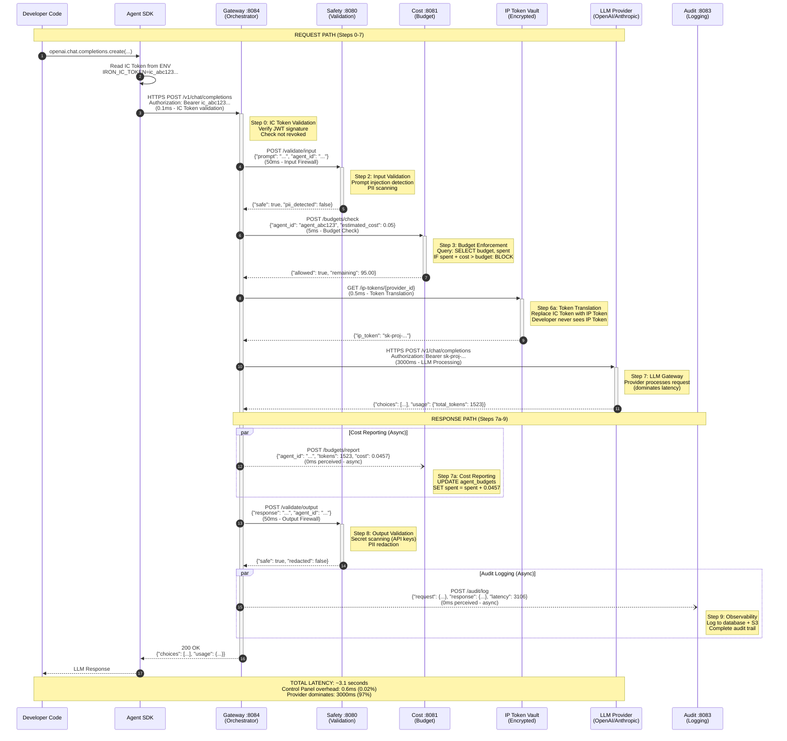
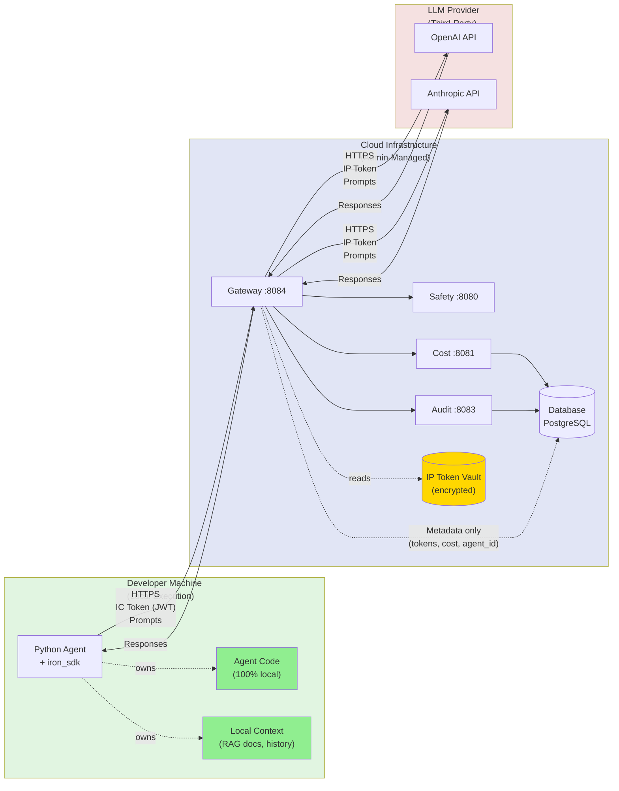
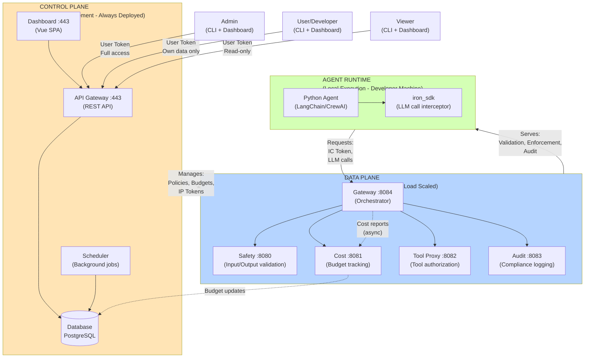

# Architecture: High-Level Overview

### Scope

This document provides a comprehensive high-level view of the Iron Cage architecture, defining all actors, major components, and their collaboration patterns.

**In scope:**
- Complete actor taxonomy (human, software, service actors with precise roles)
- Major component catalog (Control Panel, Agent Runtime, Data Plane services, external systems)
- Collaboration patterns (authentication flows, request processing, budget enforcement, monitoring)
- Communication protocols (IC Token, IP Token, User Token, REST API, WebSocket)
- System boundaries and deployment contexts (local execution, cloud infrastructure)
- Data ownership and access patterns (who owns what, who can see what)

**Out of scope:**
- Detailed API specifications → See [Protocol](../protocol/) documents
- Database schema implementation → See [Entity Model](007_entity_model.md)
- Service internal implementation → See service-specific documentation
- Deployment infrastructure details → See [Deployment](../deployment/) documents
- Code-level design patterns → See module specifications

### Purpose

**User Need**: Architects, platform engineers, and stakeholders need a single authoritative document that explains the complete Iron Cage architecture at a high level - all actors, all components, and how they collaborate - to understand the system holistically before diving into detailed specifications.

**Solution**: Define three actor types (Human, Software, Service), five major component groups (Control Panel, Agent Runtime, Data Plane, External Systems, Infrastructure), and seven collaboration patterns (authentication, request processing, budget control, monitoring, user management, agent lifecycle, failure handling) with precise protocols and clear boundaries.

**Key Insight**: Iron Cage architecture follows a **Control Panel + Local Execution** pattern where the Control Panel (always deployed, admin-managed) provides centralized budget control, safety policies, and monitoring, while Agent Runtime executes locally on developer machines maintaining data privacy. The Gateway service acts as the central orchestrator coordinating Safety, Cost, Tool Proxy, and Audit services. Authentication uses a dual-token system - IC Token (agent→Control Panel) and IP Token (Control Panel→LLM Provider) - ensuring developers never handle provider credentials directly.

---

**Status:** Specification
**Version:** 2.0.0
**Last Updated:** 2025-12-14
**Priority:** MUST-HAVE
**Visual Diagrams:** 6 Mermaid diagrams embedded (deployment boundaries, data flow, service communication)
**Architecture Notes:** This is a concise high-level overview. Detailed specifications distributed to specialized documents (Actor Model, Service Integration, etc.)

---

## EXECUTIVE SUMMARY

This simplified diagram shows Iron Cage's three-boundary architecture at the highest level, designed for board presentations and non-technical stakeholders.

```
┌─────────────────────────────────────────────────────────────────────┐
│                   IRON CAGE ARCHITECTURE                            │
└─────────────────────────────────────────────────────────────────────┘

        DEVELOPER                  YOUR CLOUD                OPENAI/ANTHROPIC
        (Private)                  (Controlled)              (3rd Party)

    ┌──────────────┐           ┌──────────────┐          ┌──────────────┐
    │  AI Agent    │  Setup    │ Control Panel│          │              │
    │              │─Token(1)─>│ (Management) │          │              │
    │+ iron_sdk    │           │              │          │              │
    │  Runtime     │           │ • User mgmt  │          │  LLM API     │
    │ ┌──────────┐ │           │ • Tokens     │          │              │
    │ │ Safety   │ │           │ • Analytics  │          │              │
    │ │ Cost     │ │           │              │          │              │
    │ │ Audit    │ │           │ NOT in       │          │              │
    │ └──────────┘ │           │ request path │          │              │
    │              │           └──────────────┘          │              │
    │  Gateway     │                                     │              │
    │ (Validator)  │  Prompt + IP Token                  │              │
    │ (Translator) │──────────────────────────────(2)───>│  Process     │
    │              │                                     │  Request     │
    │  Your Code   │                                     │              │
    │  Your Data   │<────────────────────────────────────│              │
    │  RAG Docs    │            Response                 │  Response    │
    │              │                                     │              │
    └──────────────┘                                     └──────────────┘

    ✓ 100% Local              ✓ Setup Only             ⚠️ Third Party
    ✓ Gateway Local           ✓ Management             ⚠️ Prompts Sent
    ✓ Code NEVER Sent         ✓ Token Generation       ⚠️ Provider ToS
    ✓ Data NEVER Sent         ✓ Analytics
```

**Key Points:**
- **Left (Developer Machine):** Agent, iron_sdk, Runtime (Safety/Cost/Audit), and Gateway ALL run 100% locally. Nothing leaves your machine except prompts after local validation.
- **Middle (Your Cloud):** Control Panel ONLY for setup and management. NOT in request path. Handles user management, token generation, and analytics.
- **Right (Third Party):** LLM provider receives only prompts with IP Token. Never sees your code, data, or IC Token.

**Business Value:**
1. **Privacy First:** Agent code and data never leave developer machines (100% local execution)
2. **Cost Control:** Centralized budget enforcement prevents runaway AI spending
3. **Security:** Input/output validation protects against prompt injection, PII leaks, and credential exposure
4. **Compliance:** Complete audit trail for regulatory requirements and accountability
5. **Flexibility:** Use any LLM provider (OpenAI, Anthropic, custom) without vendor lock-in

---

## 1. ACTORS

Iron Cage has three actor types across 18 total actors:

**Human Actors (6):** Platform administrators, developers, viewers, operations/security engineers, and product visitors. Admin manages Control Panel with full access, User (developer) runs agents with own-data access, Viewer has read-only access. All three primary roles use BOTH CLI and Dashboard interfaces equivalently.

**Software Actors (7):** Python agents (LangChain/CrewAI), web browsers, CLI tools, LLM provider APIs, database, cache, and object storage. Agents authenticate via IC Token (JWT), users authenticate via User Token (JWT), Gateway translates IC Token → IP Token for provider communication.

**Service Actors (8):** Gateway (central orchestrator), Safety/Cost/Tool Proxy/Audit services in Data Plane, API Gateway/Dashboard/Scheduler in Control Plane. Failure modes: Safety and Tool Proxy fail-safe (block when down), Cost and Audit fail-open (degrade gracefully).

**See:** [Deployment: Actor Model](../deployment/002_actor_model.md) for complete actor taxonomy with roles, responsibilities, access levels, and communication protocols

---

## 2. COMPONENTS

### 2.1 Control Panel (Admin Service - Always Deployed)

**Definition:** Centralized admin service managing budgets, policies, and monitoring for all developers.

**Deployment:** Always present, never optional. Single instance per organization (pilot) or replicated for high availability (production).

**Components:**

| Component | Technology | Responsibility | External Interface |
|-----------|-----------|----------------|-------------------|
| **API Gateway** | Rust (axum) | REST API for Control Panel operations | HTTPS :443/api/v1/* |
| **Dashboard** | Vue 3 SPA | Web UI for admin/user/viewer | HTTPS :443/ |
| **Token Manager** | Rust (module) | Manage IC Tokens, User Tokens, IP Tokens | Internal service |
| **User Service** | Rust (module) | User CRUD, roles, permissions, audit | Internal service |
| **Agent Service** | Rust (module) | Agent CRUD, IC Token generation, budget allocation | Internal service |
| **Budget Service** | Rust (module) | Budget tracking, enforcement, reporting | Internal service |
| **Scheduler** | Rust (tokio) | Cron jobs (token expiration, cleanup) | Internal service |
| **Database** | PostgreSQL (prod) / SQLite (pilot) | Persist users, agents, budgets, audit logs | PostgreSQL protocol |

**Data Owned:**
- Users (user_id, username, email, role, is_active, deleted_at)
- Agents (agent_id, owner_id, project_id, status, budget)
- IC Tokens (ic_token_id, agent_id, created_at, never expires)
- User Tokens (user_token_id, user_id, created_at, expires_at default 30 days)
- IP Tokens (ip_token_id, ip_id, encrypted_value in vault)
- Budgets (agent budgets restrictive, project/IP/master informative)
- Audit Logs (user_audit_log, request_audit_log, immutable append-only)

**Authentication:**
- Incoming: User Token (JWT) in Authorization header
- Validates: Role (Admin, User, Viewer) and permissions (ManageUsers, etc.)

**See:** [Architecture: Execution Models](001_execution_models.md) for Control Panel deployment context

---

### 2.2 Agent Runtime (Developer Machine - Local Execution)

**Definition:** Execution environment where developer's AI agents run locally, maintaining data privacy.

**Deployment:** Developer's machine (laptop, workstation, local server). Never in cloud (pilot constraint).

**Components:**

| Component | Technology | Responsibility | Communication |
|-----------|-----------|----------------|---------------|
| **Python Agent** | Python 3.10+ (LangChain, CrewAI, custom) | Developer's AI application code | Calls SDK |
| **iron_sdk** | Python package (wraps LLM calls) | Intercept LLM calls, add IC Token, route to Gateway | HTTPS to Gateway :8084 |
| **Agent Framework** | LangChain / CrewAI / Custom | Orchestrate multi-step workflows, tools, RAG | Uses iron_sdk |
| **Local Tools** | Python packages | Execute code, access files, call APIs | Called by agent |
| **Environment Config** | .env file or ENV vars | IRON_RUNTIME_URL, IC_TOKEN, logging config | Read by SDK |

**Runtime Modes:**

**Router Mode** (HTTP-based, separate process):
```
Developer Agent → HTTP → Gateway (localhost:8084 or remote) → LLM Provider
```
- Overhead: ~5ms
- Use case: Framework users (LangChain/CrewAI), debugging with traffic inspection

**Library Mode** (PyO3-embedded, in-process):
```
Developer Agent → PyO3 FFI → Rust Gateway (embedded) → LLM Provider
```
- Overhead: ~0.5ms
- Use case: SDK users (default), best performance

**See:** [Architecture: Runtime Modes](008_runtime_modes.md) for mode comparison

**Data Owned:**
- Agent application code (developer's IP, never leaves machine)
- Local context (RAG documents, conversation history)
- Agent outputs (LLM responses, generated content)

**Authentication:**
- Outgoing: IC Token (JWT) in Authorization header to Gateway
- Format: `Authorization: Bearer ic_abc123def456...`
- Token: Long-lived (no auto-expiration), regenerated by admin or agent owner

---

### 2.3 Data Plane Services (Request Processing)

**Definition:** Microservices that process agent requests, enforce policies, and track usage.

**Deployment:** Cloud infrastructure (Kubernetes pods) or on-premise servers. Scales independently by load.

**Gateway Orchestration Pattern:** Gateway acts as central hub coordinating Safety (input/output validation), Cost (budget enforcement), Tool Proxy (tool authorization), and Audit (compliance logging). Synchronous calls block request (Safety, Cost), asynchronous calls non-blocking (Audit). Failure modes: Safety/Tool Proxy fail-safe (block when down - security critical), Cost/Audit fail-open (degrade gracefully - availability priority).

**See:** [Architecture: Service Integration](005_service_integration.md) for complete service responsibilities, orchestration patterns, Gateway coordination flow, and service communication sequences

---

### 2.4 External Systems (LLM Providers)

**Definition:** Third-party LLM inference providers that process AI requests.

**Supported Providers (Pilot):**

| Provider | Endpoint | Authentication | Models |
|----------|----------|----------------|--------|
| **OpenAI** | api.openai.com | IP Token (API key) | GPT-4, GPT-3.5, embeddings |
| **Anthropic** | api.anthropic.com | IP Token (API key) | Claude 3 Opus/Sonnet/Haiku |
| **Custom** | Configurable | IP Token (API key or custom) | Any OpenAI-compatible API |

**Provider Interaction Pattern:**

```
Gateway → Token Translation (IC Token → IP Token)
          ↓
        Gateway → HTTPS POST to Provider
                  Authorization: Bearer {IP_TOKEN}
                  {"model": "gpt-4", "messages": [...]}
          ↓
        Provider processes request (3000ms typical)
          ↓
        Provider → Response
                   {"choices": [...], "usage": {"total_tokens": 1523}}
          ↓
        Gateway → Cost Reporting (track 1523 tokens)
```

**IP Token Management:**
- **Storage:** Encrypted in Control Panel vault (database with encryption at rest)
- **Visibility:** Admin only (developers never see IP Tokens)
- **Rotation:** Admin regenerates via Control Panel
- **Translation:** Gateway replaces IC Token with IP Token before forwarding to provider
- **Security Guarantee:** Developers never handle provider credentials directly

**See:** [Architecture: Entity Model](007_entity_model.md) for IP Token entity definition

---

### 2.5 Infrastructure Components

**Definition:** Shared infrastructure services supporting platform operations.

| Component | Technology | Responsibility | Used By |
|-----------|-----------|----------------|---------|
| **Database** | PostgreSQL (prod) / SQLite (pilot) | Persist platform state | Control Panel, Safety, Cost, Audit |
| **Cache** | Redis (prod) / In-memory (pilot) | Hot data (budgets, permissions) | Cost, Tool Proxy |
| **Object Storage** | S3-compatible (prod) / Local FS (pilot) | Store audit logs, large payloads | Audit |
| **Load Balancer** | nginx / ALB (prod) | Distribute traffic across replicas | Control Panel, Data Plane services |
| **Service Mesh** | Istio (future) | Service discovery, mTLS, observability | All services |
| **Monitoring** | Prometheus + Grafana | Metrics, alerts, dashboards | All services |
| **Logging** | ELK stack (future) | Centralized log aggregation | All services |

**Pilot Simplifications:**
- Single instance deployment (no load balancer, no replicas)
- SQLite database (no PostgreSQL)
- In-memory cache (no Redis)
- Local filesystem (no S3)
- Minimal monitoring (logs only, no Prometheus/Grafana)

**Production Requirements:**
- High availability (replicas, load balancing)
- PostgreSQL with replication
- Redis cluster
- S3 or compatible object storage
- Full observability stack (Prometheus, Grafana, ELK)

**See:** [Technology: Infrastructure Choices](../technology/003_infrastructure_choices.md) for detailed technology decisions

---

## 3. COLLABORATION PATTERNS

### 3.1 Authentication Flow

**Pattern:** Dual-token system ensuring developers never handle provider credentials.

**Tokens:**

| Token Type | Issued By | Used By | Authenticates | Lifetime | Format |
|------------|-----------|---------|---------------|----------|--------|
| **IC Token** | Control Panel (when agent created) | Agent SDK | Agent → Gateway | Long-lived (no expiration) | JWT (ic_ prefix) |
| **User Token** | Control Panel (when user logs in) | CLI, Dashboard | User → Control Panel | 30 days (default) | JWT (user_ prefix) |
| **IP Token** | Admin (stored in vault) | Gateway | Gateway → LLM Provider | Provider-managed | Provider-specific |

**IC Token Structure (JWT):**
```json
Header:
{
  "alg": "HS256",
  "typ": "JWT"
}

Payload:
{
  "sub": "agent_abc123",           // agent_id
  "ic_token_id": "ic_def456ghi789", // unique token ID
  "iat": 1733734245,                // issued at (Unix epoch seconds)
  "exp": null                        // never expires (long-lived)
}

Signature: HMACSHA256(header + payload, secret_key)
```

**User Token Structure (JWT):**
```json
Payload:
{
  "sub": "1001",                    // user_id (numeric)
  "user_token_id": "user_xyz789",  // unique token ID
  "role": "admin",                  // admin, user, or viewer
  "iat": 1733734245,
  "exp": 1736326245                 // expires in 30 days
}
```

**Authentication Flow Diagram:**

```
STEP 1: Admin creates agent for developer
Admin → Control Panel API
        POST /api/v1/agents
        Authorization: Bearer {USER_TOKEN with Admin role}
        {"name": "Production Agent", "owner_id": 1001, ...}
        ↓
Control Panel generates IC Token (JWT, long-lived)
        ↓
Control Panel returns: {"agent_id": "agent_abc123", "ic_token": "ic_def456ghi789..."}
        ↓
Admin shares IC Token with developer (one-time, secure channel)

STEP 2: Developer configures agent with IC Token
Developer → .env file or environment variable
            IRON_IC_TOKEN=ic_def456ghi789...
            ↓
SDK reads IC Token from environment

STEP 3: Agent makes LLM call
Developer code: openai.chat.completions.create(...)
                ↓
SDK intercepts call
                ↓
SDK adds: Authorization: Bearer ic_def456ghi789...
                ↓
SDK → Gateway (8084)

STEP 4: Gateway validates IC Token
Gateway → JWT signature verification (HMACSHA256)
          ↓
        Check token not revoked (query Control Panel database)
          ↓
        Extract agent_id from token payload
          ↓
        Load agent metadata (owner, budget, project, providers)

STEP 5: Gateway translates IC Token → IP Token
Gateway → Lookup IP Token for selected provider in vault
          ↓
        Replace Authorization header: Bearer {IP_TOKEN}
          ✓ Developer never sees IP Token
          ✓ Provider credentials stay in Control Panel

STEP 6: Gateway forwards to LLM Provider
Gateway → POST https://api.openai.com/v1/chat/completions
          Authorization: Bearer {IP_TOKEN}
          {...}
```

**Security Guarantees:**
- ✅ Developer never handles provider credentials (IP Token hidden in vault)
- ✅ IC Token can't be used to impersonate other agents (1:1 relationship)
- ✅ Revoked tokens immediately blocked (database check on every request)
- ✅ Admin can regenerate any token (emergency access recovery)
- ✅ Self-modification prevented (admin can't delete own account or change own role)

**See:** [Protocol: Budget Control](../protocol/005_budget_control_protocol.md) for IC Token protocol details
**See:** [Protocol: Authentication API](../protocol/007_authentication_api.md) for User Token authentication

---

### 3.2 Request Processing Flow

**Pattern:** 11-step journey from agent code to LLM response with bidirectional validation.

**Complete Flow:**

```
REQUEST PATH (Steps 0-7):
━━━━━━━━━━━━━━━━━━━━━━━━━━━━━━━━━━━━━━━━━━━━━━━━━━━━━━━━━━━━━

Step 0: IC Token Validation (0.1ms)
  Agent SDK → Gateway (8084)
               POST /v1/chat/completions
               Authorization: Bearer ic_abc123...
               ↓
  Gateway: Verify JWT signature, check not revoked
               ✓ Token valid, extract agent_id

Step 1: API Gateway (5ms)
  Gateway: Check rate limit, route to Safety
               ✓ Rate limit OK

Step 2: Input Firewall (50ms production)
  Gateway → Safety (8080)
            {"prompt": "...", "agent_id": "agent_abc123"}
            ↓
  Safety: Scan for prompt injection, detect PII, enforce policies
            ✓ Input safe

Step 3-6: Agent Runtime Coordination (2650ms if tools used)
  [SKIPPED for simple LLM calls]
  [Used for: RAG queries (500ms), Tool execution (2000ms)]

Step 6a: Token Translation (0.5ms)
  Gateway: Load IP Token from vault
           ↓
         Replace IC Token with IP Token
           ✓ Developer credentials protected

Step 7: LLM Gateway (3000ms typical)
  Gateway → LLM Provider
            POST https://api.openai.com/v1/chat/completions
            Authorization: Bearer {IP_TOKEN}
            {"model": "gpt-4", "messages": [...]}
            ↓
  Provider processes request
            ↓
  Provider → Response
             {"choices": [...], "usage": {"total_tokens": 1523}}


RESPONSE PATH (Steps 7a-9):
━━━━━━━━━━━━━━━━━━━━━━━━━━━━━━━━━━━━━━━━━━━━━━━━━━━━━━━━━━━━━

Step 7a: Cost Reporting (0ms async production)
  Gateway → Cost (8081)
            {"agent_id": "agent_abc123", "tokens": 1523, "cost": 0.0457}
            [ASYNC, non-blocking]
            ↓
  Cost: Update agent budget, track spending
        ✓ Budget updated

Step 8: Output Firewall (50ms production)
  Gateway → Safety (8080)
            {"response": "...", "agent_id": "agent_abc123"}
            ↓
  Safety: Scan for secrets (API keys), redact PII
          ✓ Output safe

Step 9: Observability (0ms async)
  Gateway → Audit (8083)
            {"request": {...}, "response": {...}, "latency": 3106, ...}
            [ASYNC, non-blocking]
            ↓
  Audit: Log to database + object storage
         ✓ Audit trail recorded

Step 10: Return to Agent
  Gateway → Agent SDK
            HTTP 200 OK
            {"choices": [...], "usage": {...}}
            ↓
  SDK → Developer code
        Returns LLM response
```

**Latency Breakdown (Production):**

| Step | Component | Latency | Cumulative |
|------|-----------|---------|------------|
| 0 | IC Token Validation | 0.1ms | 0.1ms |
| 1 | API Gateway | 5ms | 5.1ms |
| 2 | Input Firewall | 50ms | 55.1ms |
| 6a | Token Translation | 0.5ms | 55.6ms |
| 7 | LLM Provider | 3000ms | 3055.6ms |
| 7a | Cost Reporting (async) | 0ms | 3055.6ms |
| 8 | Output Firewall | 50ms | 3105.6ms |
| 9 | Observability (async) | 0ms | 3105.6ms |

**Total:** ~3.1 seconds (provider dominates, Control Panel overhead 0.6ms = 0.02%)

**Security Guarantee:** Both input AND output validated. Agent never receives unvalidated LLM responses.

**Visual Diagram (Mermaid):**



**See:** [Architecture: Data Flow](004_data_flow.md) for complete 11-step specification
**See:** [Architecture: Service Integration](005_service_integration.md) for Gateway orchestration patterns, service communication sequences, and failure mode handling

---

### 3.3 Budget Control Pattern

**Pattern:** Centralized budget enforcement through restrictive agent budgets.

**Budget Types:**

| Budget Type | Enforcement | Blocks Requests? | Visibility | Use Case |
|-------------|-------------|------------------|------------|----------|
| **Agent Budget** | Restrictive | ✅ YES | Owner + Admin | Hard spending limit per agent |
| **Project Budget** | Informative | ❌ NO | Project members + Admin | Monitor project spending |
| **IP Budget** | Informative | ❌ NO | Admin only | Monitor provider spending |
| **Master Budget** | Informative | ❌ NO | Admin only | Monitor total platform spending |

**Critical Design:** ONLY Agent Budget blocks requests. All others are monitoring only.

**Budget Enforcement Flow:**

```
STEP 1: Admin allocates budget
Admin → Control Panel API
        POST /api/v1/agents
        {
          "name": "Production Agent",
          "owner_id": 1001,
          "budget": 100.00  // $100 hard limit
        }
        ↓
Control Panel creates agent with Agent Budget (restrictive=true)

STEP 2: Developer makes LLM call
Agent SDK → Gateway (8084)
            ↓
Gateway → Cost (8081)
          GET /budgets/agent_abc123
          ↓
Cost → Database query:
       SELECT budget, spent FROM agent_budgets WHERE agent_id = 'agent_abc123'
       ↓
       Result: budget=$100.00, spent=$95.00, remaining=$5.00

STEP 3: Cost Service checks budget BEFORE forwarding
Cost Service:
  IF (spent + estimated_cost) > budget:
    ✗ BLOCK request with 403 Forbidden
       {"error": {"code": "BUDGET_EXCEEDED", "message": "Agent budget exceeded"}}
  ELSE:
    ✓ ALLOW request, forward to provider

STEP 4: Update spending AFTER response
Provider → Response (usage: 1523 tokens)
           ↓
Cost Service calculates: 1523 tokens × $0.03/1K = $0.0457
           ↓
Cost Service updates:
  UPDATE agent_budgets SET spent = spent + 0.0457 WHERE agent_id = 'agent_abc123'
           ↓
  New spent: $95.0457 (remaining: $4.9543)

STEP 5: Developer requests budget increase
Developer → Control Panel API
            POST /api/v1/budget-requests
            {
              "agent_id": "agent_abc123",
              "requested_budget": 200.00,
              "justification": "Production traffic increased 2x"
            }
            ↓
Control Panel creates Budget Change Request (status=pending)

STEP 6: Admin reviews and approves
Admin → Control Panel Dashboard
        Review request
        ↓
Admin → PUT /api/v1/budget-requests/{request_id}
        {"action": "approve", "review_notes": "Approved for Q1"}
        ↓
Control Panel updates agent budget: $100 → $200
Control Panel updates request: status=approved
Control Panel creates audit log entry
```

**Budget Request State Machine:**

```
  [Created] (pending)
      ↓
   ┌──┴──┐
   ↓     ↓
[Approved] [Rejected] (terminal states)
   ↓
[Cancelled] (if agent deleted while pending)
```

**Monitoring Pattern (Informative Budgets):**

```
Project Budget = SUM(agent budgets for all agents in project)
IP Budget = SUM(spending on provider across all agents)
Master Budget = SUM(all spending across all projects)

These are STATISTICS ONLY - do not block requests
```

**See:** [Protocol: Budget Control](../protocol/005_budget_control_protocol.md) for complete budget protocol
**See:** [Protocol: Budget Requests API](../protocol/017_budget_requests_api.md) for budget request workflow

---

### 3.4 Monitoring & Observability Pattern

**Pattern:** Multi-layer monitoring for admins, users, and operators.

**Monitoring Actors & Access:**

| Actor | View | Data Access | Interface |
|-------|------|-------------|-----------|
| **Admin** | All users, all agents, all spending | Complete platform visibility | Dashboard (Grafana) |
| **User** | Own agents only, own spending | Own data only | Dashboard (Grafana) |
| **Viewer** | Own agents (read-only), own spending | Own data only | Dashboard (Grafana) |
| **Operations** | System health, service metrics | Aggregate metrics (no user PII) | Grafana, Prometheus |

**Monitoring Layers:**

**Layer 1: Real-Time Metrics (Prometheus)**
```
Metrics Collected:
- Request rate (requests/sec per agent, per project, per IP)
- Latency (p50, p95, p99 per service)
- Error rate (errors/sec, error types)
- Budget consumption (spent vs allocated per agent)
- Token usage (tokens/min per model)
- Service health (up/down, replica count)

Exported by:
- Gateway: Request metrics, latency, errors
- Cost: Budget metrics, spending trends
- Safety: Policy violations, PII detections
- Audit: Log volume, storage usage

Scraped by: Prometheus (15s interval)
Visualized in: Grafana dashboards
```

**Layer 2: Audit Logs (Immutable Trail)**
```
Audit Events:
- User management (create, suspend, activate, delete, role change)
- Agent lifecycle (create, IC Token regeneration, budget change, delete)
- Budget requests (create, approve, reject, cancel)
- Policy changes (safety rules, rate limits)
- Token operations (User Token login, IC Token regeneration, IP Token rotation)

Storage:
- Database: user_audit_log table (append-only, ON DELETE RESTRICT)
- Object Storage: Full request/response payloads (compliance retention)

Retention:
- Pilot: 90 days
- Production: 7 years (compliance requirement)
```

**Layer 3: Application Logs (Debugging)**
```
Log Levels:
- ERROR: Service failures, request errors, policy violations
- WARN: Degraded operation, budget warnings (>80% spent)
- INFO: Request start/end, authentication events
- DEBUG: Detailed service calls, token translations (disabled in production)

Log Aggregation:
- Pilot: Local files + stdout
- Production: ELK stack (Elasticsearch, Logstash, Kibana)

Searchable by: request_id (trace all steps for single request)
```

**Dashboard Views:**

**Admin Dashboard:**
```
┌─────────────────────────────────────────────────────┐
│ PLATFORM OVERVIEW                                   │
├─────────────────────────────────────────────────────┤
│ Total Users: 47 (42 active, 5 suspended)            │
│ Total Agents: 183 (178 running, 5 stopped)          │
│ Total Spending: $12,458.32 / $50,000 (24.9%)        │
│ Request Rate: 450 req/min (peak: 892 req/min)       │
└─────────────────────────────────────────────────────┘

┌─────────────────────────────────────────────────────┐
│ TOP SPENDERS (Last 7 Days)                          │
├─────────────────────────────────────────────────────┤
│ 1. agent_prod_ml_pipeline  $1,234.56  [████████░░] │
│ 2. agent_data_analysis     $892.11    [██████░░░░] │
│ 3. agent_customer_support  $543.22    [████░░░░░░] │
└─────────────────────────────────────────────────────┘

┌─────────────────────────────────────────────────────┐
│ BUDGET ALERTS                                        │
├─────────────────────────────────────────────────────┤
│ ⚠ agent_abc123: 95% budget consumed ($95/$100)      │
│ ⚠ project_eng: 87% budget consumed ($8.7K/$10K)     │
│ 🔴 agent_xyz789: BUDGET EXCEEDED (blocking requests) │
└─────────────────────────────────────────────────────┘
```

**User Dashboard:**
```
┌─────────────────────────────────────────────────────┐
│ MY AGENTS                                            │
├─────────────────────────────────────────────────────┤
│ Production Agent       $45.23 / $100  [████░░░░░░]  │
│ Staging Agent          $2.11 / $10    [██░░░░░░░░]  │
│ Development Agent      $0.05 / $5     [░░░░░░░░░░]  │
└─────────────────────────────────────────────────────┘

┌─────────────────────────────────────────────────────┐
│ USAGE TREND (Last 30 Days)                          │
├─────────────────────────────────────────────────────┤
│  $                                                   │
│ 50│                                            ╱╲    │
│ 40│                                    ╱╲    ╱  ╲   │
│ 30│                            ╱╲    ╱  ╲  ╱    ╲  │
│ 20│                    ╱╲    ╱  ╲  ╱    ╲╱      ╲ │
│ 10│            ╱╲    ╱  ╲  ╱    ╲╱               ╲│
│  0└────────────────────────────────────────────────│
│   Dec 1        Dec 10       Dec 20       Dec 30    │
└─────────────────────────────────────────────────────┘
```

**See:** [Architecture: Roles and Permissions](006_roles_and_permissions.md) for dashboard access levels

---

### 3.5 User Management Pattern

**Pattern:** Admin-managed user lifecycle with comprehensive audit trail.

**User Lifecycle State Machine:**

```
        [Created] (is_active=1, deleted_at=NULL)
            ↓
    Admin creates user
            ↓
        [Active] ← can login, create agents, use platform
            ↓
      ┌─────┴─────┐
      ↓           ↓
  (suspend)   (delete)
      ↓           ↓
[Suspended]   [Deleted] (soft delete)
 is_active=0  is_active=0, deleted_at=timestamp
      ↓           ↓
  (activate)  (reassign agents to admin)
      ↓           ↓
  [Active]    [Orphaned Agents Project]
```

**User Operations Flow:**

**CREATE USER:**
```
Admin → POST /api/v1/users
        Authorization: Bearer {USER_TOKEN with Admin role}
        {
          "username": "alice",
          "password": "SecurePass123!",
          "email": "alice@example.com",
          "role": "user"
        }
        ↓
Control Panel:
  - Hash password (BCrypt cost 12)
  - Create user (is_active=1)
  - Audit log: operation=create, performed_by=admin_id
        ↓
Response: 201 Created
          {"id": 1001, "username": "alice", "role": "user", ...}
```

**SUSPEND USER:**
```
Admin → PUT /api/v1/users/1001/suspend
        {"reason": "Violation of terms of service"}
        ↓
Control Panel:
  - Set is_active=0
  - Set suspended_at=current_timestamp
  - Set suspended_by=admin_id
  - Audit log: operation=suspend, reason="Violation..."
  - User Tokens remain valid (not revoked)
        ↓
User cannot login (is_active check fails)
Existing sessions valid until token expiration
```

**DELETE USER (with Agent Reassignment):**
```
Admin → DELETE /api/v1/users/1001
        ↓
Control Panel:
  1. Soft delete user:
     - Set is_active=0
     - Set deleted_at=current_timestamp
     - Set deleted_by=admin_id

  2. Reassign all owned agents:
     - Query: SELECT agent_id FROM agents WHERE owner_id=1001
     - For each agent:
         UPDATE agents SET owner_id=admin_id, project_id='proj_orphaned'
         INSERT INTO agent_tags (agent_id, tag) VALUES (agent_id, 'orphaned')
         INSERT INTO agent_tags (agent_id, tag) VALUES (agent_id, 'original-owner:1001')

  3. Cancel pending budget requests:
     - UPDATE budget_requests SET status='cancelled',
         review_notes='Auto-cancelled: user deleted'
         WHERE requester_id=1001 AND status='pending'

  4. Revoke API tokens:
     - UPDATE api_tokens SET revoked_at=current_timestamp, revoked_by=admin_id
         WHERE user_id=1001

  5. Audit log:
     - operation=delete
     - details: {"agents_affected": 5, "budget_requests_cancelled": 2, ...}
        ↓
Response: 200 OK
          {
            "id": 1001,
            "deleted_at": 1733755000000,
            "agents_affected": [
              {"agent_id": "agent_abc123", "new_owner_id": "admin_001",
               "new_project_id": "proj_orphaned", ...}
            ],
            "agents_count": 5,
            "budget_requests_cancelled": 2,
            "api_tokens_revoked": 3
          }

Critical: Agents continue working (IC Tokens valid, budgets active)
```

**Orphaned Agents Project:**
```
Special Project:
  - project_id: "proj_orphaned"
  - name: "Orphaned Agents"
  - owner: admin (system)
  - Contains: All agents from deleted users

Admin Actions:
  - View all orphaned agents
  - Reassign agent to new user: PUT /api/v1/agents/{id}/owner
  - Delete agent: DELETE /api/v1/agents/{id}
  - Adjust budget: PUT /api/v1/agents/{id}/budget
```

**See:** [Protocol: User Management API](../protocol/008_user_management_api.md) for complete user CRUD specification

---

### 3.6 Agent Lifecycle Pattern

**Pattern:** Agent creation with 1:1 IC Token binding, budget allocation, and provider assignment.

**Agent Creation Flow:**

```
STEP 1: Admin creates agent for developer
Admin → POST /api/v1/agents
        Authorization: Bearer {USER_TOKEN with Admin role}
        {
          "name": "Production Agent",
          "owner_id": 1001,              // user_id of developer
          "project_id": "proj_eng",
          "budget": 100.00,               // $100 initial budget
          "providers": [                  // allowed providers
            "ip_openai_001",
            "ip_anthropic_001"
          ],
          "tags": ["production", "ml-pipeline"]
        }
        ↓
Control Panel:
  1. Create agent record:
     INSERT INTO agents (agent_id, owner_id, project_id, status, created_at)
     VALUES ('agent_abc123', 1001, 'proj_eng', 'created', 1733740800000)

  2. Generate IC Token (JWT, long-lived):
     Header: {"alg": "HS256", "typ": "JWT"}
     Payload: {"sub": "agent_abc123", "ic_token_id": "ic_def456", ...}
     Signature: HMACSHA256(...)
     INSERT INTO ic_tokens (ic_token_id, agent_id, created_at)
     VALUES ('ic_def456', 'agent_abc123', 1733740800000)

  3. Create Agent Budget (restrictive):
     INSERT INTO agent_budgets (budget_id, agent_id, amount, spent, restrictive)
     VALUES ('budget_789', 'agent_abc123', 100.00, 0.00, true)

  4. Assign providers (N:M relationship):
     INSERT INTO agent_providers (agent_id, ip_id)
     VALUES ('agent_abc123', 'ip_openai_001'),
            ('agent_abc123', 'ip_anthropic_001')

  5. Audit log:
     operation=create_agent, performed_by=admin_id, details={...}
        ↓
Response: 201 Created
          {
            "agent_id": "agent_abc123",
            "name": "Production Agent",
            "owner_id": 1001,
            "ic_token": {
              "id": "ic_def456",
              "token": "eyJhbGciOiJIUzI1NiIsInR5cCI6IkpXVCJ9.eyJzdWI...",
              "created_at": 1733740800000
            },
            "budget": {
              "amount": 100.00,
              "spent": 0.00,
              "remaining": 100.00
            },
            "providers": ["ip_openai_001", "ip_anthropic_001"],
            "status": "active",
            "created_at": 1733740800000
          }

STEP 2: Admin shares IC Token with developer (secure channel)
Admin → Email / Slack / Secure vault
        "Your agent IC Token: ic_def456ghi789..."

STEP 3: Developer configures agent
Developer → Create .env file:
            IRON_IC_TOKEN=eyJhbGciOiJIUzI1NiIsInR5cCI6IkpXVCJ9...
            IRON_RUNTIME_URL=http://localhost:8084
            ↓
Developer → Install SDK:
            uv pip install iron_sdk
            ↓
Developer → Write agent code:
            from iron_cage import configure
            configure()  # reads IRON_IC_TOKEN from env

            import openai
            response = openai.chat.completions.create(...)
            # SDK intercepts call, adds IC Token, routes to Gateway

STEP 4: Agent runs, makes LLM call
Agent → Gateway (IC Token authentication)
        ↓
Gateway validates IC Token, checks budget, forwards to provider
        ↓
Provider responds
        ↓
Gateway updates budget, returns response
```

**Agent State Transitions:**

```
[Created] → [Active] → [Stopped] → [Deleted]
    ↓          ↓           ↓
(initial) (running)  (paused)  (soft delete)
```

**IC Token Regeneration:**

```
Owner or Admin → POST /api/v1/agents/{id}/regenerate-token
                 ↓
Control Panel:
  1. Revoke old IC Token:
     UPDATE ic_tokens SET revoked_at=current_timestamp
     WHERE agent_id='agent_abc123'

  2. Generate new IC Token (new ic_token_id)
     INSERT INTO ic_tokens (ic_token_id, agent_id, created_at)

  3. Audit log: operation=regenerate_ic_token
                 ↓
Response: 200 OK
          {
            "ic_token": {
              "id": "ic_new123",
              "token": "eyJhbGciOiJIUzI1NiIsInR5cCI6IkpXVCJ9...",
              "created_at": 1733755000000
            }
          }

Old IC Token immediately invalid (requests blocked with 401)
Developer must update .env with new token
```

**See:** [Protocol: Agents API](../protocol/010_agents_api.md) for complete agent CRUD specification

---

### 3.7 Failure Handling Pattern

**Pattern:** Service-specific failure modes balancing security, availability, and cost.

**Failure Decision Matrix:**

| Service Failure | Behavior | Rationale | Recovery |
|-----------------|----------|-----------|----------|
| **Safety Service Down** | BLOCK all requests (fail-safe) | Security critical - can't validate input/output | Manual restart, alert admin immediately |
| **Cost Service Down** | ALLOW requests, track in memory (fail-open) | Availability priority - degraded tracking acceptable | Async replay from memory when recovered |
| **Tool Proxy Down** | BLOCK tool execution (fail-safe) | Security critical - can't authorize tools | Manual restart, simple LLM calls still work |
| **Audit Service Down** | ALLOW requests, buffer logs (fail-open) | Availability priority - logs can be replayed | Replay buffered logs when recovered |
| **Gateway Down** | All requests fail (single point of failure) | Central orchestrator - must be highly available | Auto-restart, load balancer failover |
| **Database Down** | Read-only mode (cached data) | Partial availability - serve from cache | Manual recovery, replica promotion |
| **LLM Provider Down** | Try fallback provider (if configured) | Reliability layer handles provider failures | Automatic retry with exponential backoff |

**Failure Scenarios:**

**Scenario 1: Safety Service Down**
```
Agent → Gateway → Safety (8080)
                  ✗ Connection refused
                  ↓
Gateway Decision: FAIL-SAFE
                  ↓
Gateway → Agent:  503 Service Unavailable
                  {"error": {"code": "SERVICE_UNAVAILABLE",
                             "message": "Safety service down"}}

Why: Can't validate input for prompt injection or PII
     Can't validate output for secrets or PII leakage
     SECURITY RISK too high to proceed
```

**Scenario 2: Cost Service Down**
```
Agent → Gateway → Cost (8081)
                  ✗ Connection refused
                  ↓
Gateway Decision: FAIL-OPEN
                  ↓
Gateway: Store request in memory buffer
         {"agent_id": "agent_abc123", "estimated_cost": 0.05}
                  ↓
Gateway → Provider (forward request anyway)
                  ↓
Provider → Response
                  ↓
Gateway: Buffer actual cost for replay
         {"agent_id": "agent_abc123", "actual_cost": 0.0457}
                  ↓
Gateway → Agent: 200 OK (request succeeded)

Background: When Cost Service recovers
            Gateway replays buffered costs
            UPDATE agent_budgets SET spent = spent + 0.0457

Why: Availability priority - brief tracking gap acceptable
     Prevents complete system outage for billing issue
     All costs eventually tracked (async replay)
```

**Scenario 3: LLM Provider Down**
```
Agent → Gateway → Provider (OpenAI)
                  ✗ 503 Service Unavailable
                  ↓
Gateway Decision: Try fallback provider (if configured)
                  ↓
Gateway → Fallback Provider (Anthropic)
          Translate request format (OpenAI → Anthropic)
                  ↓
Provider → Response
                  ↓
Gateway → Agent: 200 OK (transparent failover)

If ALL providers down:
Gateway → Agent: 503 Service Unavailable
                 {"error": {"code": "ALL_PROVIDERS_DOWN",
                            "message": "No available providers"}}
```

**Scenario 4: Database Down**
```
Control Panel → Database (PostgreSQL)
                ✗ Connection lost
                ↓
Control Panel Decision: READ-ONLY MODE
                ↓
GET requests: Serve from cache (Redis)
              ✓ View users, agents, budgets (stale data OK)

POST/PUT/DELETE: Reject with 503
                 {"error": {"code": "DATABASE_UNAVAILABLE",
                            "message": "Database down, read-only mode"}}

Background: Alert admin, promote replica, restore write access
```

**Circuit Breaker Pattern:**

```
Service calls track failure rate:
- If failure rate > 50% over 10 requests:
  → Open circuit (stop calling service)
  → Return cached response or fail-fast
  → Retry after 30 seconds (half-open)

- If retry succeeds:
  → Close circuit (resume normal calls)

- If retry fails:
  → Keep circuit open, retry after 60 seconds
```

**See:** [Architecture: Layer Model](002_layer_model.md) for failure modes per processing layer

---

## 4. SYSTEM BOUNDARIES

### 4.1 Deployment Contexts

**Three Deployment Contexts:**

| Context | Location | Owner | Purpose | Data Residency |
|---------|----------|-------|---------|----------------|
| **Developer Machine** | Laptop / Workstation / Local Server | Developer | Run AI agents locally | 100% local (data never leaves machine) |
| **Cloud Infrastructure** | AWS / GCP / Azure / On-premise K8s | Organization (Admin) | Control Panel + Data Plane services | Metadata only (no agent context/responses) |
| **LLM Provider** | OpenAI / Anthropic / etc. | Third-party vendor | LLM inference processing | Prompts + responses (per provider terms) |

**Data Flow Across Boundaries:**

```
DEVELOPER MACHINE                  CLOUD INFRASTRUCTURE           LLM PROVIDER
┌─────────────────┐                ┌─────────────────┐            ┌────────────┐
│  Python Agent   │                │  Gateway (8084) │            │   OpenAI   │
│  + iron_sdk     │                │                 │            │            │
│                 │                │  ┌─────────┐    │            │            │
│  Local context  │   HTTPS        │  │ Safety  │    │   HTTPS    │  Process   │
│  (RAG docs,     │──IC Token────> │  │ Cost    │────IP Token──> │  request   │
│   history)      │   (JWT)        │  │ Audit   │    │            │            │
│                 │                │  └─────────┘    │            │            │
│  Responses      │ <──Response─── │                 │ <─────────│            │
└─────────────────┘                └─────────────────┘            └────────────┘
  Data stays here       Metadata only (tokens, cost)        Prompts + responses
  100% local            No agent context/responses          Per provider terms
```

**Data Ownership:**

| Data Type | Owned By | Stored Where | Visibility |
|-----------|----------|--------------|------------|
| **Agent code** | Developer | Developer machine | Developer only |
| **Local context (RAG docs)** | Developer | Developer machine | Developer only |
| **LLM prompts** | Developer | Developer machine → LLM Provider | Developer + Provider |
| **LLM responses** | Developer | LLM Provider → Developer machine | Developer + Provider |
| **IC Tokens** | Control Panel | Control Panel database | Admin + Agent owner |
| **Budget data** | Control Panel | Control Panel database | Admin (all), User (own) |
| **Audit logs** | Control Panel | Control Panel database + S3 | Admin only |
| **IP Tokens** | Control Panel | Control Panel vault (encrypted) | Admin only |

**Privacy Guarantees:**
- ✅ Agent code never leaves developer machine
- ✅ Local context (RAG documents) never leaves developer machine
- ✅ Control Panel never sees prompts or responses (metadata only)
- ✅ Admin never sees developer's private data (budget/usage stats only)
- ⚠️ LLM Provider sees prompts and responses (per provider terms)

**Visual Diagram: Data Flow Across Boundaries (Mermaid):**



**Boundary Crossing Details:**

| Boundary | What Crosses | What NEVER Crosses | Authentication |
|----------|--------------|-------------------|----------------|
| Developer → Cloud | IC Token (JWT), Prompts | Agent code, Local context, RAG docs | IC Token validates agent_id |
| Cloud → Provider | IP Token, Prompts | IC Token, User data | IP Token (hidden from developer) |
| Provider → Cloud | Responses, Token usage | N/A | IP Token signature |
| Cloud → Developer | Responses | IP Token, Other users' data | IC Token validates ownership |

**Visual Diagram: Three-Plane Architecture (Mermaid):**



**Plane Communication Patterns:**

| Direction | Data Flow | Protocol | Frequency |
|-----------|-----------|----------|-----------|
| Control → Data | Policies (safety rules, rate limits), Budgets (allocations, limits), IP Tokens (provider credentials) | REST API (internal) | Weekly (policy changes) |
| Data → Runtime | Validation results (pass/block), Budget enforcement (allow/deny), Tool authorization (permit/reject) | HTTPS + JWT | Per request (~450 req/min) |
| Runtime → Data | LLM calls (with IC Token), Tool execution requests, Agent metadata | HTTPS + JWT | Per request (~450 req/min) |
| Data → Control | Cost reports (usage, spending), Audit logs (compliance trail), Alert events (budget exceeded) | Async queue | Continuous (batched) |

**Scaling Characteristics:**

| Plane | Scales By | Change Frequency | State Management | Replicas |
|-------|-----------|------------------|------------------|----------|
| **Control Plane** | Replicas (admin load) | Weekly (policy updates) | Database (PostgreSQL) | 2-3 (HA) |
| **Data Plane** | Load (request volume) | Rarely (service updates) | Cache + Database | 5-20 (HPA) |
| **Agent Runtime** | HPA (K8s autoscale) | Per-request (agent execution) | Stateless (local context only) | 1-1000s (elastic) |

---

### 4.2 Network Communication

**Communication Protocols:** Agent SDK → Gateway (HTTPS TLS 1.3 with IC Token on :8084), Gateway → Services (HTTP internal mesh on :8080-8083), Gateway → Provider (HTTPS TLS 1.3 with IP Token), Browser/CLI → Control Panel (HTTPS TLS 1.3 with User Token on :443).

**Port Exposure:** Gateway :8084 and API Gateway :443 exposed externally, all other services (Safety :8080, Cost :8081, Tool Proxy :8082, Audit :8083, Database :5432, Redis :6379) internal-only with firewall DENY rules.

**See:** [Architecture: Service Integration](005_service_integration.md) for complete network communication matrix, protocol details, port assignments, and firewall rules

---

## 5. CROSS-REFERENCES

### Related Principle Documents
- [Principles: Design Philosophy](../principles/001_design_philosophy.md) - Agent-Centric Control, API-First Design, Fail-Safe principles
- [Principles: Quality Attributes](../principles/002_quality_attributes.md) - Security (dual-token auth), Reliability (failure modes), Scalability (independent service scaling)

### Detailed Architecture Documents
- [Architecture: Execution Models](001_execution_models.md) - Local vs server execution, Control Panel deployment
- [Architecture: Layer Model](002_layer_model.md) - 6 processing layers, failure modes
- [Architecture: Service Boundaries](003_service_boundaries.md) - 3-plane separation (Control/Data/Runtime)
- [Architecture: Data Flow](004_data_flow.md) - Complete 11-step request journey
- [Architecture: Service Integration](005_service_integration.md) - Gateway orchestration, service communication
- [Architecture: Roles and Permissions](006_roles_and_permissions.md) - RBAC (Admin/User/Viewer), permission matrix
- [Architecture: Entity Model](007_entity_model.md) - 7 core entities, relationships, lifecycles
- [Architecture: Runtime Modes](008_runtime_modes.md) - Router vs Library execution modes
- [Architecture: Resource Catalog](009_resource_catalog.md) - 23 REST API resources, entity mapping

### Protocol Specifications
- [Protocol: Budget Control](../protocol/005_budget_control_protocol.md) - IC Token protocol, budget enforcement
- [Protocol: Authentication API](../protocol/007_authentication_api.md) - User Token authentication
- [Protocol: User Management API](../protocol/008_user_management_api.md) - User CRUD, lifecycle
- [Protocol: Agents API](../protocol/010_agents_api.md) - Agent CRUD, IC Token generation
- [Protocol: Budget Requests API](../protocol/017_budget_requests_api.md) - Budget request workflow

### Deployment Documents
- [Deployment: Actor Model](../deployment/002_actor_model.md) - Human/Software/Service actors
- [Deployment: Docker Compose](../deployment/006_docker_compose_deployment.md) - Pilot deployment
