# Architecture: Service Integration

## ⚠️ CRITICAL: Default Deployment Location

**By default, ALL runtime services (Gateway, Safety, Cost, Tool Proxy, Audit) run LOCALLY on the developer machine, NOT in the cloud.**

- **Local Execution (Default, 95%):** Gateway + all services run as localhost processes on developer machine alongside the agent
- **Server Execution (Future, 5%):** Gateway + services may run in cloud for hosted agent execution

**This document describes the service architecture and communication patterns. The deployment location (local vs cloud) does not change how services communicate with each other.**

**Key Privacy Guarantee:** When running locally (default), no data leaves the developer machine - all checks happen before sending prompts to LLM providers.

---

### Scope

This document defines the five core runtime services and their communication patterns, with Gateway as the central orchestrator for Safety, Cost, Tool Proxy, and Audit services.

**In scope:**
- Five service architecture (Gateway, Safety, Cost, Tool Proxy, Audit)
- Gateway orchestration pattern (centralized coordination of specialized services)
- Service communication patterns (Gateway→Service request/response flow)
- Port assignments (8080-8084 for each service)
- Service dependencies (database, cache, object storage requirements)
- Failure handling strategies (fail-safe vs fail-open per service)
- Call sequence for typical request flow (7 steps from agent to response)

**Out of scope:**
- Service implementation details → See service-specific documentation
- API endpoint specifications → See protocol documentation
- Database schema details → See [Technology: Infrastructure Choices](../technology/003_infrastructure_choices.md)
- Deployment topology and infrastructure → See [Deployment](../deployment/readme.md)
- Load balancing and service discovery → See deployment documentation

### Purpose

**User Need**: Understand service dependencies and communication patterns for debugging and operations.

**Solution**: Gateway orchestration pattern where a central Gateway service coordinates calls to four specialized services (Safety, Cost, Tool Proxy, Audit):

**Gateway orchestrates calls to specialized services:**

```
                    +-----------------+
                    |    Gateway      |
                    |   (Port 8084)   |
                    +--------+--------+
         +--------------+----+----+--------------+
         v              v         v              v
   +----------+  +----------+ +----------+ +----------+
   |  Safety  |  |   Cost   | |Tool Proxy| |  Audit   |
   |  :8080   |  |  :8081   | |  :8082   | |  :8083   |
   +----------+  +----------+ +----------+ +----------+
```

**The five services:**
- **Safety (8080)**: Input/output validation with database for pattern storage
- **Cost (8081)**: Budget tracking with database + cache for performance
- **Tool Proxy (8082)**: Tool authorization with cache for permissions
- **Audit (8083)**: Compliance logging with database + object storage for audit trail
- **Gateway (8084)**: Orchestration coordinating all above services

**Key Insight**: Gateway acts as the central orchestrator, making synchronous calls to Safety and Cost (blocking for security/budget enforcement), while Audit runs asynchronously (non-blocking for performance). Failure modes differ by service criticality - Safety fails safe (block all), Cost/Audit fail open (allow with degraded tracking). This separation of concerns allows independent scaling and clear service boundaries.

**Status**: Specification
**Version**: 2.0.0
**Last Updated**: 2025-12-14

## Data Plane Services (Request Processing)

**Definition:** Microservices that process agent requests, enforce policies, and track usage.

**Deployment:** Cloud infrastructure (Kubernetes pods) or on-premise servers. Scales independently by load.

### Gateway Service (Central Orchestrator)

```
Agent Request → Gateway (8084)
                   ├─→ Safety (8080) - validate input [SYNC, blocking]
                   ├─→ Cost (8081) - check budget [SYNC, blocking]
                   ├─→ Translate IC Token → IP Token
                   ├─→ LLM Provider - forward request
                   ├─→ Safety (8080) - validate output [SYNC, blocking]
                   └─→ Audit (8083) - log event [ASYNC, non-blocking]
```

### Service Responsibilities

**Safety Service (8080):**
- **Input Validation:** Scan prompt for injection attacks, detect PII, enforce content policies
- **Output Validation:** Scan LLM response for secrets (API keys, passwords), redact PII, enforce output policies
- **Pattern Storage:** Database stores regex patterns, ML model configs, policy rules
- **Latency:** Pilot 10ms (regex), Production 50ms (ML models)
- **Failure Mode:** Fail-safe (block all requests if Safety down - security critical)

**Cost Service (8081):**
- **Budget Check:** Verify agent budget before request (restrictive enforcement)
- **Usage Tracking:** Record token usage, calculate cost, update spending
- **Real-time Reporting:** Send usage reports to Control Panel (async batched in production)
- **Cache Layer:** Hot budget data in Redis for fast lookups
- **Latency:** <5ms (cache hit), 100ms (cache miss)
- **Failure Mode:** Fail-open (allow requests with degraded tracking if Cost down - availability priority)

**Tool Proxy Service (8082):**
- **Tool Authorization:** Validate tool calls against whitelist, check permissions
- **Parameter Validation:** Ensure tool parameters match schema, sanitize inputs
- **Execution Coordination:** Forward tool calls to appropriate executors
- **Latency:** 50ms (typical)
- **Failure Mode:** Fail-safe (block tool execution if Tool Proxy down)

**Audit Service (8083):**
- **Request Logging:** Log all requests with prompt hash, model, input tokens
- **Response Logging:** Log all responses with response hash, output tokens, latency
- **Event Tracking:** Track safety events (PII detected, secrets redacted), cost events (budget exceeded)
- **Immutable Audit Trail:** Write to append-only database + object storage
- **Latency:** 0ms perceived (async, non-blocking)
- **Failure Mode:** Fail-open (buffer logs in queue if Audit down, replay when recovered)

---

## Gateway Orchestration Pattern

**Pattern:** Hub-and-spoke service coordination with sync/async boundaries and failure mode handling.


**Legend:**
- 🔴 **Red border (Fail-Safe):** Service down = BLOCK all requests (Safety, Tool Proxy)
- 🟢 **Green border (Fail-Open):** Service down = ALLOW with degraded tracking (Cost, Audit)
- **Solid arrows:** Synchronous calls (blocking, must complete)
- **Dotted arrows:** Asynchronous calls (non-blocking, queued)

**Failure Mode Decision Matrix:**

| Service Failure | Gateway Behavior | Rationale | Recovery |
|-----------------|------------------|-----------|----------|
| **Safety Down** | BLOCK all (fail-safe) | Can't validate input/output → security risk | Manual restart, alert admin |
| **Cost Down** | ALLOW, track in memory (fail-open) | Availability priority, costs replayed later | Auto-replay buffered costs |
| **Tool Proxy Down** | BLOCK tools only (fail-safe) | Can't authorize → security risk, simple LLM calls work | Manual restart |
| **Audit Down** | ALLOW, buffer logs (fail-open) | Availability priority, logs replayed later | Auto-replay buffered logs |

---

## Service Communication Sequence

```mermaid
sequenceDiagram
    participant A as Agent<br/>(Developer Machine)
    participant SDK as iron_sdk
    participant GW as Gateway :8084
    participant SF as Safety :8080
    participant CS as Cost :8081
    participant TP as Tool Proxy :8082
    participant Prov as LLM Provider
    participant AD as Audit :8083

    rect rgb(230, 230, 250)
        Note over A,Prov: STEP 1: Agent → SDK → Gateway
        A->>SDK: openai.chat.completions.create(...)
        SDK->>SDK: Add IC Token from ENV
        SDK->>GW: POST /v1/chat/completions<br/>Authorization: Bearer ic_abc123...
    end

    rect rgb(255, 240, 240)
        Note over GW,SF: STEP 2: Gateway → Safety (Validate Input)<br/>SYNC - BLOCKING - FAIL-SAFE
        GW->>+SF: POST /validate/input<br/>{"prompt": "...", "policies": [...]}
        SF->>SF: Regex: Prompt injection patterns<br/>ML: PII detection (email, SSN, phone)<br/>Policy: Content filter rules
        SF-->>-GW: {"safe": true, "violations": []}
    end

    rect rgb(240, 255, 240)
        Note over GW,CS: STEP 3: Gateway → Cost (Check Budget)<br/>SYNC - BLOCKING - FAIL-OPEN
        GW->>+CS: POST /budgets/check<br/>{"agent_id": "agent_abc123", "estimated_cost": 0.05}
        CS->>CS: Query cache: Budget data<br/>Calculate: spent + estimated<br/>Decide: Allow if under limit
        CS-->>-GW: {"allowed": true, "budget": 100.00, "spent": 45.23, "remaining": 54.77}
    end

    opt If request includes tool execution
        rect rgb(255, 240, 240)
            Note over GW,TP: STEP 3a: Gateway → Tool Proxy (Authorize Tool)<br/>SYNC - BLOCKING - FAIL-SAFE
            GW->>+TP: POST /tools/authorize<br/>{"tool": "web_search", "params": {...}}
            TP->>TP: Check whitelist<br/>Validate params schema<br/>Verify permissions
            TP-->>-GW: {"authorized": true}
        end
    end

    rect rgb(255, 255, 230)
        Note over GW,Prov: STEP 4: Gateway → Provider (Forward Request)<br/>SYNC - BLOCKING
        GW->>GW: Translate IC Token → IP Token<br/>(read encrypted vault)
        GW->>+Prov: POST /v1/chat/completions<br/>Authorization: Bearer {IP_TOKEN}<br/>{"model": "gpt-4", "messages": [...]}
        Prov->>Prov: Process LLM request<br/>(~3000ms)
        Prov-->>-GW: {"choices": [...], "usage": {"total_tokens": 1523}}
    end

    rect rgb(255, 240, 240)
        Note over GW,SF: STEP 5: Gateway → Safety (Validate Output)<br/>SYNC - BLOCKING - FAIL-SAFE
        GW->>+SF: POST /validate/output<br/>{"response": "...", "agent_id": "..."}
        SF->>SF: Regex: API keys (sk-, pk-)<br/>Regex: Passwords, tokens<br/>ML: PII detection and redaction
        SF-->>-GW: {"safe": true, "redacted": false}
    end

    par Async Reporting (Non-Blocking)
        rect rgb(240, 255, 240)
            Note over GW,CS: STEP 6: Gateway → Cost (Report Usage)<br/>ASYNC - NON-BLOCKING - FAIL-OPEN
            GW--)CS: POST /budgets/report<br/>{"agent_id": "...", "tokens": 1523, "cost": 0.0457}
            CS->>CS: UPDATE agent_budgets<br/>SET spent = spent + 0.0457
        end

        rect rgb(240, 255, 240)
            Note over GW,AD: STEP 6: Gateway → Audit (Log Event)<br/>ASYNC - NON-BLOCKING - FAIL-OPEN
            GW--)AD: POST /audit/log<br/>{"request": {...}, "response": {...}, "latency": 3106}
            AD->>AD: Write to database<br/>Archive to S3<br/>Index for search
        end
    end

    rect rgb(230, 230, 250)
        Note over GW,A: STEP 7: Gateway → Agent (Return Response)
        GW-->>SDK: 200 OK<br/>{"choices": [...], "usage": {...}}
        SDK-->>A: LLM Response
    end
```



**Call Dependencies:**

| Step | Depends On | Can Proceed If | Cannot Proceed If |
|------|------------|----------------|-------------------|
| 1 (SDK → Gateway) | IC Token in ENV | IC Token valid | No IC Token, Invalid signature |
| 2 (Input Validation) | Step 1 complete | Safety service up | Safety service down (BLOCK) |
| 3 (Budget Check) | Step 2 complete | Cost service up OR down (fail-open) | Never blocked (fail-open) |
| 4 (Provider Forward) | Steps 2-3 complete | Provider reachable | All providers down |
| 5 (Output Validation) | Step 4 complete | Safety service up | Safety service down (BLOCK) |
| 6 (Async Reporting) | Step 5 complete | Services up OR down (buffered) | Never blocked (async) |
| 7 (Response Return) | Step 5 complete | Agent reachable | Agent disconnected |

---

## Network Communication

**Communication Protocols:**

```
ACTOR A                 PROTOCOL          ACTOR B
━━━━━━━━━━━━━━━━━━━━━━━━━━━━━━━━━━━━━━━━━━━━━━━━━━━━━━━━━━

Developer Machine → Agent Runtime
  Python code          → Function calls → iron_sdk

Agent SDK → Gateway
  HTTPS                → TLS 1.3         → Gateway (8084)
  Authorization: Bearer ic_abc123...

Gateway → Safety/Cost/Tool/Audit
  HTTP (internal)      → Service mesh    → Services (8080-8083)
  (future: gRPC for performance)

Gateway → LLM Provider
  HTTPS                → TLS 1.3         → Provider API
  Authorization: Bearer {IP_TOKEN}

Browser → Control Panel
  HTTPS                → TLS 1.3         → API Gateway (443)
  Authorization: Bearer user_xyz789...

CLI → Control Panel
  HTTPS                → TLS 1.3         → API Gateway (443)
  Authorization: Bearer user_xyz789...

Dashboard → Control Panel (real-time updates)
  WebSocket            → WSS (TLS 1.3)   → API Gateway (443)
  (future: Server-Sent Events)
```

**Port Assignments:**

| Service | Port | Protocol | Exposed Externally? |
|---------|------|----------|---------------------|
| Gateway | 8084 | HTTPS | Yes (to agents) |
| Safety | 8080 | HTTP | No (internal only) |
| Cost | 8081 | HTTP | No (internal only) |
| Tool Proxy | 8082 | HTTP | No (internal only) |
| Audit | 8083 | HTTP | No (internal only) |
| API Gateway | 443 | HTTPS | Yes (to users) |
| Dashboard | 443 | HTTPS | Yes (to browsers) |
| PostgreSQL | 5432 | PostgreSQL | No (internal only) |
| Redis | 6379 | Redis | No (internal only) |

**Firewall Rules (Production):**

```
ALLOW: 0.0.0.0/0 → Gateway (8084) [HTTPS] # Agent SDK calls
ALLOW: 0.0.0.0/0 → API Gateway (443) [HTTPS] # CLI + Dashboard
DENY:  0.0.0.0/0 → Safety/Cost/Tool/Audit (8080-8083) # Internal only
DENY:  0.0.0.0/0 → PostgreSQL (5432) # Internal only
DENY:  0.0.0.0/0 → Redis (6379) # Internal only
```

**Network Communication Matrix (Mermaid):**

```mermaid
sequenceDiagram
    participant Dev as Developer<br/>(Terminal/Browser)
    participant CLI as CLI Tool
    participant Agent as Python Agent<br/>(with SDK)
    participant GW as Gateway :8084
    participant SF as Safety :8080
    participant CS as Cost :8081
    participant API as API Gateway :443
    participant DB as Database :5432
    participant Prov as LLM Provider<br/>(OpenAI/Anthropic)

    Note over Dev,API: BOUNDARY 1: User → Control Panel
    Dev->>+CLI: iron users create
    CLI->>+API: HTTPS TLS 1.3<br/>POST /api/v1/users<br/>Authorization: Bearer user_xyz789...
    API->>+DB: PostgreSQL protocol<br/>INSERT INTO users
    DB-->>-API: User created
    API-->>-CLI: 201 Created<br/>{"id": 1001, ...}
    CLI-->>-Dev: User created successfully

    Note over Agent,GW: BOUNDARY 2: Agent → Gateway
    Agent->>+GW: HTTPS TLS 1.3<br/>POST /v1/chat/completions<br/>Authorization: Bearer ic_abc123...

    Note over GW,CS: BOUNDARY 3: Gateway → Services (Internal)
    GW->>+SF: HTTP (internal)<br/>POST /validate/input<br/>{"prompt": "..."}
    SF-->>-GW: {"safe": true}

    GW->>+CS: HTTP (internal)<br/>POST /budgets/check<br/>{"agent_id": "agent_abc123"}
    CS->>+DB: PostgreSQL<br/>SELECT budget, spent
    DB-->>-CS: Budget OK
    CS-->>-GW: {"allowed": true}

    Note over GW,Prov: BOUNDARY 4: Gateway → LLM Provider
    GW->>GW: Translate IC Token → IP Token<br/>(read from encrypted vault)
    GW->>+Prov: HTTPS TLS 1.3<br/>POST /v1/chat/completions<br/>Authorization: Bearer {IP_TOKEN}
    Prov-->>-GW: {"choices": [...], "usage": {...}}

    GW-->>-Agent: 200 OK<br/>{"choices": [...]}

    Note over GW,DB: BOUNDARY 5: Async Reporting
    GW--)CS: Async queue<br/>Cost report
    CS->>DB: UPDATE agent_budgets
```



**Port Assignments & Exposure:**

| Service | Port | Protocol | External? | Firewall Rule |
|---------|------|----------|-----------|---------------|
| **Gateway** | 8084 | HTTPS (TLS 1.3) | ✅ YES (agents) | ALLOW 0.0.0.0/0 |
| **Safety** | 8080 | HTTP | ❌ NO (internal) | DENY 0.0.0.0/0 |
| **Cost** | 8081 | HTTP | ❌ NO (internal) | DENY 0.0.0.0/0 |
| **Tool Proxy** | 8082 | HTTP | ❌ NO (internal) | DENY 0.0.0.0/0 |
| **Audit** | 8083 | HTTP | ❌ NO (internal) | DENY 0.0.0.0/0 |
| **API Gateway** | 443 | HTTPS (TLS 1.3) | ✅ YES (users) | ALLOW 0.0.0.0/0 |
| **Dashboard** | 443 | HTTPS (TLS 1.3) + WSS | ✅ YES (browsers) | ALLOW 0.0.0.0/0 |
| **PostgreSQL** | 5432 | PostgreSQL | ❌ NO (internal) | DENY 0.0.0.0/0 |
| **Redis** | 6379 | Redis | ❌ NO (internal) | DENY 0.0.0.0/0 |

---

### Cross-References

#### Related Principles Documents
- [Principles: Design Philosophy](../principles/001_design_philosophy.md) - Fail-Safe principle reflected in Safety service failure mode, Separation of Concerns via service boundaries
- [Principles: Quality Attributes](../principles/002_quality_attributes.md) - Reliability via failure handling strategies, Maintainability via service separation, Scalability via independent service scaling
- [Principles: Development Workflow](../principles/005_development_workflow.md) - Specification-first approach applied to this architecture document

**Related Architecture Documents:**
- [Architecture: Execution Models](001_execution_models.md) - Runtime modes that these services support
- [Architecture: Layer Model](002_layer_model.md) - Processing layers implemented by these services
- [Architecture: Service Boundaries](003_service_boundaries.md) - Data Plane services that these five services represent
- [Architecture: Data Flow](004_data_flow.md) - Request flow through these services (eleven steps)
- [Architecture: Roles and Permissions](006_roles_and_permissions.md) - Authorization enforced by these services
- [Architecture: Entity Model](007_entity_model.md) - Entities managed by these services

#### Used By
- [Architecture: Data Flow](004_data_flow.md) - Eleven-step flow implements service communication patterns
- Implementation documentation - Service deployment and configuration

#### Dependencies
- [Technology: Infrastructure Choices](../technology/003_infrastructure_choices.md) - Cache (In-memory/Redis), Database (SQLite/PostgreSQL), Object Storage (S3/compatible) technology choices

#### Implementation
- Gateway service: Port 8084, orchestrates all service calls, no direct dependencies
- Safety service: Port 8080, database for validation patterns
- Cost service: Port 8081, database + cache for budget tracking
- Tool Proxy service: Port 8082, cache for permission caching
- Audit service: Port 8083, database + object storage for compliance logs
