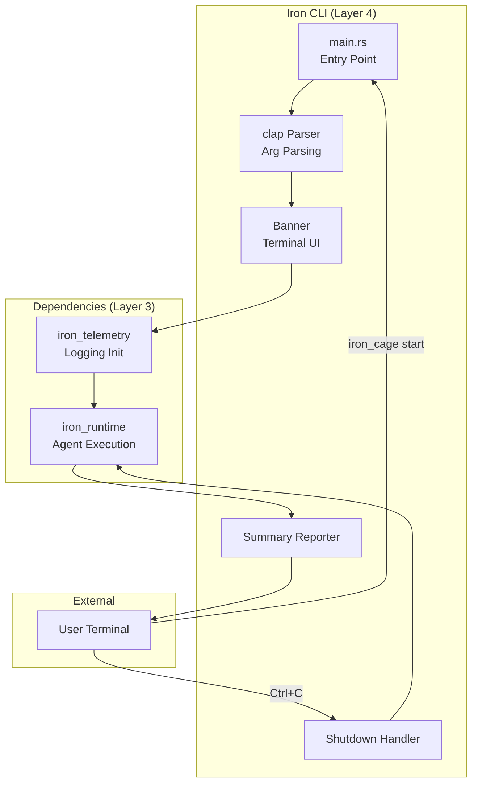
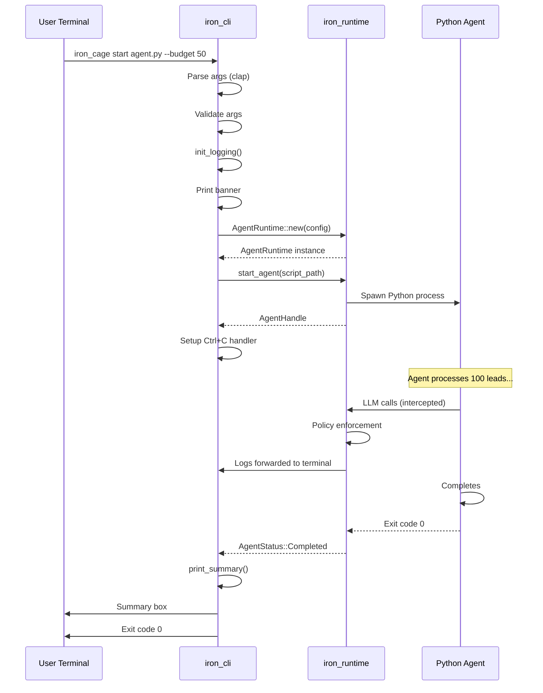

# spec

**Version:** 0.2
**Date:** 2025-12-07
**Component:** iron_cli
**Layer:** Application (Layer 4)
**Status:** Specification Complete, Implementation Minimal (15%)
**Priority:** CRITICAL for Pilot (Demo Entry Point)

---

## 1. Overview

### 1.1 Purpose

**iron_cli** is the **user-facing command-line interface** for Iron Cage. It provides the primary entry point for the conference demo, orchestrating iron_runtime, starting agents, and displaying formatted terminal output. This is what presenters and users interact with directly.

**Primary Responsibilities:**
- CLI command parsing (subcommands: start, stop, status)
- Runtime initialization and configuration
- Agent lifecycle control (via iron_runtime)
- Terminal UI with formatted output
- Graceful shutdown handling (Ctrl+C)
- Error reporting with actionable messages

**Pilot Scope:** Single command `iron_cage start <script> --budget <amount>` for 5-minute demo.

**Full Platform (Out of Scope):** Multi-agent management, interactive TUI, agent templates, configuration profiles, shell completions.

### 1.2 Design Principles

1. **Convention Over Configuration** - Sensible defaults, minimal required args
2. **Clear Feedback** - All events visible in terminal with timestamps
3. **Fail-Fast** - Invalid args rejected before runtime starts
4. **Ctrl+C Friendly** - Graceful shutdown on interrupt signal
5. **Demo-Ready** - Terminal output matches demonstration_scenario.md format

---

## 2. Scope

### 2.1 In Scope (Pilot)

**For Pilot Project (Conference Demo):**
- `iron_cage start <script>` command with --budget flag
- Runtime initialization (iron_telemetry, iron_runtime)
- Agent execution via iron_runtime
- Terminal output formatting (timestamps, colors, emojis)
- Graceful shutdown (Ctrl+C, agent completion, errors)
- Exit codes (0 = success, 1 = error)

**Rationale:** Demo requires single command to start agent with visible terminal output. Additional commands (stop, status) are not needed for demo script.

### 2.2 Out of Scope (Full Platform)

**Deferred to Post-Pilot:**
- Multi-agent commands (`iron_cage agents list`) → Pilot runs 1 agent
- Interactive TUI (Bubble Tea, termion) → Pilot uses plain logs
- Agent templates (`iron_cage new my_agent`) → Pilot uses custom script
- Configuration profiles (dev, staging, prod) → Pilot uses CLI args only
- Shell completions (bash, zsh, fish) → Pilot has no shell integration
- `iron_cage config` command → Pilot has no persistent config
- Progress bars (leads processed: [##########] 45/100) → Pilot uses log lines
- Log file output (--log-file flag) → Pilot uses stdout only

**Reasoning:** Conference demo is single command execution with terminal output. TUI and multi-agent management add complexity without demo value.

## 2.3 Deployment Context

Iron Cage supports two deployment modes. This module's behavior differs between modes.

**See:** [docs/deployment_packages.md](../../docs/deployment_packages.md) § Deployment Modes for complete deployment architecture.

**This Module (iron_cli):**

**Pilot Mode (Single Process):**
- Runs locally as demo entry point
- Starts iron_runtime in same process
- WebSocket connection to localhost (ws://localhost:8080/ws)
- --no-dashboard flag disables WebSocket server (terminal-only mode)

**Production Mode (Distributed):**
- Runs on developer machines (Agent Runtime package only)
- Starts iron_runtime locally for agent execution
- No WebSocket connection to Control Panel (agents run independently)
- Optional telemetry reporting to cloud Control Panel via HTTPS
- Control Panel accessed via web browser (separate deployment)

---

## 3. Functional Requirements

### FR-1: Command Structure

**Requirement:**
Provide CLI with subcommands and arguments following POSIX conventions.

**Command Syntax:**
```bash
iron_cage [OPTIONS] <COMMAND> [ARGS]

Commands:
  start     Start an AI agent from Python script
  stop      Stop a running agent (optional for pilot)
  status    Show agent status (optional for pilot)
  help      Print this message or the help of the given subcommand(s)

Options:
  -h, --help     Print help
  -V, --version  Print version
```

**Primary Command (Pilot):**
```bash
iron_cage start <SCRIPT> [OPTIONS]

Arguments:
  <SCRIPT>  Path to Python agent script

Options:
  --budget <USD>       Budget limit in USD [default: 50.0]
  --verbose            Enable verbose logging [default: false]
  --no-dashboard       Disable WebSocket server for dashboard [default: false]
  -h, --help          Print help
```

**Example Usage:**
```bash
# Minimal (uses defaults)
iron_cage start lead_gen_agent.py

# With budget
iron_cage start lead_gen_agent.py --budget 100

# Verbose mode
iron_cage start lead_gen_agent.py --budget 50 --verbose

# No dashboard (terminal only)
iron_cage start lead_gen_agent.py --no-dashboard
```

**Out of Scope:** Subcommands stop, status (optional for pilot).

---

### FR-2: Runtime Initialization

**Requirement:**
Initialize all required components before starting agent.

**Initialization Sequence:**
```rust
#[tokio::main]
async fn main() -> Result<()> {
  // 1. Initialize logging (iron_telemetry)
  iron_telemetry::init_logging(if args.verbose { "debug" } else { "info" })?;

  // 2. Print banner
  print_banner();

  // 3. Validate arguments
  validate_args(&args)?;

  // 4. Build runtime config
  let config = RuntimeConfig {
    budget: args.budget,
    verbose: args.verbose,
    websocket_enabled: !args.no_dashboard,
    ..Default::default()
  };

  // 5. Create runtime
  let runtime = AgentRuntime::new(config).await?;

  // 6. Start WebSocket server (if enabled)
  if !args.no_dashboard {
    let state = runtime.state_manager().clone();
    tokio::spawn(async move {
      iron_runtime::start_websocket_server(state).await
    });
  }

  // 7. Setup Ctrl+C handler
  setup_shutdown_handler(runtime.clone());

  // 8. Start agent
  let handle = runtime.start_agent(&args.script).await?;

  // 9. Wait for completion
  handle.wait().await?;

  // 10. Print summary
  print_summary(&runtime, &handle.agent_id)?;

  Ok(())
}
```

**Banner Output:**
```
╔═══════════════════════════════════════════════════════╗
║          Iron Cage Runtime v1.0.0                     ║
║          AI Agent Safety & Cost Control               ║
╚═══════════════════════════════════════════════════════╝

[14:23:31] INFO  Budget: $50.00 | PII Detection: ENABLED | Circuit Breaker: 3 failures
[14:23:31] INFO  WebSocket server listening on 127.0.0.1:8080
[14:23:31] INFO  Dashboard: http://localhost:5173
```

---

### FR-3: Agent Execution Orchestration

**Requirement:**
Start agent via iron_runtime, monitor execution, handle completion/failure.

**Execution Flow:**
```rust
async fn run_agent(args: StartArgs) -> Result<()> {
  // Create runtime
  let runtime = AgentRuntime::new(build_config(&args)).await?;

  // Start agent
  tracing::info!(
    script = %args.script.display(),
    "Starting agent"
  );

  let handle = runtime.start_agent(&args.script).await
    .map_err(|e| {
      tracing::error!("Failed to start agent: {}", e);
      e
    })?;

  tracing::info!(
    agent_id = %handle.agent_id,
    "Agent started successfully"
  );

  // Wait for completion
  let exit_status = handle.wait().await?;

  // Check result
  match handle.status() {
    AgentStatus::Completed => {
      tracing::info!("✅ Agent completed successfully");
      print_summary(&runtime, &handle.agent_id).await?;
      Ok(())
    },
    AgentStatus::Failed => {
      tracing::error!("❌ Agent failed");
      print_error_summary(&runtime, &handle.agent_id).await?;
      std::process::exit(1);
    },
    AgentStatus::Stopped => {
      tracing::warn!("Agent stopped by user (Ctrl+C)");
      std::process::exit(130);  // 128 + SIGINT(2)
    },
    _ => unreachable!(),
  }
}
```

**Terminal Output (Demo):**
```
[14:23:32] INFO  Starting agent (script=/path/to/lead_gen_agent.py)
[14:23:32] INFO  Agent started successfully (agent_id=agent-001)
[14:23:32] AGENT Processing lead 1/100: Acme Corp
...
[14:25:45] INFO  ✅ Agent completed successfully

╔═══════════════════════════════════════════════════════╗
║                   Execution Summary                   ║
╠═══════════════════════════════════════════════════════╣
║  Leads Processed:     100                             ║
║  Success Rate:        98%  (98/100)                   ║
║  Total Cost:          $49.88 / $50.00                 ║
║  Budget Used:         99.76%                          ║
║  PII Detections:      1                               ║
║  Circuit Breakers:    1 (linkedin_api)                ║
║  Duration:            2m 14s                          ║
╚═══════════════════════════════════════════════════════╝
```

---

### FR-4: Graceful Shutdown

**Requirement:**
Handle Ctrl+C (SIGINT) and SIGTERM gracefully, stopping agent cleanly before exit.

**Implementation:**
```rust
use tokio::signal;

fn setup_shutdown_handler(runtime: Arc<AgentRuntime>) {
  tokio::spawn(async move {
    match signal::ctrl_c().await {
      Ok(()) => {
        tracing::warn!("Received Ctrl+C, shutting down gracefully...");

        // Stop all running agents
        for agent_id in runtime.active_agents() {
          runtime.stop_agent(&agent_id).await.ok();
        }

        // Wait for cleanup
        tokio::time::sleep(Duration::from_secs(2)).await;

        std::process::exit(130);  // 128 + SIGINT(2)
      },
      Err(e) => {
        tracing::error!("Failed to listen for Ctrl+C: {}", e);
      }
    }
  });
}
```

**Shutdown Sequence:**
1. User presses Ctrl+C
2. CLI receives SIGINT signal
3. Log: `[HH:MM:SS] WARN Received Ctrl+C, shutting down gracefully...`
4. Call runtime.stop_agent() for all active agents
5. Python agents receive SIGTERM
6. Wait 2s for cleanup
7. Exit with code 130

**Timeout:**
- If agent doesnt stop in 2s, send SIGKILL (force)
- Log: `[HH:MM:SS] ERROR Agent did not stop, forcing shutdown`

---

### FR-5: Summary Reporting

**Requirement:**
Print formatted execution summary after agent completes or fails.

**Success Summary:**
```rust
async fn print_summary(
  runtime: &AgentRuntime,
  agent_id: &str
) -> Result<()> {
  let metrics = runtime.get_metrics(agent_id)
    .ok_or_else(|| Error::AgentNotFound(agent_id.to_string()))?;

  println!("\n╔═══════════════════════════════════════════════════════╗");
  println!("║                   Execution Summary                   ║");
  println!("╠═══════════════════════════════════════════════════════╣");
  println!("║  Leads Processed:     {:<33}║", metrics.leads_processed);
  println!("║  Success Rate:        {:>5.1}%  ({}/{}){}║",
    metrics.success_rate * 100.0,
    metrics.leads_succeeded,
    metrics.leads_processed,
    " ".repeat(20)
  );
  println!("║  Total Cost:          ${:.2} / ${:.2}{}║",
    metrics.cost.total_spent,
    metrics.cost.budget_limit,
    " ".repeat(15)
  );
  println!("║  Budget Used:         {:>5.2}%{}║",
    metrics.cost.percentage_used * 100.0,
    " ".repeat(28)
  );
  println!("║  PII Detections:      {:<33}║", metrics.safety.pii_count);
  println!("║  Circuit Breakers:    {:<33}║",
    format!("{} ({})", metrics.performance.circuits_opened, "linkedin_api")
  );
  println!("║  Duration:            {:<33}║",
    format_duration(metrics.duration_secs)
  );
  println!("╚═══════════════════════════════════════════════════════╝\n");

  Ok(())
}
```

**Failure Summary:**
```
[14:24:30] ERROR ❌ Agent failed

╔═══════════════════════════════════════════════════════╗
║                     Error Report                      ║
╠═══════════════════════════════════════════════════════╣
║  Error Type:          Budget Exceeded                 ║
║  Failed At:           Lead 92/100                     ║
║  Total Cost:          $50.12 / $50.00                 ║
║  Last Operation:      LLM call (gpt-4)                ║
║  Suggestion:          Increase budget or reduce       ║
║                       agent complexity                ║
╚═══════════════════════════════════════════════════════╝

Exit code: 1
```

---

### FR-6: Argument Validation

**Requirement:**
Validate all CLI arguments before starting runtime.

**Validation Rules:**

| Argument | Validation | Error Message |
|----------|------------|---------------|
| `<SCRIPT>` | File exists, readable, ends in .py | "Script not found: /path/to/agent.py" |
| `--budget` | > 0.0 | "Budget must be positive (got: -10.0)" |
| `--budget` | ≤ 10000.0 | "Budget exceeds max ($10,000.00)" |

**Implementation:**
```rust
fn validate_args(args: &StartArgs) -> Result<()> {
  // Validate script
  if !args.script.exists() {
    return Err(Error::InvalidArgument(
      format!("Script not found: {}", args.script.display())
    ));
  }

  if !args.script.extension().map_or(false, |e| e == "py") {
    return Err(Error::InvalidArgument(
      "Script must be a Python file (.py extension)".to_string()
    ));
  }

  // Validate budget
  if args.budget <= 0.0 {
    return Err(Error::InvalidArgument(
      format!("Budget must be positive (got: ${:.2})", args.budget)
    ));
  }

  if args.budget > 10000.0 {
    return Err(Error::InvalidArgument(
      format!("Budget exceeds maximum ($10,000.00, got: ${:.2})", args.budget)
    ));
  }

  Ok(())
}
```

**Error Display:**
```
Error: Budget must be positive (got: $-10.0)

Usage: iron_cage start <SCRIPT> --budget <USD>

For more information, try '--help'.
```

---

## 4. Non-Functional Requirements

### NFR-1: Startup Time

**Requirement:** CLI must print first log line within 500ms of invocation.

**Rationale:** Demo has tight timeline. Slow startup wastes presentation time and looks unprofessional.

**Measurement:** Time from shell `iron_cage start` to first `[HH:MM:SS] INFO` log.

**Acceptance:**
- P50: <300ms
- P99: <500ms

**Breakdown:**
- Rust binary startup: ~50ms
- Logging init: ~10ms
- Arg parsing: ~5ms
- Runtime creation: ~100ms
- Banner print: ~10ms
- Total: ~175ms typical

---

### NFR-2: Error Message Quality

**Requirement:** All errors must include actionable suggestions for resolution.

**Examples:**

**Bad (Non-Actionable):**
```
Error: File not found
```

**Good (Actionable):**
```
Error: Script not found: /path/to/agent.py

Suggestion: Check the file path and ensure the script exists.
            Use absolute paths or paths relative to current directory.
```

**Bad:**
```
Error: Invalid budget
```

**Good:**
```
Error: Budget must be positive (got: $-10.0)

Suggestion: Provide a positive budget value:
            iron_cage start agent.py --budget 50
```

**Implementation:**
- All Error variants include suggestion field
- CLI displays error + suggestion + usage hint

---

### NFR-3: Exit Codes

**Requirement:** Return standard POSIX exit codes for scripting integration.

**Exit Code Mapping:**

| Code | Meaning | Example |
|------|---------|---------|
| 0 | Success | Agent completed all leads |
| 1 | General error | Budget exceeded, agent crash |
| 2 | Misuse of CLI | Invalid arguments, missing script |
| 130 | Interrupted (Ctrl+C) | User canceled execution |

**Implementation:**
```rust
match run_agent(args).await {
  Ok(()) => std::process::exit(0),
  Err(Error::InvalidArgument(_)) => {
    eprintln!("{}", err);
    eprintln!("\nFor more information, try '--help'.");
    std::process::exit(2);
  },
  Err(Error::BudgetExceeded(_)) => {
    tracing::error!("{}", err);
    print_error_summary(&runtime, &agent_id).await;
    std::process::exit(1);
  },
  Err(e) => {
    tracing::error!("Fatal error: {}", e);
    std::process::exit(1);
  }
}
```

---

## 5. Ubiquitous Language

| Term | Definition | Example |
|------|------------|---------|
| **CLI** | Command-Line Interface | iron_cage binary |
| **Subcommand** | Primary action verb | start, stop, status |
| **Argument** | Positional parameter | <SCRIPT> path |
| **Flag** | Optional parameter | --budget, --verbose |
| **Banner** | ASCII art header on startup | Iron Cage Runtime v1.0.0 |
| **Summary** | Execution report on completion | Box with metrics |
| **Exit Code** | Process return value | 0 (success), 1 (error) |
| **Ctrl+C** | SIGINT signal (interrupt) | User cancellation |
| **Graceful Shutdown** | Clean agent stop before exit | SIGTERM → cleanup → exit |

---

## 6. System Architecture

### 6.1 Component Diagram



### 6.2 Execution Flow



---

## 7. Detailed Functional Requirements

### FR-1: Command Parsing (clap)

**Implementation:**
```rust
use clap::{Parser, Subcommand};

#[derive(Parser)]
#[command(name = "iron_cage")]
#[command(version = "1.0.0")]
#[command(about = "AI Agent Safety & Cost Control Runtime")]
#[command(long_about = "
Iron Cage provides production-grade safety, cost control, and reliability
for AI agent systems. Prevents PII leaks, enforces budget limits, and
handles API failures gracefully.
")]
struct Cli {
  #[command(subcommand)]
  command: Commands,
}

#[derive(Subcommand)]
enum Commands {
  /// Start an AI agent from Python script
  Start(StartArgs),

  /// Stop a running agent (optional for pilot)
  #[cfg(feature = "full")]
  Stop(StopArgs),

  /// Show agent status (optional for pilot)
  #[cfg(feature = "full")]
  Status(StatusArgs),
}

#[derive(Parser)]
struct StartArgs {
  /// Path to Python agent script
  #[arg(value_name = "SCRIPT")]
  script: PathBuf,

  /// Budget limit in USD
  #[arg(long, default_value = "50.0")]
  budget: f64,

  /// Enable verbose logging
  #[arg(long, default_value = "false")]
  verbose: bool,

  /// Disable WebSocket server for dashboard
  #[arg(long, default_value = "false")]
  no_dashboard: bool,
}
```

**Help Output:**
```
$ iron_cage start --help

Start an AI agent from Python script

Usage: iron_cage start <SCRIPT> [OPTIONS]

Arguments:
  <SCRIPT>  Path to Python agent script

Options:
      --budget <USD>     Budget limit in USD [default: 50.0]
      --verbose          Enable verbose logging
      --no-dashboard     Disable WebSocket server for dashboard
  -h, --help            Print help
```

---

### FR-2: Terminal Banner

**Implementation:**
```rust
fn print_banner() {
  println!("\n╔═══════════════════════════════════════════════════════╗");
  println!("║          Iron Cage Runtime v{}{}║", env!("CARGO_PKG_VERSION"), " ".repeat(30));
  println!("║          AI Agent Safety & Cost Control               ║");
  println!("╚═══════════════════════════════════════════════════════╝\n");
}
```

**Output:**
```
╔═══════════════════════════════════════════════════════╗
║          Iron Cage Runtime v1.0.0                     ║
║          AI Agent Safety & Cost Control               ║
╚═══════════════════════════════════════════════════════╝
```

**Demo Impact:**
- Professional appearance for conference presentation
- Clear version identification
- Sets expectation for runtime behavior

---

### FR-3: Execution Summary (Detailed)

**Data Collection:**
```rust
#[derive(Debug)]
struct ExecutionSummary {
  leads_processed: u32,
  leads_succeeded: u32,
  leads_failed: u32,
  success_rate: f64,
  total_cost: f64,
  budget_limit: f64,
  percentage_used: f64,
  pii_detections: u32,
  circuits_opened: Vec<String>,
  duration_secs: u64,
}

async fn collect_summary(
  runtime: &AgentRuntime,
  agent_id: &str
) -> Result<ExecutionSummary> {
  let cost = runtime.get_cost_metrics(agent_id)?;
  let safety = runtime.get_safety_metrics(agent_id)?;
  let performance = runtime.get_performance_metrics(agent_id)?;

  Ok(ExecutionSummary {
    leads_processed: performance.leads_processed,
    leads_succeeded: performance.leads_succeeded,
    leads_failed: performance.leads_failed,
    success_rate: performance.leads_succeeded as f64 / performance.leads_processed as f64,
    total_cost: cost.total_spent,
    budget_limit: cost.budget_limit,
    percentage_used: cost.percentage_used,
    pii_detections: safety.pii_count,
    circuits_opened: performance.circuits_opened.clone(),
    duration_secs: performance.duration_secs,
  })
}
```

**Formatting:**
```rust
fn print_summary_box(summary: &ExecutionSummary) {
  println!("\n╔═══════════════════════════════════════════════════════╗");
  println!("║                   Execution Summary                   ║");
  println!("╠═══════════════════════════════════════════════════════╣");

  println!("║  Leads Processed:     {:<33}║", summary.leads_processed);

  println!("║  Success Rate:        {:>5.1}%  ({}/{}){}║",
    summary.success_rate * 100.0,
    summary.leads_succeeded,
    summary.leads_processed,
    " ".repeat(20)
  );

  println!("║  Total Cost:          ${:.2} / ${:.2}{}║",
    summary.total_cost,
    summary.budget_limit,
    " ".repeat(15)
  );

  println!("║  Budget Used:         {:>5.2}%{}║",
    summary.percentage_used * 100.0,
    " ".repeat(28)
  );

  println!("║  PII Detections:      {:<33}║", summary.pii_detections);

  let circuits = summary.circuits_opened.join(", ");
  println!("║  Circuit Breakers:    {:<33}║",
    format!("{} ({})", summary.circuits_opened.len(), circuits)
  );

  println!("║  Duration:            {:<33}║",
    format_duration(summary.duration_secs)
  );

  println!("╚═══════════════════════════════════════════════════════╝\n");
}

fn format_duration(secs: u64) -> String {
  if secs < 60 {
    format!("{}s", secs)
  } else if secs < 3600 {
    let mins = secs / 60;
    let secs = secs % 60;
    format!("{}m {}s", mins, secs)
  } else {
    let hours = secs / 3600;
    let mins = (secs % 3600) / 60;
    let secs = secs % 60;
    format!("{}h {}m {}s", hours, mins, secs)
  }
}
```

---

## 8. API Surface (Public Contract)

### 8.1 CLI Interface (Mandatory for Pilot)

**Primary Command:**
```
iron_cage start <SCRIPT> [OPTIONS]

Arguments:
  <SCRIPT>  Path to Python agent script

Options:
  --budget <USD>       Budget limit in USD [default: 50.0]
  --verbose            Enable verbose logging
  --no-dashboard       Disable WebSocket server for dashboard
  -h, --help          Print help
  -V, --version       Print version
```

**Exit Codes:**
- 0: Success (agent completed)
- 1: Error (budget exceeded, agent crashed)
- 2: Invalid arguments
- 130: Interrupted (Ctrl+C)

### 8.2 Internal Module Structure

```rust
// src/main.rs (entry point)
mod banner;      // print_banner()
mod summary;     // print_summary(), print_error_summary()
mod validation;  // validate_args()
mod shutdown;    // setup_shutdown_handler()

#[tokio::main]
async fn main() -> Result<()> { /* ... */ }

// src/banner.rs
pub fn print_banner();

// src/summary.rs
pub async fn print_summary(runtime: &AgentRuntime, agent_id: &str) -> Result<()>;
pub async fn print_error_summary(runtime: &AgentRuntime, agent_id: &str) -> Result<()>;

// src/validation.rs
pub fn validate_args(args: &StartArgs) -> Result<()>;

// src/shutdown.rs
pub fn setup_shutdown_handler(runtime: Arc<AgentRuntime>);
```

---

## 9. External Dependencies

### 9.1 Rust Crates

| Crate | Version | Purpose | Risk | Mitigation |
|-------|---------|---------|------|------------|
| **clap** | 4.4 | CLI parsing | Low (mature) | Pin version, test help output |
| **tokio** | 1.35 | Async runtime | Low (standard) | Existing in project |
| **tracing-subscriber** | 0.3 | Logging backend | Low (standard) | Existing in project |

**Cargo.toml:**
```toml
[dependencies]
iron_types = { version = "0.1", path = "../iron_types" }
iron_runtime = { version = "0.1", path = "../iron_runtime" }
iron_telemetry = { version = "0.1", path = "../iron_telemetry" }

clap = { version = "4.4", features = ["derive"] }
tokio = { version = "1.35", features = ["full", "signal"] }
tracing = "0.1"
tracing-subscriber = { version = "0.3", features = ["env-filter"] }
anyhow = "1.0"

[features]
enabled = []
full = ["enabled"]

[[bin]]
name = "iron_cage"
path = "src/main.rs"
```

### 9.2 Internal Crate Dependencies

- **iron_types** (Layer 1) - Error, Result types
- **iron_runtime** (Layer 3) - AgentRuntime for agent execution
- **iron_telemetry** (Layer 1) - Logging initialization

**Dependency Chain:**
CLI → runtime → (safety, cost, reliability, state, telemetry, types)

**Critical Path:** iron_cli blocks on iron_runtime implementation.

---

## 10. Data Model

### 10.1 CLI Arguments

**StartArgs:**
```rust
#[derive(Parser, Debug)]
pub struct StartArgs {
  /// Path to Python agent script
  #[arg(value_name = "SCRIPT")]
  pub script: PathBuf,

  /// Budget limit in USD
  #[arg(long, default_value = "50.0", value_name = "USD")]
  pub budget: f64,

  /// Enable verbose logging
  #[arg(long, default_value = "false")]
  pub verbose: bool,

  /// Disable WebSocket server for dashboard
  #[arg(long, default_value = "false")]
  pub no_dashboard: bool,
}
```

### 10.2 Execution Summary

**ExecutionSummary:**
```rust
#[derive(Debug)]
pub struct ExecutionSummary {
  pub leads_processed: u32,
  pub leads_succeeded: u32,
  pub leads_failed: u32,
  pub success_rate: f64,         // 0.98 for 98%
  pub total_cost: f64,
  pub budget_limit: f64,
  pub percentage_used: f64,
  pub pii_detections: u32,
  pub circuits_opened: Vec<String>,  // ["linkedin_api"]
  pub duration_secs: u64,
}
```

---

## 11. Error Handling

### 11.1 Error Scenarios

**Scenario 1: Script Not Found**
```
$ iron_cage start missing.py

Error: Script not found: missing.py

Suggestion: Check the file path and ensure the script exists.
            Use absolute paths or paths relative to current directory.

            Example: iron_cage start /path/to/lead_gen_agent.py

Exit code: 2
```

**Scenario 2: Invalid Budget**
```
$ iron_cage start agent.py --budget -10

Error: Budget must be positive (got: $-10.00)

Suggestion: Provide a positive budget value.

            Example: iron_cage start agent.py --budget 50

Exit code: 2
```

**Scenario 3: Budget Exceeded During Execution**
```
[14:24:30] INFO  Processing lead 92/100...
[14:24:31] ERROR BUDGET EXCEEDED - Agent stopped
[14:24:31] ERROR ❌ Agent failed

╔═══════════════════════════════════════════════════════╗
║                     Error Report                      ║
╠═══════════════════════════════════════════════════════╣
║  Error Type:          Budget Exceeded                 ║
║  Failed At:           Lead 92/100                     ║
║  Total Cost:          $50.12 / $50.00                 ║
║  Overage:             $0.12                           ║
║  Suggestion:          Increase budget or use          ║
║                       cheaper model (gpt-3.5-turbo)   ║
╚═══════════════════════════════════════════════════════╝

Exit code: 1
```

**Scenario 4: Ctrl+C (User Interrupt)**
```
[14:24:15] INFO  Processing lead 45/100...
^C
[14:24:16] WARN  Received Ctrl+C, shutting down gracefully...
[14:24:16] INFO  Stopping agent (agent_id=agent-001)
[14:24:18] WARN  Agent stopped by user (Ctrl+C)

Leads Processed: 45/100
Cost: $22.50 / $50.00

Exit code: 130
```

---

## 12. Integration Points

### 12.1 With iron_runtime (Layer 3)

**Runtime Creation:**
```rust
let config = RuntimeConfig {
  budget: args.budget,
  verbose: args.verbose,
  websocket_enabled: !args.no_dashboard,
  ..Default::default()
};

let runtime = AgentRuntime::new(config).await?;
```

**Agent Control:**
```rust
// Start
let handle = runtime.start_agent(&args.script).await?;

// Monitor
let exit_status = handle.wait().await?;

// Get metrics
let metrics = runtime.get_metrics(&handle.agent_id)?;
```

### 12.2 With iron_telemetry (Layer 1)

**Logging Initialization:**
```rust
// At startup (before any other operations)
iron_telemetry::init_logging(if args.verbose { "debug" } else { "info" })?;
```

**Log Output:**
- All tracing::info!/warn!/error! calls go to terminal
- Format: `[HH:MM:SS] LEVEL Message (key=value)`
- Colors applied by iron_telemetry subscriber

### 12.3 With User Terminal

**Stdout:**
- Banner, logs, agent output, summary

**Stderr:**
- Errors only (clap validation errors, fatal errors)

**Interactive:**
- Ctrl+C signal handling
- No other interactivity (not a TUI)

---

## 13. Demo Integration

### 13.1 Demo Command

**From demonstration_scenario.md:**
```bash
iron_cage start /path/to/lead_gen_agent.py --budget 50
```

**Expected Terminal Output (First 10 Lines):**
```
╔═══════════════════════════════════════════════════════╗
║          Iron Cage Runtime v1.0.0                     ║
║          AI Agent Safety & Cost Control               ║
╚═══════════════════════════════════════════════════════╝

[14:23:31] INFO  Budget: $50.00 | PII Detection: ENABLED | Circuit Breaker: 3 failures
[14:23:31] INFO  WebSocket server listening on 127.0.0.1:8080
[14:23:31] INFO  Dashboard: http://localhost:5173
[14:23:32] INFO  Starting agent (script=/path/to/lead_gen_agent.py)
[14:23:32] INFO  Agent started successfully (agent_id=agent-001)
[14:23:32] AGENT Processing lead 1/100: Acme Corp
```

**Expected Summary (Last 15 Lines):**
```
[14:25:45] INFO  ✅ Agent completed successfully

╔═══════════════════════════════════════════════════════╗
║                   Execution Summary                   ║
╠═══════════════════════════════════════════════════════╣
║  Leads Processed:     100                             ║
║  Success Rate:        98.0%  (98/100)                 ║
║  Total Cost:          $49.88 / $50.00                 ║
║  Budget Used:         99.76%                          ║
║  PII Detections:      1                               ║
║  Circuit Breakers:    1 (linkedin_api)                ║
║  Duration:            2m 14s                          ║
╚═══════════════════════════════════════════════════════╝
```

### 13.2 Conference Presentation Integration

**Slide Transition:**
- Slide 17: "Let me show you Iron Cage in action"
- **Action:** Switch to terminal window
- **Command:** `iron_cage start lead_gen_agent.py --budget 50`
- **Visual:** Banner appears, logs start streaming
- Slide 18: Live demo (terminal + dashboard side-by-side)

**Terminal Visibility:**
- Font size: 18pt (readable from back of room)
- Terminal dimensions: 100 columns × 40 rows
- Color scheme: Dark background (Solarized Dark or similar)
- Emojis: ✅🔴🔒⚠️ must render correctly

---

## 14. Testing Strategy

### 14.1 Unit Tests

**Test File:** `tests/cli_parsing_unit_tests.rs`
```rust
#[test]
fn test_parse_start_command_minimal() {
  let cli = Cli::try_parse_from(&["iron_cage", "start", "agent.py"]).unwrap();

  match cli.command {
    Commands::Start(args) => {
      assert_eq!(args.script, PathBuf::from("agent.py"));
      assert_eq!(args.budget, 50.0);  // Default
      assert_eq!(args.verbose, false);
    },
    _ => panic!("Expected Start command"),
  }
}

#[test]
fn test_parse_start_command_with_budget() {
  let cli = Cli::try_parse_from(&[
    "iron_cage", "start", "agent.py", "--budget", "100"
  ]).unwrap();

  match cli.command {
    Commands::Start(args) => {
      assert_eq!(args.budget, 100.0);
    },
    _ => panic!("Expected Start command"),
  }
}

#[test]
fn test_parse_start_command_verbose() {
  let cli = Cli::try_parse_from(&[
    "iron_cage", "start", "agent.py", "--verbose"
  ]).unwrap();

  match cli.command {
    Commands::Start(args) => {
      assert!(args.verbose);
    },
    _ => panic!("Expected Start command"),
  }
}
```

**Test File:** `tests/validation_unit_tests.rs`
```rust
#[test]
fn test_validate_args_success() {
  let args = StartArgs {
    script: PathBuf::from("tests/fixtures/dummy_agent.py"),
    budget: 50.0,
    verbose: false,
    no_dashboard: false,
  };

  // Create dummy script for test
  std::fs::write("tests/fixtures/dummy_agent.py", "# dummy").unwrap();

  assert!(validate_args(&args).is_ok());

  std::fs::remove_file("tests/fixtures/dummy_agent.py").unwrap();
}

#[test]
fn test_validate_args_script_not_found() {
  let args = StartArgs {
    script: PathBuf::from("nonexistent.py"),
    budget: 50.0,
    verbose: false,
    no_dashboard: false,
  };

  let err = validate_args(&args).unwrap_err();
  assert!(matches!(err, Error::InvalidArgument(_)));
  assert!(err.to_string().contains("Script not found"));
}

#[test]
fn test_validate_args_invalid_budget() {
  let args = StartArgs {
    script: PathBuf::from("agent.py"),
    budget: -10.0,
    verbose: false,
    no_dashboard: false,
  };

  let err = validate_args(&args).unwrap_err();
  assert!(err.to_string().contains("must be positive"));
}
```

### 14.2 Integration Tests

**Test File:** `tests/cli_execution_integration_tests.rs`
```rust
/// Full CLI execution with dummy agent
///
/// # Prevention
/// Validates complete CLI flow:
/// - Arg parsing
/// - Runtime initialization
/// - Agent execution
/// - Summary printing
/// - Exit code
///
/// # Pitfall
/// CLI must initialize iron_telemetry BEFORE any tracing calls,
/// otherwise logs wont be formatted correctly.

#[tokio::test]
async fn test_cli_full_execution() {
  // Create minimal test agent
  let test_script = "/tmp/test_agent_cli.py";
  std::fs::write(test_script, r#"
import time
print("Agent started")
time.sleep(0.5)
print("Agent completed")
"#).unwrap();

  // Run CLI
  let exit_code = std::process::Command::new("target/debug/iron_cage")
    .args(&["start", test_script, "--budget", "10"])
    .status()
    .unwrap()
    .code()
    .unwrap();

  assert_eq!(exit_code, 0);

  std::fs::remove_file(test_script).unwrap();
}

#[tokio::test]
async fn test_cli_invalid_args() {
  let exit_code = std::process::Command::new("target/debug/iron_cage")
    .args(&["start", "nonexistent.py"])
    .status()
    .unwrap()
    .code()
    .unwrap();

  assert_eq!(exit_code, 2);  // Invalid argument
}
```

### 14.3 Demo Rehearsal Test

**Test File:** `tests/demo_rehearsal_integration_tests.rs`
```rust
/// Full demo scenario rehearsal
///
/// # Prevention
/// Validates complete conference demo:
/// - Command: iron_cage start lead_gen_agent.py --budget 50
/// - 100 leads processed
/// - All 3 triggers fire
/// - Summary printed
/// - Exit code 0
///
/// # Pitfall
/// Requires:
/// - OpenAI API key (OPENAI_API_KEY env var)
/// - lead_gen_agent.py in correct location
/// - test_data/leads.csv with 100 leads
/// - Dashboard NOT running (avoid port conflict)

#[tokio::test]
#[ignore]  // Requires OpenAI API key
async fn test_demo_full_rehearsal() {
  let output = std::process::Command::new("target/release/iron_cage")
    .args(&[
      "start",
      "/path/to/lead_gen_agent.py",
      "--budget", "50",
      "--verbose"
    ])
    .output()
    .unwrap();

  // Verify exit code
  assert_eq!(output.status.code().unwrap(), 0);

  let stdout = String::from_utf8(output.stdout).unwrap();

  // Verify banner printed
  assert!(stdout.contains("Iron Cage Runtime"));

  // Verify all 3 triggers logged
  assert!(stdout.contains("Circuit breaker OPENED"));  // Trigger #1
  assert!(stdout.contains("PII DETECTED"));            // Trigger #2
  assert!(stdout.contains("BUDGET WARNING"));          // Trigger #3

  // Verify summary printed
  assert!(stdout.contains("Execution Summary"));
  assert!(stdout.contains("Leads Processed:     100"));

  // Verify final cost under budget
  assert!(stdout.contains("$49.88 / $50.00") || stdout.contains("99.76%"));
}
```

---

## 15. Success Metrics

### 15.1 Pilot Success Criteria

**Functional:**
- ✅ `iron_cage start` command works without errors
- ✅ Banner displays on startup
- ✅ All logs formatted correctly ([HH:MM:SS] LEVEL)
- ✅ Agent executes and completes 100 leads
- ✅ Summary printed on completion
- ✅ Ctrl+C gracefully stops agent
- ✅ Exit codes correct (0=success, 1=error, 2=invalid args)

**Performance (NFRs):**
- ✅ Startup time: <500ms to first log (NFR-1)
- ✅ Error messages include suggestions (NFR-2)
- ✅ Exit codes follow POSIX standards (NFR-3)

**Demo Execution:**
- ✅ Presenter types single command, demo starts
- ✅ Terminal output readable from back of room
- ✅ Emojis render correctly (✅🔴🔒⚠️)
- ✅ Summary box displays professional metrics

### 15.2 Code Quality

- Target LOC: 400 (current: 67, gap: +333)
- Test coverage: >70% line coverage
- Zero clippy warnings (Level 3 tests pass)
- Documentation: Help text clear and complete
- Binary size: <10MB (release build)

---

## 16. Implementation Phases

### Phase 1: Enhanced Argument Parsing (FR-1)
**Estimated LOC:** +60
**Dependencies:** clap crate
**Deliverable:** Full StartArgs with validation
**Validation:** CLI parsing unit tests

### Phase 2: Argument Validation (FR-6)
**Estimated LOC:** +50
**Dependencies:** std::fs
**Deliverable:** validate_args() with actionable errors
**Validation:** Validation unit tests (missing script, invalid budget)

### Phase 3: Terminal Banner (FR-2)
**Estimated LOC:** +20
**Dependencies:** None
**Deliverable:** print_banner() with ASCII box
**Validation:** Visual inspection in terminal

### Phase 4: Runtime Integration (FR-2, FR-3)
**Estimated LOC:** +80
**Dependencies:** iron_runtime
**Deliverable:** AgentRuntime creation and agent execution
**Validation:** Integration test with dummy agent

### Phase 5: Graceful Shutdown (FR-4)
**Estimated LOC:** +50
**Dependencies:** tokio::signal
**Deliverable:** Ctrl+C handler with cleanup
**Validation:** Manual test (Ctrl+C during execution)

### Phase 6: Summary Reporting (FR-5)
**Estimated LOC:** +70
**Dependencies:** iron_runtime metrics
**Deliverable:** print_summary() with formatted box
**Validation:** Integration test verifies summary printed

### Phase 7: Error Handling
**Estimated LOC:** +33 (error messages + suggestions)
**Dependencies:** iron_types
**Deliverable:** Comprehensive error messages
**Validation:** Error scenario tests

**Total Estimated:** 363 LOC (close to 400 target with margin for refinement)

---

## 17. Limitations and Assumptions

### 17.1 Pilot Limitations

**Simplified for Conference Demo:**

1. **Single Command:** Only `start` subcommand implemented
   - **Why:** Demo uses single command execution model
   - **Impact:** Full platform needs stop, status, list commands

2. **No Interactive Mode:** Command executes and exits
   - **Why:** Demo is one-shot execution (100 leads, done)
   - **Impact:** Full platform may want TUI for monitoring

3. **No Configuration File:** All config via CLI args
   - **Why:** Demo uses consistent settings (--budget 50)
   - **Impact:** Full platform needs ~/.iron_cage/config.toml

4. **No Shell Completions:** No tab-completion for args
   - **Why:** Demo presenter types full command
   - **Impact:** Full platform generates completions for bash/zsh/fish

5. **Hardcoded Paths:** Assumes Python 3.11 in PATH
   - **Why:** Demo machine configured with Python 3.11
   - **Impact:** Full platform detects Python version, validates compatibility

6. **No Log File Output:** Logs to stdout only
   - **Why:** Demo shows terminal output live
   - **Impact:** Full platform supports --log-file for persistence

### 17.2 Known Issues

**None currently.** Basic demo implementation is functional.

**Potential Issue (Terminal Encoding):**
- Emojis require UTF-8 terminal encoding
- **Mitigation:** Verify presenter's terminal supports UTF-8 before demo
- **Fallback:** If emojis dont render, remove from iron_telemetry output

---

## 18. Cross-References

### 18.1 Parent Specifications

- **Pilot Spec:** `/home/user1/pro/lib/willbe/module/iron_cage/pilot/spec.md`
  - Section 5.3: Feature #27 (CLI Interface)
  - Lines 470-490: CLI requirements

- **Demo Scenario:** `/home/user1/pro/lib/willbe/module/iron_cage/pilot/demo/demonstration_scenario.md`
  - Part 1: Agent Startup (lines 100-150)
  - Terminal output format specification
  - Summary box format

### 18.2 Related Crate Specifications

- **iron_types:** Error enum with InvalidArgument variant
- **iron_runtime:** AgentRuntime, AgentHandle APIs
- **iron_telemetry:** Logging initialization, format specification

### 18.3 Consumer Documentation

**Users:**
- Conference presenters (primary)
- Demo rehearsal testers
- Future pilot users (post-conference)

**Usage Documentation:**
- Help text: `iron_cage --help`
- Specification: This file
- Demo script: demonstration_scenario.md

---

## 19. Conformance Checklist

**Specification Completeness:**
- ✅ Version and date specified
- ✅ Component and layer identified
- ✅ Purpose and scope defined (In/Out of scope)
- ✅ Functional requirements (FR-1 through FR-6)
- ✅ Non-functional requirements (NFR-1 through NFR-3)
- ✅ Ubiquitous language vocabulary
- ✅ System architecture (Mermaid diagrams)
- ✅ API surface documented (CLI interface)
- ✅ Error handling specified
- ✅ Integration points defined
- ✅ Demo integration detailed
- ✅ Testing strategy provided
- ✅ Success metrics measurable
- ✅ Limitations documented
- ✅ Cross-references complete

**Implementation Readiness (Mark ❌ during implementation):**
- ❌ FR-1: clap command structure implemented (Start subcommand)
- ❌ FR-2: Terminal banner implemented
- ❌ FR-2: Runtime initialization sequence implemented
- ❌ FR-3: Agent execution orchestration implemented
- ❌ FR-4: Graceful shutdown (Ctrl+C) implemented
- ❌ FR-5: Success summary printing implemented
- ❌ FR-5: Error summary printing implemented
- ❌ FR-6: Argument validation implemented
- ❌ NFR-1: Startup time <500ms verified
- ❌ NFR-2: Error messages have suggestions
- ❌ NFR-3: Exit codes follow POSIX
- ❌ Demo rehearsal test passes
- ❌ Test coverage ≥70%
- ❌ Zero clippy warnings

---

## 20. Open Questions and Decisions

### 20.1 Resolved

**Q1:** Should CLI have interactive TUI mode?
**A1:** No for pilot. Logs-only is sufficient for demo. Full platform can add TUI.

**Q2:** Configuration file support?
**A2:** No for pilot. CLI args only. Full platform adds ~/.iron_cage/config.toml.

**Q3:** Multiple subcommands (start, stop, status)?
**A3:** Only `start` for pilot. Others are optional, demo doesn't use them.

### 20.2 Pending

**Q1:** Should summary box use Unicode box-drawing characters or ASCII?
**Current:** Unicode (╔═╗║╚╝)
**Alternative:** ASCII (+--+||+-+)
**Decision:** Keep Unicode for professional appearance, test terminal compatibility.

**Q2:** Binary name: `iron_cage` or `iron`?
**Current main.rs:** `#[command(name = "iron")]` (line 9)
**Demo script:** Uses `iron_cage` (demonstration_scenario.md)
**Decision:** Change to `iron_cage` for clarity (current name is confusing).

---

## 21. Migration Notes

### 21.1 From Current Implementation

**Existing Code (67 LOC):**
- ✅ clap Parser setup
- ✅ Basic Cli struct with args (budget, pii_detection, circuit_breaker)
- ✅ tokio::main async entry point
- ✅ tracing_subscriber initialization
- ✅ Module initialization demo (PII, cost, reliability)
- ⚠️ Wrong binary name: "iron" should be "iron_cage"
- ⚠️ No subcommands (start, stop, status)
- ⚠️ No script path argument
- ⚠️ No actual agent execution (demo only)
- ⚠️ No summary printing
- ⚠️ No Ctrl+C handling

**Required Changes:**
1. Change binary name: "iron" → "iron_cage" (line 9)
2. Add Subcommand enum (Start, Stop, Status)
3. Add StartArgs struct with script: PathBuf
4. Replace demo logic with actual runtime integration
5. Add validate_args() function
6. Add print_banner() function
7. Add print_summary(), print_error_summary() functions
8. Add setup_shutdown_handler() for Ctrl+C
9. Remove current demo logic (lines 40-61)
10. Add proper error handling with exit codes

**Estimated Effort:** 2 developer-days (333 LOC to add + tests)
**Priority:** CRITICAL - Demo execution entry point

### 21.2 Breaking Changes

**Binary Name Change:**
- Current: `iron` (confusing, conflicts with chemistry element)
- Pilot: `iron_cage` (clear project identification)
- Impact: All documentation and demo scripts use `iron_cage`

**Argument Structure Change:**
- Current: Top-level flags (--budget at root)
- Pilot: Subcommand flags (iron_cage start --budget)
- Impact: More scalable for future subcommands

---

## 22. Future Extensions (Post-Pilot)

### 22.1 Interactive TUI (Bubble Tea)

**Requirement:** Terminal UI with panels for live metrics monitoring.

**Features:**
- Split-pane layout (logs left, metrics right)
- Real-time metric updates (no dashboard needed)
- Keyboard shortcuts (q=quit, p=pause, r=resume)

**Implementation:**
```rust
use ratatui::{Terminal, backend::CrosstermBackend};

fn run_tui(runtime: AgentRuntime) -> Result<()> {
  let mut terminal = Terminal::new(CrosstermBackend::new(stdout()))?;

  loop {
    terminal.draw(|f| {
      // Left pane: scrolling logs
      // Right pane: metrics (cost, safety, performance)
    })?;

    if event::poll(Duration::from_millis(100))? {
      if let Event::Key(key) = event::read()? {
        match key.code {
          KeyCode::Char('q') => break,
          _ => {}
        }
      }
    }
  }

  Ok(())
}
```

**Effort:** 5 developer-days (ratatui integration, layout design)

### 22.2 Agent Templates

**Requirement:** Generate starter agent code from templates.

**Command:**
```bash
iron_cage new my_agent --template langchain
# Creates: my_agent.py with boilerplate
```

**Templates:**
- langchain: LangChain agent with Iron Cage integration
- crewai: CrewAI agent with Iron Cage integration
- minimal: Bare-bones agent (OpenAI only)

**Effort:** 1 developer-day (template files, substitution logic)

### 22.3 Configuration Profiles

**Requirement:** Save/load configuration from ~/.iron_cage/config.toml.

**Config File:**
```toml
[default]
budget = 50.0
pii_detection = true
circuit_breaker_threshold = 3

[production]
budget = 500.0
pii_detection = true
budget_warning_threshold = 0.95

[development]
budget = 10.0
verbose = true
```

**Usage:**
```bash
iron_cage start agent.py --profile production
```

**Effort:** 2 developer-days (toml parsing, profile merging with CLI args)

---

**End of Specification**

**Critical Priority:**
iron_cli is the demo entry point. Without this, conference demo cannot execute.

**Dependencies:**
- Blocks on: iron_runtime (must be implemented first)
- Blocked by: None (top layer)

**Next Steps:**
1. Review this specification
2. Implement after iron_runtime complete
3. Test with demo rehearsal (full 100-lead scenario)
4. Verify terminal output matches demonstration_scenario.md

**Demo Command (Final):**
```bash
iron_cage start /path/to/lead_gen_agent.py --budget 50
```

---

## Revision History

| Version | Date | Changes |
|---------|------|---------|
| 0.2 | 2025-12-07 | Added § 2.3 Deployment Context - distinguish Pilot vs Production mode CLI behavior |
| 0.1 | 2025-11-25 | Initial pilot specification - CLI entry point for conference demo |

**Next Review:** After iron_runtime implementation (Phase 1 complete)
