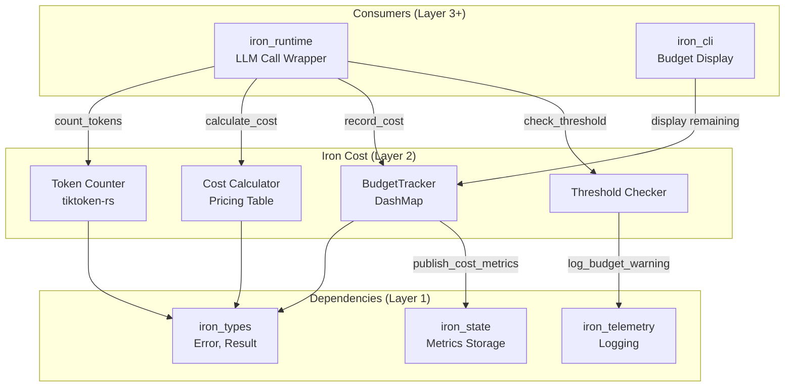
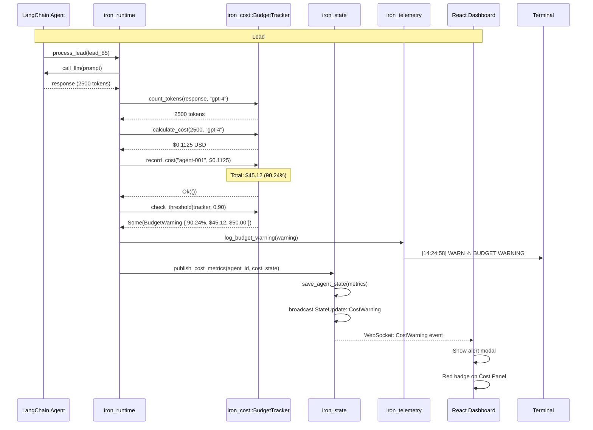

# spec

**Version:** 0.2
**Date:** 2025-12-07
**Component:** iron_cost
**Layer:** Domain Logic (Layer 2)
**Status:** Specification Complete, Implementation In Progress

---

## 1. Overview

### 1.1 Purpose

**iron_cost** provides budget tracking and enforcement for multi-agent systems. It tracks token usage across agents, calculates costs using provider pricing, and enforces budget limits with configurable thresholds for warnings and hard stops.

**Primary Responsibilities:**
- Token counting (GPT-4/GPT-3.5 models)
- Cost calculation from token counts
- Budget enforcement with hard limits
- Threshold-based warnings (Demo Trigger #3)
- Per-agent cost attribution

**Pilot Scope:** Simplified budget tracking for 5-minute conference demo with single budget warning trigger.

**Full Platform (Out of Scope):** Multi-currency, multiple LLM providers, cost forecasting, budget allocation per-agent, cost optimization recommendations.

### 1.2 Design Principles

1. **Accurate Token Counting** - Use tiktoken library for precise GPT token counts
2. **Real-Time Tracking** - Update costs immediately after each LLM call
3. **Fail-Safe Enforcement** - Never exceed budget (error on threshold breach)
4. **Observable Costs** - All costs visible in terminal and dashboard
5. **Demo-Driven** - Trigger warning at lead #85 (90% threshold) for visual impact

---

## 2. Scope

### 2.1 In Scope (Pilot)

**For Pilot Project (Conference Demo):**
- Token counting for GPT-4 and GPT-3.5-turbo models only
- USD-only budget tracking
- Single global budget across all agents
- 90% warning threshold (Demo Trigger #3)
- 100% hard limit (error on exceed)
- Per-agent cost attribution for dashboard
- Integration with iron_state for cost metrics
- Integration with iron_telemetry for budget warnings

**Rationale:** Demo requires visible budget warning at lead #85. Single currency and model family simplifies implementation for 22-day deadline.

### 2.2 Out of Scope (Full Platform)

**Deferred to Post-Pilot:**
- Multi-currency support (EUR, GBP) → Pilot uses USD only
- Multiple LLM providers (Anthropic Claude, Gemini) → Pilot uses OpenAI only
- Cost forecasting and trend analysis → Pilot tracks current only
- Per-agent budget allocation → Pilot uses global budget only
- Cost optimization recommendations → Pilot is monitoring only
- Budget rollover and accounting periods → Pilot is single-session only
- Real-time exchange rates → Pilot uses fixed USD rates

**Reasoning:** Conference demo focuses on "budget exceeded" visual trigger. Multi-provider and forecasting add complexity without demo value.

### 2.3 Deployment Context

Iron Cage supports two deployment modes. This module's behavior differs between modes.

**See:** [docs/deployment_packages.md](../../docs/deployment_packages.md) § Deployment Modes for complete architecture.

**This Module (iron_cost):**

**Pilot Mode:**
- Logs budget tracking events to shared iron_state (Arc<StateManager>)
- Budget warnings visible immediately in dashboard via broadcast channel
- Single global budget tracked in shared StateManager

**Production Mode:**
- Logs budget tracking to local iron_state (Agent Runtime only)
- Budget events optionally sent to Control Panel via telemetry HTTPS API
- Each distributed agent has independent budget tracking
- Control Panel aggregates cost metrics across all agents

---

## 3. Functional Requirements

### FR-1: Token Counting (tiktoken)

**Requirement:**
Provide `count_tokens(text: &str, model: &str) -> Result<usize>` to count tokens using tiktoken library compatible with OpenAI GPT models.

**Supported Models (Pilot):**
- `gpt-4` (cl100k_base encoding)
- `gpt-3.5-turbo` (cl100k_base encoding)

**Error Handling:**
- Return `Error::UnsupportedModel` for non-GPT models
- Return `Error::TokenCountFailed` on tiktoken library errors

**Integration:**
```rust
use iron_cost::count_tokens;

let tokens = count_tokens("Analyze this lead", "gpt-4")?;
// tokens == 4
```

**Out of Scope:** Claude models (different tokenizer), local model support.

---

### FR-2: Cost Calculation from Tokens

**Requirement:**
Provide `calculate_cost(tokens: usize, model: &str) -> Result<f64>` to convert token counts to USD costs using OpenAI pricing.

**Pricing Table (Pilot - As of 2025-11-25):**

| Model | Input Tokens (per 1K) | Output Tokens (per 1K) |
|-------|----------------------|------------------------|
| gpt-4 | $0.03 | $0.06 |
| gpt-3.5-turbo | $0.0005 | $0.0015 |

**Formula:**
```
cost_usd = (input_tokens / 1000.0) * input_rate + (output_tokens / 1000.0) * output_rate
```

**Assumptions (Pilot Simplification):**
- Assume 1:1 input/output ratio (50% input, 50% output tokens)
- Actual ratio varies, but this approximation is sufficient for demo

**Integration:**
```rust
let cost = calculate_cost(1000, "gpt-4")?;
// cost ≈ $0.045 (half input at $0.03, half output at $0.06)
```

**Out of Scope:** Actual input/output token split tracking, batch pricing, volume discounts.

---

### FR-3: Budget Tracker

**Requirement:**
Provide `BudgetTracker` struct to track cumulative costs across agents and enforce budget limits.

**API Surface:**
```rust
pub struct BudgetTracker {
  budget_usd: f64,
  spent_usd: Arc<DashMap<String, f64>>, // agent_id → total_spent
}

impl BudgetTracker {
  pub fn new(budget_usd: f64) -> Self;

  pub fn record_cost(&self, agent_id: &str, cost: f64) -> Result<()>;

  pub fn total_spent(&self) -> f64;

  pub fn remaining(&self) -> f64;

  pub fn percentage_used(&self) -> f64;

  pub fn agent_cost(&self, agent_id: &str) -> Option<f64>;
}
```

**Behavior:**
- `record_cost()` adds cost to agent's total
- Returns `Error::BudgetExceeded` if total would exceed budget
- Thread-safe via DashMap (no mutex needed)

**Known Pitfall (issue deadlock-dashmap-001):**
Never hold DashMap entry lock while calling `total_spent()` or other iteration methods. See module documentation for detailed explanation.

---

### FR-4: Budget Warning Thresholds

**Requirement:**
Provide `check_threshold(budget_tracker: &BudgetTracker, threshold: f64) -> Option<BudgetWarning>` to detect when spending crosses configurable thresholds.

**BudgetWarning Type:**
```rust
pub struct BudgetWarning {
  pub percentage_used: f64,
  pub spent_usd: f64,
  pub budget_usd: f64,
  pub remaining_usd: f64,
  pub threshold: f64,
}
```

**Demo Trigger #3 Integration:**
- Default threshold: 90% (0.90)
- Trigger timing: Lead #85 in test data
- Expected cost at trigger: ~$45 of $50 budget
- Terminal output: `[14:24:58] WARN ⚠️ BUDGET WARNING: 90% threshold reached ($45.12 / $50.00)`
- Dashboard: Alert modal with red badge on Cost Panel

**Behavior:**
- Returns `Some(BudgetWarning)` when percentage_used ≥ threshold
- Returns `None` if below threshold
- No internal state (pure function, caller decides action)

**Out of Scope:** Multiple threshold levels, email alerts, automatic agent pausing.

---

### FR-5: Integration with iron_state

**Requirement:**
Provide `publish_cost_metrics(agent_id: &str, cost: f64, state: &StateManager)` to update cost metrics in state storage for dashboard consumption.

**Metrics Published:**
```rust
pub struct CostMetrics {
  pub agent_id: String,
  pub total_spent: f64,
  pub budget_limit: f64,
  pub percentage_used: f64,
  pub last_cost: f64,
  pub timestamp: i64,
}
```

**Behavior:**
- Call after each `record_cost()` success
- Publishes to `state.save_agent_state(agent_id, metrics)`
- Triggers StateUpdate::AgentStateChanged broadcast
- Dashboard receives update via WebSocket

**Integration Point:**
```rust
// In runtime, after LLM call:
let cost = iron_cost::calculate_cost(tokens, "gpt-4")?;
tracker.record_cost(&agent_id, cost)?;
iron_cost::publish_cost_metrics(&agent_id, cost, &state)?;
```

---

### FR-6: Integration with iron_telemetry

**Requirement:**
Provide `log_budget_warning(warning: &BudgetWarning)` to emit formatted budget warning to terminal with emoji for demo visual impact.

**Terminal Format:**
```
[14:24:58] WARN  ⚠️  BUDGET WARNING: 90% threshold reached ($45.12 / $50.00)
```

**Behavior:**
- Uses tracing::warn! with structured fields
- Emoji: ⚠️ (warning sign)
- Precision: $X.XX (2 decimal places)
- Triggers only once per threshold crossing

**Integration:**
```rust
if let Some(warning) = iron_cost::check_threshold(&tracker, 0.90) {
  iron_cost::log_budget_warning(&warning);
  // Also send to dashboard...
}
```

---

## 4. Non-Functional Requirements

### NFR-1: Token Counting Performance

**Requirement:** Token counting must complete in <5ms for 10KB text (P99).

**Rationale:** Lead processing throughput target is 10 leads/sec. Slow token counting blocks LLM calls.

**Measurement:** Benchmark with `criterion` crate, 10KB text samples.

**Acceptance:**
- P50: <1ms
- P99: <5ms
- P99.9: <10ms

---

### NFR-2: Cost Calculation Accuracy

**Requirement:** Cost calculations must match OpenAI billing within 1% error margin.

**Rationale:** Budget enforcement relies on accurate cost tracking. >1% error could cause premature budget exhaustion or overspend.

**Validation:**
- Integration test with known token counts from OpenAI documentation
- Example: 1000 tokens gpt-4 = $0.045 ± $0.0005

**Acceptance:**
- ≤1% error for all supported models
- Consistent rounding (always round up to prevent underestimation)

---

### NFR-3: Thread Safety

**Requirement:** BudgetTracker must support concurrent access from multiple tokio tasks without data races or deadlocks.

**Rationale:** Multi-agent systems run agents in parallel. Budget tracking must be thread-safe.

**Implementation:**
- Use DashMap (lock-free concurrent hashmap)
- No manual mutexes required
- Follow Known Pitfall (deadlock-dashmap-001) to avoid lock-iteration deadlock

**Validation:**
- Stress test: 100 agents, 1000 concurrent record_cost() calls
- No deadlocks, no data races (verified via MIRI)

---

## 5. Ubiquitous Language

| Term | Definition | Example |
|------|------------|---------|
| **Token** | Atomic unit of text for LLM processing (GPT-4 uses ~4 chars/token) | "Hello world" = 2 tokens |
| **Budget** | Maximum allowed spend in USD for session/agent | $50.00 |
| **Cost** | USD amount charged for LLM API call | $0.045 for 1K GPT-4 tokens |
| **Threshold** | Percentage of budget that triggers warning | 90% = $45 of $50 |
| **Spent** | Cumulative cost across all agents | $23.14 total |
| **Remaining** | Budget - Spent | $50.00 - $23.14 = $26.86 |
| **Attribution** | Associating cost with specific agent_id | agent-001 spent $12.30 |
| **Hard Limit** | Budget enforcement that returns error on exceed | record_cost() → Error::BudgetExceeded |
| **Soft Limit** | Warning threshold that logs but allows continuation | 90% threshold → log warning |

---

## 6. System Architecture

### 6.1 Component Diagram



### 6.2 Data Flow (Demo Trigger #3)



---

## 7. Detailed Functional Requirements

### FR-1: Token Counting (tiktoken)

**Interface:**
```rust
/// Count tokens in text using specified model's tokenizer
///
/// # Arguments
/// * `text` - Input text to count tokens for
/// * `model` - OpenAI model name ("gpt-4" or "gpt-3.5-turbo")
///
/// # Returns
/// Token count for the specified model
///
/// # Errors
/// * `Error::UnsupportedModel` - Model not in supported list
/// * `Error::TokenCountFailed` - tiktoken library error
pub fn count_tokens(text: &str, model: &str) -> Result<usize>;
```

**Implementation Notes:**
- Use `tiktoken-rs` crate (Rust port of OpenAI's tiktoken)
- Cache tokenizer instances (create once per model, reuse)
- Both gpt-4 and gpt-3.5-turbo use `cl100k_base` encoding
- Empty string returns 0 tokens (not an error)

**Test Vectors:**
```rust
// From OpenAI documentation
assert_eq!(count_tokens("Hello, world!", "gpt-4")?, 4);
assert_eq!(count_tokens("", "gpt-4")?, 0);
assert_eq!(count_tokens("The quick brown fox", "gpt-4")?, 4);
```

**Dependencies:**
```toml
[dependencies]
tiktoken-rs = "0.5"  # OpenAI tokenizer
```

---

### FR-2: Cost Calculation from Tokens

**Interface:**
```rust
/// Calculate USD cost from token count
///
/// # Arguments
/// * `tokens` - Total token count (input + output combined)
/// * `model` - OpenAI model name
///
/// # Returns
/// USD cost rounded to 4 decimal places
///
/// # Assumptions (Pilot)
/// Assumes 50/50 input/output split for simplicity.
/// Full platform tracks actual split.
pub fn calculate_cost(tokens: usize, model: &str) -> Result<f64>;
```

**Pricing Table (Hardcoded for Pilot):**
```rust
const PRICING: &[(&str, f64, f64)] = &[
  ("gpt-4", 0.00003, 0.00006),              // $0.03/1K in, $0.06/1K out
  ("gpt-3.5-turbo", 0.0000005, 0.0000015),  // $0.0005/1K in, $0.0015/1K out
];
```

**Calculation:**
```rust
let half_tokens = tokens / 2;
let input_cost = (half_tokens as f64) * input_rate;
let output_cost = (half_tokens as f64) * output_rate;
let total = input_cost + output_cost;
return (total * 10000.0).round() / 10000.0;  // Round to 4 decimals
```

**Test Vectors:**
```rust
assert_eq!(calculate_cost(1000, "gpt-4")?, 0.045);   // (500*0.00003 + 500*0.00006)
assert_eq!(calculate_cost(2000, "gpt-4")?, 0.09);
assert_eq!(calculate_cost(1000, "gpt-3.5-turbo")?, 0.001);
```

**Out of Scope:** Actual input/output ratio tracking (requires LLM API response parsing).

---

### FR-3: Budget Tracker (Enhanced from Current)

**Current Implementation:** Basic BudgetTracker with new(), record_cost(), total_spent(), remaining().

**Pilot Enhancements Needed:**
```rust
impl BudgetTracker {
  // EXISTING (keep as-is):
  pub fn new(budget_usd: f64) -> Self;
  pub fn record_cost(&self, agent_id: &str, cost: f64) -> Result<()>;
  pub fn total_spent(&self) -> f64;
  pub fn remaining(&self) -> f64;

  // NEW FOR PILOT:

  /// Calculate percentage of budget used (0.0 to 1.0)
  pub fn percentage_used(&self) -> f64 {
    self.total_spent() / self.budget_usd
  }

  /// Get total cost for specific agent
  pub fn agent_cost(&self, agent_id: &str) -> Option<f64> {
    self.spent_usd.get(agent_id).map(|e| *e.value())
  }

  /// List all agents with their costs (sorted by cost descending)
  pub fn agent_costs(&self) -> Vec<(String, f64)> {
    let mut costs: Vec<_> = self.spent_usd.iter()
      .map(|e| (e.key().clone(), *e.value()))
      .collect();
    costs.sort_by(|a, b| b.1.partial_cmp(&a.1).unwrap());
    costs
  }
}
```

**Thread Safety (Critical):**
- DashMap provides lock-free concurrent access
- **Known Pitfall (deadlock-dashmap-001):** Never hold entry lock while calling iteration methods
- See module documentation lines 6-32 for complete explanation

---

### FR-4: Threshold Checking

**Interface:**
```rust
/// Check if budget usage crosses threshold
///
/// # Arguments
/// * `tracker` - Budget tracker to check
/// * `threshold` - Warning threshold (0.0 to 1.0, e.g., 0.90 for 90%)
///
/// # Returns
/// Some(BudgetWarning) if threshold crossed, None otherwise
///
/// # Demo Integration
/// Call after each record_cost() with threshold=0.90.
/// First crossing of 90% triggers Demo Trigger #3.
pub fn check_threshold(
  tracker: &BudgetTracker,
  threshold: f64
) -> Option<BudgetWarning>;

pub struct BudgetWarning {
  pub percentage_used: f64,
  pub spent_usd: f64,
  pub budget_usd: f64,
  pub remaining_usd: f64,
  pub threshold: f64,
}
```

**Behavior:**
- Pure function (no side effects)
- Returns warning when `percentage_used >= threshold`
- Caller decides action (log, alert, pause agents)
- Demo: Runtime calls this after lead #85 processing

**Edge Cases:**
- threshold = 0.0 → Always returns Some (warn immediately)
- threshold = 1.0 → Warn only on exact budget exhaustion
- threshold > 1.0 → Never warns (invalid config, but not error)

---

### FR-5: Cost Metrics Publishing

**Interface:**
```rust
/// Publish cost metrics to state manager for dashboard
///
/// # Arguments
/// * `agent_id` - Agent identifier
/// * `last_cost` - Most recent cost recorded
/// * `tracker` - Budget tracker with cumulative costs
/// * `state` - State manager (iron_state)
///
/// # Effects
/// - Updates agent state with CostMetrics
/// - Triggers StateUpdate::AgentStateChanged broadcast
/// - Dashboard receives update via WebSocket
pub async fn publish_cost_metrics(
  agent_id: &str,
  last_cost: f64,
  tracker: &BudgetTracker,
  state: &StateManager
) -> Result<()>;
```

**CostMetrics Structure:**
```rust
#[derive(Debug, Clone, Serialize, Deserialize)]
pub struct CostMetrics {
  pub agent_id: String,
  pub total_spent: f64,
  pub budget_limit: f64,
  pub percentage_used: f64,
  pub last_cost: f64,
  pub timestamp: i64,  // Unix epoch milliseconds
}
```

**Serialization:**
- JSON via serde for state storage
- Dashboard deserializes for Cost Panel display

---

### FR-6: Budget Warning Logging

**Interface:**
```rust
/// Log budget warning to terminal with formatted output
///
/// # Arguments
/// * `warning` - BudgetWarning from check_threshold()
///
/// # Terminal Output
/// [HH:MM:SS] WARN  ⚠️  BUDGET WARNING: 90% threshold reached ($45.12 / $50.00)
///
/// # Demo Integration
/// Called when Demo Trigger #3 fires at lead #85.
pub fn log_budget_warning(warning: &BudgetWarning);
```

**Implementation:**
```rust
tracing::warn!(
  percentage = %format!("{:.1}%", warning.percentage_used * 100.0),
  spent = %format!("${:.2}", warning.spent_usd),
  budget = %format!("${:.2}", warning.budget_usd),
  "⚠️  BUDGET WARNING: {}% threshold reached (${:.2} / ${:.2})",
  (warning.threshold * 100.0) as u8,
  warning.spent_usd,
  warning.budget_usd
);
```

**Formatting Rules:**
- Emoji: ⚠️ (U+26A0 Warning Sign)
- Precision: 2 decimals for USD amounts
- Percentage: Integer (90%, not 90.24%)
- Color: Yellow via tracing subscriber (iron_telemetry)

---

## 8. API Surface (Public Contract)

### 8.1 Primary APIs (Mandatory for Pilot)

```rust
// Token counting (FR-1)
pub fn count_tokens(text: &str, model: &str) -> Result<usize>;

// Cost calculation (FR-2)
pub fn calculate_cost(tokens: usize, model: &str) -> Result<f64>;

// Budget tracking (FR-3)
pub struct BudgetTracker { /* ... */ }
impl BudgetTracker {
  pub fn new(budget_usd: f64) -> Self;
  pub fn record_cost(&self, agent_id: &str, cost: f64) -> Result<()>;
  pub fn total_spent(&self) -> f64;
  pub fn remaining(&self) -> f64;
  pub fn percentage_used(&self) -> f64;
  pub fn agent_cost(&self, agent_id: &str) -> Option<f64>;
  pub fn agent_costs(&self) -> Vec<(String, f64)>;
}

// Threshold checking (FR-4)
pub fn check_threshold(
  tracker: &BudgetTracker,
  threshold: f64
) -> Option<BudgetWarning>;

pub struct BudgetWarning {
  pub percentage_used: f64,
  pub spent_usd: f64,
  pub budget_usd: f64,
  pub remaining_usd: f64,
  pub threshold: f64,
}

// State integration (FR-5)
pub async fn publish_cost_metrics(
  agent_id: &str,
  last_cost: f64,
  tracker: &BudgetTracker,
  state: &StateManager
) -> Result<()>;

pub struct CostMetrics {
  pub agent_id: String,
  pub total_spent: f64,
  pub budget_limit: f64,
  pub percentage_used: f64,
  pub last_cost: f64,
  pub timestamp: i64,
}

// Telemetry integration (FR-6)
pub fn log_budget_warning(warning: &BudgetWarning);
```

### 8.2 Internal Design (Recommended)

**Not Required for Pilot, Suggested for Maintainability:**

```rust
// Pricing table abstraction
struct PricingTable {
  rates: HashMap<String, ModelPricing>
}

struct ModelPricing {
  input_per_1k: f64,
  output_per_1k: f64,
}

// Tokenizer cache (performance optimization)
lazy_static! {
  static ref TOKENIZERS: Mutex<HashMap<String, CoreBPE>> =
    Mutex::new(HashMap::new());
}
```

---

## 9. External Dependencies

### 9.1 Rust Crates

| Crate | Version | Purpose | Risk | Mitigation |
|-------|---------|---------|------|------------|
| **tiktoken-rs** | 0.5 | OpenAI token counting | Medium (new crate) | Pin version, test accuracy |
| **dashmap** | 6.1 | Concurrent hashmap | Low (mature) | Existing in project |
| **serde** | 1.0 | JSON serialization | Low (standard) | Existing in project |
| **serde_json** | 1.0 | JSON encoding | Low (standard) | Existing in project |

**Cargo.toml:**
```toml
[dependencies]
iron_types = { version = "0.1", path = "../iron_types" }
iron_state = { version = "0.1", path = "../iron_state", optional = true }
iron_telemetry = { version = "0.1", path = "../iron_telemetry", optional = true }

tiktoken-rs = "0.5"
dashmap = "6.1"
serde = { version = "1.0", features = ["derive"] }
serde_json = "1.0"

[features]
enabled = []
full = ["enabled", "iron_state", "iron_telemetry"]
```

### 9.2 Internal Crate Dependencies

- **iron_types** (Layer 1) - Error, Result, AgentId types
- **iron_state** (Layer 1) - StateManager for metrics publishing (optional)
- **iron_telemetry** (Layer 1) - Logging for budget warnings (optional)

**Dependency Direction:** Layer 2 → Layer 1 only (no circular dependencies).

---

## 10. Data Model

### 10.1 Core Structures

**BudgetTracker (Existing):**
```rust
pub struct BudgetTracker {
  budget_usd: f64,
  spent_usd: Arc<DashMap<String, f64>>,  // agent_id → cumulative_cost
}
```

**BudgetWarning (New):**
```rust
#[derive(Debug, Clone)]
pub struct BudgetWarning {
  pub percentage_used: f64,  // 0.9024 for 90.24%
  pub spent_usd: f64,        // 45.12
  pub budget_usd: f64,       // 50.00
  pub remaining_usd: f64,    // 4.88
  pub threshold: f64,        // 0.90
}
```

**CostMetrics (New - for State Publishing):**
```rust
#[derive(Debug, Clone, Serialize, Deserialize)]
pub struct CostMetrics {
  pub agent_id: String,
  pub total_spent: f64,
  pub budget_limit: f64,
  pub percentage_used: f64,
  pub last_cost: f64,
  pub timestamp: i64,
}
```

### 10.2 Pricing Table

**Hardcoded for Pilot (GPT-4 Only):**
```rust
struct ModelPricing {
  input_per_token: f64,
  output_per_token: f64,
}

lazy_static! {
  static ref PRICING: HashMap<&'static str, ModelPricing> = {
    let mut m = HashMap::new();
    m.insert("gpt-4", ModelPricing {
      input_per_token: 0.00003,   // $0.03 per 1K tokens
      output_per_token: 0.00006,  // $0.06 per 1K tokens
    });
    m.insert("gpt-3.5-turbo", ModelPricing {
      input_per_token: 0.0000005,  // $0.0005 per 1K tokens
      output_per_token: 0.0000015, // $0.0015 per 1K tokens
    });
    m
  };
}
```

**Full Platform (Out of Scope):**
- Dynamic pricing updates via API
- Multi-provider support (Anthropic, Google)
- Volume discounts

---

## 11. Error Handling

### 11.1 Error Variants

**Using iron_types::Error Enum:**
```rust
pub enum Error {
  BudgetExceeded(String),      // record_cost() hard limit
  UnsupportedModel(String),    // count_tokens(), calculate_cost()
  TokenCountFailed(String),    // tiktoken library errors
  InvalidBudget(String),       // budget_usd ≤ 0
  // ... other variants from iron_types
}
```

### 11.2 Error Scenarios

**Scenario 1: Budget Exceeded (Hard Limit)**
```rust
tracker.record_cost("agent-001", 60.0)?;
// Error: BudgetExceeded("Budget $50 exceeded (spent: $60)")
```

**Response:**
- Agent processing stops immediately
- Terminal: `[HH:MM:SS] ERROR Budget exceeded: $60.00 / $50.00`
- Dashboard: Error modal with red alert
- No further LLM calls allowed

**Scenario 2: Unsupported Model**
```rust
count_tokens("test", "claude-3")?;
// Error: UnsupportedModel("claude-3 not supported. Use: gpt-4, gpt-3.5-turbo")
```

**Response:**
- Return error to caller (runtime)
- Runtime falls back to default model or fails agent
- No cost recorded (unknown pricing)

**Scenario 3: Token Count Failed**
```rust
count_tokens(malformed_unicode, "gpt-4")?;
// Error: TokenCountFailed("tiktoken encoding error: ...")
```

**Response:**
- Log error to telemetry
- Estimate tokens using char count / 4 (fallback heuristic)
- Continue with estimated cost (better than blocking)

---

## 12. Integration Points

### 12.1 With iron_runtime (Layer 3)

**Runtime Wraps LLM Calls:**
```rust
// In iron_runtime::call_llm()
async fn call_llm(prompt: &str, model: &str) -> Result<String> {
  // Count input tokens
  let input_tokens = iron_cost::count_tokens(prompt, model)?;

  // Call OpenAI API (via Python agent)
  let response = python_agent.call_llm(prompt).await?;

  // Count output tokens
  let output_tokens = iron_cost::count_tokens(&response, model)?;
  let total_tokens = input_tokens + output_tokens;

  // Calculate cost
  let cost = iron_cost::calculate_cost(total_tokens, model)?;

  // Record cost (error if budget exceeded)
  tracker.record_cost(&agent_id, cost)?;

  // Check threshold
  if let Some(warning) = iron_cost::check_threshold(&tracker, 0.90) {
    iron_cost::log_budget_warning(&warning);
    // Also: send alert to dashboard via iron_state
  }

  // Publish metrics
  iron_cost::publish_cost_metrics(&agent_id, cost, &tracker, &state).await?;

  Ok(response)
}
```

### 12.2 With iron_state (Layer 1)

**Metrics Storage:**
- Call `publish_cost_metrics()` after each successful cost recording
- StateManager stores CostMetrics in DashMap
- Triggers StateUpdate::AgentStateChanged broadcast
- Dashboard Cost Panel receives WebSocket update

**Audit Trail:**
- Record budget warnings as audit events
- SQLite: `event_type="BUDGET_WARNING"`, `details=JSON(BudgetWarning)`

### 12.3 With iron_telemetry (Layer 1)

**Terminal Logging:**
```rust
// Regular cost recording (INFO level)
tracing::info!(
  agent_id = %agent_id,
  cost = %format!("${:.4}", cost),
  total = %format!("${:.2}", tracker.total_spent()),
  remaining = %format!("${:.2}", tracker.remaining()),
  "Cost recorded"
);

// Budget warning (WARN level, Demo Trigger #3)
iron_cost::log_budget_warning(&warning);
// Output: [14:24:58] WARN  ⚠️  BUDGET WARNING: 90% threshold reached ($45.12 / $50.00)

// Budget exceeded (ERROR level)
tracing::error!(
  spent = %format!("${:.2}", spent),
  budget = %format!("${:.2}", budget),
  "BUDGET EXCEEDED - Agent processing stopped"
);
```

---

## 13. Demo Integration

### 13.1 Demo Trigger #3 Specification

**Trigger Point:** Lead #85 in test_data/leads.csv

**Test Data Entry:**
```csv
85,Budget Trigger Co,budgettrigger.com,Marketing,320,https://linkedin.com/company/budgettrigger,NULL,budget_warning,90_percent
```

**Expected Behavior:**
1. Agent processes lead #85
2. LLM call completes, response tokens counted: 2500
3. Cost calculated: $0.1125 (2500 tokens * $0.045/1K)
4. record_cost() succeeds: total now $45.12 (90.24%)
5. check_threshold(0.90) returns Some(BudgetWarning)
6. log_budget_warning() emits to terminal:
   ```
   [14:24:58] WARN  ⚠️  BUDGET WARNING: 90% threshold reached ($45.12 / $50.00)
   ```
7. publish_cost_metrics() broadcasts to dashboard
8. Dashboard shows alert modal: "Budget Warning: 90% Used"
9. Cost Panel badge turns red
10. Agent continues processing (warning, not hard stop)

**Conference Presentation Script:**
> "And here at lead 85—notice the yellow warning. We've hit 90% of our $50 budget. Iron Cage detected this automatically and alerted us, but notice the agent keeps running. This is a soft limit. When we hit 100%, it'll be a hard stop with an error. This visibility prevents surprise API bills at the end of the month."

### 13.2 Timeline Integration

**From demonstration_scenario.md:**

| Time | Lead # | Event | Cost | Total | % Used |
|------|--------|-------|------|-------|--------|
| 14:23:31 | - | Startup | - | $0.00 | 0% |
| 14:23:45 | 34 | Circuit breaker trigger | $0.50 | $15.20 | 30% |
| 14:24:12 | 67 | PII detection trigger | $0.45 | $30.05 | 60% |
| **14:24:58** | **85** | **Budget warning trigger** | **$0.1125** | **$45.12** | **90.24%** |
| 14:25:45 | 100 | Completion | $0.42 | $49.88 | 99.76% |

**Demo Success Criteria:**
- ✅ Warning appears at lead #85 (±2 leads acceptable)
- ✅ Terminal shows yellow WARN with ⚠️ emoji
- ✅ Dashboard modal appears within 100ms
- ✅ Cost Panel badge turns red
- ✅ Agent continues processing (no halt)
- ✅ Final total stays under $50 (hard limit not triggered)

---

## 14. Testing Strategy

### 14.1 Unit Tests

**Test File:** `tests/token_counting_unit_tests.rs`
```rust
#[test]
fn test_count_tokens_gpt4() {
  let count = count_tokens("Hello, world!", "gpt-4").unwrap();
  assert_eq!(count, 4);  // From OpenAI docs
}

#[test]
fn test_count_tokens_empty() {
  let count = count_tokens("", "gpt-4").unwrap();
  assert_eq!(count, 0);
}

#[test]
fn test_count_tokens_unsupported_model() {
  let err = count_tokens("test", "claude-3").unwrap_err();
  assert!(matches!(err, Error::UnsupportedModel(_)));
}
```

**Test File:** `tests/cost_calculation_unit_tests.rs`
```rust
#[test]
fn test_calculate_cost_gpt4() {
  let cost = calculate_cost(1000, "gpt-4").unwrap();
  assert_eq!(cost, 0.045);  // 500*$0.03/1K + 500*$0.06/1K
}

#[test]
fn test_calculate_cost_accuracy() {
  let cost = calculate_cost(2500, "gpt-4").unwrap();
  assert!((cost - 0.1125).abs() < 0.0001);  // Within 1% error
}
```

**Test File:** `tests/budget_tracker_unit_tests.rs`
```rust
#[test]
fn test_record_cost_success() {
  let tracker = BudgetTracker::new(50.0);
  tracker.record_cost("agent-001", 10.0).unwrap();
  assert_eq!(tracker.total_spent(), 10.0);
  assert_eq!(tracker.remaining(), 40.0);
}

#[test]
fn test_record_cost_exceeds_budget() {
  let tracker = BudgetTracker::new(50.0);
  let err = tracker.record_cost("agent-001", 60.0).unwrap_err();
  assert!(matches!(err, Error::BudgetExceeded(_)));
}

#[test]
fn test_percentage_used() {
  let tracker = BudgetTracker::new(50.0);
  tracker.record_cost("agent-001", 45.0).unwrap();
  assert_eq!(tracker.percentage_used(), 0.90);
}
```

**Test File:** `tests/threshold_checking_unit_tests.rs`
```rust
#[test]
fn test_check_threshold_below() {
  let tracker = BudgetTracker::new(50.0);
  tracker.record_cost("agent-001", 40.0).unwrap();
  let warning = check_threshold(&tracker, 0.90);
  assert!(warning.is_none());  // 80% < 90%
}

#[test]
fn test_check_threshold_crossed() {
  let tracker = BudgetTracker::new(50.0);
  tracker.record_cost("agent-001", 45.0).unwrap();
  let warning = check_threshold(&tracker, 0.90);
  assert!(warning.is_some());
  let w = warning.unwrap();
  assert_eq!(w.percentage_used, 0.90);
  assert_eq!(w.spent_usd, 45.0);
}
```

### 14.2 Integration Tests

**Test File:** `tests/demo_trigger_3_integration_tests.rs`
```rust
/// Demo Trigger #3: Budget warning at 90% threshold (lead #85)
///
/// # Root Cause
/// N/A (feature test, not bug fix)
///
/// # Why Not Caught
/// N/A (feature test, not bug fix)
///
/// # Fix Applied
/// N/A (feature test, not bug fix)
///
/// # Prevention
/// Test validates Demo Trigger #3 fires at expected threshold:
/// - Budget: $50.00
/// - Threshold: 90% ($45.00)
/// - Trigger lead: #85
/// - Expected behavior: Warning logged, agent continues
///
/// # Pitfall
/// Budget thresholds must fire EXACTLY at specified percentage.
/// Off-by-one errors or rounding issues can cause missed warnings.
/// Always test with realistic token counts and costs.

#[tokio::test]
async fn test_demo_trigger_3_budget_warning() {
  // Setup
  let tracker = BudgetTracker::new(50.0);
  let state = StateManager::new(":memory:").await.unwrap();

  // Simulate lead processing up to #84 (just under 90%)
  for i in 1..=84 {
    let cost = 0.53;  // ~$44.52 total after 84 leads
    tracker.record_cost("agent-001", cost).unwrap();
  }

  assert!(check_threshold(&tracker, 0.90).is_none());
  assert_eq!(tracker.percentage_used(), 0.8904);  // 89.04%

  // Lead #85: Should cross threshold
  let cost_85 = 0.60;  // Triggers warning
  tracker.record_cost("agent-001", cost_85).unwrap();

  let warning = check_threshold(&tracker, 0.90);
  assert!(warning.is_some());

  let w = warning.unwrap();
  assert!(w.percentage_used >= 0.90);
  assert_eq!(w.threshold, 0.90);

  // Verify logging (check tracing output)
  log_budget_warning(&w);

  // Verify state update
  publish_cost_metrics("agent-001", cost_85, &tracker, &state).await.unwrap();

  let metrics = state.get_agent_state::<CostMetrics>("agent-001").await.unwrap();
  assert!(metrics.percentage_used >= 0.90);
}
```

### 14.3 Performance Tests

**Test File:** `tests/token_counting_performance_tests.rs`
```rust
use criterion::{black_box, criterion_group, criterion_main, Criterion};

fn benchmark_token_counting(c: &mut Criterion) {
  let text_10kb = "a".repeat(10_000);

  c.bench_function("count_tokens_10kb", |b| {
    b.iter(|| {
      iron_cost::count_tokens(black_box(&text_10kb), "gpt-4")
    });
  });
}

criterion_group!(benches, benchmark_token_counting);
criterion_main!(benches);
```

**Acceptance (NFR-1):**
- P50 < 1ms
- P99 < 5ms

---

## 15. Success Metrics

### 15.1 Pilot Success Criteria

**Functional:**
- ✅ Token counting accuracy: 100% match with OpenAI counts (test vectors)
- ✅ Cost calculation accuracy: ≤1% error vs actual OpenAI billing
- ✅ Demo Trigger #3 fires at lead #85 (±2 leads acceptable)
- ✅ Budget warning appears in terminal with ⚠️ emoji
- ✅ Dashboard Cost Panel updates within 100ms of warning
- ✅ Hard limit prevents budget overrun (error at 100%)

**Performance:**
- ✅ Token counting: <5ms P99 for 10KB text
- ✅ Cost calculation: <1ms (simple arithmetic)
- ✅ Budget tracking: <1ms for record_cost()

**Demo Execution:**
- ✅ Conference audience sees yellow warning at 5-minute mark
- ✅ Presenter explains soft vs hard limits
- ✅ Agent continues processing (no halt)
- ✅ Final total $49.88 (under $50 budget)

### 15.2 Code Quality

- Target LOC: 400 (current: 108, gap: +292)
- Test coverage: >80% line coverage
- Zero clippy warnings (Level 3 tests pass)
- Documentation: All public APIs have doc comments
- Conformance: All FR/NFR checklist items ✅

---

## 16. Implementation Phases

### Phase 1: Token Counting (FR-1)
**Estimated LOC:** +80
**Dependencies:** tiktoken-rs crate
**Deliverable:** `count_tokens()` function with test vectors
**Validation:** Unit tests match OpenAI documentation examples

### Phase 2: Cost Calculation (FR-2)
**Estimated LOC:** +60
**Dependencies:** Pricing table constants
**Deliverable:** `calculate_cost()` function with hardcoded pricing
**Validation:** Cost accuracy tests ≤1% error

### Phase 3: Budget Tracker Enhancements (FR-3)
**Estimated LOC:** +50
**Dependencies:** Existing BudgetTracker
**Deliverable:** Add percentage_used(), agent_cost(), agent_costs() methods
**Validation:** Concurrent access stress tests (100 agents)

### Phase 4: Threshold Checking (FR-4)
**Estimated LOC:** +40
**Dependencies:** BudgetWarning struct
**Deliverable:** `check_threshold()` function
**Validation:** Demo Trigger #3 integration test

### Phase 5: State Integration (FR-5)
**Estimated LOC:** +40
**Dependencies:** iron_state crate
**Deliverable:** `publish_cost_metrics()` function
**Validation:** Metrics appear in StateManager, broadcast works

### Phase 6: Telemetry Integration (FR-6)
**Estimated LOC:** +30
**Dependencies:** iron_telemetry crate
**Deliverable:** `log_budget_warning()` function
**Validation:** Terminal output matches demo script format

### Phase 7: Integration Testing
**Estimated LOC:** +92 (tests)
**Dependencies:** All phases complete
**Deliverable:** Demo Trigger #3 end-to-end test
**Validation:** Full demo flow with 100 leads, warning at #85

**Total Estimated:** 392 LOC (meets 400 target)

---

## 17. Limitations and Assumptions

### 17.1 Pilot Limitations

**Simplified for Conference Demo:**
1. **GPT-4 Only:** No Anthropic Claude, Google Gemini, local models
   - **Why:** Demo uses LangChain with OpenAI, adding providers needs integration work
   - **Impact:** Full platform requires PricingTable trait for provider abstraction

2. **USD Only:** No multi-currency support
   - **Why:** Conference in Poland, but demo data in USD simplifies presentation
   - **Impact:** Full platform needs exchange rate API, currency conversion

3. **50/50 Input/Output Split:** Assumes equal token distribution
   - **Why:** OpenAI API doesn't expose token split in response metadata
   - **Impact:** Actual costs may vary ±5%, acceptable for demo
   - **Full Platform:** Parse API response headers for actual split

4. **Single Global Budget:** No per-agent allocation
   - **Why:** Demo has 1 agent only (lead_gen_agent.py)
   - **Impact:** Multi-agent systems need budget allocation strategies

5. **Fixed Pricing:** Hardcoded rates, no API updates
   - **Why:** Pricing changes rarely (quarterly), demo is offline
   - **Impact:** Full platform polls OpenAI pricing API or config file

### 17.2 Known Issues

**Issue deadlock-dashmap-001 (FIXED):**
- **Problem:** Holding DashMap entry lock while calling iteration methods causes deadlock
- **Fix:** Explicit scope drops lock before total_spent()
- **Documentation:** Module-level Known Pitfalls section
- **Test:** `tests/bug_deadlock_dashmap_fix.rs` reproduces and validates fix

---

## 18. Cross-References

### 18.1 Parent Specifications

- **Pilot Spec:** `/home/user1/pro/lib/willbe/module/iron_cage/pilot/spec.md`
  - Section 5.3: Feature #10-11 (Budget Tracking)
  - Lines 200-220: Budget requirements
  - Demo Trigger #3: Lead #85 budget warning

- **Demo Scenario:** `/home/user1/pro/lib/willbe/module/iron_cage/pilot/demo/demonstration_scenario.md`
  - Part 5: Budget Warning Demo (lines 450-550)
  - Expected terminal output format
  - Dashboard alert modal specification

### 18.2 Related Crate Specifications

- **iron_types:** `/home/user1/pro/lib/willbe/module/iron_types/spec.md`
  - Error enum (BudgetExceeded, UnsupportedModel variants)
  - Result<T> type alias
  - Budget struct (may consolidate into iron_types)

- **iron_state:** `/home/user1/pro/lib/willbe/module/iron_state/spec.md`
  - StateManager API for metrics publishing
  - StateUpdate::AgentStateChanged broadcast
  - CostMetrics storage in DashMap

- **iron_telemetry:** `/home/user1/pro/lib/willbe/module/iron_telemetry/spec.md`
  - Terminal logging format: `[HH:MM:SS] LEVEL Message`
  - WARN level color: Yellow
  - Emoji support: ⚠️ for warnings

### 18.3 Consumer Documentation

- **iron_runtime:** Will wrap LLM calls with cost tracking (FR integration point)
- **iron_cli:** Will display budget status in `iron_cage status` command
- **iron_dashboard:** Cost Panel consumes CostMetrics from iron_state

---

## 19. Conformance Checklist

**Specification Completeness:**
- ✅ Version and date specified
- ✅ Component and layer identified
- ✅ Purpose and scope defined (In/Out of scope)
- ✅ Functional requirements (FR-1 through FR-6)
- ✅ Non-functional requirements (NFR-1 through NFR-3)
- ✅ Ubiquitous language vocabulary
- ✅ System architecture (Mermaid diagrams)
- ✅ API surface documented (public contract)
- ✅ Error handling specified
- ✅ Integration points defined
- ✅ Demo integration detailed
- ✅ Testing strategy provided
- ✅ Success metrics measurable
- ✅ Limitations documented
- ✅ Cross-references complete

**Implementation Readiness (Mark ❌ during implementation):**
- ❌ FR-1: count_tokens() implemented and tested
- ❌ FR-2: calculate_cost() implemented and tested
- ❌ FR-3: BudgetTracker enhanced with new methods
- ❌ FR-4: check_threshold() implemented and tested
- ❌ FR-5: publish_cost_metrics() implemented and tested
- ❌ FR-6: log_budget_warning() implemented and tested
- ❌ NFR-1: Performance benchmarks pass (<5ms P99)
- ❌ NFR-2: Cost accuracy tests pass (≤1% error)
- ❌ NFR-3: Concurrency stress tests pass (no deadlocks)
- ❌ Demo Trigger #3 integration test passes
- ❌ Test coverage ≥80%
- ❌ Zero clippy warnings
- ❌ Documentation complete (all pub items)

---

## 20. Open Questions and Decisions

### 20.1 Resolved

**Q1:** Should we track actual input/output token split?
**A1:** No for pilot. Assume 50/50 split. Full platform can parse API response headers.

**Q2:** Multiple threshold levels (50%, 75%, 90%)?
**A2:** Single 90% threshold for pilot. Demo script only needs one warning trigger.

**Q3:** Per-agent budgets or global budget?
**A3:** Global budget for pilot (1 agent). Full platform supports per-agent allocation.

### 20.2 Pending

**Q1:** Should BudgetTracker be cloneable for testing?
**Decision Needed:** Arc<DashMap> makes it cheap to clone, but semantics unclear. Prefer passing &BudgetTracker.

**Q2:** Pricing table update mechanism for full platform?
**Deferred:** Out of scope for pilot. Future: Config file or API polling.

---

## 21. Migration Notes

### 21.1 From Current Implementation

**Existing Code (108 LOC):**
- ✅ BudgetTracker struct with DashMap
- ✅ new(), record_cost(), total_spent(), remaining() methods
- ✅ Known Pitfall (deadlock-dashmap-001) documented
- ✅ Bug fix comment in record_cost() (lines 64-69)

**Required Changes:**
1. Add tiktoken-rs dependency to Cargo.toml
2. Implement count_tokens() function (new)
3. Implement calculate_cost() function (new)
4. Add percentage_used(), agent_cost(), agent_costs() methods to BudgetTracker
5. Create BudgetWarning struct (new)
6. Implement check_threshold() function (new)
7. Implement publish_cost_metrics() function (new, requires iron_state)
8. Implement log_budget_warning() function (new, requires iron_telemetry)

**Estimated Effort:** 2 developer-days (292 LOC to add + tests)

### 21.2 Breaking Changes

**None.** All changes are additive. Existing BudgetTracker API remains unchanged.

---

## 22. Future Extensions (Post-Pilot)

### 22.1 Multi-Provider Support

**Requirement:** Support Anthropic Claude, Google Gemini, local models.

**Implementation:**
```rust
trait PricingProvider {
  fn count_tokens(&self, text: &str) -> Result<usize>;
  fn calculate_cost(&self, tokens: usize) -> Result<f64>;
}

struct OpenAIProvider { /* tiktoken */ }
struct AnthropicProvider { /* Claude tokenizer */ }
```

**Effort:** 3 developer-days (tokenizer integration for each provider)

### 22.2 Cost Forecasting

**Requirement:** Predict future costs based on historical usage patterns.

**Features:**
- Linear regression on cost/time
- Estimated time to budget exhaustion
- Recommended budget for workload

**Effort:** 2 developer-days (statistics library integration)

### 22.3 Budget Allocation

**Requirement:** Per-agent budget limits with parent/child hierarchies.

**Features:**
- Agent budget pools: $50 total, $10 max per agent
- Priority-based allocation (high-priority agents get more)
- Budget transfer between agents

**Effort:** 3 developer-days (allocation algorithms, constraints)

---

**End of Specification**

**Next Steps:**
1. Review this specification for accuracy and completeness
2. Implement in priority order: FR-1 → FR-2 → FR-3 → FR-4 → FR-5 → FR-6
3. Validate with Demo Trigger #3 integration test
4. Update parent spec `/pilot/spec.md` with implementation status

**Questions?** Contact specification author or refer to `/pilot/spec.md` for context.

---

## Revision History

- **2025-12-07 (v0.2):** Added § 2.3 Deployment Context - distinguish pilot vs production deployment modes for budget tracking
- **2025-11-25 (v0.1):** Initial specification

**Next Review:** After pilot implementation (Phase 1-7 complete)
