# spec

**Version:** 0.2
**Date:** 2025-12-07
**Component:** iron_reliability
**Layer:** Domain Logic (Layer 2)
**Status:** Specification Complete, Implementation In Progress

---

## 1. Overview

### 1.1 Purpose

**iron_reliability** provides circuit breaker pattern implementation and fallback strategies for resilient multi-agent systems. It prevents cascading failures when external services (APIs, databases) become unavailable or degraded, and provides graceful degradation via fallback mechanisms.

**Primary Responsibilities:**
- Circuit breaker state machine (Closed → Open → Half-Open)
- Failure threshold detection (consecutive errors trigger opening)
- Automatic timeout-based recovery (half-open state)
- Fallback strategy registration (cache, alternative providers)
- Service health monitoring and reporting

**Pilot Scope:** Basic circuit breaker for LinkedIn API with cache fallback for 5-minute conference demo.

**Full Platform (Out of Scope):** Distributed circuit breakers, health check probes, adaptive thresholds, circuit breaker dashboards, automatic service discovery.

### 1.2 Design Principles

1. **Fail Fast** - Open circuit immediately after threshold breach
2. **Auto-Recovery** - Transition to half-open after timeout
3. **Graceful Degradation** - Fallback to cache when circuit open
4. **Observable Failures** - Log all state transitions
5. **Demo-Driven** - Trigger circuit breaker at lead #34 for visual impact

---

## 2. Scope

### 2.1 In Scope (Pilot)

**For Pilot Project (Conference Demo):**
- Circuit breaker state machine (Closed/Open/HalfOpen)
- Failure threshold: 3 consecutive failures → Open
- Timeout: 60 seconds (auto-transition to HalfOpen)
- Service-specific tracking (linkedin_api, openai_api)
- Cache fallback strategy for LinkedIn API
- Integration with iron_state for health metrics
- Integration with iron_telemetry for state transition logging
- Demo Trigger #1: LinkedIn 429 rate limit at lead #34

**Rationale:** Demo requires visible circuit breaker opening when LinkedIn API fails. Cache fallback shows graceful degradation.

### 2.2 Out of Scope (Full Platform)

**Deferred to Post-Pilot:**
- Distributed circuit breaker (cross-process state) → Pilot is single-process
- Health check probes (active monitoring) → Pilot is reactive only
- Adaptive thresholds (ML-based) → Pilot uses fixed threshold (3 failures)
- Circuit breaker dashboard UI → Pilot uses terminal logging only
- Automatic service discovery → Pilot uses hardcoded service names
- Retry budgets (exponential backoff) → Pilot uses simple timeout
- Bulkhead pattern (resource isolation) → Pilot is circuit breaker only

**Reasoning:** Conference demo focuses on "circuit opened, using cache" visual trigger. Distributed coordination and ML thresholds add complexity without demo value.

### 2.3 Deployment Context

Iron Cage supports two deployment modes. This module's behavior differs between modes.

**See:** [docs/deployment_packages.md](../../docs/deployment_packages.md) § Deployment Modes for complete architecture.

**This Module (iron_reliability):**

**Pilot Mode:**
- Logs circuit breaker state transitions to shared iron_state (Arc<StateManager>)
- Circuit state changes visible immediately in dashboard via broadcast channel
- Single circuit breaker state tracked in shared StateManager

**Production Mode:**
- Logs circuit breaker events to local iron_state (Agent Runtime only)
- Circuit state transitions optionally sent to Control Panel via telemetry HTTPS API
- Each distributed agent maintains independent circuit breaker state
- Control Panel aggregates circuit breaker metrics across all agents

---

## 3. Functional Requirements

### FR-1: Circuit Breaker State Machine

**Requirement:**
Implement classic circuit breaker pattern with three states: Closed, Open, HalfOpen.

**State Transitions:**

```mermaid
stateDiagram-v2
    [*] --> Closed
    Closed --> Open: Failures ≥ Threshold
    Open --> HalfOpen: Timeout Elapsed
    HalfOpen --> Closed: Success
    HalfOpen --> Open: Failure
    Closed --> Closed: Success
```


**State Definitions:**

| State | Meaning | Behavior |
|-------|---------|----------|
| **Closed** | Service healthy | All requests pass through |
| **Open** | Service failing | All requests fail fast (no call) |
| **HalfOpen** | Testing recovery | Single probe request allowed |

**API Surface:**
```rust
pub enum CircuitState {
  Closed,
  Open,
  HalfOpen,
}

pub struct CircuitBreaker {
  state: Arc<Mutex<HashMap<String, CircuitStateEntry>>>,
  failure_threshold: u32,
  timeout: Duration,
}

impl CircuitBreaker {
  pub fn new(failure_threshold: u32, timeout_secs: u64) -> Self;

  pub fn is_open(&self, service: &str) -> bool;

  pub fn record_success(&self, service: &str);

  pub fn record_failure(&self, service: &str);

  pub fn get_state(&self, service: &str) -> CircuitState;  // NEW
}
```

**Enhancement from Current (90 LOC):**
- Add `get_state()` method to query current state
- Add half-open state transition logic (currently missing)
- Add state transition logging

---

### FR-2: Failure Threshold Detection

**Requirement:**
Open circuit after specified number of consecutive failures.

**Configuration:**
- **Pilot Default:** 3 consecutive failures
- **Per-Service Override:** Supported via constructor

**Behavior:**
```rust
let cb = CircuitBreaker::new(3, 60);  // 3 failures, 60s timeout

cb.record_failure("linkedin_api");  // Failure 1 (state: Closed)
cb.record_failure("linkedin_api");  // Failure 2 (state: Closed)
cb.record_failure("linkedin_api");  // Failure 3 (state: Open)

assert!(cb.is_open("linkedin_api"));
```

**Counter Reset:**
- Any success resets failure counter to 0
- Failures for different services are tracked independently

**Demo Trigger #1:**
- Lead #34: LinkedIn API returns 429 (rate limit)
- Runtime calls record_failure() 3 times (simulated retries)
- Circuit opens on 3rd failure
- Terminal: `[14:23:45] CRIT 🔴 Circuit breaker OPENED for linkedin_api`

---

### FR-3: Timeout-Based Recovery

**Requirement:**
Automatically transition from Open → HalfOpen after timeout period.

**Timeout Behavior:**
- **Open State:** After timeout elapses, next `is_open()` check returns false
- **Half-Open State:** Single probe request allowed
- **Probe Success:** Transition to Closed, reset failure counter
- **Probe Failure:** Transition back to Open, restart timeout

**Implementation:**
```rust
pub fn is_open(&self, service: &str) -> bool {
  let mut state = self.state.lock().unwrap();

  if let Some(entry) = state.get_mut(service) {
    match entry.0 {
      CircuitState::Open => {
        if entry.1.elapsed() >= self.timeout {
          // Timeout elapsed, transition to HalfOpen
          entry.0 = CircuitState::HalfOpen;
          return false;  // Allow probe request
        }
        return true;  // Still open
      },
      CircuitState::HalfOpen => false,  // Allow probe
      CircuitState::Closed => false,    // Normal operation
    }
  } else {
    false  // Unknown service, allow request
  }
}
```

**Pilot Configuration:**
- Timeout: 60 seconds (demo won't wait this long, but spec defines it)
- Demo: Circuit opens at lead #34, stays open until end of demo

---

### FR-4: Fallback Strategy Registration

**Requirement:**
Provide mechanism to register fallback strategies executed when circuit is open.

**API Surface:**
```rust
pub trait FallbackStrategy: Send + Sync {
  fn execute(&self, context: &FallbackContext) -> Result<FallbackResponse>;
}

pub struct FallbackContext {
  pub service: String,
  pub original_request: String,  // JSON-encoded original params
  pub failure_count: u32,
}

pub struct FallbackResponse {
  pub data: String,  // JSON-encoded response
  pub source: FallbackSource,
}

pub enum FallbackSource {
  Cache,
  AlternativeProvider,
  DefaultValue,
}

impl CircuitBreaker {
  pub fn register_fallback(&self, service: &str, strategy: Box<dyn FallbackStrategy>);

  pub fn execute_with_fallback(
    &self,
    service: &str,
    request: &str
  ) -> Result<FallbackResponse>;
}
```

**Demo Fallback (LinkedIn API):**
```rust
struct LinkedInCacheFallback {
  cache: Arc<HashMap<String, String>>,  // company_domain → linkedin_url
}

impl FallbackStrategy for LinkedInCacheFallback {
  fn execute(&self, ctx: &FallbackContext) -> Result<FallbackResponse> {
    let domain = parse_domain(&ctx.original_request)?;
    if let Some(url) = self.cache.get(&domain) {
      Ok(FallbackResponse {
        data: url.clone(),
        source: FallbackSource::Cache,
      })
    } else {
      Err(Error::FallbackFailed("No cache entry"))
    }
  }
}
```

**Integration:**
```rust
// In runtime, before calling LinkedIn API:
if cb.is_open("linkedin_api") {
  let fallback = cb.execute_with_fallback("linkedin_api", &request)?;
  tracing::info!("Using cached LinkedIn URL (circuit open)");
  return Ok(fallback.data);
}
```

---

### FR-5: Integration with iron_state

**Requirement:**
Publish circuit breaker metrics to StateManager for dashboard Real-Time Performance Panel.

**Metrics Published:**
```rust
#[derive(Debug, Clone, Serialize, Deserialize)]
pub struct CircuitBreakerMetrics {
  pub service: String,
  pub state: CircuitState,
  pub failure_count: u32,
  pub opened_at: Option<i64>,  // Unix timestamp, None if Closed
  pub timeout_remaining_secs: Option<u32>,  // None if Closed
  pub last_transition: i64,  // Timestamp of last state change
}
```

**Publishing Function:**
```rust
pub async fn publish_circuit_metrics(
  service: &str,
  cb: &CircuitBreaker,
  state: &StateManager
) -> Result<()>;
```

**Behavior:**
- Call after each state transition
- StateManager broadcasts StateUpdate::CircuitBreakerChanged
- Dashboard Performance Panel updates circuit status
- Open circuits show red indicator, Closed show green

---

### FR-6: Integration with iron_telemetry

**Requirement:**
Log circuit breaker state transitions to terminal with emoji for demo visual impact.

**Terminal Format:**
```
[14:23:45] CRIT  🔴 Circuit breaker OPENED for linkedin_api (3 failures)
[14:24:45] INFO  🟡 Circuit breaker HALF-OPEN for linkedin_api (testing recovery)
[14:24:47] INFO  🟢 Circuit breaker CLOSED for linkedin_api (recovery successful)
```

**Logging Function:**
```rust
pub fn log_circuit_transition(
  service: &str,
  old_state: CircuitState,
  new_state: CircuitState,
  failure_count: u32
);
```

**Emoji Mapping:**
- Open: 🔴 (red circle, CRIT level)
- HalfOpen: 🟡 (yellow circle, INFO level)
- Closed: 🟢 (green circle, INFO level)

---

## 4. Non-Functional Requirements

### NFR-1: State Check Latency

**Requirement:** `is_open()` must complete in <100μs (P99).

**Rationale:** Called before every external API call. Slow checks block agent processing.

**Measurement:** Benchmark with criterion, 1000 services in state map.

**Acceptance:**
- P50: <10μs
- P99: <100μs
- P99.9: <500μs

---

### NFR-2: Thread Safety

**Requirement:** CircuitBreaker must support concurrent access from multiple tokio tasks without data races.

**Rationale:** Multi-agent systems make parallel API calls. Circuit breaker state must be consistent.

**Implementation:**
- Use Arc<Mutex<HashMap>> for state (existing)
- Lock granularity: Per-operation (not per-service)
- No lock held across await points

**Validation:**
- Stress test: 100 agents, 1000 concurrent record_failure() calls
- No data races (verified via MIRI)

---

### NFR-3: State Transition Accuracy

**Requirement:** State transitions must follow circuit breaker pattern exactly (no invalid transitions).

**Invalid Transitions (Must Never Occur):**
- Closed → HalfOpen (must go through Open)
- Open → Closed (must go through HalfOpen)

**Validation:**
- State machine property tests (proptest crate)
- Invariant: failure_count = 0 when state = Closed

---

## 5. Ubiquitous Language

| Term | Definition | Example |
|------|------------|---------|
| **Circuit Breaker** | Pattern that prevents repeated calls to failing service | Like electrical circuit breaker |
| **Service** | External dependency identified by string key | "linkedin_api", "openai_api" |
| **Failure** | Single unsuccessful service call (error, timeout, 5xx) | LinkedIn 429 rate limit |
| **Threshold** | Number of consecutive failures to trigger opening | 3 failures |
| **Timeout** | Duration circuit stays open before testing recovery | 60 seconds |
| **Probe Request** | Single test request in HalfOpen state | First request after timeout |
| **Fallback** | Alternative data source used when circuit open | Cached LinkedIn URLs |
| **State Transition** | Change between Closed/Open/HalfOpen | Closed → Open on 3rd failure |
| **Fail Fast** | Return error immediately without calling service | is_open() = true → Error::CircuitOpen |

---

## 6. System Architecture

### 6.1 Component Diagram


### 6.2 Data Flow (Demo Trigger #1)

```mermaid
sequenceDiagram
    participant Agent as LangChain Agent
    participant Runtime as iron_runtime
    participant CB as iron_reliability::CircuitBreaker
    participant Fallback as CacheFallback
    participant State as iron_state
    participant Telem as iron_telemetry
    participant Dashboard as React Dashboard

    Note over Agent,Dashboard: Lead #34 Processing (Demo Trigger #1)

    Agent->>Runtime: enrich_lead(lead_34)
    Runtime->>CB: is_open("linkedin_api")?
    CB-->>Runtime: false (Closed state)

    Runtime->>LinkedIn: GET /company/failcorp
    LinkedIn-->>Runtime: 429 Rate Limit (Failure 1)

    Runtime->>CB: record_failure("linkedin_api")
    Note over CB: Failure count: 1/3

    Runtime->>LinkedIn: Retry 1
    LinkedIn-->>Runtime: 429 Rate Limit (Failure 2)
    Runtime->>CB: record_failure("linkedin_api")
    Note over CB: Failure count: 2/3

    Runtime->>LinkedIn: Retry 2
    LinkedIn-->>Runtime: 429 Rate Limit (Failure 3)
    Runtime->>CB: record_failure("linkedin_api")
    Note over CB: Failure count: 3/3 → OPEN

    CB->>Telem: log_circuit_transition(CLOSED → OPEN)
    Telem->>Terminal: [14:23:45] CRIT 🔴 Circuit breaker OPENED

    CB->>State: publish_circuit_metrics(linkedin_api, OPEN)
    State-->>Dashboard: WebSocket: CircuitBreakerOpened

    Runtime->>CB: is_open("linkedin_api")?
    CB-->>Runtime: true (Open state)

    Runtime->>Fallback: execute(linkedin_api, request)
    Fallback-->>Runtime: Cached URL from cache

    Runtime-->>Agent: LinkedIn URL (from cache)
    Note over Dashboard: Performance Panel shows red circuit
</sequenceDiagram>
```

---

## 7. Detailed Functional Requirements

### FR-1: Circuit Breaker State Machine (Enhanced from Current)

**Current Implementation (90 LOC):**
- ✅ CircuitState enum (Closed, Open, HalfOpen)
- ✅ CircuitBreaker struct with state, threshold, timeout
- ✅ is_open(), record_success(), record_failure() methods
- ⚠️ Missing: get_state() method
- ⚠️ Missing: Half-open transition logic (timeout elapsed)

**Pilot Enhancements:**
```rust
impl CircuitBreaker {
  // EXISTING (enhance with half-open logic):
  pub fn new(failure_threshold: u32, timeout_secs: u64) -> Self;
  pub fn is_open(&self, service: &str) -> bool;
  pub fn record_success(&self, service: &str);
  pub fn record_failure(&self, service: &str);

  // NEW FOR PILOT:

  /// Get current circuit state for service
  pub fn get_state(&self, service: &str) -> CircuitState {
    let state = self.state.lock().unwrap();
    state.get(service)
      .map(|(s, _, _)| *s)
      .unwrap_or(CircuitState::Closed)
  }

  /// Get failure count for service
  pub fn failure_count(&self, service: &str) -> u32 {
    let state = self.state.lock().unwrap();
    state.get(service)
      .map(|(_, _, count)| *count)
      .unwrap_or(0)
  }

  /// Get time until circuit can transition to half-open
  pub fn time_until_half_open(&self, service: &str) -> Option<Duration> {
    let state = self.state.lock().unwrap();
    if let Some((CircuitState::Open, opened_at, _)) = state.get(service) {
      let elapsed = opened_at.elapsed();
      if elapsed < self.timeout {
        return Some(self.timeout - elapsed);
      }
    }
    None
  }
}
```

**State Transition Table:**

| Current State | Event | New State | Failure Counter | Action |
|---------------|-------|-----------|----------------|---------|
| Closed | record_failure() | Closed | +1 | Continue |
| Closed | record_failure() [threshold reached] | Open | Reset to threshold | Log transition |
| Closed | record_success() | Closed | Reset to 0 | Continue |
| Open | timeout elapsed | HalfOpen | Unchanged | Allow probe |
| HalfOpen | record_success() | Closed | Reset to 0 | Log recovery |
| HalfOpen | record_failure() | Open | +1 | Restart timeout |

---

### FR-2: Failure Detection and Recording

**Interface:**
```rust
/// Record a failed service call
///
/// # Arguments
/// * `service` - Service identifier (e.g., "linkedin_api")
///
/// # Effects
/// - Increments failure counter for service
/// - Opens circuit if counter ≥ threshold
/// - Logs state transition if opened
/// - Publishes metrics to state manager
///
/// # Demo Integration
/// Called 3 times for LinkedIn API at lead #34 to trigger Demo Trigger #1.
pub fn record_failure(&self, service: &str);
```

**Enhanced Implementation:**
```rust
pub fn record_failure(&self, service: &str) {
  let mut state = self.state.lock().unwrap();
  let entry = state.entry(service.to_string())
    .or_insert((CircuitState::Closed, Instant::now(), 0));

  let old_state = entry.0;

  match entry.0 {
    CircuitState::Closed => {
      entry.2 += 1;
      if entry.2 >= self.failure_threshold {
        entry.0 = CircuitState::Open;
        entry.1 = Instant::now();  // Reset timeout start
        // Log transition after releasing lock
      }
    },
    CircuitState::HalfOpen => {
      entry.0 = CircuitState::Open;
      entry.1 = Instant::now();
      entry.2 += 1;
      // Log transition after releasing lock
    },
    CircuitState::Open => {
      // Already open, no action
    },
  }

  let new_state = entry.0;
  let count = entry.2;
  drop(state);  // Release lock

  if old_state != new_state {
    log_circuit_transition(service, old_state, new_state, count);
  }
}
```

**Logging Integration:**
- State transition: Call `log_circuit_transition()` after lock released
- Avoid holding mutex while logging (prevents deadlock)

---

### FR-3: Success Recording and Recovery

**Interface:**
```rust
/// Record a successful service call
///
/// # Arguments
/// * `service` - Service identifier
///
/// # Effects
/// - Resets failure counter to 0
/// - Closes circuit if currently HalfOpen (recovery successful)
/// - Logs state transition if recovered
pub fn record_success(&self, service: &str);
```

**Enhanced Implementation:**
```rust
pub fn record_success(&self, service: &str) {
  let mut state = self.state.lock().unwrap();
  let old_state = state.get(service)
    .map(|(s, _, _)| *s)
    .unwrap_or(CircuitState::Closed);

  state.insert(
    service.to_string(),
    (CircuitState::Closed, Instant::now(), 0)
  );

  drop(state);

  if old_state != CircuitState::Closed {
    log_circuit_transition(service, old_state, CircuitState::Closed, 0);
  }
}
```

**Behavior:**
- Always transitions to Closed (resets circuit)
- Resets failure counter to 0
- Logs recovery if transitioning from Open or HalfOpen

---

### FR-4: Fallback Strategy Registration

**Interface:**
```rust
impl CircuitBreaker {
  /// Register fallback strategy for service
  pub fn register_fallback(
    &mut self,
    service: &str,
    strategy: Arc<dyn FallbackStrategy>
  );

  /// Execute request with fallback if circuit open
  pub async fn execute_with_fallback(
    &self,
    service: &str,
    request: &str
  ) -> Result<FallbackResponse>;
}
```

**Fallback Strategy Trait:**
```rust
#[async_trait]
pub trait FallbackStrategy: Send + Sync {
  async fn execute(&self, context: FallbackContext) -> Result<FallbackResponse>;
}
```

**Implementation Notes:**
- Store strategies in separate HashMap<String, Arc<dyn FallbackStrategy>>
- Lookup strategy when circuit opens
- Return Error::NoFallback if circuit open and no strategy registered

**Demo Fallback (Pilot):**
- LinkedIn API: CacheFallback with 1000 company → URL mappings
- OpenAI API: No fallback (fail fast if circuit opens)

---

### FR-5: Circuit Metrics Publishing

**Interface:**
```rust
/// Publish circuit breaker metrics to state manager
///
/// # Arguments
/// * `service` - Service identifier
/// * `cb` - Circuit breaker instance
/// * `state` - State manager
///
/// # Effects
/// - Updates state with CircuitBreakerMetrics
/// - Triggers StateUpdate::CircuitBreakerChanged broadcast
/// - Dashboard receives update via WebSocket
pub async fn publish_circuit_metrics(
  service: &str,
  cb: &CircuitBreaker,
  state: &StateManager
) -> Result<()>;
```

**CircuitBreakerMetrics:**
```rust
#[derive(Debug, Clone, Serialize, Deserialize)]
pub struct CircuitBreakerMetrics {
  pub service: String,
  pub state: CircuitState,
  pub failure_count: u32,
  pub opened_at: Option<i64>,
  pub timeout_remaining_secs: Option<u32>,
  pub last_transition: i64,
}

impl Serialize for CircuitState {
  fn serialize<S>(&self, serializer: S) -> Result<S::Ok, S::Error>
  where S: Serializer {
    serializer.serialize_str(match self {
      CircuitState::Closed => "CLOSED",
      CircuitState::Open => "OPEN",
      CircuitState::HalfOpen => "HALF_OPEN",
    })
  }
}
```

**Dashboard Consumption:**
- Performance Panel queries StateManager for all circuit metrics
- Displays circuit status as colored indicators (🔴/🟡/🟢)
- Shows failure count and timeout remaining

---

### FR-6: Circuit Transition Logging

**Interface:**
```rust
/// Log circuit breaker state transition to terminal
///
/// # Arguments
/// * `service` - Service identifier
/// * `old_state` - Previous state
/// * `new_state` - New state
/// * `failure_count` - Current failure count
///
/// # Terminal Output Examples
/// [14:23:45] CRIT  🔴 Circuit breaker OPENED for linkedin_api (3 failures)
/// [14:24:47] INFO  🟢 Circuit breaker CLOSED for linkedin_api (recovery successful)
pub fn log_circuit_transition(
  service: &str,
  old_state: CircuitState,
  new_state: CircuitState,
  failure_count: u32
);
```

**Implementation:**
```rust
use tracing::{info, warn, error};

pub fn log_circuit_transition(
  service: &str,
  old_state: CircuitState,
  new_state: CircuitState,
  failure_count: u32
) {
  match (old_state, new_state) {
    (CircuitState::Closed, CircuitState::Open) => {
      tracing::error!(
        service = %service,
        failure_count = %failure_count,
        "🔴 Circuit breaker OPENED for {} ({} failures)",
        service, failure_count
      );
    },
    (CircuitState::Open, CircuitState::HalfOpen) => {
      tracing::info!(
        service = %service,
        "🟡 Circuit breaker HALF-OPEN for {} (testing recovery)",
        service
      );
    },
    (CircuitState::HalfOpen, CircuitState::Closed) => {
      tracing::info!(
        service = %service,
        "🟢 Circuit breaker CLOSED for {} (recovery successful)",
        service
      );
    },
    (CircuitState::HalfOpen, CircuitState::Open) => {
      tracing::warn!(
        service = %service,
        "🔴 Circuit breaker REOPENED for {} (probe failed)",
        service
      );
    },
    _ => {}, // No logging for other transitions
  }
}
```

---

## 8. API Surface (Public Contract)

### 8.1 Primary APIs (Mandatory for Pilot)

```rust
// Circuit state (FR-1)
#[derive(Debug, Clone, Copy, PartialEq, Serialize, Deserialize)]
pub enum CircuitState {
  Closed,
  Open,
  HalfOpen,
}

// Circuit breaker (FR-1, FR-2, FR-3)
pub struct CircuitBreaker { /* ... */ }
impl CircuitBreaker {
  pub fn new(failure_threshold: u32, timeout_secs: u64) -> Self;
  pub fn is_open(&self, service: &str) -> bool;
  pub fn record_success(&self, service: &str);
  pub fn record_failure(&self, service: &str);
  pub fn get_state(&self, service: &str) -> CircuitState;
  pub fn failure_count(&self, service: &str) -> u32;
  pub fn time_until_half_open(&self, service: &str) -> Option<Duration>;
}

// Fallback strategies (FR-4)
#[async_trait]
pub trait FallbackStrategy: Send + Sync {
  async fn execute(&self, context: FallbackContext) -> Result<FallbackResponse>;
}

pub struct FallbackContext {
  pub service: String,
  pub original_request: String,
  pub failure_count: u32,
}

pub struct FallbackResponse {
  pub data: String,
  pub source: FallbackSource,
}

pub enum FallbackSource {
  Cache,
  AlternativeProvider,
  DefaultValue,
}

impl CircuitBreaker {
  pub fn register_fallback(&mut self, service: &str, strategy: Arc<dyn FallbackStrategy>);

  pub async fn execute_with_fallback(
    &self,
    service: &str,
    request: &str
  ) -> Result<FallbackResponse>;
}

// State integration (FR-5)
pub async fn publish_circuit_metrics(
  service: &str,
  cb: &CircuitBreaker,
  state: &StateManager
) -> Result<()>;

#[derive(Debug, Clone, Serialize, Deserialize)]
pub struct CircuitBreakerMetrics {
  pub service: String,
  pub state: CircuitState,
  pub failure_count: u32,
  pub opened_at: Option<i64>,
  pub timeout_remaining_secs: Option<u32>,
  pub last_transition: i64,
}

// Telemetry integration (FR-6)
pub fn log_circuit_transition(
  service: &str,
  old_state: CircuitState,
  new_state: CircuitState,
  failure_count: u32
);
```

### 8.2 Demo-Specific Implementations

**LinkedIn Cache Fallback (Pilot):**
```rust
pub struct LinkedInCacheFallback {
  cache: Arc<HashMap<String, String>>,  // domain → linkedin_url
}

impl LinkedInCacheFallback {
  pub fn new(cache_data: HashMap<String, String>) -> Self;

  pub async fn load_from_csv(path: &str) -> Result<Self>;
}

#[async_trait]
impl FallbackStrategy for LinkedInCacheFallback {
  async fn execute(&self, ctx: FallbackContext) -> Result<FallbackResponse> {
    // Parse company domain from request
    let domain = extract_domain(&ctx.original_request)?;

    // Lookup in cache
    if let Some(url) = self.cache.get(&domain) {
      Ok(FallbackResponse {
        data: url.clone(),
        source: FallbackSource::Cache,
      })
    } else {
      Err(Error::FallbackFailed(format!("No cache entry for {}", domain)))
    }
  }
}
```

**Cache Data Source:**
- File: `/pilot/demo/agent/test_data/linkedin_cache.csv`
- Format: `domain,linkedin_url`
- 1000 entries pre-populated
- Includes all 100 demo leads

---

## 9. External Dependencies

### 9.1 Rust Crates

| Crate | Version | Purpose | Risk | Mitigation |
|-------|---------|---------|------|------------|
| **async-trait** | 0.1 | Async trait support | Low (standard) | Existing in project |
| **serde** | 1.0 | JSON serialization | Low (standard) | Existing in project |
| **tokio** | 1.35 | Async runtime | Low (standard) | Existing in project |

**Cargo.toml:**
```toml
[dependencies]
iron_types = { version = "0.1", path = "../iron_types" }
iron_state = { version = "0.1", path = "../iron_state", optional = true }
iron_telemetry = { version = "0.1", path = "../iron_telemetry", optional = true }

async-trait = "0.1"
serde = { version = "1.0", features = ["derive"] }
serde_json = "1.0"
tokio = { version = "1.35", features = ["sync", "time"] }

[features]
enabled = []
full = ["enabled", "iron_state", "iron_telemetry"]
```

### 9.2 Internal Crate Dependencies

- **iron_types** (Layer 1) - Error, Result types
- **iron_state** (Layer 1) - StateManager for metrics publishing (optional)
- **iron_telemetry** (Layer 1) - Logging for state transitions (optional)

---

## 10. Data Model

### 10.1 Core Structures

**CircuitBreaker (Existing with Enhancements):**
```rust
pub struct CircuitBreaker {
  state: Arc<Mutex<HashMap<String, CircuitStateEntry>>>,
  failure_threshold: u32,
  timeout: Duration,
  fallbacks: Arc<Mutex<HashMap<String, Arc<dyn FallbackStrategy>>>>,  // NEW
}

type CircuitStateEntry = (CircuitState, Instant, u32);
// (current_state, state_changed_at, failure_count)
```

**CircuitBreakerMetrics (New):**
```rust
#[derive(Debug, Clone, Serialize, Deserialize)]
pub struct CircuitBreakerMetrics {
  pub service: String,
  pub state: CircuitState,          // "CLOSED", "OPEN", "HALF_OPEN"
  pub failure_count: u32,           // Current consecutive failures
  pub opened_at: Option<i64>,       // Unix timestamp when opened, None if Closed
  pub timeout_remaining_secs: Option<u32>,  // Seconds until HalfOpen, None if Closed
  pub last_transition: i64,         // Unix timestamp of last state change
}
```

**FallbackContext (New):**
```rust
#[derive(Debug, Clone)]
pub struct FallbackContext {
  pub service: String,
  pub original_request: String,  // JSON-encoded request params
  pub failure_count: u32,
}
```

**FallbackResponse (New):**
```rust
#[derive(Debug, Clone)]
pub struct FallbackResponse {
  pub data: String,              // JSON-encoded response
  pub source: FallbackSource,
}

#[derive(Debug, Clone, Copy, PartialEq)]
pub enum FallbackSource {
  Cache,
  AlternativeProvider,
  DefaultValue,
}
```

---

## 11. Error Handling

### 11.1 Error Variants

**Using iron_types::Error Enum:**
```rust
pub enum Error {
  CircuitOpen(String),         // is_open() = true, fail fast
  FallbackFailed(String),      // execute_with_fallback() found no data
  InvalidThreshold(String),    // threshold = 0 (invalid config)
  // ... other variants from iron_types
}
```

### 11.2 Error Scenarios

**Scenario 1: Circuit Open (Fail Fast)**
```rust
if cb.is_open("linkedin_api") {
  return Err(Error::CircuitOpen("linkedin_api circuit is open"));
}
```

**Response:**
- Request not sent to service (fail fast)
- Attempt fallback if registered
- If no fallback: propagate error to caller

**Scenario 2: Fallback Failed**
```rust
let response = cb.execute_with_fallback("linkedin_api", &request).await?;
// Error: FallbackFailed("No cache entry for example.com")
```

**Response:**
- Log error to telemetry
- Return error to runtime
- Agent marks lead as failed (partial data)

**Scenario 3: Invalid Configuration**
```rust
let cb = CircuitBreaker::new(0, 60);  // Invalid: threshold = 0
// Panic or Error::InvalidThreshold
```

**Response:**
- Panic in debug builds (assert!)
- Return error in release builds
- Caller must use threshold ≥ 1

---

## 12. Integration Points

### 12.1 With iron_runtime (Layer 3)

**Runtime Wraps External API Calls:**
```rust
// In iron_runtime::call_linkedin_api()
async fn call_linkedin_api(company: &str) -> Result<LinkedInProfile> {
  // Check circuit state
  if circuit_breaker.is_open("linkedin_api") {
    tracing::warn!("LinkedIn circuit open, using fallback");

    // Execute fallback
    let fallback = circuit_breaker
      .execute_with_fallback("linkedin_api", &company)
      .await?;

    return Ok(parse_linkedin_profile(&fallback.data)?);
  }

  // Normal path: call API
  match reqwest::get(&format!("https://api.linkedin.com/v2/companies/{}", company)).await {
    Ok(resp) if resp.status().is_success() => {
      circuit_breaker.record_success("linkedin_api");
      Ok(resp.json().await?)
    },
    Ok(resp) if resp.status() == 429 => {
      // Demo Trigger #1: Rate limit
      circuit_breaker.record_failure("linkedin_api");
      Err(Error::RateLimitExceeded("LinkedIn API"))
    },
    Err(e) => {
      circuit_breaker.record_failure("linkedin_api");
      Err(Error::NetworkError(e.to_string()))
    }
  }
}
```

### 12.2 With iron_state (Layer 1)

**Metrics Storage:**
- Call `publish_circuit_metrics()` after each state transition
- StateManager stores CircuitBreakerMetrics per service
- Triggers StateUpdate::CircuitBreakerChanged broadcast
- Dashboard Performance Panel receives WebSocket update

**Query Interface:**
```rust
// Dashboard queries circuit health
let metrics = state.get_circuit_metrics("linkedin_api").await?;
if metrics.state == CircuitState::Open {
  // Show red indicator in UI
}
```

### 12.3 With iron_telemetry (Layer 1)

**State Transition Logging:**
```rust
// Circuit opens (Demo Trigger #1)
log_circuit_transition("linkedin_api", CircuitState::Closed, CircuitState::Open, 3);
// Output: [14:23:45] CRIT  🔴 Circuit breaker OPENED for linkedin_api (3 failures)

// Circuit recovers
log_circuit_transition("linkedin_api", CircuitState::HalfOpen, CircuitState::Closed, 0);
// Output: [14:24:47] INFO  🟢 Circuit breaker CLOSED for linkedin_api (recovery successful)
```

**Logging Levels:**
- Closed → Open: ERROR (🔴 critical failure)
- Open → HalfOpen: INFO (🟡 testing recovery)
- HalfOpen → Closed: INFO (🟢 recovery success)
- HalfOpen → Open: WARN (🔴 probe failed)

---

## 13. Demo Integration

### 13.1 Demo Trigger #1 Specification

**Trigger Point:** Lead #34 in test_data/leads.csv

**Test Data Entry:**
```csv
34,FailCorp,failcorp.com,FinTech,450,https://linkedin.com/company/failcorp,NULL,circuit_breaker,linkedin_429
```

**Expected Behavior:**
1. Agent processes lead #34 (FailCorp)
2. Runtime calls LinkedIn API: `GET /v2/companies/failcorp`
3. LinkedIn returns **429 Rate Limit Exceeded**
4. Runtime calls `record_failure("linkedin_api")` (failure 1/3)
5. Runtime retries after 1s delay
6. LinkedIn returns **429** again (failure 2/3)
7. Runtime retries after 2s delay
8. LinkedIn returns **429** third time (failure 3/3)
9. CircuitBreaker transitions Closed → Open
10. `log_circuit_transition()` emits to terminal:
    ```
    [14:23:45] CRIT  🔴 Circuit breaker OPENED for linkedin_api (3 failures)
    ```
11. `publish_circuit_metrics()` broadcasts to dashboard
12. Runtime detects circuit open for next lead
13. Runtime calls `execute_with_fallback("linkedin_api", "lead_35_domain")`
14. CacheFallback returns cached URL
15. Terminal shows: `[14:23:46] INFO Using cached LinkedIn URL (circuit open)`
16. Agent continues with cached data

**Conference Presentation Script:**
> "Watch what happens at lead 34. The LinkedIn API hits its rate limit—429 errors. After three consecutive failures, Iron Cage opens the circuit breaker. See that red indicator? The agent automatically switches to cached LinkedIn data. No cascading failures, no complete halt. This is resilience in action."

### 13.2 Timeline Integration

**From demonstration_scenario.md:**

| Time | Lead # | Event | Circuit State | Fallback |
|------|--------|-------|---------------|----------|
| 14:23:31 | - | Startup | Closed | - |
| **14:23:45** | **34** | **LinkedIn 429 (3x)** | **Open** | **Cache** |
| 14:23:46 | 35-66 | Using cache | Open | Cache |
| 14:24:12 | 67 | PII detection | Open | Cache |
| 14:24:58 | 85 | Budget warning | Open | Cache |
| 14:25:45 | 100 | Completion | Open | Cache |

**Demo Success Criteria:**
- ✅ Circuit opens at lead #34 (±1 lead acceptable)
- ✅ Terminal shows red CRIT with 🔴 emoji
- ✅ Dashboard Performance Panel shows red circuit indicator
- ✅ Subsequent leads (35-100) use cache fallback
- ✅ Terminal shows "Using cached LinkedIn URL" for leads 35+
- ✅ Agent completes all 100 leads (graceful degradation)

**Note:** Demo circuit stays open for entire demo (60s timeout not reached in 5 minutes). Full platform would show recovery in extended runs.

---

## 14. Testing Strategy

### 14.1 Unit Tests

**Test File:** `tests/circuit_state_machine_unit_tests.rs`
```rust
#[test]
fn test_circuit_opens_after_threshold() {
  let cb = CircuitBreaker::new(3, 60);

  cb.record_failure("service1");
  assert_eq!(cb.get_state("service1"), CircuitState::Closed);
  assert_eq!(cb.failure_count("service1"), 1);

  cb.record_failure("service1");
  assert_eq!(cb.get_state("service1"), CircuitState::Closed);
  assert_eq!(cb.failure_count("service1"), 2);

  cb.record_failure("service1");
  assert_eq!(cb.get_state("service1"), CircuitState::Open);
  assert_eq!(cb.failure_count("service1"), 3);
}

#[test]
fn test_circuit_resets_on_success() {
  let cb = CircuitBreaker::new(3, 60);

  cb.record_failure("service1");
  cb.record_failure("service1");
  cb.record_success("service1");

  assert_eq!(cb.get_state("service1"), CircuitState::Closed);
  assert_eq!(cb.failure_count("service1"), 0);
}

#[test]
fn test_timeout_transitions_to_half_open() {
  let cb = CircuitBreaker::new(3, 1);  // 1 second timeout

  // Open circuit
  for _ in 0..3 {
    cb.record_failure("service1");
  }
  assert!(cb.is_open("service1"));

  // Wait for timeout
  std::thread::sleep(Duration::from_secs(2));

  // Should transition to HalfOpen (is_open returns false)
  assert!(!cb.is_open("service1"));
  assert_eq!(cb.get_state("service1"), CircuitState::HalfOpen);
}
```

**Test File:** `tests/fallback_strategy_unit_tests.rs`
```rust
struct MockFallback {
  data: String,
}

#[async_trait]
impl FallbackStrategy for MockFallback {
  async fn execute(&self, _ctx: FallbackContext) -> Result<FallbackResponse> {
    Ok(FallbackResponse {
      data: self.data.clone(),
      source: FallbackSource::Cache,
    })
  }
}

#[tokio::test]
async fn test_fallback_execution() {
  let mut cb = CircuitBreaker::new(3, 60);

  let fallback = Arc::new(MockFallback {
    data: "cached_data".to_string(),
  });
  cb.register_fallback("service1", fallback);

  // Open circuit
  for _ in 0..3 {
    cb.record_failure("service1");
  }

  // Execute with fallback
  let response = cb.execute_with_fallback("service1", "request").await.unwrap();
  assert_eq!(response.data, "cached_data");
  assert_eq!(response.source, FallbackSource::Cache);
}

#[tokio::test]
async fn test_fallback_missing() {
  let cb = CircuitBreaker::new(3, 60);

  // Open circuit (no fallback registered)
  for _ in 0..3 {
    cb.record_failure("service1");
  }

  // Should error
  let err = cb.execute_with_fallback("service1", "request").await.unwrap_err();
  assert!(matches!(err, Error::NoFallback(_)));
}
```

### 14.2 Integration Tests

**Test File:** `tests/demo_trigger_1_integration_tests.rs`
```rust
/// Demo Trigger #1: Circuit breaker opens for LinkedIn API at lead #34
///
/// # Root Cause
/// N/A (feature test, not bug fix)
///
/// # Why Not Caught
/// N/A (feature test, not bug fix)
///
/// # Fix Applied
/// N/A (feature test, not bug fix)
///
/// # Prevention
/// Test validates Demo Trigger #1 fires at expected lead:
/// - Service: linkedin_api
/// - Trigger: 3 consecutive 429 rate limit errors
/// - Expected behavior: Circuit opens, fallback to cache
/// - Dashboard: Red circuit indicator on Performance Panel
///
/// # Pitfall
/// Circuit breaker must open EXACTLY after threshold failures.
/// Off-by-one errors can cause missed triggers or premature opening.
/// Always test with realistic retry scenarios.

#[tokio::test]
async fn test_demo_trigger_1_circuit_breaker() {
  // Setup
  let cb = CircuitBreaker::new(3, 60);
  let state = StateManager::new(":memory:").await.unwrap();

  // Load cache fallback
  let cache = HashMap::from([
    ("failcorp.com".to_string(), "https://linkedin.com/company/failcorp".to_string()),
  ]);
  let fallback = Arc::new(LinkedInCacheFallback::new(cache));
  cb.register_fallback("linkedin_api", fallback);

  // Simulate lead #34: 3 consecutive 429 errors
  for i in 1..=3 {
    cb.record_failure("linkedin_api");

    if i < 3 {
      assert_eq!(cb.get_state("linkedin_api"), CircuitState::Closed);
    } else {
      assert_eq!(cb.get_state("linkedin_api"), CircuitState::Open);
    }
  }

  // Verify circuit is open
  assert!(cb.is_open("linkedin_api"));

  // Verify logging (check tracing output)
  log_circuit_transition("linkedin_api", CircuitState::Closed, CircuitState::Open, 3);

  // Verify state update
  publish_circuit_metrics("linkedin_api", &cb, &state).await.unwrap();

  let metrics = state.get_circuit_metrics("linkedin_api").await.unwrap();
  assert_eq!(metrics.state, CircuitState::Open);
  assert_eq!(metrics.failure_count, 3);

  // Execute with fallback
  let response = cb.execute_with_fallback("linkedin_api", "failcorp.com").await.unwrap();
  assert_eq!(response.source, FallbackSource::Cache);
  assert_eq!(response.data, "https://linkedin.com/company/failcorp");
}
```

### 14.3 Property Tests

**Test File:** `tests/circuit_state_machine_property_tests.rs`
```rust
use proptest::prelude::*;

proptest! {
  #[test]
  fn test_circuit_state_machine_invariants(
    threshold in 1u32..10,
    failures in 0u32..20
  ) {
    let cb = CircuitBreaker::new(threshold, 60);

    for _ in 0..failures {
      cb.record_failure("service");
    }

    let state = cb.get_state("service");
    let count = cb.failure_count("service");

    if count < threshold {
      // Invariant: Below threshold → Must be Closed
      prop_assert_eq!(state, CircuitState::Closed);
    } else {
      // Invariant: At/above threshold → Must be Open
      prop_assert_eq!(state, CircuitState::Open);
    }

    // Invariant: Success always resets to Closed with count=0
    cb.record_success("service");
    prop_assert_eq!(cb.get_state("service"), CircuitState::Closed);
    prop_assert_eq!(cb.failure_count("service"), 0);
  }
}
```

---

## 15. Success Metrics

### 15.1 Pilot Success Criteria

**Functional:**
- ✅ Circuit breaker opens after 3 consecutive failures
- ✅ Demo Trigger #1 fires at lead #34 (±1 lead acceptable)
- ✅ Circuit state transitions follow state machine (no invalid transitions)
- ✅ Fallback returns cached data when circuit open
- ✅ Terminal shows red 🔴 emoji on circuit open
- ✅ Dashboard Performance Panel updates within 100ms

**Performance:**
- ✅ is_open() check: <100μs P99
- ✅ record_failure(): <50μs P99
- ✅ Fallback execution: <1ms P99 (cache lookup)

**Demo Execution:**
- ✅ Conference audience sees red critical alert at 1:30 mark
- ✅ Presenter explains graceful degradation
- ✅ Agent continues processing with cache (no halt)
- ✅ All 100 leads complete despite LinkedIn failure

### 15.2 Code Quality

- Target LOC: 500 (current: 90, gap: +410)
- Test coverage: >80% line coverage
- Zero clippy warnings (Level 3 tests pass)
- Documentation: All public APIs have doc comments
- Conformance: All FR/NFR checklist items ✅

---

## 16. Implementation Phases

### Phase 1: State Machine Enhancement (FR-1)
**Estimated LOC:** +60
**Dependencies:** Existing CircuitBreaker
**Deliverable:** Add get_state(), failure_count(), time_until_half_open() methods
**Validation:** Property tests verify state machine invariants

### Phase 2: Half-Open Transition Logic (FR-1)
**Estimated LOC:** +40
**Dependencies:** Phase 1
**Deliverable:** Enhance is_open() to handle timeout → HalfOpen transition
**Validation:** Unit tests with sleep() to verify timeout behavior

### Phase 3: Fallback Strategy Trait (FR-4)
**Estimated LOC:** +80
**Dependencies:** None (independent)
**Deliverable:** FallbackStrategy trait, register_fallback(), execute_with_fallback()
**Validation:** Mock fallback unit tests

### Phase 4: LinkedIn Cache Fallback (FR-4)
**Estimated LOC:** +70
**Dependencies:** Phase 3, test_data/linkedin_cache.csv
**Deliverable:** LinkedInCacheFallback implementation
**Validation:** Integration test with 1000 cache entries

### Phase 5: State Integration (FR-5)
**Estimated LOC:** +50
**Dependencies:** iron_state crate
**Deliverable:** publish_circuit_metrics() function, CircuitBreakerMetrics struct
**Validation:** Metrics appear in StateManager, broadcast works

### Phase 6: Telemetry Integration (FR-6)
**Estimated LOC:** +40
**Dependencies:** iron_telemetry crate
**Deliverable:** log_circuit_transition() function with emoji
**Validation:** Terminal output matches demo script format

### Phase 7: Integration Testing (FR-2, FR-3)
**Estimated LOC:** +70 (tests)
**Dependencies:** All phases complete
**Deliverable:** Demo Trigger #1 end-to-end test
**Validation:** Full demo flow, circuit opens at lead #34, fallback works

**Total Estimated:** 410 LOC (meets 500 target)

---

## 17. Limitations and Assumptions

### 17.1 Pilot Limitations

**Simplified for Conference Demo:**

1. **In-Process Only:** No distributed circuit breaker across multiple runtimes
   - **Why:** Demo runs single Python agent in single Rust runtime process
   - **Impact:** Full platform needs Redis/etcd for shared state

2. **Fixed Thresholds:** Hardcoded 3 failures, no adaptive learning
   - **Why:** Demo has predictable trigger points, dynamic thresholds complicate testing
   - **Impact:** Full platform uses ML to adjust thresholds based on service patterns

3. **No Active Health Checks:** Reactive only (waits for failures)
   - **Why:** Demo timeline is 5 minutes, no time for background probes
   - **Impact:** Full platform runs periodic health checks to detect degradation early

4. **Single Fallback Strategy:** Cache only, no provider switching
   - **Why:** Demo shows LinkedIn API fallback, adding OpenAI fallback is redundant
   - **Impact:** Full platform supports multiple strategies (cache, alternative provider, default)

5. **Manual Circuit Reset:** No admin API to force close circuit
   - **Why:** Demo doesn't need manual intervention
   - **Impact:** Full platform needs CLI command: `iron_cage circuit reset linkedin_api`

6. **No Metrics History:** Only current state stored
   - **Why:** Dashboard shows real-time only, historical trends not needed for demo
   - **Impact:** Full platform stores circuit open/close events for analysis

### 17.2 Known Issues

**None currently.** Implementation is basic but functional.

**Potential Issue (Thread Safety):**
- Current implementation uses Mutex<HashMap> which can block under contention
- **Future:** Consider DashMap for lock-free concurrent access (like iron_cost)
- **Pilot:** Single agent, low contention, Mutex is acceptable

---

## 18. Cross-References

### 18.1 Parent Specifications

- **Pilot Spec:** `/home/user1/pro/lib/willbe/module/iron_cage/pilot/spec.md`
  - Section 5.3: Feature #12-13 (Circuit Breakers)
  - Lines 230-250: Reliability requirements
  - Demo Trigger #1: Lead #34 circuit breaker opening

- **Demo Scenario:** `/home/user1/pro/lib/willbe/module/iron_cage/pilot/demo/demonstration_scenario.md`
  - Part 3: Circuit Breaker Demo (lines 250-350)
  - Expected terminal output format
  - Cache fallback specification

### 18.2 Related Crate Specifications

- **iron_types:** `/home/user1/pro/lib/willbe/module/iron_types/spec.md`
  - Error enum (CircuitOpen, FallbackFailed variants)
  - Result<T> type alias
  - CircuitBreakerState may move to iron_types for reuse

- **iron_state:** `/home/user1/pro/lib/willbe/module/iron_state/spec.md`
  - StateManager API for metrics publishing
  - StateUpdate::CircuitBreakerChanged broadcast
  - CircuitBreakerMetrics storage

- **iron_telemetry:** `/home/user1/pro/lib/willbe/module/iron_telemetry/spec.md`
  - Terminal logging format
  - CRIT level color: Bold Red
  - Emoji support: 🔴🟡🟢 for state transitions

### 18.3 Consumer Documentation

- **iron_runtime:** Wraps all external API calls with circuit breaker checks
- **iron_cli:** `iron_cage status` displays circuit health
- **iron_dashboard:** Performance Panel shows circuit state indicators

---

## 19. Conformance Checklist

**Specification Completeness:**
- ✅ Version and date specified
- ✅ Component and layer identified
- ✅ Purpose and scope defined (In/Out of scope)
- ✅ Functional requirements (FR-1 through FR-6)
- ✅ Non-functional requirements (NFR-1 through NFR-3)
- ✅ Ubiquitous language vocabulary
- ✅ System architecture (Mermaid diagrams)
- ✅ API surface documented (public contract)
- ✅ Error handling specified
- ✅ Integration points defined
- ✅ Demo integration detailed
- ✅ Testing strategy provided
- ✅ Success metrics measurable
- ✅ Limitations documented
- ✅ Cross-references complete

**Implementation Readiness (Mark ❌ during implementation):**
- ❌ FR-1: State machine enhancements implemented (get_state, failure_count)
- ❌ FR-1: Half-open transition logic implemented
- ❌ FR-2: Failure threshold detection tested
- ❌ FR-3: Success recording and recovery tested
- ❌ FR-4: FallbackStrategy trait implemented
- ❌ FR-4: LinkedInCacheFallback implemented
- ❌ FR-5: publish_circuit_metrics() implemented
- ❌ FR-6: log_circuit_transition() implemented
- ❌ NFR-1: Performance benchmarks pass (<100μs P99)
- ❌ NFR-2: Concurrency stress tests pass
- ❌ NFR-3: State machine property tests pass
- ❌ Demo Trigger #1 integration test passes
- ❌ Test coverage ≥80%
- ❌ Zero clippy warnings

---

## 20. Open Questions and Decisions

### 20.1 Resolved

**Q1:** Should circuit breaker state be distributed (Redis/etcd)?
**A1:** No for pilot. Single-process in-memory state. Full platform can add distributed backend.

**Q2:** Multiple fallback strategies per service?
**A2:** No for pilot. Single strategy per service. Full platform can support priority-ordered strategies.

**Q3:** Expose circuit breaker admin API (force open/close)?
**A3:** No for pilot. Demo doesn't need manual control. Full platform adds CLI commands.

### 20.2 Pending

**Q1:** Should we switch from Mutex<HashMap> to DashMap for better concurrency?
**Decision Needed:** DashMap would match iron_cost pattern, but adds complexity. Pilot has low contention.

**Q2:** How to handle fallback failures?
**Current:** Return Error::FallbackFailed, agent marks lead as failed.
**Alternative:** Cascade to secondary fallback (cache → default → error).
**Decision:** Keep simple for pilot, single fallback.

---

## 21. Migration Notes

### 21.1 From Current Implementation

**Existing Code (90 LOC):**
- ✅ CircuitState enum (Closed, Open, HalfOpen)
- ✅ CircuitBreaker struct with state, threshold, timeout
- ✅ new(), is_open(), record_success(), record_failure() methods
- ✅ Basic state machine (Closed → Open on threshold)
- ⚠️ Missing: Half-open transition logic in is_open()
- ⚠️ Missing: get_state(), failure_count() query methods
- ⚠️ Missing: Fallback strategy support
- ⚠️ Missing: Integration with iron_state, iron_telemetry

**Required Changes:**
1. Add async-trait dependency to Cargo.toml
2. Enhance is_open() to handle timeout → HalfOpen transition
3. Add get_state(), failure_count(), time_until_half_open() methods
4. Create FallbackStrategy trait and related types
5. Add fallbacks HashMap to CircuitBreaker struct
6. Implement register_fallback(), execute_with_fallback() methods
7. Create LinkedInCacheFallback implementation
8. Implement publish_circuit_metrics() function (requires iron_state)
9. Implement log_circuit_transition() function (requires iron_telemetry)

**Estimated Effort:** 3 developer-days (410 LOC to add + tests)

### 21.2 Breaking Changes

**None.** All changes are additive or internal enhancements. Existing API (is_open, record_success, record_failure) remains unchanged.

---

## 22. Future Extensions (Post-Pilot)

### 22.1 Distributed Circuit Breaker

**Requirement:** Share circuit state across multiple runtime instances via Redis.

**Implementation:**
```rust
trait CircuitStateBackend: Send + Sync {
  fn get_state(&self, service: &str) -> Result<CircuitState>;
  fn set_state(&self, service: &str, state: CircuitState) -> Result<()>;
}

struct RedisBackend { /* redis client */ }
struct InMemoryBackend { /* current HashMap */ }
```

**Effort:** 4 developer-days (Redis integration, leader election for state writes)

### 22.2 Adaptive Thresholds

**Requirement:** ML-based threshold adjustment based on historical failure patterns.

**Features:**
- Normal failure rate baseline (e.g., 1% is healthy)
- Open circuit when failure rate spikes above baseline (e.g., >10%)
- Seasonal patterns (weekday vs weekend traffic)

**Effort:** 5 developer-days (ML library integration, training pipeline)

### 22.3 Bulkhead Pattern

**Requirement:** Resource isolation to prevent cascading failures.

**Features:**
- Thread pool per service (limit concurrent calls)
- Queue depth limits (fail fast when queue full)
- Resource allocation (CPU, memory budgets per service)

**Effort:** 3 developer-days (tokio semaphore integration, resource monitoring)

---

**End of Specification**

**Next Steps:**
1. Review this specification for accuracy and completeness
2. Implement in priority order: FR-1 → FR-4 → FR-5 → FR-6 → FR-2 → FR-3
3. Validate with Demo Trigger #1 integration test
4. Create linkedin_cache.csv test data (1000 entries)

**Questions?** Contact specification author or refer to `/pilot/spec.md` for context.

---

## Revision History

- **2025-12-07 (v0.2):** Added § 2.3 Deployment Context - distinguish pilot vs production deployment modes for circuit breaker state
- **2025-11-25 (v0.1):** Initial specification

**Next Review:** After pilot implementation (Phase 1-7 complete)
