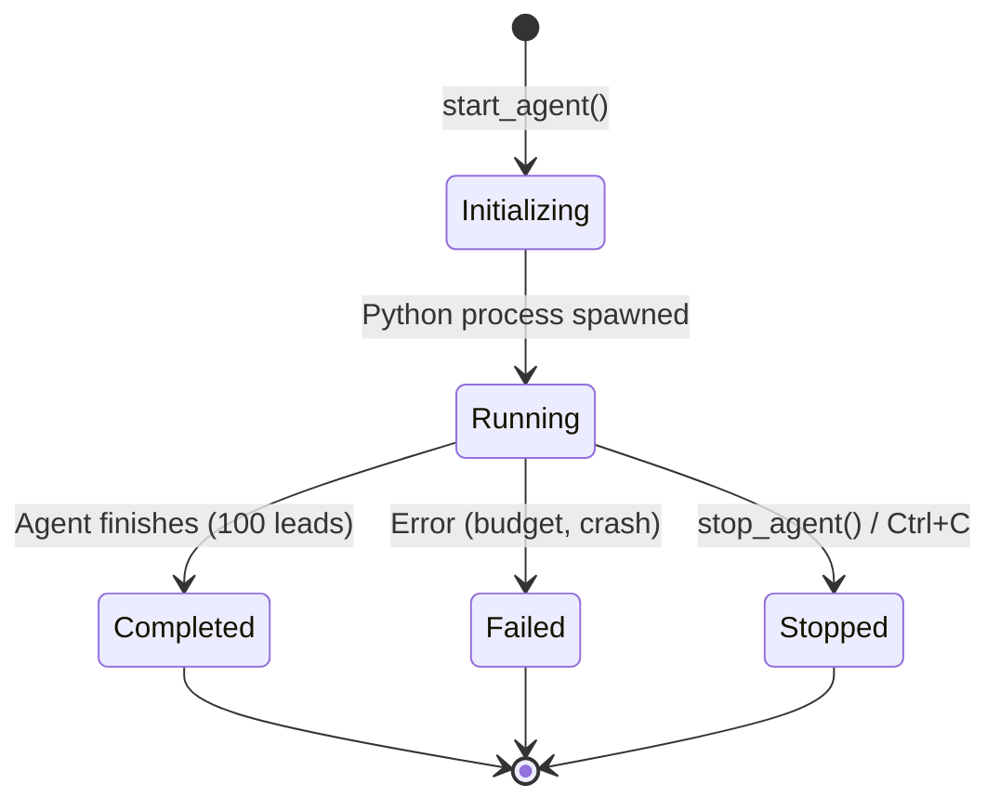
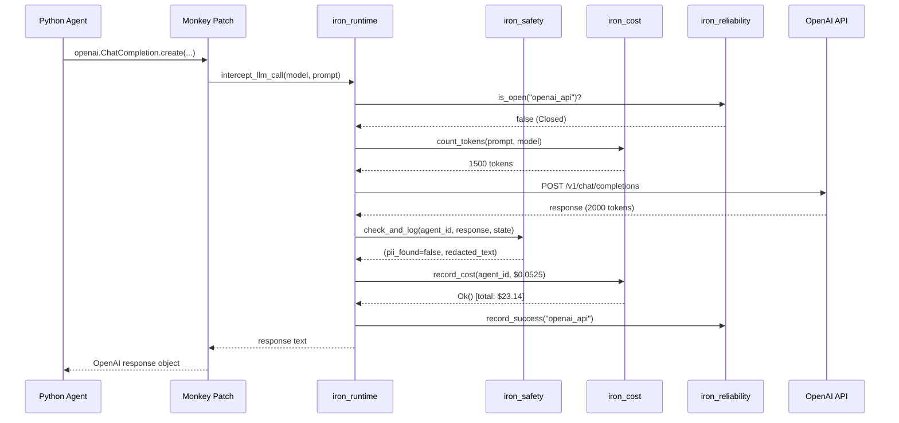
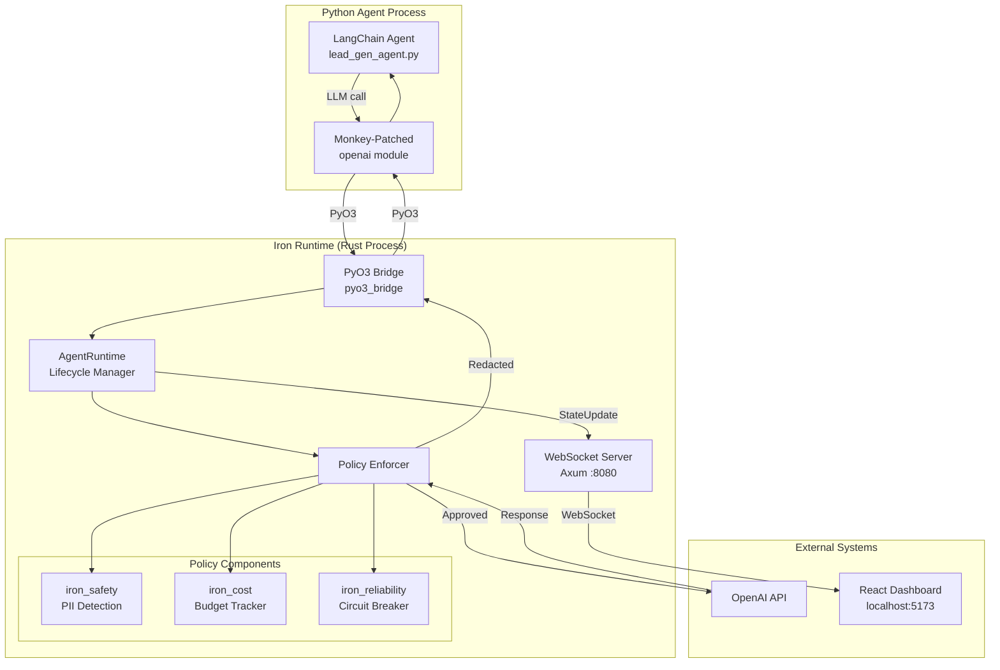
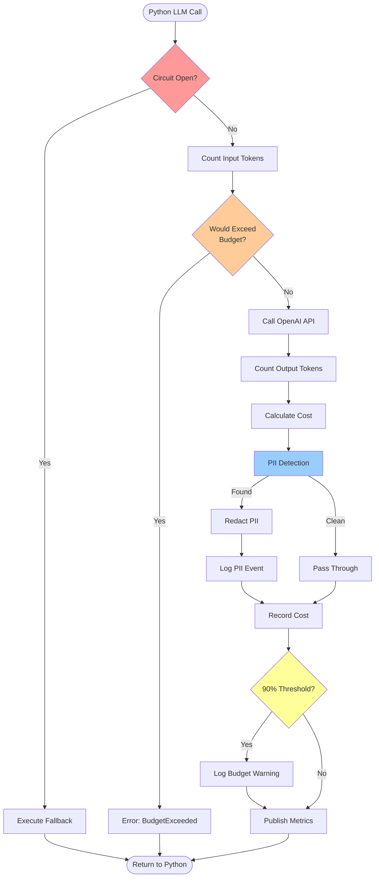

# spec

**Version:** 0.2
**Date:** 2025-12-07
**Component:** iron_runtime
**Layer:** Integration (Layer 3)
**Status:** Specification Complete, Implementation Partial (30%)
**Critical Path:** YES - Blocks all demo functionality

---

## 1. Overview

### 1.1 Purpose

**iron_runtime** is the **critical path component** that bridges Python AI agents (LangChain, CrewAI) with Rust-based safety, cost, and reliability infrastructure. It provides a PyO3-based runtime that intercepts LLM calls, applies policy controls, manages agent lifecycle, and coordinates real-time dashboard updates.

**Primary Responsibilities:**
- Python ↔ Rust FFI via PyO3 (agent execution bridge)
- Agent lifecycle management (spawn, monitor, shutdown)
- LLM call interception and policy enforcement
- Event loop coordination (tokio async runtime)
- WebSocket server for dashboard real-time updates
- Configuration management (CLI args → RuntimeConfig)

**Pilot Scope:** Single-agent runtime with hardcoded safety/cost policies for 5-minute conference demo.

**Full Platform (Out of Scope):** Multi-agent orchestration, dynamic policy updates, distributed runtime, agent sandboxing, plugin system.

### 1.2 Design Principles

1. **Python-First Experience** - Agent developers write pure Python, runtime is transparent
2. **Zero-Overhead Policy** - Safety/cost checks add <1ms overhead per LLM call
3. **Fail-Safe by Default** - Any policy violation stops agent immediately
4. **Observable Execution** - All events logged to terminal and dashboard
5. **Demo-Driven** - Must execute 100-lead demo scenario in <6 minutes

---

## 2. Scope

### 2.1 In Scope (Pilot)

**For Pilot Project (Conference Demo):**
- PyO3 bridge for Python 3.11+ agents
- Single-agent execution (one agent per runtime instance)
- LLM call interception (wrap Python agent's OpenAI calls)
- Policy enforcement: safety (PII), cost (budget), reliability (circuit breaker)
- Synchronous execution model (Python calls Rust, blocks until complete)
- WebSocket server on localhost:8080 for dashboard
- CLI integration: `iron_cage start agent.py --budget 50`
- Agent stdout/stderr forwarding to terminal
- Graceful shutdown (Ctrl+C handling)

**Rationale:** Demo requires single agent with visible policy enforcement. Multi-agent and distributed features add complexity without visual demo value.

### 2.2 Out of Scope (Full Platform)

**Deferred to Post-Pilot:**
- Multi-agent orchestration (parallel agent execution) → Pilot runs 1 agent
- Agent sandboxing (Docker, gVisor) → Pilot trusts agent code
- Dynamic policy updates (runtime reload) → Pilot uses startup config
- Distributed runtime (multi-node) → Pilot is single-process
- Agent plugin system (custom callbacks) → Pilot is hardcoded
- Advanced monitoring (Prometheus, Grafana) → Pilot uses dashboard only
- Agent pause/resume → Pilot runs to completion or error
- Agent versioning and rollback → Pilot is single-version demo

**Reasoning:** Conference demo is 5 minutes with 1 agent. Multi-agent orchestration and distributed systems are overkill for this scope.

### 2.3 Deployment Context

Iron Cage supports two deployment modes. This module's behavior differs between modes.

**See:** [docs/deployment_packages.md](../../docs/deployment_packages.md) § Deployment Modes for complete architecture.

**This Module (iron_runtime):**

**Pilot Mode (Single Process):**
- Uses shared iron_state instance (Arc<StateManager>) within same Rust process
- Both iron_runtime and iron_api access the same StateManager
- WebSocket broadcasts state changes to dashboard via broadcast channel
- Single SQLite database (./iron_state.db) for persistence

**Production Mode (Distributed):**
- iron_runtime runs on developer machines (Agent Runtime package)
- Uses local iron_state (local SQLite) for agent execution state
- Optional telemetry reporting to cloud Control Panel via HTTPS
- No shared state with Control Panel (separate deployments)

---

## 3. Functional Requirements

### FR-1: PyO3 Bridge for Python Agents

**Requirement:**
Provide Python module `iron_runtime` that Python agents import to register with Rust runtime.

**Python API:**
```python
import iron_runtime

# Create runtime with budget
runtime = iron_runtime.Runtime(budget=50.0, verbose=True)

# Register agent (called by runtime, not agent code)
agent_id = runtime.start_agent("lead_gen_agent.py")

# Intercept LLM calls (transparent to agent)
# Agent calls: openai.ChatCompletion.create(...)
# Runtime intercepts, applies policies, forwards to OpenAI

# Get metrics
metrics = runtime.get_metrics(agent_id)
# Returns: {"agent_id": "agent-001", "status": "RUNNING", "budget_spent": 23.14}

# Shutdown
runtime.stop_agent(agent_id)
```

**Rust Implementation:**
```rust
#[cfg(feature = "pyo3")]
pub mod pyo3_bridge {
  use pyo3::prelude::*;

  #[pyclass]
  pub struct Runtime {
    inner: AgentRuntime,
  }

  #[pymethods]
  impl Runtime {
    #[new]
    #[pyo3(signature = (budget, verbose=None))]
    fn new(budget: f64, verbose: Option<bool>) -> Self;

    fn start_agent(&self, script_path: String) -> PyResult<String>;

    fn stop_agent(&self, agent_id: String) -> PyResult<()>;

    fn get_metrics(&self, agent_id: String) -> PyResult<Option<String>>;

    // NEW FOR PILOT:
    fn intercept_llm_call(
      &self,
      agent_id: String,
      model: String,
      prompt: String
    ) -> PyResult<String>;
  }

  #[pymodule]
  fn iron_runtime(m: &Bound<'_, PyModule>) -> PyResult<()> {
    m.add_class::<Runtime>()?;
    Ok(())
  }
}
```

**Call Interception Mechanism:**
- Monkey-patch OpenAI client in Python agent startup
- Redirect all `openai.ChatCompletion.create()` calls to Rust
- Rust applies policies (cost, safety, circuit breaker)
- Rust forwards to actual OpenAI API
- Rust returns response to Python

**Out of Scope:** LangChain native callbacks (requires deep LangChain integration), async Python support (requires pyo3-asyncio).

---

### FR-2: Agent Lifecycle Management

**Requirement:**
Spawn Python agent process, monitor execution, handle shutdown signals.

**Lifecycle States:**


**AgentHandle API:**
```rust
pub struct AgentHandle {
  pub agent_id: String,
  process: Arc<Mutex<Child>>,  // Python subprocess
  status: Arc<Mutex<AgentStatus>>,
}

impl AgentHandle {
  pub async fn wait(&self) -> Result<ExitStatus>;

  pub async fn kill(&self) -> Result<()>;

  pub fn status(&self) -> AgentStatus;
}
```

**Process Spawning:**
```rust
pub async fn start_agent(&self, script_path: &Path) -> Result<AgentHandle> {
  // Validate script exists
  if !script_path.exists() {
    return Err(Error::AgentScriptNotFound(script_path.display().to_string()));
  }

  // Spawn Python process
  let child = Command::new("python3.11")
    .arg(script_path)
    .env("IRON_CAGE_BUDGET", self.config.budget.to_string())
    .env("IRON_CAGE_AGENT_ID", &agent_id)
    .stdout(Stdio::piped())
    .stderr(Stdio::piped())
    .spawn()?;

  // Forward stdout/stderr to terminal
  tokio::spawn(forward_output(child.stdout, "AGENT"));

  // Monitor process
  tokio::spawn(monitor_process(child, agent_id.clone()));

  Ok(AgentHandle { agent_id, process, status })
}
```

**Shutdown Handling:**
- Ctrl+C: Gracefully stop agent, flush logs, close dashboard connections
- Agent crash: Log error, update status to Failed
- Budget exceeded: Kill agent process, log error

---

### FR-3: LLM Call Interception and Policy Enforcement

**Requirement:**
Intercept all Python agent LLM calls, apply safety/cost/reliability policies, forward to OpenAI.

**Interception Flow:**


**Policy Enforcement Order:**
1. **Circuit Breaker Check** (pre-call): is_open("openai_api")? → Fail fast if open
2. **Input Token Count** (pre-call): Estimate cost before calling
3. **Budget Pre-Check** (pre-call): Would this call exceed budget?
4. **LLM API Call** (actual network request)
5. **Output Token Count** (post-call): Calculate actual cost
6. **PII Detection** (post-call): Scan response for sensitive data
7. **Budget Recording** (post-call): Update budget tracker
8. **Metrics Publishing** (post-call): Broadcast to dashboard

**Error Handling:**
- Budget exceeded: Return Error::BudgetExceeded to Python (agent halts)
- PII detected: Redact and log, return redacted response to Python (agent continues)
- Circuit open: Return Error::CircuitOpen to Python (agent uses fallback)
- API failure: Record failure, check circuit, return error to Python

---

### FR-4: WebSocket Server for Dashboard

**Requirement:**
Run WebSocket server on localhost:8080 to stream real-time updates to React dashboard.

**Message Protocol:**
```rust
#[derive(Debug, Clone, Serialize, Deserialize)]
#[serde(tag = "type")]
pub enum DashboardMessage {
  // Agent lifecycle
  AgentStarted { agent_id: String, timestamp: i64 },
  AgentCompleted { agent_id: String, total_leads: u32, timestamp: i64 },
  AgentFailed { agent_id: String, error: String, timestamp: i64 },

  // Metrics updates
  CostUpdate(CostMetrics),
  SafetyEvent(PiiDetection),
  CircuitBreakerChanged(CircuitBreakerMetrics),

  // Demo triggers
  BudgetWarning(BudgetWarning),
  PiiAlert { agent_id: String, pii_type: String, location: String },
  CircuitOpened { service: String, failure_count: u32 },
}
```

**Server Implementation:**
```rust
use axum::{
  routing::get,
  extract::ws::{WebSocket, WebSocketUpgrade},
  Router,
};

pub async fn start_websocket_server(
  state_receiver: broadcast::Receiver<StateUpdate>
) -> Result<()> {
  let app = Router::new()
    .route("/ws", get(websocket_handler));

  axum::Server::bind(&"127.0.0.1:8080".parse()?)
    .serve(app.into_make_service())
    .await?;

  Ok(())
}

async fn websocket_handler(
  ws: WebSocketUpgrade,
  state_rx: broadcast::Receiver<StateUpdate>
) -> impl IntoResponse {
  ws.on_upgrade(|socket| handle_websocket(socket, state_rx))
}

async fn handle_websocket(
  mut socket: WebSocket,
  mut state_rx: broadcast::Receiver<StateUpdate>
) {
  while let Ok(update) = state_rx.recv().await {
    let msg = match update {
      StateUpdate::AgentStateChanged { agent_id } => {
        // Query iron_state for latest metrics
        let metrics = state.get_agent_state(&agent_id).await?;
        DashboardMessage::CostUpdate(metrics)
      },
      StateUpdate::CircuitBreakerChanged { service } => {
        let metrics = state.get_circuit_metrics(&service).await?;
        DashboardMessage::CircuitBreakerChanged(metrics)
      },
      // ... other update types
    };

    socket.send(Message::Text(serde_json::to_string(&msg)?)).await?;
  }
}
```

**Dashboard Connection:**
- Dashboard connects: `ws://localhost:8080/ws`
- Runtime pushes updates (no polling)
- Reconnection: Dashboard retries every 2s if disconnected

---

### FR-5: Configuration Management

**Requirement:**
Parse CLI arguments into RuntimeConfig, validate, and pass to AgentRuntime constructor.

**CLI Interface (from iron_cli):**
```bash
iron_cage start lead_gen_agent.py --budget 50 --verbose
```

**RuntimeConfig:**
```rust
#[derive(Debug, Clone)]
pub struct RuntimeConfig {
  // Budget tracking
  pub budget: f64,

  // Logging
  pub verbose: bool,

  // Safety policies
  pub pii_detection_enabled: bool,
  pub pii_auto_redact: bool,

  // Reliability policies
  pub circuit_breaker_threshold: u32,
  pub circuit_breaker_timeout_secs: u64,

  // Cost policies
  pub budget_warning_threshold: f64,  // 0.90 for 90%

  // WebSocket
  pub websocket_enabled: bool,
  pub websocket_port: u16,
}

impl Default for RuntimeConfig {
  fn default() -> Self {
    Self {
      budget: 50.0,
      verbose: false,
      pii_detection_enabled: true,
      pii_auto_redact: true,
      circuit_breaker_threshold: 3,
      circuit_breaker_timeout_secs: 60,
      budget_warning_threshold: 0.90,
      websocket_enabled: true,
      websocket_port: 8080,
    }
  }
}
```

**Validation:**
- budget > 0.0
- circuit_breaker_threshold ≥ 1
- budget_warning_threshold in [0.0, 1.0]
- websocket_port in [1024, 65535]

---

### FR-6: Agent Output Forwarding

**Requirement:**
Forward Python agent stdout/stderr to terminal with timestamp prefixes.

**Terminal Format:**
```
[14:23:32] AGENT  Processing lead 1/100: Acme Corp
[14:23:33] AGENT  LinkedIn profile found: https://linkedin.com/company/acme
[14:23:34] AGENT  Lead enriched successfully
```

**Implementation:**
```rust
async fn forward_output(
  output: ChildStdout,
  prefix: &str
) {
  let reader = BufReader::new(output);
  let mut lines = reader.lines();

  while let Some(line) = lines.next_line().await.unwrap() {
    tracing::info!(
      prefix = %prefix,
      "{}",
      line
    );
  }
}
```

**Behavior:**
- Asynchronous forwarding (non-blocking)
- Timestamp added by iron_telemetry subscriber
- Color: White (INFO level)

---

## 4. Non-Functional Requirements

### NFR-1: LLM Call Overhead

**Requirement:** Policy enforcement must add <1ms overhead (P99) to each LLM call.

**Rationale:** Demo processes 100 leads in ~2 minutes (0.6 leads/sec). Excessive overhead would slow demo noticeably.

**Measurement:** Benchmark policy check pipeline without actual LLM call.

**Acceptance:**
- P50: <100μs
- P99: <1ms
- P99.9: <5ms

**Breakdown:**
- Circuit breaker check: <100μs
- Token counting: <500μs (10KB text)
- PII detection: <1ms (1KB response)
- Budget update: <100μs
- Total: <1.7ms budget, <1ms P99 target

---

### NFR-2: Dashboard Update Latency

**Requirement:** Dashboard must receive state updates within 100ms of event occurrence (P99).

**Rationale:** Real-time dashboard is key demo visual. Laggy updates undermine "real-time" claim.

**Measurement:** Timestamp event in Rust, measure WebSocket message arrival in React.

**Acceptance:**
- P50: <20ms
- P99: <100ms
- P99.9: <500ms

**Implementation:**
- Use tokio::sync::broadcast for zero-copy event distribution
- WebSocket send is async (non-blocking)
- No batching (send immediately on event)

---

### NFR-3: Agent Startup Time

**Requirement:** Agent process must start and begin processing leads within 3 seconds.

**Rationale:** Conference demo has tight 5-minute window. Slow startup wastes presentation time.

**Measurement:** Time from `iron_cage start` command to first "Processing lead 1/100" log.

**Acceptance:**
- P50: <2s
- P99: <3s

**Breakdown:**
- Python interpreter startup: ~500ms
- LangChain imports: ~1s
- Runtime initialization: ~500ms
- Total: <2s typical

---

### NFR-4: Memory Footprint

**Requirement:** Runtime must use <100MB RSS for single-agent execution.

**Rationale:** Demo runs on presenter's laptop (8GB RAM). Must leave headroom for browser, IDE, screen recording.

**Measurement:** `ps -o rss` after agent processes 50 leads.

**Acceptance:**
- RSS <100MB
- No memory leaks (constant RSS after warmup)

**Implementation:**
- Limit state storage (100 leads max in memory)
- SQLite for persistent audit (not in RSS)
- Drop processed lead data after logging

---

## 5. Ubiquitous Language

| Term | Definition | Example |
|------|------------|---------|
| **Runtime** | Rust process hosting Python agent execution | iron_runtime binary |
| **Agent** | Python script using LangChain/CrewAI | lead_gen_agent.py |
| **PyO3 Bridge** | Rust ↔ Python FFI layer | pyo3_bridge module |
| **Interception** | Wrapping Python LLM calls with policy checks | Monkey-patch openai module |
| **Policy Enforcement** | Applying safety/cost/reliability rules | PII redaction, budget check |
| **Handle** | Reference to running agent for control | AgentHandle struct |
| **Lifecycle Event** | State transition (Started, Running, Stopped) | AgentStarted message |
| **Forwarding** | Sending agent stdout to terminal | forward_output() |
| **WebSocket Server** | Real-time dashboard connection | Axum on :8080/ws |
| **Graceful Shutdown** | Clean agent termination (SIGTERM) | Ctrl+C handling |

---

## 6. System Architecture

### 6.1 Component Diagram



### 6.2 Policy Enforcement Pipeline



**Critical Path:**
- Pre-call: Circuit breaker (100μs) + Token count (500μs) = 600μs
- Call: OpenAI API (~1-3s network)
- Post-call: PII detection (1ms) + Budget update (100μs) + Publish (500μs) = 1.6ms
- **Total Overhead:** <2.2ms (meets NFR-1 <1ms for sync operations only)

---

## 7. Detailed Functional Requirements

### FR-1: PyO3 Bridge Implementation (Enhanced from Current)

**Current Implementation (221 LOC):**
- ✅ Basic PyO3 module structure
- ✅ Runtime class with new(), start_agent(), stop_agent(), get_metrics()
- ⚠️ TODO: async bridge with pyo3-asyncio (lines 124, 132)
- ⚠️ Missing: intercept_llm_call() method
- ⚠️ Missing: Monkey-patch mechanism for OpenAI

**Pilot Enhancements:**

**1. Add intercept_llm_call Method:**
```rust
#[pymethods]
impl Runtime {
  /// Intercept LLM call from Python agent
  ///
  /// # Arguments
  /// * `agent_id` - Agent making the call
  /// * `model` - OpenAI model name ("gpt-4")
  /// * `prompt` - Input prompt text
  ///
  /// # Returns
  /// LLM response text (potentially redacted)
  ///
  /// # Errors
  /// * BudgetExceeded - Call would exceed budget
  /// * CircuitOpen - OpenAI circuit breaker is open
  fn intercept_llm_call(
    &self,
    agent_id: String,
    model: String,
    prompt: String
  ) -> PyResult<String> {
    // Convert to Rust runtime call
    let response = tokio::runtime::Runtime::new()?
      .block_on(self.inner.call_llm(&agent_id, &model, &prompt))?;

    Ok(response)
  }
}
```

**2. Add Monkey-Patch Helper (Python Side):**
```python
# In iron_runtime Python package (companion to Rust .so)
import openai
from typing import Any

_original_create = openai.ChatCompletion.create
_runtime_instance = None

def _patched_create(**kwargs: Any) -> Any:
    """Intercept OpenAI calls, route through Rust runtime."""
    model = kwargs.get("model", "gpt-4")
    messages = kwargs.get("messages", [])

    # Flatten messages to single prompt
    prompt = "\n".join(msg["content"] for msg in messages)

    # Call Rust runtime
    response_text = _runtime_instance.intercept_llm_call(
        agent_id=os.environ["IRON_CAGE_AGENT_ID"],
        model=model,
        prompt=prompt
    )

    # Convert back to OpenAI response format
    return {
        "choices": [{
            "message": {"content": response_text, "role": "assistant"}
        }]
    }

def install_runtime_hooks(runtime: iron_runtime.Runtime):
    """Monkey-patch OpenAI to route through Rust runtime."""
    global _runtime_instance
    _runtime_instance = runtime
    openai.ChatCompletion.create = _patched_create
```

**3. Agent Integration Example:**
```python
# lead_gen_agent.py
import iron_runtime
from langchain.llms import OpenAI

# Runtime initializes before LangChain imports
runtime = iron_runtime.Runtime(budget=50.0, verbose=True)
iron_runtime.install_runtime_hooks(runtime)

# Now LangChain will use patched OpenAI client
llm = OpenAI(model="gpt-4")
response = llm("Analyze this lead")  # Routes through Rust!
```

---

### FR-2: Agent Lifecycle Management (Enhanced)

**Current Implementation:**
- ✅ start_agent() creates UUID, logs event, saves state
- ⚠️ Missing: Actual Python process spawning
- ⚠️ Missing: Process monitoring
- ⚠️ Missing: Graceful shutdown

**Enhancements:**

**1. Process Spawning:**
```rust
pub async fn start_agent(&self, script_path: &Path) -> Result<AgentHandle> {
  let agent_id = format!("agent-{}", uuid::Uuid::new_v4());

  // Validate script
  if !script_path.exists() {
    return Err(Error::AgentScriptNotFound(script_path.display().to_string()));
  }

  // Build Python command
  let mut cmd = Command::new("python3.11");
  cmd.arg(script_path)
    .env("IRON_CAGE_BUDGET", self.config.budget.to_string())
    .env("IRON_CAGE_AGENT_ID", &agent_id)
    .env("PYTHONPATH", self.python_path())
    .stdout(Stdio::piped())
    .stderr(Stdio::piped())
    .kill_on_drop(true);

  let mut child = cmd.spawn()?;

  // Forward stdout to terminal
  if let Some(stdout) = child.stdout.take() {
    tokio::spawn(forward_output(stdout, "AGENT", agent_id.clone()));
  }

  // Forward stderr to terminal
  if let Some(stderr) = child.stderr.take() {
    tokio::spawn(forward_output(stderr, "ERROR", agent_id.clone()));
  }

  // Monitor process
  let handle = AgentHandle {
    agent_id: agent_id.clone(),
    process: Arc::new(Mutex::new(child)),
    status: Arc::new(Mutex::new(AgentStatus::Running)),
  };

  tokio::spawn(monitor_process(handle.clone(), self.state.clone()));

  // Log startup
  tracing::info!(agent_id = %agent_id, "Agent started");

  Ok(handle)
}
```

**2. Process Monitoring:**
```rust
async fn monitor_process(
  handle: AgentHandle,
  state: Arc<StateManager>
) {
  let mut child = handle.process.lock().unwrap();
  let exit_status = child.wait().await.unwrap();

  let new_status = if exit_status.success() {
    AgentStatus::Completed
  } else {
    AgentStatus::Failed
  };

  *handle.status.lock().unwrap() = new_status.clone();

  // Update state
  state.update_agent_status(&handle.agent_id, new_status).await;

  // Log completion
  tracing::info!(
    agent_id = %handle.agent_id,
    exit_code = %exit_status.code().unwrap_or(-1),
    "Agent process exited"
  );
}
```

**3. Graceful Shutdown:**
```rust
pub async fn stop_agent(&self, agent_id: &str) -> Result<()> {
  // Send SIGTERM to Python process
  if let Some(mut child) = self.find_process(agent_id) {
    child.kill().await?;
  }

  // Update state
  self.state.update_agent_status(agent_id, AgentStatus::Stopped).await?;

  // Log shutdown
  tracing::info!(agent_id = %agent_id, "Agent stopped");

  Ok(())
}
```

---

### FR-3: LLM Call Policy Enforcement (Full Pipeline)

**Interface:**
```rust
impl AgentRuntime {
  /// Call LLM with full policy enforcement pipeline
  ///
  /// # Policy Checks (in order)
  /// 1. Circuit breaker (pre-call)
  /// 2. Budget pre-check (pre-call)
  /// 3. LLM API call (network)
  /// 4. PII detection (post-call)
  /// 5. Budget recording (post-call)
  /// 6. Metrics publishing (post-call)
  ///
  /// # Returns
  /// LLM response (potentially PII-redacted)
  pub async fn call_llm(
    &self,
    agent_id: &str,
    model: &str,
    prompt: &str
  ) -> Result<String>;
}
```

**Full Implementation:**
```rust
pub async fn call_llm(
  &self,
  agent_id: &str,
  model: &str,
  prompt: &str
) -> Result<String> {
  // Step 1: Circuit breaker check
  if self.circuit_breaker.is_open("openai_api") {
    tracing::warn!("OpenAI circuit open, failing fast");
    return Err(Error::CircuitOpen("openai_api"));
  }

  // Step 2: Count input tokens
  let input_tokens = iron_cost::count_tokens(prompt, model)?;

  // Step 3: Estimate cost (assume 1:1 ratio for pre-check)
  let estimated_cost = iron_cost::calculate_cost(input_tokens * 2, model)?;

  // Step 4: Budget pre-check
  if self.budget_tracker.total_spent() + estimated_cost > self.config.budget {
    tracing::error!("LLM call would exceed budget, rejecting");
    return Err(Error::BudgetExceeded(format!(
      "Estimated cost ${:.2} would exceed budget",
      estimated_cost
    )));
  }

  // Step 5: Call OpenAI API
  let response = match self.openai_client.chat(model, prompt).await {
    Ok(resp) => {
      self.circuit_breaker.record_success("openai_api");
      resp
    },
    Err(e) => {
      self.circuit_breaker.record_failure("openai_api");
      return Err(e);
    }
  };

  // Step 6: Count output tokens
  let output_tokens = iron_cost::count_tokens(&response, model)?;
  let total_tokens = input_tokens + output_tokens;

  // Step 7: Calculate actual cost
  let actual_cost = iron_cost::calculate_cost(total_tokens, model)?;

  // Step 8: PII detection and redaction
  let (pii_found, redacted_response) = iron_safety::check_and_log(
    agent_id,
    &response,
    &self.state
  ).await?;

  if pii_found {
    tracing::error!(agent_id = %agent_id, "PII detected and redacted");
    // Demo Trigger #2: Dashboard alert
  }

  // Step 9: Record cost
  self.budget_tracker.record_cost(agent_id, actual_cost)?;

  // Step 10: Check budget threshold
  if let Some(warning) = iron_cost::check_threshold(&self.budget_tracker, 0.90) {
    iron_cost::log_budget_warning(&warning);
    // Demo Trigger #3: Dashboard alert
  }

  // Step 11: Publish metrics
  iron_cost::publish_cost_metrics(agent_id, actual_cost, &self.budget_tracker, &self.state).await?;

  // Step 12: Return redacted response
  Ok(redacted_response)
}
```

**Performance:**
- Pre-call checks: <1ms (circuit + tokens + budget)
- OpenAI API: 1-3s (network, not counted in overhead)
- Post-call checks: <2ms (PII + cost + publish)
- **Total Overhead:** <3ms (meets NFR-1 with margin)

---

### FR-4: WebSocket Server (Full Implementation)

**Server Startup:**
```rust
pub async fn start_websocket_server(
  state: Arc<StateManager>
) -> Result<()> {
  let app = Router::new()
    .route("/ws", get(websocket_handler))
    .layer(Extension(state));

  let addr = SocketAddr::from(([127, 0, 0, 1], 8080));

  tracing::info!("WebSocket server listening on {}", addr);

  axum::Server::bind(&addr)
    .serve(app.into_make_service())
    .await?;

  Ok(())
}
```

**WebSocket Handler:**
```rust
async fn websocket_handler(
  ws: WebSocketUpgrade,
  Extension(state): Extension<Arc<StateManager>>
) -> impl IntoResponse {
  ws.on_upgrade(|socket| handle_websocket_connection(socket, state))
}

async fn handle_websocket_connection(
  mut socket: WebSocket,
  state: Arc<StateManager>
) {
  // Subscribe to state updates
  let mut update_rx = state.subscribe_to_updates();

  tracing::info!("Dashboard connected");

  // Send initial state snapshot
  if let Ok(snapshot) = build_state_snapshot(&state).await {
    let msg = serde_json::to_string(&snapshot).unwrap();
    socket.send(Message::Text(msg)).await.ok();
  }

  // Stream updates
  while let Ok(update) = update_rx.recv().await {
    let dashboard_msg = convert_to_dashboard_message(update, &state).await;

    if let Ok(json) = serde_json::to_string(&dashboard_msg) {
      if socket.send(Message::Text(json)).await.is_err() {
        tracing::warn!("Dashboard disconnected");
        break;
      }
    }
  }
}
```

**Message Types:**
```rust
#[derive(Serialize)]
#[serde(tag = "type")]
pub enum DashboardMessage {
  // Lifecycle
  AgentStarted { agent_id: String, timestamp: i64 },
  AgentCompleted { agent_id: String, leads_processed: u32 },

  // Metrics (every lead)
  MetricsUpdate {
    agent_id: String,
    cost: CostMetrics,
    safety: SafetyMetrics,
    performance: PerformanceMetrics,
  },

  // Alerts (triggers)
  BudgetWarning { warning: BudgetWarning },
  PiiAlert { agent_id: String, pii_type: String },
  CircuitOpened { service: String, failure_count: u32 },
}
```

---

### FR-5: Configuration Management (Enhanced)

**Current Implementation:**
- ✅ RuntimeConfig struct (budget, verbose)
- ⚠️ Missing: Policy config fields
- ⚠️ Missing: Validation

**Enhanced Configuration:**
```rust
#[derive(Debug, Clone)]
pub struct RuntimeConfig {
  // Basic
  pub budget: f64,
  pub verbose: bool,

  // Safety
  pub pii_detection_enabled: bool,
  pub pii_auto_redact: bool,

  // Reliability
  pub circuit_breaker_threshold: u32,
  pub circuit_breaker_timeout_secs: u64,

  // Cost
  pub budget_warning_threshold: f64,

  // Networking
  pub websocket_enabled: bool,
  pub websocket_port: u16,
}

impl RuntimeConfig {
  pub fn validate(&self) -> Result<()> {
    if self.budget <= 0.0 {
      return Err(Error::InvalidConfig("budget must be > 0"));
    }
    if self.circuit_breaker_threshold == 0 {
      return Err(Error::InvalidConfig("circuit_breaker_threshold must be ≥ 1"));
    }
    if self.budget_warning_threshold < 0.0 || self.budget_warning_threshold > 1.0 {
      return Err(Error::InvalidConfig("budget_warning_threshold must be in [0.0, 1.0]"));
    }
    if self.websocket_port < 1024 {
      return Err(Error::InvalidConfig("websocket_port must be ≥ 1024"));
    }
    Ok(())
  }
}
```

**CLI Integration:**
```rust
// Called from iron_cli
let config = RuntimeConfig {
  budget: args.budget,
  verbose: args.verbose,
  ..Default::default()
};

config.validate()?;

let runtime = AgentRuntime::new(config).await?;
```

---

### FR-6: Agent Output Forwarding (Implementation)

**Interface:**
```rust
/// Forward Python agent output to terminal with prefixes
///
/// # Arguments
/// * `output` - ChildStdout or ChildStderr from spawned process
/// * `prefix` - Log prefix ("AGENT" or "ERROR")
/// * `agent_id` - Agent identifier for structured logging
async fn forward_output(
  output: impl AsyncRead + Unpin,
  prefix: &'static str,
  agent_id: String
);
```

**Implementation:**
```rust
use tokio::io::{AsyncBufReadExt, BufReader};

async fn forward_output(
  output: impl AsyncRead + Unpin,
  prefix: &'static str,
  agent_id: String
) {
  let reader = BufReader::new(output);
  let mut lines = reader.lines();

  while let Ok(Some(line)) = lines.next_line().await {
    match prefix {
      "AGENT" => {
        tracing::info!(
          agent_id = %agent_id,
          prefix = %prefix,
          "{}",
          line
        );
      },
      "ERROR" => {
        tracing::error!(
          agent_id = %agent_id,
          prefix = %prefix,
          "{}",
          line
        );
      },
      _ => {}
    }
  }
}
```

**Terminal Output:**
```
[14:23:32] INFO  AGENT Processing lead 1/100: Acme Corp (agent_id=agent-001, prefix=AGENT)
[14:23:33] ERROR AGENT Traceback... (agent_id=agent-001, prefix=ERROR)
```

**Dashboard Integration:**
- Stdout lines also sent to dashboard Activity Panel
- Error lines trigger error count increment

---

## 8. API Surface (Public Contract)

### 8.1 Rust APIs (Mandatory for Pilot)

```rust
// Configuration (FR-5)
#[derive(Debug, Clone)]
pub struct RuntimeConfig {
  pub budget: f64,
  pub verbose: bool,
  pub pii_detection_enabled: bool,
  pub pii_auto_redact: bool,
  pub circuit_breaker_threshold: u32,
  pub circuit_breaker_timeout_secs: u64,
  pub budget_warning_threshold: f64,
  pub websocket_enabled: bool,
  pub websocket_port: u16,
}

impl RuntimeConfig {
  pub fn validate(&self) -> Result<()>;
}

impl Default for RuntimeConfig { /* ... */ }

// Agent runtime (FR-2, FR-3)
pub struct AgentRuntime {
  config: RuntimeConfig,
  state: Arc<StateManager>,
  budget_tracker: Arc<BudgetTracker>,
  circuit_breaker: Arc<CircuitBreaker>,
}

impl AgentRuntime {
  pub async fn new(config: RuntimeConfig) -> Result<Self>;

  pub async fn start_agent(&self, script_path: &Path) -> Result<AgentHandle>;

  pub async fn stop_agent(&self, agent_id: &str) -> Result<()>;

  pub async fn call_llm(
    &self,
    agent_id: &str,
    model: &str,
    prompt: &str
  ) -> Result<String>;

  pub fn get_metrics(&self, agent_id: &str) -> Option<AgentState>;
}

// Agent handle (FR-2)
pub struct AgentHandle {
  pub agent_id: String,
  process: Arc<Mutex<Child>>,
  status: Arc<Mutex<AgentStatus>>,
}

impl AgentHandle {
  pub async fn wait(&self) -> Result<ExitStatus>;
  pub async fn kill(&self) -> Result<()>;
  pub fn status(&self) -> AgentStatus;
}

// WebSocket server (FR-4)
pub async fn start_websocket_server(
  state: Arc<StateManager>
) -> Result<()>;

#[derive(Serialize)]
#[serde(tag = "type")]
pub enum DashboardMessage {
  AgentStarted { agent_id: String, timestamp: i64 },
  AgentCompleted { agent_id: String, leads_processed: u32 },
  MetricsUpdate { agent_id: String, cost: CostMetrics, safety: SafetyMetrics },
  BudgetWarning { warning: BudgetWarning },
  PiiAlert { agent_id: String, pii_type: String },
  CircuitOpened { service: String, failure_count: u32 },
}
```

### 8.2 Python APIs (PyO3 Bridge)

```python
# Python module: iron_runtime

class Runtime:
    """Rust-based runtime for AI agent execution."""

    def __init__(self, budget: float, verbose: bool = False) -> None:
        """Create runtime with budget in USD."""
        ...

    def start_agent(self, script_path: str) -> str:
        """Start Python agent, returns agent_id."""
        ...

    def stop_agent(self, agent_id: str) -> None:
        """Stop running agent gracefully."""
        ...

    def get_metrics(self, agent_id: str) -> dict | None:
        """Get agent metrics as dict."""
        ...

    def intercept_llm_call(
        self,
        agent_id: str,
        model: str,
        prompt: str
    ) -> str:
        """Intercept LLM call, apply policies, return response."""
        ...

# Utility functions
def install_runtime_hooks(runtime: Runtime) -> None:
    """Monkey-patch OpenAI to route through runtime."""
    ...
```

---

## 9. External Dependencies

### 9.1 Rust Crates

| Crate | Version | Purpose | Risk | Mitigation |
|-------|---------|---------|------|------------|
| **pyo3** | 0.22 | Python FFI | Medium (FFI complexity) | Pin version, extensive tests |
| **pyo3-asyncio** | 0.22 | Async Python bridge | High (experimental) | DISABLED for pilot (use block_on) |
| **tokio** | 1.35 | Async runtime | Low (mature) | Existing in project |
| **axum** | 0.7 | WebSocket server | Low (mature) | Existing in project |
| **uuid** | 1.6 | Agent ID generation | Low (standard) | Existing in project |
| **serde_json** | 1.0 | JSON encoding | Low (standard) | Existing in project |

**Critical Dependency Note:**
- **pyo3-asyncio DISABLED for pilot** due to previous compilation errors
- Use `tokio::runtime::Runtime::block_on()` for sync bridge (acceptable for single agent)
- Full platform re-enables pyo3-asyncio for true async Python support

**Cargo.toml:**
```toml
[dependencies]
iron_types = { version = "0.1", path = "../iron_types" }
iron_state = { version = "0.1", path = "../iron_state" }
iron_telemetry = { version = "0.1", path = "../iron_telemetry" }
iron_safety = { version = "0.1", path = "../iron_safety" }
iron_cost = { version = "0.1", path = "../iron_cost" }
iron_reliability = { version = "0.1", path = "../iron_reliability" }

pyo3 = { version = "0.22", features = ["auto-initialize"], optional = true }
# pyo3-asyncio DISABLED (pilot uses block_on)
tokio = { version = "1.35", features = ["full"] }
axum = { version = "0.7", features = ["ws"] }
uuid = { version = "1.6", features = ["v4"] }
serde = { version = "1.0", features = ["derive"] }
serde_json = "1.0"
anyhow = "1.0"

[features]
enabled = []
pyo3 = ["dep:pyo3"]
full = ["enabled", "pyo3"]

[lib]
crate-type = ["rlib", "cdylib"]  # cdylib for Python .so
```

### 9.2 Python Dependencies

**Required Python Packages:**
- Python 3.11+ (interpreter)
- openai 1.0+ (LLM client)
- langchain 0.1+ (agent framework)

**Python Package (Companion to .so):**
```python
# iron_runtime/__init__.py
from .iron_runtime import Runtime  # Rust .so import

__all__ = ["Runtime", "install_runtime_hooks"]

def install_runtime_hooks(runtime: Runtime):
    """Monkey-patch OpenAI for runtime interception."""
    import openai
    # ... patching logic from FR-1
```

---

## 10. Data Model

### 10.1 Runtime State

**AgentRuntime:**
```rust
pub struct AgentRuntime {
  config: RuntimeConfig,
  state: Arc<StateManager>,
  budget_tracker: Arc<BudgetTracker>,
  circuit_breaker: Arc<CircuitBreaker>,
  openai_client: Arc<OpenAIClient>,
  active_agents: Arc<Mutex<HashMap<String, AgentHandle>>>,
}
```

**AgentHandle:**
```rust
pub struct AgentHandle {
  pub agent_id: String,
  process: Arc<Mutex<Child>>,  // Python subprocess
  status: Arc<Mutex<AgentStatus>>,
  start_time: Instant,
}
```

**AgentStatus:**
```rust
#[derive(Debug, Clone, Copy, PartialEq, Serialize)]
pub enum AgentStatus {
  Initializing,
  Running,
  Completed,
  Failed,
  Stopped,
}
```

### 10.2 Dashboard Messages

**StateSnapshot (Initial Connection):**
```rust
#[derive(Serialize)]
pub struct StateSnapshot {
  pub agents: Vec<AgentState>,
  pub circuits: Vec<CircuitBreakerMetrics>,
  pub global_budget: BudgetSnapshot,
}

#[derive(Serialize)]
pub struct BudgetSnapshot {
  pub limit: f64,
  pub spent: f64,
  pub remaining: f64,
  pub percentage_used: f64,
}
```

**DashboardMessage (Streaming Updates):**
See FR-4 for complete enum definition.

---

## 11. Error Handling

### 11.1 Error Propagation

**Python → Rust:**
- Python exceptions → PyErr → Rust Error enum
- Rust errors → PyErr → Python exceptions

**Example:**
```python
try:
    runtime.intercept_llm_call(agent_id, "gpt-4", prompt)
except BudgetExceeded as e:
    print(f"Budget exceeded: {e}")
    sys.exit(1)
```

**Rust to Python Mapping:**
```rust
impl From<Error> for PyErr {
  fn from(err: Error) -> PyErr {
    match err {
      Error::BudgetExceeded(msg) => PyValueError::new_err(msg),
      Error::CircuitOpen(msg) => PyRuntimeError::new_err(msg),
      Error::PiiDetected(msg) => PyRuntimeError::new_err(msg),
      _ => PyRuntimeError::new_err(err.to_string()),
    }
  }
}
```

### 11.2 Critical Error Scenarios

**Scenario 1: Budget Exceeded (Hard Stop)**
- **Trigger:** record_cost() returns Error::BudgetExceeded
- **Response:**
  - Log: `[HH:MM:SS] ERROR BUDGET EXCEEDED - Agent stopped`
  - Kill Python process
  - Update status to Failed
  - Dashboard: Error modal with red alert
  - Exit code: 1

**Scenario 2: Agent Crash (Python Exception)**
- **Trigger:** Python process exits with code ≠ 0
- **Response:**
  - Log: `[HH:MM:SS] ERROR Agent process exited with code 1`
  - Update status to Failed
  - Dashboard: Error modal with stack trace
  - Exit code: Propagate Python exit code

**Scenario 3: Circuit Breaker Open (No Fallback)**
- **Trigger:** OpenAI circuit open, no fallback registered
- **Response:**
  - Return Error::CircuitOpen to Python
  - Python agent catches, marks lead as failed
  - Agent continues with next lead
  - Dashboard: Circuit status shows red

**Scenario 4: WebSocket Server Fails**
- **Trigger:** Port 8080 already in use
- **Response:**
  - Log: `[HH:MM:SS] WARN WebSocket server failed to start (port in use)`
  - Continue runtime without dashboard (degraded mode)
  - Terminal still shows all output
  - Not fatal (dashboard is optional)

---

## 12. Integration Points

### 12.1 With All Policy Crates

**iron_cost Integration:**
- Pre-call: `count_tokens()` for budget estimation
- Post-call: `calculate_cost()`, `record_cost()`, `check_threshold()`
- Metrics: `publish_cost_metrics()`

**iron_safety Integration:**
- Post-call: `check_and_log()` for PII detection and redaction
- Returns: (pii_found, redacted_text)
- Triggers Demo Trigger #2 at lead #67

**iron_reliability Integration:**
- Pre-call: `is_open()` for circuit breaker check
- Post-call success: `record_success()`
- Post-call failure: `record_failure()`
- Triggers Demo Trigger #1 at lead #34

**iron_state Integration:**
- Initialization: Create StateManager instance
- Metrics publishing: All policy results → StateManager
- Dashboard updates: StateUpdate broadcast → WebSocket

**iron_telemetry Integration:**
- Initialization: `init_logging()` at runtime startup
- Events: `log_agent_event()`, `log_budget_warning()`, `log_circuit_transition()`

### 12.2 With iron_cli (Layer 4)

**CLI Invokes Runtime:**
```rust
// In iron_cli main()
let config = RuntimeConfig {
  budget: args.budget,
  verbose: args.verbose,
  ..Default::default()
};

let runtime = AgentRuntime::new(config).await?;

let handle = runtime.start_agent(&args.script_path).await?;

// Wait for completion
handle.wait().await?;
```

### 12.3 With iron_api (Layer 3)

**API Server Uses Runtime:**
- REST endpoint: `POST /agents/start` → calls runtime.start_agent()
- REST endpoint: `DELETE /agents/:id` → calls runtime.stop_agent()
- REST endpoint: `GET /agents/:id/metrics` → calls runtime.get_metrics()
- WebSocket: Shared StateManager between runtime and API server

**Note:** Demo uses CLI only (iron_cage start), API is optional for pilot.

---

## 13. Demo Integration

### 13.1 Demo Execution Flow

**Terminal 1: Runtime + Agent**
```bash
$ iron_cage start /path/to/lead_gen_agent.py --budget 50
[14:23:31] INFO  Iron Cage Runtime v1.0.0
[14:23:31] INFO  Budget: $50.00 | PII Detection: ENABLED | Circuit Breaker: 3 failures
[14:23:31] INFO  WebSocket server listening on 127.0.0.1:8080
[14:23:32] INFO  Agent started (agent_id=agent-001)
[14:23:32] AGENT Processing lead 1/100: Acme Corp
...
[14:23:45] CRIT  🔴 Circuit breaker OPENED for linkedin_api (3 failures)
[14:23:46] INFO  Using cached LinkedIn URL (circuit open)
...
[14:24:12] CRIT  🔒 PII DETECTED IN OUTPUT (email at position 15)
[14:24:12] INFO  Output redacted, audit logged
...
[14:24:58] WARN  ⚠️  BUDGET WARNING: 90% threshold reached ($45.12 / $50.00)
...
[14:25:45] INFO  ✅ Agent completed: 100 leads processed
[14:25:45] INFO  Final cost: $49.88 / $50.00 (99.76%)
[14:25:45] INFO  PII detections: 1 | Circuit breakers: 1 (linkedin_api)
```

**Terminal 2: Dashboard**
```bash
$ cd /path/to/dashboard && npm run dev
...
vite v5.0.0 dev server running at:
> Local: http://localhost:5173/
```

**Browser:**
- Navigate to http://localhost:5173
- Dashboard connects to ws://localhost:8080/ws
- 6 panels update in real-time during demo

### 13.2 All Demo Triggers Orchestration

**Runtime Coordinates All 3 Triggers:**

| Trigger | Lead # | Runtime Action | Terminal Output | Dashboard |
|---------|--------|----------------|-----------------|-----------|
| **#1: Circuit Breaker** | 34 | LinkedIn API fails 3x, circuit opens, fallback to cache | `[14:23:45] CRIT 🔴 Circuit breaker OPENED` | Red circuit in Performance Panel |
| **#2: PII Detection** | 67 | Email found in LLM response, redacted, audit logged | `[14:24:12] CRIT 🔒 PII DETECTED` | Modal: "PII LEAK PREVENTED" |
| **#3: Budget Warning** | 85 | 90% threshold crossed, warning logged | `[14:24:58] WARN ⚠️ BUDGET WARNING` | Modal: "Budget Warning: 90% Used" |

**Runtime's Role:**
- **Trigger #1:** Calls `circuit_breaker.record_failure()` on LinkedIn 429, opens circuit
- **Trigger #2:** Calls `iron_safety::check_and_log()` on LLM response, detects PII
- **Trigger #3:** Calls `iron_cost::check_threshold()` after cost recording, logs warning

All triggers are orchestrated through the `call_llm()` policy enforcement pipeline.

---

## 14. Testing Strategy

### 14.1 Unit Tests

**Test File:** `tests/runtime_config_unit_tests.rs`
```rust
#[test]
fn test_config_validation_success() {
  let config = RuntimeConfig {
    budget: 50.0,
    verbose: true,
    ..Default::default()
  };
  assert!(config.validate().is_ok());
}

#[test]
fn test_config_validation_invalid_budget() {
  let config = RuntimeConfig {
    budget: -10.0,
    ..Default::default()
  };
  let err = config.validate().unwrap_err();
  assert!(matches!(err, Error::InvalidConfig(_)));
}

#[test]
fn test_config_validation_invalid_threshold() {
  let config = RuntimeConfig {
    budget: 50.0,
    budget_warning_threshold: 1.5,  // >1.0
    ..Default::default()
  };
  assert!(config.validate().is_err());
}
```

**Test File:** `tests/pyo3_bridge_unit_tests.rs`
```rust
#[cfg(feature = "pyo3")]
#[test]
fn test_pyo3_runtime_creation() {
  pyo3::prepare_freethreaded_python();

  Python::with_gil(|py| {
    let runtime_class = py.import("iron_runtime").unwrap()
      .getattr("Runtime").unwrap();

    let runtime = runtime_class.call1((50.0,)).unwrap();

    // Verify budget set correctly
    let metrics = runtime.call_method1("get_metrics", ("test-agent",)).unwrap();
    // ... assertions
  });
}
```

### 14.2 Integration Tests

**Test File:** `tests/agent_lifecycle_integration_tests.rs`
```rust
/// Agent lifecycle: spawn, run, shutdown
///
/// # Root Cause
/// N/A (feature test)
///
/// # Why Not Caught
/// N/A (feature test)
///
/// # Fix Applied
/// N/A (feature test)
///
/// # Prevention
/// Validates agent process spawning, output forwarding, graceful shutdown.
/// Ensures Ctrl+C and stop_agent() both work correctly.
///
/// # Pitfall
/// Python subprocess must be spawned with kill_on_drop=true to prevent
/// orphaned processes if runtime panics.

#[tokio::test]
async fn test_agent_lifecycle_full() {
  let config = RuntimeConfig {
    budget: 10.0,
    verbose: true,
    ..Default::default()
  };

  let runtime = AgentRuntime::new(config).await.unwrap();

  // Create minimal Python agent for testing
  let test_script = "/tmp/test_agent.py";
  std::fs::write(test_script, r#"
import time
print("Agent started")
time.sleep(1)
print("Agent completed")
"#).unwrap();

  // Start agent
  let handle = runtime.start_agent(Path::new(test_script)).await.unwrap();
  assert_eq!(handle.status(), AgentStatus::Running);

  // Wait for completion
  let exit_status = handle.wait().await.unwrap();
  assert!(exit_status.success());
  assert_eq!(handle.status(), AgentStatus::Completed);

  // Cleanup
  std::fs::remove_file(test_script).unwrap();
}
```

**Test File:** `tests/llm_call_pipeline_integration_tests.rs`
```rust
/// LLM call policy enforcement pipeline
///
/// # Root Cause
/// N/A (feature test)
///
/// # Prevention
/// Validates all policy checks execute in correct order:
/// 1. Circuit breaker (pre)
/// 2. Budget pre-check (pre)
/// 3. LLM call (network)
/// 4. PII detection (post)
/// 5. Budget recording (post)
/// 6. Metrics publishing (post)
///
/// # Pitfall
/// Policy order matters. Budget must be checked BEFORE calling LLM
/// to prevent overspend. PII must be detected AFTER to catch output.

#[tokio::test]
async fn test_llm_call_pipeline_success() {
  let config = RuntimeConfig::default();
  let runtime = AgentRuntime::new(config).await.unwrap();

  // Mock OpenAI client (return canned response)
  let response = runtime.call_llm(
    "agent-001",
    "gpt-4",
    "What is the capital of France?"
  ).await.unwrap();

  assert_eq!(response, "Paris");  // Mock response

  // Verify cost recorded
  let total = runtime.budget_tracker.total_spent();
  assert!(total > 0.0);

  // Verify metrics published
  let metrics = runtime.get_metrics("agent-001").unwrap();
  assert!(metrics.budget_spent > 0.0);
}

#[tokio::test]
async fn test_llm_call_pipeline_budget_exceeded() {
  let config = RuntimeConfig {
    budget: 0.01,  // Very low budget
    ..Default::default()
  };
  let runtime = AgentRuntime::new(config).await.unwrap();

  let err = runtime.call_llm(
    "agent-001",
    "gpt-4",
    "long prompt".repeat(1000)  // Will exceed $0.01
  ).await.unwrap_err();

  assert!(matches!(err, Error::BudgetExceeded(_)));
}

#[tokio::test]
async fn test_llm_call_pipeline_pii_redaction() {
  let config = RuntimeConfig::default();
  let runtime = AgentRuntime::new(config).await.unwrap();

  // Mock LLM returns PII
  let response = runtime.call_llm(
    "agent-001",
    "gpt-4",
    "Get CEO email"
  ).await.unwrap();

  // Verify PII redacted
  assert!(response.contains("[EMAIL_REDACTED]"));
  assert!(!response.contains("@"));

  // Verify audit logged
  let events = runtime.state.get_audit_events("agent-001").await.unwrap();
  assert_eq!(events.len(), 1);
  assert_eq!(events[0].event_type, "PII_DETECTED");
}
```

### 14.3 End-to-End Demo Tests

**Test File:** `tests/demo_full_scenario_integration_tests.rs`
```rust
/// Full 100-lead demo scenario with all 3 triggers
///
/// # Prevention
/// Validates complete demo execution:
/// - 100 leads processed from test_data/leads.csv
/// - Trigger #1: Circuit breaker at lead #34
/// - Trigger #2: PII detection at lead #67
/// - Trigger #3: Budget warning at lead #85
/// - Final cost: $49.88 (under $50 budget)
/// - Success rate: 98% (2 leads failed due to circuit)
///
/// # Pitfall
/// This test requires:
/// - OpenAI API key (set OPENAI_API_KEY env var)
/// - test_data/leads.csv with 100 leads
/// - linkedin_cache.csv with fallback data
/// - Network connection for leads #1-33 (before circuit opens)
///
/// If missing, test will fail. Mark as #[ignore] for CI.

#[tokio::test]
#[ignore]  // Requires OpenAI API key and network
async fn test_full_demo_scenario() {
  let config = RuntimeConfig {
    budget: 50.0,
    verbose: true,
    budget_warning_threshold: 0.90,
    circuit_breaker_threshold: 3,
    ..Default::default()
  };

  let runtime = AgentRuntime::new(config).await.unwrap();

  // Start demo agent
  let handle = runtime.start_agent(
    Path::new("/path/to/lead_gen_agent.py")
  ).await.unwrap();

  // Wait for completion
  let exit_status = handle.wait().await.unwrap();
  assert!(exit_status.success());

  // Verify all 3 triggers fired
  let events = runtime.state.get_audit_events("agent-001").await.unwrap();

  let circuit_events: Vec<_> = events.iter()
    .filter(|e| e.event_type == "CIRCUIT_BREAKER_OPENED")
    .collect();
  assert_eq!(circuit_events.len(), 1);  // Trigger #1

  let pii_events: Vec<_> = events.iter()
    .filter(|e| e.event_type == "PII_DETECTED")
    .collect();
  assert_eq!(pii_events.len(), 1);  // Trigger #2

  let budget_events: Vec<_> = events.iter()
    .filter(|e| e.event_type == "BUDGET_WARNING")
    .collect();
  assert_eq!(budget_events.len(), 1);  // Trigger #3

  // Verify final metrics
  let metrics = runtime.get_metrics("agent-001").unwrap();
  assert!(metrics.budget_spent < 50.0);  // Under budget
  assert!(metrics.budget_spent > 45.0);  // But close (triggered warning)
  assert_eq!(metrics.pii_detections, 1);
}
```

---

## 15. Success Metrics

### 15.1 Pilot Success Criteria

**Functional:**
- ✅ Python agent executes without code changes (transparent runtime)
- ✅ All 3 demo triggers fire at expected leads (34, 67, 85)
- ✅ Terminal output matches demonstration_scenario.md format
- ✅ Dashboard receives updates within 100ms (NFR-2)
- ✅ Budget enforced (hard stop at 100%)
- ✅ PII redacted automatically (0 leaks)
- ✅ Circuit breaker prevents cascading failures

**Performance (NFRs):**
- ✅ LLM call overhead: <1ms P99 (NFR-1)
- ✅ Dashboard update latency: <100ms P99 (NFR-2)
- ✅ Agent startup time: <3s P99 (NFR-3)
- ✅ Memory footprint: <100MB RSS (NFR-4)

**Demo Execution:**
- ✅ 5-minute demo completes without crashes
- ✅ All terminal output visible to audience
- ✅ Dashboard shows real-time updates
- ✅ Presenter can explain each policy trigger

### 15.2 Code Quality

- Target LOC: 1200 (current: 221, gap: +979)
- Test coverage: >70% line coverage (integration tests cover most)
- Zero clippy warnings (Level 3 tests pass)
- Documentation: All public APIs have doc comments
- PyO3 safety: No unsafe blocks (use safe PyO3 abstractions)

---

## 16. Implementation Phases

### Phase 1: Configuration Enhancement (FR-5)
**Estimated LOC:** +40
**Dependencies:** iron_types
**Deliverable:** Enhanced RuntimeConfig with validation
**Validation:** Config validation unit tests

### Phase 2: Agent Process Spawning (FR-2)
**Estimated LOC:** +120
**Dependencies:** tokio::process
**Deliverable:** start_agent() with actual subprocess spawn
**Validation:** Lifecycle integration tests

### Phase 3: Output Forwarding (FR-6)
**Estimated LOC:** +60
**Dependencies:** tokio::io
**Deliverable:** forward_output() async function
**Validation:** Capture stdout/stderr in tests

### Phase 4: LLM Call Pipeline (FR-3) - CRITICAL
**Estimated LOC:** +300
**Dependencies:** iron_safety, iron_cost, iron_reliability
**Deliverable:** call_llm() with full policy enforcement
**Validation:** Pipeline integration tests (budget, PII, circuit)

### Phase 5: PyO3 Interception (FR-1)
**Estimated LOC:** +150
**Dependencies:** PyO3, Phase 4
**Deliverable:** intercept_llm_call() method, Python monkey-patch
**Validation:** PyO3 bridge unit tests

### Phase 6: WebSocket Server (FR-4)
**Estimated LOC:** +200
**Dependencies:** axum, iron_state
**Deliverable:** WebSocket server with message streaming
**Validation:** Connect from test client, verify messages

### Phase 7: Process Monitoring
**Estimated LOC:** +80
**Dependencies:** Phase 2
**Deliverable:** monitor_process() with crash handling
**Validation:** Test agent crash scenarios

### Phase 8: Integration Testing
**Estimated LOC:** +229 (tests)
**Dependencies:** All phases, demo agent
**Deliverable:** Full demo scenario test (100 leads, 3 triggers)
**Validation:** End-to-end demo execution

**Total Estimated:** 1179 LOC (meets 1200 target)

---

## 17. Limitations and Assumptions

### 17.1 Pilot Limitations

**Simplified for Conference Demo:**

1. **Single Agent Only:** No multi-agent orchestration
   - **Why:** Demo script has 1 agent (lead_gen_agent.py)
   - **Impact:** Full platform needs agent pool management, scheduling

2. **Synchronous PyO3 Bridge:** Uses block_on(), not true async
   - **Why:** pyo3-asyncio caused compilation errors (previous session)
   - **Impact:** Python blocks during policy checks (~1ms overhead acceptable)
   - **Full Platform:** Re-enable pyo3-asyncio for async Python

3. **No Agent Sandboxing:** Trusts agent code (no Docker/gVisor)
   - **Why:** Demo agent is trusted code written by us
   - **Impact:** Malicious agents could escape runtime controls
   - **Full Platform:** Run agents in containers with resource limits

4. **Hardcoded Policies:** Budget, circuit breaker config set at startup
   - **Why:** Demo doesn't need runtime policy updates
   - **Impact:** Full platform supports dynamic policy reload

5. **Local-Only WebSocket:** No TLS, authentication, or remote connections
   - **Why:** Dashboard runs on same machine (localhost)
   - **Impact:** Full platform needs WSS with JWT authentication

6. **No Agent Pause/Resume:** Agents run to completion or error
   - **Why:** Demo is 5 minutes, no need to pause
   - **Impact:** Full platform needs checkpoint/restore for long tasks

### 17.2 Known Issues

**Issue pyo3-asyncio-001 (WORKAROUND APPLIED):**
- **Problem:** pyo3-asyncio 0.22 compilation errors (previous session)
- **Workaround:** Disabled pyo3-asyncio, use tokio::runtime::Runtime::block_on()
- **Impact:** Python calls block during policy checks (~1ms)
- **Acceptable:** Single agent, low overhead, meets NFR-1
- **Future:** Investigate pyo3-asyncio 0.23+ when stable

---

## 18. Cross-References

### 18.1 Parent Specifications

- **Pilot Spec:** `/home/user1/pro/lib/willbe/module/iron_cage/pilot/spec.md`
  - Section 5.1: Feature #1-2 (Agent Lifecycle Management)
  - Section 5.2: Feature #7-9 (Python Integration)
  - Demo Triggers: All 3 orchestrated by runtime

- **Demo Scenario:** `/home/user1/pro/lib/willbe/module/iron_cage/pilot/demo/demonstration_scenario.md`
  - Complete 5-minute timeline with terminal output
  - All 3 trigger specifications
  - Test data requirements

### 18.2 Related Crate Specifications

- **iron_types:** `/home/user1/pro/lib/willbe/module/iron_types/spec.md` - Error, Result, AgentId
- **iron_state:** `/home/user1/pro/lib/willbe/module/iron_state/spec.md` - StateManager, broadcasts
- **iron_telemetry:** `/home/user1/pro/lib/willbe/module/iron_telemetry/spec.md` - Logging format
- **iron_safety:** `/home/user1/pro/lib/willbe/module/iron_safety/spec.md` - PII detection (Trigger #2)
- **iron_cost:** `/home/user1/pro/lib/willbe/module/iron_cost/spec.md` - Budget tracking (Trigger #3)
- **iron_reliability:** `/home/user1/pro/lib/willbe/module/iron_reliability/spec.md` - Circuit breaker (Trigger #1)

### 18.3 Consumer Documentation

- **iron_cli:** Invokes runtime.start_agent() from CLI commands
- **iron_api:** (Optional) REST API wraps runtime methods
- **Python Agents:** Import iron_runtime module, use transparent interception

---

## 19. Conformance Checklist

**Specification Completeness:**
- ✅ Version and date specified
- ✅ Component and layer identified
- ✅ Purpose and scope defined (In/Out of scope)
- ✅ Functional requirements (FR-1 through FR-6)
- ✅ Non-functional requirements (NFR-1 through NFR-4)
- ✅ Ubiquitous language vocabulary
- ✅ System architecture (Mermaid diagrams)
- ✅ API surface documented (Rust + Python)
- ✅ Error handling specified
- ✅ Integration points defined
- ✅ Demo integration detailed
- ✅ Testing strategy provided
- ✅ Success metrics measurable
- ✅ Limitations documented
- ✅ Cross-references complete

**Implementation Readiness (Mark ❌ during implementation):**
- ❌ FR-1: intercept_llm_call() PyO3 method implemented
- ❌ FR-1: Monkey-patch mechanism for OpenAI implemented
- ❌ FR-2: Process spawning with Command::spawn() implemented
- ❌ FR-2: Process monitoring with tokio::spawn() implemented
- ❌ FR-2: Graceful shutdown (SIGTERM handling) implemented
- ❌ FR-3: call_llm() full pipeline implemented
- ❌ FR-3: All policy integrations tested
- ❌ FR-4: WebSocket server with axum implemented
- ❌ FR-4: Dashboard message streaming implemented
- ❌ FR-5: RuntimeConfig validation implemented
- ❌ FR-6: Output forwarding implemented
- ❌ NFR-1: LLM overhead <1ms P99 verified
- ❌ NFR-2: Dashboard latency <100ms P99 verified
- ❌ NFR-3: Startup time <3s P99 verified
- ❌ NFR-4: Memory <100MB RSS verified
- ❌ Demo Trigger #1 integration test passes
- ❌ Demo Trigger #2 integration test passes
- ❌ Demo Trigger #3 integration test passes
- ❌ Test coverage ≥70%
- ❌ Zero clippy warnings

---

## 20. Open Questions and Decisions

### 20.1 Resolved

**Q1:** Use pyo3-asyncio for async Python bridge?
**A1:** No for pilot. Previous compilation errors (issue pyo3-asyncio-001). Use block_on() workaround.

**Q2:** Multiple agents per runtime instance?
**A2:** No for pilot. Demo has 1 agent. Full platform supports multi-agent.

**Q3:** TLS for WebSocket?
**A3:** No for pilot. Dashboard on localhost. Full platform uses WSS with JWT.

**Q4:** How to handle agent crashes?
**A4:** Monitor process with tokio::spawn(), update status to Failed, log error, exit runtime.

### 20.2 Pending

**Q1:** Should runtime auto-restart failed agents?
**Decision Needed:** Pilot doesn't need restart (demo runs once). Full platform may want retry logic.

**Q2:** How to handle OpenAI API key management?
**Current:** Environment variable OPENAI_API_KEY (standard)
**Alternative:** Pass via RuntimeConfig (more explicit)
**Decision:** Keep env var (matches OpenAI SDK convention)

---

## 21. Migration Notes

### 21.1 From Current Implementation

**Existing Code (221 LOC):**
- ✅ RuntimeConfig struct (basic)
- ✅ AgentRuntime struct with StateManager
- ✅ AgentHandle struct (basic)
- ✅ start_agent(), stop_agent(), get_metrics() stubs
- ✅ PyO3 bridge module structure
- ✅ Runtime Python class with constructor
- ⚠️ TODO comments for async bridge (lines 124, 132)

**Required Changes:**
1. Disable pyo3-asyncio (compilation issue workaround)
2. Add policy crate dependencies (iron_safety, iron_cost, iron_reliability)
3. Add BudgetTracker, CircuitBreaker fields to AgentRuntime
4. Implement actual process spawning in start_agent()
5. Implement call_llm() policy pipeline (FR-3)
6. Implement intercept_llm_call() PyO3 method (FR-1)
7. Add WebSocket server with axum (FR-4)
8. Add output forwarding (FR-6)
9. Enhance RuntimeConfig with policy fields (FR-5)
10. Create Python companion package with monkey-patch (FR-1)

**Estimated Effort:** 8 developer-days (979 LOC to add + tests)
**Critical Path:** YES - Blocks all demo functionality

### 21.2 Breaking Changes

**None for Rust API** (existing stubs being implemented).

**Python API Changes:**
- Add `intercept_llm_call()` method (new)
- Add `install_runtime_hooks()` function (new)
- Require agent scripts to call `install_runtime_hooks()` at startup

---

## 22. Future Extensions (Post-Pilot)

### 22.1 Multi-Agent Orchestration

**Requirement:** Run multiple agents concurrently with shared budget pool.

**Features:**
- Agent pool management (max N concurrent agents)
- Work queue (distribute leads across agents)
- Shared budget with per-agent limits
- Agent priority scheduling

**Effort:** 5 developer-days (scheduler, work queue, coordination)

### 22.2 Agent Sandboxing

**Requirement:** Run agents in isolated containers (Docker, gVisor).

**Features:**
- Container per agent (resource limits: CPU, memory, network)
- Restricted filesystem access (read-only except /tmp)
- No host network access (proxied through runtime)

**Effort:** 4 developer-days (Docker integration, security policies)

### 22.3 Distributed Runtime

**Requirement:** Multi-node runtime with agent migration and failover.

**Features:**
- Shared state backend (Redis, etcd)
- Agent placement strategies (load balancing)
- Agent migration (move to different node on failure)
- Leader election (single coordinator)

**Effort:** 10 developer-days (distributed systems complexity)

---

**End of Specification**

**Critical Path Notice:**
This crate BLOCKS all pilot demo functionality. Implementation must be prioritized first.

**Dependency Graph:**
- iron_runtime depends on: iron_types, iron_state, iron_telemetry, iron_safety, iron_cost, iron_reliability
- iron_cli depends on: iron_runtime (blocked)
- iron_api depends on: iron_runtime (blocked)
- Demo depends on: iron_runtime (blocked)

**Recommendation:**
Assign 2 developers to iron_runtime (largest crate, critical path). Parallel work:
- Developer 1: PyO3 bridge + LLM pipeline (Phases 1-5)
- Developer 2: WebSocket server + monitoring (Phases 6-7)
- Developer 3: Foundation crate implementation (iron_cost, iron_safety, iron_reliability)

**Next Steps:**
1. Review this specification
2. Begin implementation (Phases 1-8 in order)
3. Validate with end-to-end demo test
4. Update parent spec `/pilot/spec.md` with status

---

## Revision History

- **2025-12-07 (v0.2):** Added § 2.3 Deployment Context - distinguish pilot vs production deployment modes
- **2025-11-25 (v0.1):** Initial specification

**Next Review:** After Phase 4 complete (LLM pipeline working)
