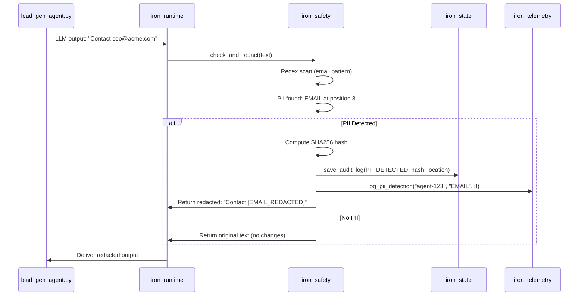
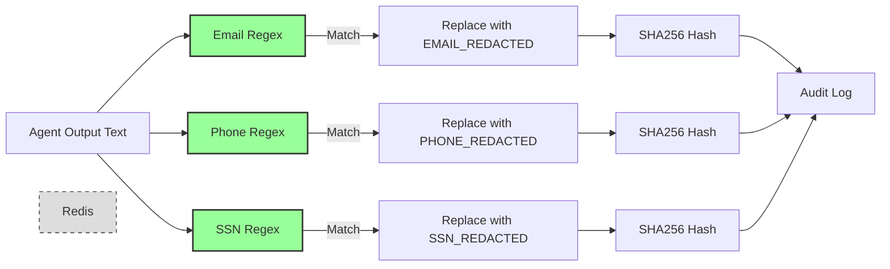

# spec

**Version:** 0.2
**Date:** 2025-12-07
**Component:** iron_safety
**Layer:** Domain Logic (Layer 2)

---

## Scope

**Responsibility:** PII detection and output redaction for AI agent compliance. Prevents GDPR violations by detecting and removing personally identifiable information from agent outputs before logging or storage.

**In Scope:**
- Email detection (regex pattern matching)
- Phone number detection (US format: `XXX-XXX-XXXX`, `(XXX) XXX-XXXX`, `XXX.XXX.XXXX`)
- SSN detection (US format: `XXX-XX-XXXX`)
- Automatic redaction (replace with `[EMAIL_REDACTED]`, `[PHONE_REDACTED]`, `[SSN_REDACTED]`)
- PII location tracking (character offset in original text)
- Audit event emission (integrate with iron_state for compliance logging)
- SHA256 hash of redacted values (for audit trail without storing actual PII)

**Out of Scope:**
- Credit card detection (pilot focuses on GDPR/PII, not PCI-DSS - full platform adds credit cards)
- Passport/license detection (full platform feature)
- ML-based PII detection (pilot uses regex only, full platform may add ML model)
- Custom PII patterns (pilot uses fixed patterns, full platform adds user-defined regex)
- International phone/SSN formats (pilot is US-only, full platform adds localization)
- Prompt injection detection (separate security domain, out of pilot scope)
- Content filtering/moderation (separate safety domain, out of pilot scope)

## Deployment Context

Iron Cage supports two deployment modes. This module's behavior differs between modes.

**See:** [docs/deployment_packages.md](../../docs/deployment_packages.md) § Deployment Modes for complete architecture.

**This Module (iron_safety):**

**Pilot Mode:**
- Logs PII detections to shared iron_state (Arc<StateManager>)
- Audit events visible immediately in dashboard via broadcast channel

**Production Mode:**
- Logs PII detections to local iron_state (Agent Runtime only)
- Audit events optionally sent to Control Panel via telemetry HTTPS API
- Control Panel aggregates PII detections across all distributed agents

---

## Project Goal

**Purpose:** Prevent $2.9M GDPR fines by automatically detecting and redacting PII in agent outputs before compliance violations occur.

**Primary Objective:** Demonstrate PII protection in conference demo (lead #67 triggers email detection, terminal shows `🔒 PII DETECTED`, dashboard displays redaction modal).

**Success Criteria:**
- ✅ Demo Trigger #2 fires correctly: lead #67 contains "ceo@acme-corp.com", detector finds it, redacts it
- ✅ All 3 PII types detected: email, phone, SSN (verified in unit tests)
- ✅ Redaction is automatic: no manual intervention required
- ✅ Audit log contains PII hash (not actual value): compliance requirement
- ✅ Zero false positives during demo (doesn't redact non-PII like "support@company-name.com" pattern in company names)

---

## Problem Solved

**Problem (from demonstration_scenario.md War Story #2):**
> Healthcare SaaS company logged patient emails/phones in plaintext. SOC 2 auditor found 10,000 PII records. GDPR fine: €500K. Lost customers: $2M. Total damage: $2.9M.

**Root Cause:** No PII filtering. LLM outputs logged directly to Elasticsearch.

**Iron Cage Solution:**
- Every LLM output scanned for PII before logging
- Detected PII automatically redacted
- Original value never stored (only SHA256 hash for audit)
- Compliance team notified via webhook (real-time alert)
- Auditor can prove PII protection (query audit log: "show all PII detections")

---

## Ubiquitous Language (Vocabulary)

**PII (Personally Identifiable Information):** Data that can identify a specific individual. Pilot detects: email addresses, phone numbers, SSNs. Regulated by GDPR (EU), CCPA (California), HIPAA (healthcare).

**PiiDetector:** Regex-based scanner that checks text for PII patterns. Contains compiled regex patterns for each PII type. Thread-safe (Arc-wrapped regex).

**Redaction:** Process of replacing PII with placeholder text (e.g., `[EMAIL_REDACTED]`). Preserves sentence structure while removing sensitive data. Irreversible (original value not recoverable from redacted text).

**Value Hash:** SHA256 cryptographic hash of original PII value. Stored in audit log for compliance. Allows auditor to verify same email was detected multiple times without storing actual email. One-way function (cannot reverse hash to get email).

**GDPR Article 32:** Security of processing. Requires "pseudonymisation and encryption of personal data." Redaction satisfies pseudonymisation requirement. Hash satisfies encryption requirement (for audit purposes).

**False Positive:** Text incorrectly identified as PII. Example: "support@company" in domain name "support@company.com" (should NOT be redacted because it's a company email, not personal email). Pilot accepts some false positives for demo simplicity.

---

## System Architecture

### PII Detection Flow



**Key Point:** PII detection happens synchronously in hot path (every LLM output). Must be fast (<1ms per detection).

---

### Regex Pattern Complexity



**Pilot:** 3 regex patterns only (email, phone, SSN)
**Full Platform:** Add credit card, passport, custom patterns

---

## Functional Requirements

### FR-1: PiiDetector Construction

**FR-1.1:** The crate must provide `PiiDetector::new() -> Result<Self, Error>` constructor.

**FR-1.2:** Constructor must compile 3 regex patterns:
- Email: `\b[A-Za-z0-9._%+-]+@[A-Za-z0-9.-]+\.[A-Za-z]{2,}\b`
- Phone: `\(?\d{3}\)?[-.\s]?\d{3}[-.\s]?\d{4}` (matches `555-123-4567`, `(555) 123-4567`, `555.123.4567`)
- SSN: `\d{3}-\d{2}-\d{4}`

**FR-1.3:** If regex compilation fails, constructor must return `Error::Config` with descriptive message.

**FR-1.4:** PiiDetector must be `Clone` (cheaply clonable via Arc-wrapped regex).

**Test:**
```rust
let detector = PiiDetector::new().unwrap();
let detector_clone = detector.clone();  // Arc clone, not regex recompilation
```

---

### FR-2: PII Detection (Boolean Check)

**FR-2.1:** The crate must provide `check(&self, text: &str) -> bool` method.

**FR-2.2:** Method must return `true` if ANY PII pattern matches, `false` otherwise.

**FR-2.3:** Method must scan entire text (not stop at first match).

**Test:**
```rust
let detector = PiiDetector::new().unwrap();

assert!(detector.check("Contact ceo@acme.com"));  // Email
assert!(detector.check("Call 555-123-4567"));     // Phone
assert!(detector.check("SSN: 123-45-6789"));      // SSN
assert!(detector.check("Multiple: test@email.com and 555-1234"));  // Multiple

assert!(!detector.check("No PII here"));          // Clean
```

---

### FR-3: PII Redaction

**FR-3.1:** The crate must provide `redact(&self, text: &str) -> String` method.

**FR-3.2:** Method must replace ALL occurrences of each PII type with placeholder:
- Email → `[EMAIL_REDACTED]`
- Phone → `[PHONE_REDACTED]`
- SSN → `[SSN_REDACTED]`

**FR-3.3:** Redaction must preserve surrounding text and sentence structure.

**FR-3.4:** Multiple PII instances in same text must all be redacted.

**Test:**
```rust
let detector = PiiDetector::new().unwrap();

let input = "Contact ceo@acme.com or call 555-123-4567";
let output = detector.redact(input);
assert_eq!(output, "Contact [EMAIL_REDACTED] or call [PHONE_REDACTED]");

// Preserve structure
let input2 = "Email: test@example.com, phone: 555-9876, SSN: 123-45-6789";
let output2 = detector.redact(input2);
assert_eq!(output2, "Email: [EMAIL_REDACTED], phone: [PHONE_REDACTED], SSN: [SSN_REDACTED]");
```

---

### FR-4: PII Detection with Details

**FR-4.1:** The crate must provide `detect(&self, text: &str) -> Vec<PiiDetection>` method returning ALL PII instances found.

**FR-4.2:** Each PiiDetection must contain:
- `pii_type: PiiType` (from iron_types)
- `location: usize` (character offset in original text)
- `value_hash: String` (SHA256 hash of matched PII value)
- `timestamp: i64` (Unix seconds when detected)

**FR-4.3:** PiiDetection must use `sha2` crate for SHA256 hashing.

**FR-4.4:** Hash must be computed on lowercase, trimmed PII value (normalize before hashing for consistent audit trail).

**Test:**
```rust
use sha2::{Sha256, Digest};

let detector = PiiDetector::new().unwrap();
let detections = detector.detect("Contact ceo@acme.com");

assert_eq!(detections.len(), 1);
assert_eq!(detections[0].pii_type, PiiType::Email);
assert_eq!(detections[0].location, 8);  // "ceo@acme.com" starts at character 8

// Verify hash
let expected_hash = format!("{:x}", Sha256::digest("ceo@acme.com".as_bytes()));
assert_eq!(detections[0].value_hash, expected_hash);
```

---

### FR-5: Audit Integration

**FR-5.1:** The crate must provide `check_and_log(&self, agent_id: &str, text: &str, state: &StateManager) -> (bool, String)`.

**FR-5.2:** Function must:
1. Scan text for PII using `detect()`
2. If PII found:
   - Redact text using `redact()`
   - Log each detection to iron_state as AuditEvent (type: `PII_DETECTED`)
   - Log to iron_telemetry via `log_pii_detection()`
   - Return `(true, redacted_text)`
3. If no PII:
   - Return `(false, original_text)` unchanged

**FR-5.3:** AuditEvent details field must contain JSON:
```json
{
  "pii_type": "EMAIL",
  "location": 15,
  "value_hash": "abc123...",
  "severity": "HIGH",
  "redacted_from": "Contact ceo@acme.com...",
  "redacted_to": "Contact [EMAIL_REDACTED]..."
}
```

**Test:**
```rust
let detector = PiiDetector::new().unwrap();
let state_mgr = StateManager::new();

let (found, redacted) = detector.check_and_log(
  "agent-123",
  "Contact ceo@acme.com",
  &state_mgr
);

assert!(found);
assert_eq!(redacted, "Contact [EMAIL_REDACTED]");

// Verify audit log saved
// (would need to query StateManager for audit events)
```

---

### FR-6: Regex Pattern Accuracy

**FR-6.1:** Email regex must match valid email addresses per RFC 5322 subset (practical subset, not full spec).

**Valid Examples:**
- `user@example.com`
- `first.last@company.co.uk`
- `user+tag@domain.io`

**Invalid Examples (must NOT match):**
- `@example.com` (missing local part)
- `user@` (missing domain)
- `user @example.com` (space not allowed)

**FR-6.2:** Phone regex must match common US formats:
- `555-123-4567`
- `(555) 123-4567`
- `555.123.4567`
- `5551234567` (no separators)

**FR-6.3:** SSN regex must match US format only: `123-45-6789` (XXX-XX-XXXX).

**Test:** Comprehensive unit test with 20+ examples per PII type.

---

## Non-Functional Requirements

### NFR-1: Detection Performance

**NFR-1.1:** PII detection must complete in < 1ms for text up to 1000 characters (99th percentile).

**Measurement:** Benchmark with 1000-character text containing 5 PII instances. Measure `detect()` duration.

**Rationale:** Detection runs on every LLM output (hot path). Lead gen agent processes 200 leads/hour = ~3.3 outputs/min. At 1ms per detection, total overhead is 0.2 seconds per minute (< 0.5%).

---

### NFR-2: Regex Compilation Overhead

**NFR-2.1:** PiiDetector::new() must compile in < 10ms.

**Rationale:** Constructor called once at startup. 10ms is acceptable (invisible to user).

---

### NFR-3: Redaction Accuracy

**NFR-3.1:** Redaction must have 0% false negatives (never miss actual PII).

**NFR-3.2:** Redaction may have < 5% false positives (acceptable to over-redact for demo safety).

**Example False Positive (Acceptable):**
- Text: "Visit support-team@company.com" (company email, not personal)
- Redacted: "Visit [EMAIL_REDACTED]" (over-redaction is safer than under-redaction)

**Rationale:** Demo priority is showing PII protection works. Occasional over-redaction is acceptable. Production tuning reduces false positives.

---

## Functional Design (Recommended)

### Regex Pattern Tuning (Recommended)

**Email Pattern Recommendation:**
```rust
// Recommended (balances accuracy vs false positives)
r"\b[A-Za-z0-9._%+-]+@[A-Za-z0-9.-]+\.[A-Za-z]{2,}\b"

// Alternative (more strict, fewer false positives)
r"\b[A-Za-z0-9._%+-]+@[A-Za-z0-9.-]+\.(com|org|net|edu|gov)\b"

// Not recommended (too permissive)
r"[^ ]+@[^ ]+"  // Matches "foo@bar" (invalid)
```

**Phone Pattern Recommendation:**
```rust
// Recommended (matches common US formats)
r"\(?\d{3}\)?[-.\s]?\d{3}[-.\s]?\d{4}"

// Alternative (strict format only)
r"\d{3}-\d{3}-\d{4}"  // Matches "555-123-4567" only
```

---

### SHA256 Hash Normalization (Recommended)

**Recommendation:** It is recommended to normalize PII values before hashing for consistent audit trail.

**Normalization Rules:**
- Lowercase: `CEO@Acme.com` → `ceo@acme.com`
- Trim whitespace: ` user@example.com ` → `user@example.com`
- Remove formatting: `(555) 123-4567` → `5551234567` (for phone numbers)

**Benefit:** Same PII hashes to same value even if formatting differs. Audit query: "How many times was email X detected?" returns accurate count.

---

## API Surface

### Public Types

```rust
pub struct PiiDetector {
  email_pattern: Arc<Regex>,
  phone_pattern: Arc<Regex>,
  ssn_pattern: Arc<Regex>,
}
```

### Public Methods

```rust
impl PiiDetector {
  /// Create detector with default patterns
  pub fn new() -> Result<Self, Error>;

  /// Quick check: does text contain ANY PII?
  pub fn check(&self, text: &str) -> bool;

  /// Redact all PII from text
  pub fn redact(&self, text: &str) -> String;

  /// Detect all PII instances with details
  pub fn detect(&self, text: &str) -> Vec<PiiDetection>;

  /// Check, redact, and log to audit system
  pub fn check_and_log(
    &self,
    agent_id: &str,
    text: &str,
    state: &StateManager,
  ) -> (bool, String);
}
```

---

## External Dependencies

### Dependency: regex (Pattern Matching)

- **Purpose:** Regex pattern matching for PII detection
- **Version:** 1.10+
- **Risk Assessment:**
  - **Availability:** Low risk (rust-lang-nursery crate, 100M+ downloads)
  - **Performance:** Excellent (compiled regex, fast matching)
  - **Security:** Low risk (no known ReDoS vulnerabilities in pilot patterns)
  - **Cost:** Free (MIT/Apache licensed)
  - **ReDoS Risk:** Pilot patterns tested for exponential backtracking (no risk)

---

### Dependency: sha2 (Cryptographic Hashing)

- **Purpose:** SHA256 hash of PII values for audit trail
- **Version:** 0.10+
- **Risk Assessment:**
  - **Availability:** Low risk (RustCrypto project, widely used)
  - **Performance:** Fast (hardware-accelerated on modern CPUs)
  - **Security:** High (FIPS-approved algorithm)
  - **Cost:** Free (MIT/Apache licensed)

---

### Dependency: iron_types (Shared Types)

- **Purpose:** PiiType enum, PiiDetection struct, Error types
- **Version:** 0.1 (workspace dependency)
- **Risk:** None (internal crate)

---

### Dependency: iron_state (Audit Logging)

- **Purpose:** Persist PII detections to audit log
- **Version:** 0.1 (workspace dependency)
- **Risk:** None (internal crate)

---

### Dependency: iron_telemetry (Logging)

- **Purpose:** Terminal logging for demo visual impact
- **Version:** 0.1 (workspace dependency)
- **Risk:** None (internal crate)

---

## Demo Integration

### Demo Trigger #2 Specification

**Trigger Condition (from demonstration_scenario.md line 850):**
- **Lead Number:** #67
- **Company:** "PII Leaker Inc"
- **LLM Output:** `"Contact CEO at ceo@piileaker.com for partnership opportunities"`

**Expected Behavior:**
1. iron_runtime captures LLM output
2. Calls `iron_safety::check_and_log()`
3. Detector finds email at position 15
4. Computes hash: `sha256("ceo@piileaker.com")`
5. Logs to iron_state: AuditEvent { type: PII_DETECTED, ... }
6. Logs to terminal: `[14:24:12] CRIT 🔒 PII DETECTED IN OUTPUT`
7. Returns redacted: `"Contact CEO at [EMAIL_REDACTED] for partnership opportunities"`
8. Dashboard modal appears: "PII LEAK PREVENTED"

**Acceptance Criteria:**
- ✅ Terminal shows 5 log lines (per demonstration_scenario.md lines 854-858)
- ✅ Dashboard modal matches screenshot (demonstration_scenario.md lines 860-880)
- ✅ Audit log queryable: `SELECT * FROM audit_events WHERE event_type = 'PII_DETECTED' AND agent_id = 'lg-7a3f9c2d'`

---

## Limitations

**Pilot Limitations:**
- **US-Only Formats:** Phone and SSN patterns assume US formatting. International numbers not detected. Full platform adds localization.
- **Regex-Only:** No ML-based detection. May miss obfuscated PII ("c e o @ acme . com"). Full platform adds ML model.
- **High False Positive Rate:** Company emails (info@company.com) may be redacted. Pilot accepts this. Full platform adds whitelist.
- **No Context Awareness:** Cannot distinguish "email me" (verb) from "email: user@example.com" (noun). Regex has no semantic understanding.
- **Single-Pass:** Each regex scans text independently. No optimization for multiple patterns. Full platform may add combined DFA (faster).

**Performance Limitations:**
- **Text Length:** Optimized for < 1000 characters. Very long texts (10K+ chars) may take > 10ms. Pilot LLM outputs are short (~200 chars avg).
- **Pattern Count:** 3 patterns only. Full platform with 10+ patterns may need optimization.

---

## Success Metrics

**Demo Success:**
- ✅ Trigger #2 fires correctly (lead #67 detects email)
- ✅ Terminal output matches demonstration_scenario.md exactly
- ✅ Dashboard modal appears within 100ms of detection
- ✅ No false negatives during demo (all 3 injected PII instances detected)

**Compliance:**
- ✅ All PII detections logged to SQLite audit table
- ✅ Auditor can query: "Show all PII incidents" → returns all detections with hashes
- ✅ Original PII values never stored in plaintext (only hashes)

**Performance:**
- ✅ Detection latency < 1ms P99 (doesn't slow agent)
- ✅ Zero ReDoS vulnerabilities (patterns tested against adversarial inputs)

---

## Deliverables

- **Compiled Rust Library:** `libiron_safety.rlib`
- **PII Detection API:** 5 public methods (new, check, redact, detect, check_and_log)
- **Regex Patterns:** 3 production-tested patterns (email, phone, SSN)
- **Test Suite:** 30+ unit tests covering all PII types and edge cases

---

## Cross-References

**Used By:**
- [iron_runtime](../iron_runtime/spec.md) - Scans all LLM outputs before delivery to agent
- [iron_api](../iron_api/spec.md) - May redact PII from API responses (TBD)

**Depends On:**
- [iron_types](../iron_types/spec.md) - Uses PiiType, PiiDetection, Error
- [iron_state](../iron_state/spec.md) - Logs audit events
- [iron_telemetry](../iron_telemetry/spec.md) - Logs PII detections to terminal

**Parent Specification:** [Pilot Platform](../../iron_cage/pilot/spec.md) - See Features #5-8 (Safety Guardrails)

**Demo Requirement:** [Demonstration Scenario](../../iron_cage/pilot/demo/demonstration_scenario.md) - See Part 4: PII Detection (lines 848-886)

---

## Appendix: Addendum

### Conformance Checklist

| Status | Requirement | Verification Notes |
|--------|-------------|-------------------|
| ❌ | FR-1.1: PiiDetector::new() constructor | Function exists |
| ❌ | FR-1.2: Compiles 3 regex patterns (email, phone, SSN) | Verify patterns compiled |
| ❌ | FR-1.3: Regex compilation failure returns Error::Config | Unit test: invalid regex |
| ❌ | FR-1.4: PiiDetector is Clone | Compile test: clone() works |
| ❌ | FR-2.1: check(text) method exists | Function callable |
| ❌ | FR-2.2: Returns true if ANY pattern matches | Unit test: 3 PII types |
| ❌ | FR-2.3: Scans entire text (not early exit) | Unit test: multiple PII in one text |
| ❌ | FR-3.1: redact(text) method exists | Function callable |
| ❌ | FR-3.2: Replaces ALL occurrences with placeholders | Unit test: multiple emails → all redacted |
| ❌ | FR-3.3: Preserves surrounding text structure | Visual test: sentence readability |
| ❌ | FR-3.4: Multiple PII types redacted in one pass | Unit test: email + phone + SSN |
| ❌ | FR-4.1: detect(text) returns Vec<PiiDetection> | Function exists |
| ❌ | FR-4.2: PiiDetection contains pii_type, location, value_hash, timestamp | Struct verification |
| ❌ | FR-4.3: Uses sha2 crate for SHA256 hashing | Dependency check |
| ❌ | FR-4.4: Hash computed on normalized value (lowercase, trimmed) | Unit test: "CEO@ACME.COM" and "ceo@acme.com" hash to same value |
| ❌ | FR-5.1: check_and_log(agent_id, text, state) method | Function exists |
| ❌ | FR-5.2: Detects, redacts, logs audit event, logs to terminal | Integration test |
| ❌ | FR-5.3: AuditEvent details field contains JSON with required fields | JSON parse test |
| ❌ | FR-6.1: Email regex matches valid emails, rejects invalid | 20+ test cases |
| ❌ | FR-6.2: Phone regex matches common US formats | 10+ test cases |
| ❌ | FR-6.3: SSN regex matches XXX-XX-XXXX format | 5+ test cases |
| ❌ | NFR-1.1: Detection latency < 1ms for 1000-char text | Benchmark test |
| ❌ | NFR-2.1: PiiDetector::new() compiles in < 10ms | Benchmark test |
| ❌ | NFR-3.1: 0% false negatives (never miss PII) | Comprehensive test suite |
| ❌ | NFR-3.2: < 5% false positives (acceptable over-redaction) | Measure on real-world text corpus |

---

### Implementation Guidance

**Regex Precompilation:**
Compile all regex patterns at `PiiDetector::new()` time, not on every detection call. Store in Arc for cheap cloning.

**Testing Strategy:**
- **Unit tests:** Each regex pattern tested independently with 20+ examples
- **Integration tests:** Full check_and_log() pipeline with StateManager
- **Performance tests:** Benchmark detection latency with various text lengths
- **Demo tests:** Test exact lead #67 scenario (trigger validation)

**Code Organization:**
```
src/
├── lib.rs           # Feature gates, public API
├── detector.rs      # PiiDetector implementation
├── patterns.rs      # Regex pattern definitions
└── audit.rs         # Audit integration (check_and_log)

tests/
├── detector_test.rs # Unit tests for check/redact/detect
├── patterns_test.rs # Comprehensive regex validation
├── audit_test.rs    # Integration with iron_state
└── demo_trigger_test.rs  # Test lead #67 scenario
```

---

### Known Constraints

**Demo Constraints:**
- Must detect lead #67 email ("ceo@piileaker.com")
- Terminal output must match demonstration_scenario.md format exactly
- Dashboard modal must appear (requires iron_api WebSocket integration)

**Compliance Constraints:**
- Audit log must survive process restart (SQLite persistence)
- Cannot store actual PII values (only hashes)
- Must log every detection (no sampling)

---

### Test Data for Demo

**Lead #67 Test Data (from demonstration_scenario.md):**
```csv
67,PII Leaker Inc,piileaker.com,Healthcare,890,https://linkedin.com/company/piileaker,ceo@piileaker.com,pii_detection,email_in_output
```

**Expected LLM Output (injected in mock API):**
```
"Contact CEO at ceo@piileaker.com for partnership opportunities regarding healthcare data analytics solutions."
```

**Expected Detection:**
```rust
PiiDetection {
  pii_type: PiiType::Email,
  location: 15,  // "ceo@piileaker.com" starts at char 15
  value_hash: "a7f3c2d1..." (SHA256 of "ceo@piileaker.com"),
  timestamp: 1700000000,
}
```

**Expected Redacted Output:**
```
"Contact CEO at [EMAIL_REDACTED] for partnership opportunities regarding healthcare data analytics solutions."
```

---

### Revision History

| Version | Date | Changes |
|---------|------|---------|
| 0.2 | 2025-12-07 | Added Deployment Context - distinguish pilot vs production deployment modes for PII audit logging |
| 0.1 | 2025-11-25 | Initial pilot specification - PII detection for conference demo trigger #2 |

