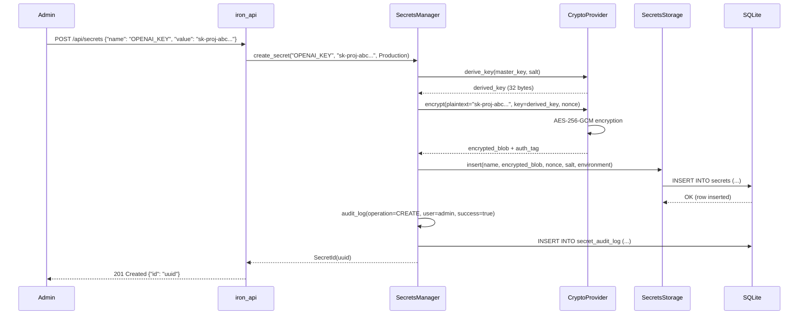
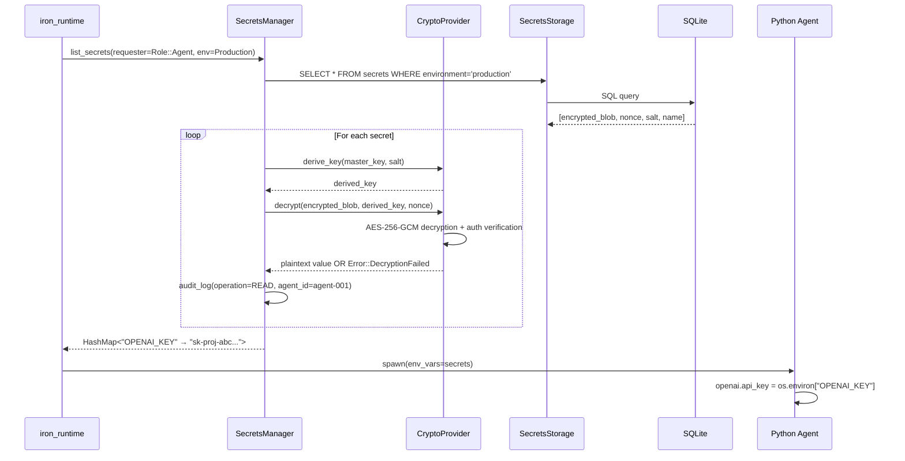

# spec

**Version:** 0.2
**Date:** 2025-12-07
**Component:** iron_secrets
**Layer:** Domain Logic (Layer 2)
**Status:** Specification Complete, Implementation Not Started
**Priority:** HIGH (Core Product Feature)

---

## Scope

**Responsibility:** Secure secrets management for AI agents. Provides encrypted storage, access control, audit logging, and runtime injection of sensitive credentials (API keys, database passwords, cookies).

**In Scope (Pilot):**
- AES-256-GCM encryption for secrets at rest
- Argon2id key derivation from master key
- SQLite storage for encrypted blobs and metadata
- CRUD operations (create, read, update, delete, list)
- Role-based access control (Admin, Viewer, Agent)
- Comprehensive audit logging for all operations
- Master key from environment variable
- Environment isolation (Development, Staging, Production)
- Secret masking for dashboard display (`sk-proj-abc...xyz`)
- Integration with iron_runtime for secret injection
- Integration with iron_api for REST endpoints
- Integration with iron_dashboard for secrets panel

**Out of Scope (Full Platform):**
- AWS KMS integration (pilot uses local master key)
- HashiCorp Vault integration (full platform feature)
- Secret versioning and history (pilot stores current value only)
- Secret expiration and auto-rotation (manual rotation only)
- Multi-tenancy (per-customer secret isolation)
- Secret templates and variable substitution
- Secret sharing between agents (pilot: all agents share secrets)
- External secret providers (GitHub Secrets, Azure Key Vault)

## Deployment Context

Iron Cage supports two deployment modes. This module's storage location differs between modes.

**See:** [docs/deployment_packages.md](../../docs/deployment_packages.md) § Deployment Modes for complete architecture.

**This Module (iron_secrets):**

**Pilot Mode:**
- Secrets stored in shared iron_state SQLite database
- Encryption/decryption happens within same Rust process
- Both iron_api (secret management UI) and iron_runtime (secret injection) access same database
- Master key from environment variable (single machine)

**Production Mode:**
- Secrets stored in iron_control_store (PostgreSQL, Control Panel only)
- Agent Runtime does NOT store secrets locally (fetches from Control Panel API as needed)
- Control Panel provides REST API for secret retrieval (HTTPS, authenticated)
- Master key managed by cloud infrastructure (AWS KMS, separate from agents)
- Agents cache decrypted secrets in memory only (never persist locally)

---

## Project Goal

**Purpose:** Enable secure, centralized management of sensitive credentials required by AI agents while maintaining SOC 2 compliance and preventing accidental leaks.

**Primary Objective:** Provide enterprise-grade secrets management that allows:
1. Admins to create/update/delete secrets via dashboard
2. Agents to access secrets at runtime without hardcoding
3. Auditors to track all secret access for compliance

**Success Criteria:**
- ✅ Secrets encrypted with AES-256-GCM (NIST approved)
- ✅ Master key never stored with encrypted data
- ✅ All secret operations logged to audit trail
- ✅ Secrets injectable into Python agents as environment variables
- ✅ Dashboard displays masked values only
- ✅ Zero secrets leaked in logs or terminal output
- ✅ Demo Trigger #4: Live secret rotation without agent restart

---

## Problem Solved

**Without iron_secrets:**
- ❌ API keys hardcoded in Python scripts (visible in git)
- ❌ Secrets in `.env` files (accidentally committed)
- ❌ Secrets passed as CLI arguments (visible in `ps aux`)
- ❌ No audit trail (can't prove who accessed what)
- ❌ No rotation support (must restart agents)
- ❌ Secrets logged in plaintext (compliance violation)

**With iron_secrets:**
- ✅ Centralized encrypted storage (SQLite with AES-256-GCM)
- ✅ Automatic injection into agents (via iron_runtime)
- ✅ Role-based access control (admin/viewer/agent)
- ✅ Complete audit trail (SOC 2 compliant)
- ✅ Live rotation support (SIGUSR1 signal to agents)
- ✅ Automatic redaction (secrets treated like PII)

---

## Ubiquitous Language (Vocabulary)

**Secret:** Sensitive credential required by agent at runtime. Examples: OpenAI API key (`sk-proj-...`), database password, LinkedIn session cookie. Always encrypted at rest.

**Master Key:** 32-byte encryption key used to derive per-secret keys. Stored in environment variable `IRON_CAGE_MASTER_KEY`. NEVER stored in database or git. Loss of master key = loss of all secrets (irreversible).

**Encrypted Blob:** Ciphertext output of AES-256-GCM encryption. Stored in SQLite `secrets.encrypted_blob` column. Cannot be decrypted without master key.

**Nonce:** 12-byte random value used once for AES-GCM. Unique per encryption operation. Prevents replay attacks. Stored alongside encrypted blob in database.

**Salt:** 16-byte random value for Argon2id key derivation. Unique per secret. Prevents rainbow table attacks if master key compromised. Stored in database.

**Role:** Authorization level for secret operations. Three roles: Admin (full CRUD), Viewer (read masked values only), Agent (read full values via runtime only).

**Masked Value:** Secret value with middle characters replaced by ellipsis. Example: `sk-proj-abc...xyz` (shows first 10 + last 3 chars). Used in dashboard for visibility without exposure.

**Audit Entry:** Immutable log record of secret operation. Contains: timestamp, secret_name, operation (CREATE/READ/UPDATE/DELETE), requester_role, success/failure, error_message. Queryable for compliance audits.

**Environment:** Secret namespace for lifecycle stage. Three environments: Development (dev testing), Staging (pre-production), Production (live agents). Secrets isolated by environment (dev agents can't access prod secrets).

**Secret Rotation:** Updating secret value without agent restart. New value encrypted, old value replaced atomically. Agent receives SIGUSR1 signal, fetches new value, continues execution.

---

## System Architecture

### Component Interaction

```mermaid
graph TB
    subgraph "Dashboard (UI)"
        UI[Secrets Panel<br/>Add/Edit/Delete/View]
    end

    subgraph "API Layer"
        API[iron_api<br/>REST Endpoints]
    end

    subgraph "Secrets Management (Layer 2)"
        SM[SecretsManager<br/>Core Logic]
        CRYPTO[CryptoProvider<br/>AES-256-GCM]
        STORAGE[SecretsStorage<br/>SQLite CRUD]
        AC[AccessControl<br/>RBAC]
        AUDIT[AuditLogger<br/>Compliance]
    end

    subgraph "Runtime (Layer 3)"
        RT[iron_runtime<br/>Secret Injection]
        AGENT[Python Agent<br/>os.environ access]
    end

    subgraph "Database (Layer 1)"
        DB[(SQLite<br/>secrets table<br/>audit_log table)]
    end

    UI -->|POST /api/secrets| API
    API --> SM
    SM --> CRYPTO
    SM --> STORAGE
    SM --> AC
    SM --> AUDIT
    STORAGE --> DB
    AUDIT --> DB

    RT -->|Fetch Secrets| SM
    RT -->|Inject Env Vars| AGENT
    AGENT -->|os.environ["KEY"]| RT

    CRYPTO:::crypto
    DB:::storage

    classDef crypto fill:#9f9,stroke:#333,stroke-width:4px
    classDef storage fill:#99f,stroke:#333,stroke-width:2px
```

### Encryption Flow



### Decryption and Injection Flow



---

## Functional Requirements

### FR-1: Master Key Management

**FR-1.1:** The crate must accept master key from environment variable `IRON_CAGE_MASTER_KEY`.

**FR-1.2:** Master key must be 32 bytes (256 bits), encoded as base64 string.

**FR-1.3:** If environment variable missing, return `Error::MasterKeyNotFound` with clear error message.

**FR-1.4:** Master key must NEVER be stored in database, logs, or any persistent storage.

**Test:**
```rust
std::env::set_var("IRON_CAGE_MASTER_KEY", "base64_encoded_32_bytes");
let manager = SecretsManager::new(":memory:").await?;
assert!(manager.is_initialized());
```

**Security Note:** Master key loss = irreversible secret loss. Pilot accepts this risk. Full platform will use AWS KMS.

---

### FR-2: AES-256-GCM Encryption

**FR-2.1:** The crate must use AES-256-GCM for secret encryption.

**FR-2.2:** Each encryption operation must generate unique 12-byte nonce (cryptographically random via `rand::thread_rng()`).

**FR-2.3:** Each secret must use unique 16-byte salt for key derivation.

**FR-2.4:** Encryption must include authenticated encryption (GCM mode provides authentication tag).

**FR-2.5:** Decryption failures (wrong key, tampered ciphertext) must return `Error::DecryptionFailed`.

**Implementation:**
```rust
use aes_gcm::{Aes256Gcm, KeyInit, Nonce};
use aes_gcm::aead::{Aead, OsRng};

pub fn encrypt(&self, plaintext: &[u8], key: &[u8; 32]) -> Result<(Vec<u8>, Vec<u8>)> {
  let cipher = Aes256Gcm::new(key.into());
  let nonce = Aes256Gcm::generate_nonce(&mut OsRng);

  let ciphertext = cipher.encrypt(&nonce, plaintext)
    .map_err(|_| Error::EncryptionFailed)?;

  Ok((ciphertext, nonce.to_vec()))
}
```

**Test:**
```rust
let key = [0u8; 32];  // Test key
let plaintext = b"sk-proj-test-key";

let (ciphertext, nonce) = crypto.encrypt(plaintext, &key)?;
assert_ne!(ciphertext, plaintext);  // Encrypted
assert_eq!(nonce.len(), 12);  // Nonce size

let decrypted = crypto.decrypt(&ciphertext, &key, &nonce)?;
assert_eq!(decrypted, plaintext);  // Round-trip success
```

---

### FR-3: Argon2id Key Derivation

**FR-3.1:** The crate must use Argon2id for deriving per-secret keys from master key.

**FR-3.2:** Key derivation must use per-secret salt (16 bytes random).

**FR-3.3:** Argon2id parameters (pilot): `m=19456 KiB, t=2 iterations, p=1 parallelism` (OWASP recommended minimum).

**FR-3.4:** Derived key must be 32 bytes (256 bits) for AES-256.

**Implementation:**
```rust
use argon2::{Argon2, PasswordHasher};
use argon2::password_hash::{SaltString, rand_core::OsRng};

pub fn derive_key(&self, master_key: &[u8], salt: &[u8; 16]) -> Result<[u8; 32]> {
  let argon2 = Argon2::default();
  let salt_string = SaltString::b64_encode(salt)?;

  let hash = argon2.hash_password(master_key, &salt_string)
    .map_err(|_| Error::KeyDerivationFailed)?;

  // Extract 32 bytes from hash
  let derived_key = hash.hash.unwrap().as_bytes()[..32].try_into()?;
  Ok(derived_key)
}
```

**Test:**
```rust
let master_key = b"test_master_key_32_bytes_long!!";
let salt1 = [1u8; 16];
let salt2 = [2u8; 16];

let key1 = derive_key(master_key, &salt1)?;
let key2 = derive_key(master_key, &salt2)?;

assert_ne!(key1, key2);  // Different salts → different keys
assert_eq!(key1.len(), 32);  // 256-bit key
```

---

### FR-4: SQLite Secret Storage

**FR-4.1:** The crate must store encrypted secrets in SQLite table `secrets`.

**FR-4.2:** Table schema:
```sql
CREATE TABLE secrets (
  id TEXT PRIMARY KEY,
  name TEXT NOT NULL UNIQUE,
  encrypted_blob BLOB NOT NULL,
  nonce BLOB NOT NULL,
  salt BLOB NOT NULL,
  environment TEXT NOT NULL CHECK(environment IN ('development', 'staging', 'production')),
  created_at INTEGER NOT NULL DEFAULT (strftime('%s', 'now')),
  updated_at INTEGER NOT NULL DEFAULT (strftime('%s', 'now'))
);
```

**FR-4.3:** Unique constraint on `name` (cannot create duplicate secret names).

**FR-4.4:** Indexes on `name` and `environment` for fast lookups.

**Test:**
```rust
let storage = SecretsStorage::new(":memory:").await?;

let id = storage.insert("OPENAI_KEY", &encrypted_blob, &nonce, &salt, Environment::Production).await?;
assert!(!id.is_empty());

// Duplicate insert fails
let result = storage.insert("OPENAI_KEY", &encrypted_blob2, &nonce2, &salt2, Environment::Production).await;
assert!(result.is_err());  // Unique constraint violation
```

---

### FR-5: CRUD Operations

**FR-5.1:** The crate must provide `create_secret(name: &str, value: &str, environment: Environment) -> Result<SecretId>`.

**FR-5.2:** The crate must provide `get_secret(name: &str, requester: Role) -> Result<String>`.

**FR-5.3:** The crate must provide `update_secret(name: &str, new_value: &str) -> Result<()>`.

**FR-5.4:** The crate must provide `delete_secret(name: &str) -> Result<()>`.

**FR-5.5:** The crate must provide `list_secrets(requester: Role) -> Result<Vec<SecretMetadata>>`.

**Behavior:**
- `create_secret`: Encrypts value, stores in database, logs audit entry
- `get_secret`: Checks access control, decrypts value, logs audit entry
- `update_secret`: Encrypts new value, atomic SQL UPDATE, logs audit entry
- `delete_secret`: Deletes row, logs audit entry (WARNING: irreversible)
- `list_secrets`: Returns all secrets for requester's environment, values masked if requester=Viewer

**Test:**
```rust
let manager = SecretsManager::new(":memory:").await?;

// Create
let id = manager.create_secret("OPENAI_KEY", "sk-proj-abc123", Environment::Production).await?;

// Read
let value = manager.get_secret("OPENAI_KEY", Role::Admin).await?;
assert_eq!(value, "sk-proj-abc123");

// Update
manager.update_secret("OPENAI_KEY", "sk-proj-xyz789").await?;
let updated = manager.get_secret("OPENAI_KEY", Role::Admin).await?;
assert_eq!(updated, "sk-proj-xyz789");

// Delete
manager.delete_secret("OPENAI_KEY").await?;
let result = manager.get_secret("OPENAI_KEY", Role::Admin).await;
assert!(result.is_err());  // Secret not found
```

---

### FR-6: Role-Based Access Control

**FR-6.1:** The crate must enforce role-based access control for all operations.

**FR-6.2:** Three roles must be supported:
- `Admin`: Full CRUD (create, read full values, update, delete)
- `Viewer`: Read-only (list secrets with masked values)
- `Agent`: Read-only (full values, via iron_runtime only)

**FR-6.3:** Access control rules:
| Operation | Admin | Viewer | Agent |
|-----------|:-----:|:------:|:-----:|
| create_secret | ✅ | ❌ | ❌ |
| get_secret (full) | ✅ | ❌ | ✅ |
| get_secret (masked) | ✅ | ✅ | ❌ |
| update_secret | ✅ | ❌ | ❌ |
| delete_secret | ✅ | ❌ | ❌ |
| list_secrets (full) | ✅ | ❌ | ✅ |
| list_secrets (masked) | ✅ | ✅ | ❌ |

**FR-6.4:** Unauthorized operations must return `Error::AccessDenied` with descriptive message.

**Test:**
```rust
let manager = SecretsManager::new(":memory:").await?;
manager.create_secret("KEY", "value", Environment::Production).await?;

// Admin: full access
let value = manager.get_secret("KEY", Role::Admin).await?;
assert_eq!(value, "value");

// Viewer: masked only
let value = manager.get_secret("KEY", Role::Viewer).await?;
assert_eq!(value, "va...ue");  // Masked

// Agent via runtime: full access
let value = manager.get_secret("KEY", Role::Agent).await?;
assert_eq!(value, "value");

// Viewer cannot update
let result = manager.update_secret("KEY", "new_value").await;  // Assumes viewer context
assert!(result.is_err());  // Access denied
```

---

### FR-7: Secret Masking

**FR-7.1:** The crate must provide `mask_secret(value: &str) -> String` function.

**FR-7.2:** Masking rules:
- If len ≤ 10: Mask all (`***`)
- If 10 < len ≤ 20: Show first 3 + last 3 chars, mask middle (`abc...xyz`)
- If len > 20: Show first 10 + last 3 chars, mask middle (`sk-proj-ab...xyz`)

**FR-7.3:** Masked values must be used in:
- Dashboard Secrets panel (Viewer role)
- Audit log (never log full secret values)
- API responses for Viewer role

**Implementation:**
```rust
pub fn mask_secret(value: &str) -> String {
  let len = value.len();

  match len {
    0..=10 => "***".to_string(),
    11..=20 => format!("{}...{}", &value[..3], &value[len-3..]),
    _ => format!("{}...{}", &value[..10], &value[len-3..]),
  }
}
```

**Test:**
```rust
assert_eq!(mask_secret("short"), "***");
assert_eq!(mask_secret("medium_length"), "med...gth");
assert_eq!(mask_secret("sk-proj-abc123def456ghi789"), "sk-proj-ab...789");
```

---

### FR-8: Audit Logging

**FR-8.1:** The crate must log ALL secret operations to SQLite table `secret_audit_log`.

**FR-8.2:** Table schema:
```sql
CREATE TABLE secret_audit_log (
  id INTEGER PRIMARY KEY AUTOINCREMENT,
  secret_name TEXT NOT NULL,
  operation TEXT NOT NULL CHECK(operation IN ('CREATE', 'READ', 'UPDATE', 'DELETE')),
  requester_role TEXT NOT NULL CHECK(requester_role IN ('admin', 'viewer', 'agent')),
  agent_id TEXT,
  success BOOLEAN NOT NULL,
  error_message TEXT,
  timestamp INTEGER NOT NULL DEFAULT (strftime('%s', 'now'))
);
```

**FR-8.3:** Audit entries must be immutable (no UPDATE or DELETE operations on audit log).

**FR-8.4:** The crate must provide `audit_log() -> Result<Vec<AuditEntry>>` to query log.

**FR-8.5:** Audit log retention: 90 days (configurable, pilot uses default).

**Test:**
```rust
let manager = SecretsManager::new(":memory:").await?;

manager.create_secret("KEY", "value", Environment::Production).await?;
manager.get_secret("KEY", Role::Admin).await?;
manager.update_secret("KEY", "new_value").await?;

let log = manager.audit_log().await?;
assert_eq!(log.len(), 3);  // CREATE, READ, UPDATE

assert_eq!(log[0].operation, "CREATE");
assert_eq!(log[0].secret_name, "KEY");
assert_eq!(log[0].requester_role, "admin");
assert!(log[0].success);
```

---

### FR-9: Environment Isolation

**FR-9.1:** The crate must support three environments: Development, Staging, Production.

**FR-9.2:** Secrets must be tagged with environment at creation.

**FR-9.3:** `list_secrets(role, environment)` must filter by environment.

**FR-9.4:** Agents running in Production environment must NOT access Development or Staging secrets.

**Implementation:**
```rust
pub enum Environment {
  Development,
  Staging,
  Production,
}

impl SecretsManager {
  pub async fn list_secrets(&self, role: Role, env: Environment) -> Result<Vec<SecretMetadata>> {
    // SQL: SELECT * FROM secrets WHERE environment = ?
    self.storage.list(env).await
  }
}
```

**Test:**
```rust
let manager = SecretsManager::new(":memory:").await?;

manager.create_secret("DEV_KEY", "dev_value", Environment::Development).await?;
manager.create_secret("PROD_KEY", "prod_value", Environment::Production).await?;

let dev_secrets = manager.list_secrets(Role::Agent, Environment::Development).await?;
assert_eq!(dev_secrets.len(), 1);
assert_eq!(dev_secrets[0].name, "DEV_KEY");

let prod_secrets = manager.list_secrets(Role::Agent, Environment::Production).await?;
assert_eq!(prod_secrets.len(), 1);
assert_eq!(prod_secrets[0].name, "PROD_KEY");
```

---

## Non-Functional Requirements

### NFR-1: Encryption Performance

**NFR-1.1:** AES-256-GCM encryption must complete in <1ms per secret (P99).

**Measurement:** Benchmark with 1000 iterations, 1KB secret values.

**Rationale:** Agent startup fetches 10-50 secrets. <1ms/secret = <50ms total overhead.

**Acceptance:**
- P50: <0.5ms
- P99: <1ms
- P99.9: <5ms

**Implementation:** Use hardware AES-NI instructions (enabled by default in `aes-gcm` crate).

---

### NFR-2: Decryption Performance

**NFR-2.1:** AES-256-GCM decryption must complete in <1ms per secret (P99).

**Measurement:** Same as NFR-1 (encryption and decryption use same cipher).

**Rationale:** `list_secrets()` decrypts all secrets for agent. Must not delay startup.

---

### NFR-3: Key Derivation Performance

**NFR-3.1:** Argon2id key derivation must complete in <10ms per secret (P99).

**Measurement:** Benchmark with 100 iterations (key derivation is slower than encryption).

**Rationale:** Each secret requires unique key derivation. 10ms × 50 secrets = 500ms (acceptable for startup).

**Trade-off:** Slower derivation = stronger security. Argon2id with m=19456 KiB is OWASP minimum.

---

### NFR-4: CRUD Operation Latency

**NFR-4.1:** All CRUD operations must complete in <5ms (P99) excluding crypto overhead.

**Measurement:** Benchmark with SQLite in-memory database.

**Rationale:** Dashboard operations should feel instant. <5ms + <1ms crypto = <6ms total.

**Acceptance:**
- create_secret: <5ms
- get_secret: <5ms
- update_secret: <5ms
- delete_secret: <5ms
- list_secrets (100 secrets): <10ms

---

### NFR-5: Audit Log Write Performance

**NFR-5.1:** Audit log writes must not block secret operations.

**Implementation:** Use async SQLite writes via `tokio::spawn`.

**Rationale:** Audit logging is secondary to secret operations. Failures should not block.

---

### NFR-6: Memory Security

**NFR-6.1:** Decrypted secrets must be zeroed after use (pilot: best-effort).

**Implementation:** Use `zeroize` crate for sensitive data types.

**Pilot Limitation:** Rust strings are not automatically zeroed. Full platform will use `secrecy` crate.

**Rationale:** Defense-in-depth. Memory dumps should not expose plaintext secrets.

---

## Security Considerations

### Master Key Security

**Threat:** Master key compromised → all secrets decryptable.

**Mitigations:**
1. ✅ Master key from environment variable (not in code or database)
2. ✅ Environment variable not logged by iron_telemetry
3. ✅ Master key never written to disk (ephemeral)
4. ⚠️ Master key visible in process environment (acceptable for pilot)
5. ❌ No master key rotation (pilot limitation)

**Full Platform Mitigations:**
- Use AWS KMS or HashiCorp Vault (master key never in process memory)
- Master key rotation with re-encryption of all secrets
- Hardware Security Module (HSM) for regulated industries

---

### SQL Injection Prevention

**Threat:** Malicious secret names containing SQL syntax.

**Mitigations:**
1. ✅ Use sqlx prepared statements (auto-escaped)
2. ✅ Never concatenate SQL strings
3. ✅ Secret name validation (alphanumeric + underscore only)

**Example:**
```rust
// SAFE: Prepared statement
sqlx::query("SELECT * FROM secrets WHERE name = ?")
  .bind(name)
  .fetch_one(&pool).await?;

// UNSAFE: String concatenation (NOT used in pilot)
// let query = format!("SELECT * FROM secrets WHERE name = '{}'", name);
```

---

### Timing Attacks

**Threat:** Attacker measures decryption time to infer plaintext.

**Mitigations:**
1. ✅ AES-GCM is constant-time for valid ciphertexts
2. ⚠️ Argon2id is intentionally slow (not constant-time, but acceptable)
3. ❌ No constant-time comparison for secret values (pilot limitation)

**Full Platform:** Use `subtle::ConstantTimeEq` for secret comparisons.

---

### Ciphertext Tampering

**Threat:** Attacker modifies encrypted_blob in database.

**Mitigations:**
1. ✅ AES-GCM provides authenticated encryption (detects tampering)
2. ✅ Decryption fails if authentication tag invalid
3. ✅ Error logged to audit trail

**Result:** Tampered ciphertexts return `Error::DecryptionFailed`, operation logged as failed.

---

## Integration Points

### iron_runtime Integration

**Secret Injection:**
```rust
// In iron_runtime/src/lifecycle.rs
impl AgentRuntime {
  pub async fn start_agent(&self, script_path: &Path) -> Result<AgentHandle> {
    // Fetch secrets for Production environment
    let secrets = self.secrets_manager.list_secrets(Role::Agent, Environment::Production).await?;

    let mut cmd = Command::new("python3.11");
    cmd.arg(script_path);

    // Inject as environment variables
    for (name, value) in secrets {
      cmd.env(name, value);
    }

    let child = cmd.spawn()?;
    // ...
  }
}
```

---

### iron_api Integration

**REST Endpoints:**
```rust
// In iron_api/src/routes/secrets.rs
pub fn secrets_routes() -> Router {
  Router::new()
    .route("/api/secrets", get(list_secrets).post(create_secret))
    .route("/api/secrets/:name", get(get_secret).put(update_secret).delete(delete_secret))
    .route("/api/secrets/audit", get(audit_log))
}
```

---

### iron_dashboard Integration

**Secrets Panel Component:**
```typescript
// In iron_dashboard/src/components/SecretsPanel.tsx
export function SecretsPanel() {
  const [secrets, setSecrets] = useState<SecretMetadata[]>([]);

  useEffect(() => {
    fetch('http://localhost:8080/api/secrets')
      .then(res => res.json())
      .then(data => setSecrets(data));
  }, []);

  return (
    <div className="secrets-panel">
      <table>
        <thead>
          <tr><th>Name</th><th>Value</th><th>Environment</th><th>Actions</th></tr>
        </thead>
        <tbody>
          {secrets.map(s => (
            <tr key={s.name}>
              <td>{s.name}</td>
              <td className="font-mono">{s.value_masked}</td>
              <td>{s.environment}</td>
              <td>
                <button onClick={() => handleEdit(s)}>Edit</button>
                <button onClick={() => handleDelete(s)}>Delete</button>
              </td>
            </tr>
          ))}
        </tbody>
      </table>
    </div>
  );
}
```

---

### iron_telemetry Integration

**Secret Redaction:**
```rust
// In iron_telemetry/src/redaction.rs
pub fn redact_secrets(text: &str, patterns: &[String]) -> String {
  let mut redacted = text.to_string();

  for pattern in patterns {
    redacted = redacted.replace(pattern, "[SECRET_REDACTED]");
  }

  redacted
}
```

---

## Demo Integration (Trigger #4)

### Secret Rotation Scenario

**Timeline:**
- Lead #50 processing
- Dashboard shows alert: "Secret expired: OPENAI_API_KEY"
- Admin clicks "Rotate" button
- New key entered: `sk-proj-NEW-abc123`
- Backend encrypts new value, updates database
- iron_runtime sends SIGUSR1 to agent process
- Agent Python code catches signal, calls runtime API
- Runtime returns updated secrets
- Agent reloads `openai.api_key = new_value`
- Processing continues without restart
- Terminal: `[14:24:15] INFO Secret rotated: OPENAI_API_KEY (no restart required)`

**Visual Impact:**
- Live demonstration of zero-downtime rotation
- Shows enterprise-grade secret management
- Differentiator vs competitors (most require restart)

---

## Deliverables

1. **iron_secrets Crate** (800 LOC Rust)
   - src/lib.rs (public API)
   - src/crypto.rs (AES-256-GCM, Argon2id)
   - src/storage.rs (SQLite CRUD)
   - src/access_control.rs (RBAC)
   - src/audit.rs (audit logging)
   - src/types.rs (Secret, SecretMetadata, Role, Environment)
   - tests/ (unit tests, 80%+ coverage)

2. **SQLite Migrations**
   - 002_secrets.sql (secrets table + secret_audit_log table)

3. **Integration Code**
   - iron_runtime/src/secrets_injection.rs (new file)
   - iron_api/src/routes/secrets.rs (new file)
   - iron_dashboard/src/components/SecretsPanel.tsx (new file)
   - iron_telemetry/src/redaction.rs (secret redaction)

---

## Success Metrics

**Correctness:**
- ✅ 100 secrets encrypted and decrypted successfully (round-trip test)
- ✅ Access control enforced (unauthorized operations rejected)
- ✅ Audit log captures all operations (100% coverage)

**Security:**
- ✅ Encrypted secrets unreadable without master key (verified manually)
- ✅ Tampered ciphertexts rejected (authentication failure)
- ✅ No plaintext secrets in logs or terminal (grep verification)

**Performance:**
- ✅ Encryption: <1ms P99
- ✅ Decryption: <1ms P99
- ✅ Key derivation: <10ms P99
- ✅ CRUD operations: <5ms P99

**Integration:**
- ✅ Secrets injectable into Python agents (verified with test agent)
- ✅ Dashboard displays masked values (visual inspection)
- ✅ REST API CRUD operations work (curl testing)
- ✅ Demo Trigger #4 executes successfully (rehearsal verification)

---

## Cross-References

**Used By:**
- [iron_runtime](../iron_runtime/spec.md) - Secret injection at agent spawn
- [iron_api](../iron_api/spec.md) - REST endpoints for secrets CRUD
- [iron_dashboard](../iron_cage/pilot/demo/dashboard/spec.md) - Secrets panel UI

**Depends On:**
- [iron_types](../iron_types/spec.md) - Error, Result types
- [iron_state](../iron_state/spec.md) - SQLite connection pooling (shares pool)

**Parent Specification:** [Pilot Platform](../iron_cage/pilot/spec.md) - Secrets management feature

**Compliance References:**
- SOC 2 Type II: Audit logging (CC6.1)
- GDPR: Right to deletion (Art. 17)
- ISO 27001: A.10.1.1 (Cryptographic Controls)

---

## Appendix: Conformance Checklist

| Status | Requirement | Verification Notes |
|--------|-------------|-------------------|
| ❌ | FR-1.1: Master key from env var | Unit test: read IRON_CAGE_MASTER_KEY |
| ❌ | FR-1.2: Master key 32 bytes, base64 | Unit test: parse and validate |
| ❌ | FR-1.3: Error if master key missing | Unit test: unset env var, assert error |
| ❌ | FR-2.1: AES-256-GCM encryption | Compile test: aes-gcm crate imported |
| ❌ | FR-2.2: Unique nonce per encryption | Unit test: encrypt twice, different nonces |
| ❌ | FR-2.3: Unique salt per secret | Unit test: create two secrets, different salts |
| ❌ | FR-2.4: Authenticated encryption | Unit test: tamper ciphertext, decryption fails |
| ❌ | FR-3.1: Argon2id key derivation | Compile test: argon2 crate imported |
| ❌ | FR-3.2: Per-secret salt | Unit test: derive with different salts |
| ❌ | FR-3.3: Argon2id parameters (m=19456 KiB, t=2, p=1) | Code review: verify config |
| ❌ | FR-4.1: SQLite table `secrets` | Migration test: table exists |
| ❌ | FR-4.2: Schema matches specification | Migration test: PRAGMA table_info |
| ❌ | FR-4.3: Unique constraint on name | Unit test: insert duplicate name, assert error |
| ❌ | FR-5.1: create_secret() method | Unit test: create and verify in DB |
| ❌ | FR-5.2: get_secret() method | Unit test: get existing secret |
| ❌ | FR-5.3: update_secret() method | Unit test: update and verify changed |
| ❌ | FR-5.4: delete_secret() method | Unit test: delete and verify gone |
| ❌ | FR-5.5: list_secrets() method | Unit test: list and verify count |
| ❌ | FR-6.1: RBAC enforcement | Unit test: unauthorized access rejected |
| ❌ | FR-6.2: Three roles supported | Compile test: Role enum defined |
| ❌ | FR-6.3: Access control rules | Unit test matrix: all role×operation combinations |
| ❌ | FR-7.1: mask_secret() function | Unit test: verify masking logic |
| ❌ | FR-7.2: Masking rules by length | Unit test: short/medium/long secrets |
| ❌ | FR-8.1: Audit log all operations | Unit test: perform ops, verify log entries |
| ❌ | FR-8.2: Audit table schema | Migration test: table exists with correct schema |
| ❌ | FR-8.3: Immutable audit log | Code review: no UPDATE/DELETE on audit table |
| ❌ | FR-8.4: audit_log() query method | Unit test: query and verify entries |
| ❌ | FR-9.1: Three environments | Compile test: Environment enum |
| ❌ | FR-9.2: Secrets tagged with environment | Unit test: create with env, verify in DB |
| ❌ | FR-9.3: list_secrets filters by env | Unit test: create multi-env secrets, list filtered |
| ❌ | NFR-1.1: Encryption <1ms P99 | Benchmark: 1000 iterations with criterion |
| ❌ | NFR-2.1: Decryption <1ms P99 | Benchmark: 1000 iterations with criterion |
| ❌ | NFR-3.1: Key derivation <10ms P99 | Benchmark: 100 iterations with criterion |
| ❌ | NFR-4.1: CRUD <5ms P99 | Benchmark: in-memory SQLite operations |

---

## Implementation Guidance

**Module Structure:**
```
src/
├── lib.rs           # Public API, SecretsManager
├── crypto.rs        # CryptoProvider (AES-256-GCM, Argon2id)
├── storage.rs       # SecretsStorage (SQLite CRUD)
├── access_control.rs # AccessControl (RBAC enforcement)
├── audit.rs         # AuditLogger (audit log writes)
├── types.rs         # Secret, SecretMetadata, Role, Environment
└── error.rs         # Error enum (EncryptionFailed, DecryptionFailed, AccessDenied)

tests/
├── crypto_test.rs       # Encryption/decryption round-trips
├── storage_test.rs      # SQLite CRUD operations
├── access_control_test.rs # RBAC enforcement
├── audit_test.rs        # Audit log verification
└── integration_test.rs  # Full workflow (create → read → update → delete)
```

**Dependencies (Cargo.toml):**
```toml
[dependencies]
aes-gcm = "0.10"
argon2 = "0.5"
rand = "0.8"
sqlx = { version = "0.7", features = ["runtime-tokio-rustls", "sqlite"] }
tokio = { version = "1", features = ["full"] }
serde = { version = "1", features = ["derive"] }
thiserror = "1"
zeroize = "1"

iron_types = { path = "../iron_types" }
iron_state = { path = "../iron_state" }

[dev-dependencies]
criterion = "0.5"
```

**Testing Strategy:**
- Unit tests: 80%+ coverage for all public APIs
- Integration tests: Full create → read → update → delete workflow
- Security tests: Tamper detection, access control violations
- Performance tests: Benchmarks with criterion crate

---

## Revision History

| Version | Date | Changes |
|---------|------|---------|
| 0.2 | 2025-12-07 | Added Deployment Context - distinguish pilot (iron_state) vs production (iron_control_store) secret storage |
| 0.1 | 2025-11-25 | Initial pilot specification - secrets management for conference demo + reusable for full platform |
