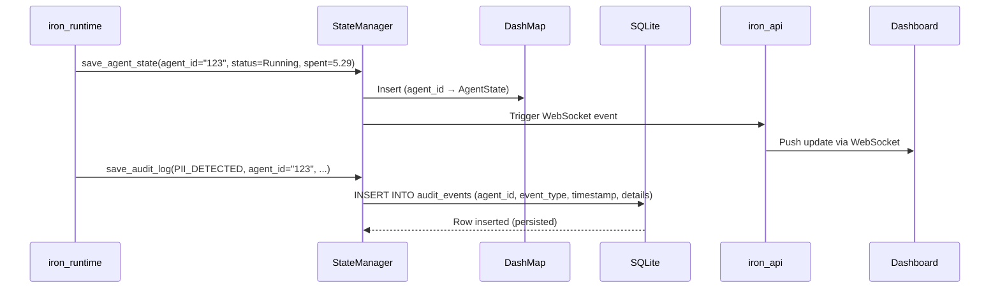
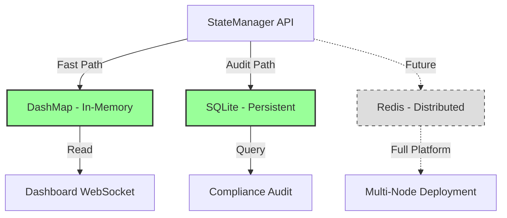

# spec

**Version:** 0.2
**Date:** 2025-12-07
**Component:** iron_state
**Layer:** Foundation (Layer 1)

---

## Scope

**Responsibility:** State management for agent execution state and audit logs. Provides fast in-memory access for real-time dashboard updates and persistent SQLite storage for compliance audit trail.

**In Scope:**
- In-memory state storage (DashMap for concurrent access)
- Agent state CRUD operations (create, read, update, list)
- Audit event logging to SQLite (PII detections, budget alerts, circuit breaker events)
- SQLite persistence (single-file database, no server required)
- Thread-safe state access (multiple crates reading/writing concurrently)

**Out of Scope:**
- Redis distributed state (pilot is single-machine demo, full platform adds Redis for multi-node deployments)
- State replication and consensus (pilot has single state manager instance, full platform adds distributed consensus)
- Historical state queries (pilot stores only current state, full platform adds time-series queries)
- State migrations and schema versioning (pilot uses simple schema, full platform adds Alembic/Flyway migrations)
- State backup and recovery (pilot relies on SQLite durability, full platform adds backup automation)

---

## Deployment Modes

Iron Cage supports two deployment modes with different usage patterns for iron_state:

### Pilot/Demo Mode (Single Process, Localhost)

**Usage:** iron_state is a **shared instance** accessed by both iron_runtime and iron_api within the same Rust process.

**Architecture:**
```
Single Rust Process (localhost)
├── iron_runtime (agent orchestration)
│   └── Arc<StateManager> (shared)
│         ├── DashMap (in-memory state)
│         └── SQLite (./iron_state.db)
│
└── iron_api (REST + WebSocket server)
    └── Arc<StateManager> (same instance)
          └── Broadcasts updates to dashboard
```

**Data Flow:**
```
Agent Event → iron_runtime.save_agent_state()
                ↓
         StateManager (shared Arc)
                ↓
         DashMap update + SQLite write
                ↓
         Broadcast StateUpdate
                ↓
         iron_api/ws (same process)
                ↓
         Dashboard UI (WebSocket push)
```

**Key Characteristics:**
- Single StateManager instance shared via Arc between modules
- Single SQLite database file (./iron_state.db)
- WebSocket communication (ws://localhost:8080/ws)
- In-process broadcast channel (zero network latency)

---

### Production Mode (Distributed, Cloud + Local)

**Usage:** iron_state exists **only in Agent Runtime package** (runs on developer machines). Control Panel uses iron_control_store instead.

**Architecture:**
```
Cloud: Control Panel                Developer Machines
├── iron_api                         ├── Machine 1: Alice
│   ├── iron_control_store           │   ├── iron_runtime
│   └── PostgreSQL                   │   └── iron_state (local)
│       (users, tokens, telemetry)   │       └── SQLite (alice_state.db)
│                                     │
│   ▲ HTTPS POST /api/telemetry      ├── Machine 2: Bob
│   └─────────────────────────────────┘   ├── iron_runtime
                                           └── iron_state (local)
                                               └── SQLite (bob_state.db)
```

**Key Differences:**
- **Control Panel:** Does NOT have iron_state (uses iron_control_store for users/tokens/secrets/telemetry)
- **Agent Runtime:** Has iron_state for local agent execution state and audit logs
- **Communication:** Agent Runtime optionally sends telemetry to Control Panel via HTTPS POST
- **Databases:** Separate databases (PostgreSQL for Control Panel, SQLite per Agent Runtime instance)
- **No Sharing:** Each Agent Runtime instance has completely independent iron_state

**Package Distribution:**
- **Control Panel Package (Docker):** Does NOT include iron_state module
- **Agent Runtime Package (PyPI):** Includes iron_state module

---

### Current Status

**Pilot Implementation (Dec 2025):** Uses Pilot/Demo Mode only (shared instance pattern)
**Production Implementation:** Planned post-pilot (Q1 2026)

**This specification describes both modes,** with primary focus on Pilot Mode for conference demo implementation.

---

## Project Goal

**Purpose:** Enable real-time dashboard updates (<100ms latency) while maintaining durable audit trail for SOC 2 compliance.

**Primary Objective:** Dashboard must show live agent metrics (budget spent, PII detections, status) with sub-second latency, while all safety/cost/reliability events are permanently logged to SQLite for compliance audits.

**Success Criteria:**
- ✅ Dashboard WebSocket receives state updates within 100ms of agent event
- ✅ All PII detections logged to SQLite (survives process restart)
- ✅ Audit log queryable by compliance auditors (SQL interface)
- ✅ Zero state corruption (concurrent writes don't lose data)
- ✅ Zero database lock contention during 5-minute demo

---

## Problem Solved

**Without iron_state:**
- No centralized state (each crate maintains own state, inconsistency risk)
- No audit trail (PII detections not logged, compliance failure)
- Dashboard polling required (1-second delays, poor UX)
- State loss on crash (no persistence, demo restart loses history)
- Lock contention (each crate uses own Mutex, deadlock risk)

**With iron_state:**
- Single source of truth (StateManager coordinates all state)
- Durable audit logs (SQLite survives crashes, auditor-queryable)
- Push-based updates (state changes trigger WebSocket events, <100ms latency)
- Persistence (demo can be paused/resumed without data loss)
- Lock-free reads (DashMap allows concurrent access)

---

## Ubiquitous Language (Vocabulary)

**StateManager:** Central coordinator for all agent state and audit logs. Provides in-memory fast path (DashMap) and durable slow path (SQLite).

**AgentState:** Runtime state of a single agent. Contains: agent_id, status (Running/Stopped/Failed), budget_spent, pii_detections (count).

**AuditEvent:** Immutable record of compliance-relevant event. Contains: agent_id, event_type (PII_DETECTED, BUDGET_WARNING, CIRCUIT_BREAKER), timestamp (Unix seconds), details (JSON-encoded event data).

**DashMap:** Lock-free concurrent HashMap (from dashmap crate). Allows multiple readers and writers without blocking. Used for agent state (hot path).

**SQLite Pool:** Connection pool to SQLite database (from sqlx crate). Used for audit logs (warm path, durability required).

---

## System Architecture

### State Flow



**Design Principle:** Fast path (in-memory) for real-time dashboard. Slow path (SQLite) for compliance audit. Writes go to both, reads prefer memory.

---

### Storage Backend Selection



**Pilot:** DashMap + SQLite only
**Full Platform:** Add Redis for multi-node state sharing

---

## Functional Requirements

### FR-1: StateManager Creation

**FR-1.1:** The crate must provide `StateManager::new() -> Self` constructor for in-memory-only state.

**FR-1.2:** StateManager must be `Clone` (cheaply clonable via Arc-wrapped internals).

**FR-1.3:** StateManager must be `Send + Sync` (usable across thread boundaries for Tokio runtime).

**Test:**
```rust
let state = StateManager::new();
let state_clone = state.clone();  // Cheap Arc clone
tokio::spawn(async move { state_clone.list_agents() });  // Send + Sync required
```

---

### FR-2: Agent State Operations

**FR-2.1:** The crate must provide `get_agent_state(&self, agent_id: &str) -> Option<AgentState>`.

**FR-2.2:** The crate must provide `save_agent_state(&self, state: AgentState)`.

**FR-2.3:** The crate must provide `list_agents(&self) -> Vec<String>` returning all agent IDs.

**FR-2.4:** The crate must provide `delete_agent_state(&self, agent_id: &str) -> bool` returning true if agent existed.

**FR-2.5:** All operations must be thread-safe (concurrent get/save from multiple crates must not corrupt state).

**Test:**
```rust
let state_mgr = StateManager::new();

state_mgr.save_agent_state(AgentState {
  agent_id: "agent-123".to_string(),
  status: AgentStatus::Running,
  budget_spent: 5.29,
  pii_detections: 0,
});

let retrieved = state_mgr.get_agent_state("agent-123");
assert!(retrieved.is_some());
assert_eq!(retrieved.unwrap().budget_spent, 5.29);
```

---

### FR-3: Audit Event Logging

**FR-3.1:** The crate must provide `save_audit_log(&self, event: AuditEvent)`.

**FR-3.2:** When SQLite feature enabled, audit events must be written to database table:
```sql
CREATE TABLE audit_events (
  id INTEGER PRIMARY KEY AUTOINCREMENT,
  agent_id TEXT NOT NULL,
  event_type TEXT NOT NULL,
  timestamp INTEGER NOT NULL,
  details TEXT NOT NULL
);
```

**FR-3.3:** When SQLite feature disabled, audit events must be logged via `tracing::debug!` (in-memory only, acceptable for dev/test).

**FR-3.4:** SQLite writes must be asynchronous (non-blocking, use tokio::spawn for background insertion).

**Test:**
```rust
#[tokio::test]
#[cfg(feature = "sqlite")]
async fn test_audit_persistence() {
  let state_mgr = StateManager::with_sqlite("test.db").await.unwrap();

  state_mgr.save_audit_log(AuditEvent {
    agent_id: "agent-123".to_string(),
    event_type: "PII_DETECTED".to_string(),
    timestamp: 1700000000,
    details: r#"{"pii_type":"EMAIL","location":15}"#.to_string(),
  });

  // Query SQLite directly
  let row: (String,) = sqlx::query_as("SELECT event_type FROM audit_events WHERE agent_id = ?")
    .bind("agent-123")
    .fetch_one(&state_mgr.db.unwrap())
    .await
    .unwrap();

  assert_eq!(row.0, "PII_DETECTED");
}
```

---

### FR-4: SQLite Backend (Feature-Gated)

**FR-4.1:** The crate must provide `StateManager::with_sqlite(db_path: &str) -> Result<Self, sqlx::Error>` constructor (async, requires `sqlite` feature).

**FR-4.2:** Constructor must create database file if not exists.

**FR-4.3:** Constructor must run migrations to create `audit_events` table.

**FR-4.4:** SQLite connection pool size must be configurable (default: 5 connections).

**Test:**
```rust
#[tokio::test]
#[cfg(feature = "sqlite")]
async fn test_sqlite_creation() {
  let state_mgr = StateManager::with_sqlite("sqlite::memory:").await.unwrap();
  // Database created, migrations run
  state_mgr.save_audit_log(/* ... */);  // Must not error
}
```

---

### FR-5: State Update Notifications

**FR-5.1:** The crate must provide `subscribe_to_updates() -> tokio::sync::broadcast::Receiver<StateUpdate>`.

**FR-5.2:** StateUpdate must be an enum with variants:
- `AgentStateChanged { agent_id: String }`
- `AuditEventLogged { agent_id: String, event_type: String }`

**FR-5.3:** Every `save_agent_state()` call must broadcast `AgentStateChanged`.

**FR-5.4:** Every `save_audit_log()` call must broadcast `AuditEventLogged`.

**Rationale:** iron_api subscribes to updates and pushes to dashboard via WebSocket (<100ms latency requirement).

**Test:**
```rust
let state_mgr = StateManager::new();
let mut rx = state_mgr.subscribe_to_updates();

state_mgr.save_agent_state(AgentState { agent_id: "agent-123".to_string(), /* ... */ });

let update = rx.recv().await.unwrap();
assert!(matches!(update, StateUpdate::AgentStateChanged { agent_id } if agent_id == "agent-123"));
```

---

## Non-Functional Requirements

### NFR-1: Read Latency

**NFR-1.1:** `get_agent_state()` must complete in < 1ms (99th percentile).

**Measurement:** Benchmark with 100 agents in memory, 1000 concurrent reads.

**Rationale:** Dashboard queries state every 100ms. Slow reads cause UI lag.

---

### NFR-2: Write Throughput

**NFR-2.1:** StateManager must handle >= 1000 state updates/second without backpressure.

**Measurement:** Spawn 10 tasks, each writing 100 states/sec for 10 seconds. Verify no blocking.

**Rationale:** Pilot demo has low write volume (~10/sec), but stress test ensures scalability.

---

### NFR-3: SQLite Write Latency

**NFR-3.1:** Audit log writes must not block caller (asynchronous via tokio::spawn).

**NFR-3.2:** Audit log write latency must be < 10ms (99th percentile).

**Measurement:** Write 100 audit events, measure time from save_audit_log() call to SQLite commit.

**Rationale:** Synchronous SQLite writes would block agent processing. Async writes prevent slowdown.

---

### NFR-4: Memory Footprint

**NFR-4.1:** StateManager with 100 agents must consume < 10 MB RAM.

**Measurement:** Populate 100 agents, measure process RSS (resident set size).

**Rationale:** Pilot runs on laptop with limited RAM. State must not consume significant memory.

---

## Functional Design (Recommended)

### Dual-Backend Pattern (Recommended)

**Recommendation:** It is recommended to use dual-backend pattern: fast path (memory) + slow path (persistent).

**Write Strategy:**
- Agent state: Write to memory only (ephemeral, dashboard needs current state only)
- Audit events: Write to memory AND SQLite (durable, compliance requires persistence)

**Read Strategy:**
- Agent state: Read from memory (fast, <1ms)
- Audit events: Read from SQLite (slower, but infrequent queries)

---

### Broadcast Channel (Recommended)

**Recommendation:** It is recommended to use `tokio::sync::broadcast` for state update notifications.

**Capacity:** 100 messages (buffer size). If dashboard can't keep up, oldest updates dropped (acceptable, dashboard shows current state anyway).

**Benefits:**
- Multiple subscribers (iron_api + future dashboard consumers)
- Non-blocking sends (if no subscribers, no overhead)

---

## API Surface

### Public Types

```rust
pub struct StateManager {
  memory: Arc<DashMap<String, AgentState>>,
  #[cfg(feature = "sqlite")]
  db: Option<sqlx::SqlitePool>,
  update_tx: broadcast::Sender<StateUpdate>,
}

pub struct AgentState {
  pub agent_id: String,
  pub status: AgentStatus,
  pub budget_spent: f64,
  pub pii_detections: usize,
}

pub enum AgentStatus {
  Running,
  Stopped,
  Failed,
}

pub struct AuditEvent {
  pub agent_id: String,
  pub event_type: String,  // "PII_DETECTED", "BUDGET_WARNING", "CIRCUIT_BREAKER"
  pub timestamp: i64,       // Unix seconds
  pub details: String,      // JSON-encoded event data
}

pub enum StateUpdate {
  AgentStateChanged { agent_id: String },
  AuditEventLogged { agent_id: String, event_type: String },
}
```

### Public Methods

```rust
impl StateManager {
  pub fn new() -> Self;

  #[cfg(feature = "sqlite")]
  pub async fn with_sqlite(db_path: &str) -> Result<Self, sqlx::Error>;

  pub fn get_agent_state(&self, agent_id: &str) -> Option<AgentState>;
  pub fn save_agent_state(&self, state: AgentState);
  pub fn delete_agent_state(&self, agent_id: &str) -> bool;
  pub fn list_agents(&self) -> Vec<String>;

  pub fn save_audit_log(&self, event: AuditEvent);

  pub fn subscribe_to_updates(&self) -> broadcast::Receiver<StateUpdate>;
}
```

---

## External Dependencies

### Dependency: dashmap (Concurrent HashMap)

- **Purpose:** Lock-free concurrent HashMap for agent state
- **Version:** 6.1+
- **Risk Assessment:**
  - **Availability:** Low risk (popular crate, 10M+ downloads, actively maintained)
  - **Performance:** Excellent (lock-free reads, minimal write contention)
  - **Security:** Low risk (no unsafe code in public API)
  - **Cost:** Free (MIT licensed)
  - **Alternative:** `std::sync::RwLock<HashMap>` (simpler but slower, 10x worse read performance under contention)

---

### Dependency: sqlx (SQLite ORM)

- **Purpose:** Async SQLite driver for audit log persistence
- **Version:** 0.7+ (must match version used in iron_safety for native library compatibility)
- **Required Features:** `sqlite`, `runtime-tokio-rustls`
- **Risk Assessment:**
  - **Availability:** Low risk (official Tokio ecosystem crate)
  - **Performance:** Good (async IO, connection pooling)
  - **Security:** Low risk (prepared statements prevent SQL injection)
  - **Cost:** Free (MIT/Apache licensed)
  - **Note:** Feature-gated behind `sqlite` feature. Core crate works without sqlx.

---

### Dependency: tokio (Async Runtime)

- **Purpose:** Async broadcast channels for state update notifications
- **Version:** 1.0+ (workspace dependency)
- **Required Features:** `sync` (broadcast channel)
- **Risk Assessment:**
  - **Availability:** Low risk (de facto Rust async standard)
  - **Performance:** Excellent (zero-cost abstractions)
  - **Cost:** Free (MIT licensed)

---

## Functional Requirements Detailed Implementation

### FR-3 Expansion: Audit Event Types

**Required Event Types (from demonstration_scenario.md):**

1. **PII_DETECTED**
   - **Trigger:** iron_safety detects PII in agent output
   - **Details JSON:** `{"pii_type":"EMAIL","location":15,"value_hash":"abc123...","severity":"HIGH"}`
   - **Usage:** Compliance audit: "Show all PII incidents for agent X"

2. **BUDGET_WARNING**
   - **Trigger:** iron_cost detects budget >= 90% threshold
   - **Details JSON:** `{"spent":45.12,"limit":50.0,"percentage":90.24}`
   - **Usage:** Financial audit: "Show all budget alerts in Q4 2025"

3. **CIRCUIT_BREAKER_OPENED**
   - **Trigger:** iron_reliability opens circuit breaker
   - **Details JSON:** `{"service":"linkedin_api","reason":"5 consecutive failures","cooldown_seconds":60}`
   - **Usage:** Reliability audit: "Show all circuit breaker activations last month"

4. **AGENT_STARTED**
   - **Trigger:** iron_runtime spawns agent process
   - **Details JSON:** `{"script_path":"lead_gen_agent.py","budget":50.0}`
   - **Usage:** Usage audit: "How many agents started this week?"

5. **AGENT_COMPLETED**
   - **Trigger:** iron_runtime agent finishes successfully
   - **Details JSON:** `{"total_leads":100,"success_rate":98,"duration_seconds":1694}`
   - **Usage:** Performance audit: "Average agent duration?"

---

### FR-5 Expansion: Broadcast Channel Behavior

**Broadcast Semantics:**
- **Buffer Size:** 100 messages (configurable via StateManager::new_with_capacity())
- **Overflow Behavior:** Oldest message dropped (FIFO eviction)
- **Subscriber Lag:** Slow subscribers don't block fast subscribers
- **No Subscribers:** Broadcast send is no-op (zero overhead if dashboard not connected)

**Usage Pattern:**
```rust
// iron_api subscribes to updates
let mut rx = state_mgr.subscribe_to_updates();

tokio::spawn(async move {
  while let Ok(update) = rx.recv().await {
    match update {
      StateUpdate::AgentStateChanged { agent_id } => {
        // Push to WebSocket
      },
      StateUpdate::AuditEventLogged { agent_id, event_type } => {
        // Push alert modal to dashboard
      },
    }
  }
});
```

---

## Non-Functional Requirements Expansion

### NFR-1 Expansion: Read Performance Benchmark

**Benchmark Setup:**
```rust
let state_mgr = StateManager::new();

// Populate 100 agents
for i in 0..100 {
  state_mgr.save_agent_state(AgentState {
    agent_id: format!("agent-{}", i),
    status: AgentStatus::Running,
    budget_spent: 5.0,
    pii_detections: 0,
  });
}

// Measure 1000 concurrent reads
let start = std::time::Instant::now();
let handles: Vec<_> = (0..1000).map(|_| {
  let state_mgr = state_mgr.clone();
  tokio::spawn(async move {
    state_mgr.get_agent_state("agent-50");
  })
}).collect();

futures::future::join_all(handles).await;
let duration = start.elapsed();

assert!(duration < std::time::Duration::from_millis(100));  // <1ms per read (avg)
```

---

### NFR-3 Expansion: SQLite Async Write Pattern

**Implementation:**
```rust
pub fn save_audit_log(&self, event: AuditEvent) {
  #[cfg(feature = "sqlite")]
  if let Some(pool) = &self.db {
    let pool = pool.clone();
    tokio::spawn(async move {
      sqlx::query("INSERT INTO audit_events (agent_id, event_type, timestamp, details) VALUES (?, ?, ?, ?)")
        .bind(&event.agent_id)
        .bind(&event.event_type)
        .bind(event.timestamp)
        .bind(&event.details)
        .execute(&pool)
        .await
        .expect("Audit log write failed");  // OK to panic here (audit failures are critical)
    });
  }

  // Broadcast update (synchronous, must complete before return)
  let _ = self.update_tx.send(StateUpdate::AuditEventLogged {
    agent_id: event.agent_id.clone(),
    event_type: event.event_type.clone(),
  });
}
```

**Key Point:** SQLite write spawned in background (async). Broadcast send is synchronous (dashboard gets immediate notification, SQLite write completes later).

---

## Limitations

**Pilot Limitations:**
- **Single Machine:** DashMap is local only. Cannot share state across multiple nodes. Full platform adds Redis for distributed state.
- **No Query Interface:** Cannot query "all agents with budget_spent > $40". Must iterate all agents. Full platform adds query API.
- **No Historical Data:** Only current agent state stored. Cannot query "agent state at timestamp T". Full platform adds time-series storage.
- **No Backups:** SQLite file is single point of failure. No automated backups. Full platform adds backup/restore automation.
- **No Access Control:** Any crate can read/write any agent state. No authentication/authorization. Full platform adds RBAC.

---

## Success Metrics

**Correctness:**
- ✅ 100 concurrent writers don't corrupt state (stress test: 10 tasks × 100 writes/sec × 10 sec)
- ✅ All audit events persisted to SQLite (query database after demo, verify 100+ events)
- ✅ State survives process restart (restart runtime mid-demo, verify SQLite preserves audit log)

**Performance:**
- ✅ get_agent_state() < 1ms P99 latency
- ✅ save_agent_state() completes in < 5ms P99
- ✅ Broadcast notification latency < 10ms (emit event → dashboard receives via WebSocket)

**Compliance:**
- ✅ All PII detections logged to SQLite (auditor can query: `SELECT * FROM audit_events WHERE event_type = 'PII_DETECTED'`)
- ✅ Audit log immutable (no UPDATE or DELETE operations exposed)
- ✅ Timestamps in UTC for compliance audit (no timezone ambiguity)

---

## Deliverables

- **Compiled Rust Library:** `libiron_state.rlib` for linking
- **State Management API:** 9 public methods for state operations
- **SQLite Schema:** Migration file creating `audit_events` table
- **Test Suite:** Unit tests + integration tests (with SQLite in-memory database)

---

## Cross-References

**Used By:**
- [iron_runtime](../iron_runtime/spec.md) - Stores agent state, audit logs
- [iron_api](../iron_api/spec.md) - Subscribes to updates, queries state for HTTP API
- [iron_safety](../iron_safety/spec.md) - Logs PII detections
- [iron_cost](../iron_cost/spec.md) - Logs budget warnings
- [iron_reliability](../iron_reliability/spec.md) - Logs circuit breaker events

**Depends On:**
- [iron_types](../iron_types/spec.md) - Uses AgentId, Error types (though current implementation uses String, should migrate to AgentId)

**Parent Specification:** [Pilot Platform](../../iron_cage/pilot/spec.md) - See Feature #25 (State Management)

---

## Appendix: Addendum

### Conformance Checklist

| Status | Requirement | Verification Notes |
|--------|-------------|-------------------|
| ❌ | FR-1.1: StateManager::new() constructor | Function exists |
| ❌ | FR-1.2: StateManager is Clone | Compile test: clone() works |
| ❌ | FR-1.3: StateManager is Send + Sync | Compile test: pass to tokio::spawn |
| ❌ | FR-2.1: get_agent_state(agent_id) method | Function exists, returns Option<AgentState> |
| ❌ | FR-2.2: save_agent_state(state) method | Function exists |
| ❌ | FR-2.3: list_agents() method | Function exists, returns Vec<String> |
| ❌ | FR-2.4: delete_agent_state(agent_id) method | Function exists, returns bool |
| ❌ | FR-2.5: All operations are thread-safe | Stress test: 100 concurrent writers |
| ❌ | FR-3.1: save_audit_log(event) method | Function exists |
| ❌ | FR-3.2: SQLite table `audit_events` created with correct schema | Migration test: verify schema |
| ❌ | FR-3.3: Without sqlite feature, logs via tracing::debug | Compile without sqlite, verify compiles |
| ❌ | FR-3.4: SQLite writes are async (non-blocking) | Verify tokio::spawn used |
| ❌ | FR-4.1: with_sqlite(db_path) async constructor | Function exists (feature-gated) |
| ❌ | FR-4.2: Creates database file if not exists | Test: call with non-existent path |
| ❌ | FR-4.3: Runs migrations to create table | Query: PRAGMA table_info(audit_events) |
| ❌ | FR-4.4: Connection pool size configurable | Config test: set pool size to 10 |
| ❌ | FR-5.1: subscribe_to_updates() returns broadcast::Receiver | Function exists |
| ❌ | FR-5.2: StateUpdate enum with AgentStateChanged, AuditEventLogged | Enum defined |
| ❌ | FR-5.3: save_agent_state broadcasts update | Unit test: receive AgentStateChanged |
| ❌ | FR-5.4: save_audit_log broadcasts update | Unit test: receive AuditEventLogged |
| ❌ | NFR-1.1: get_agent_state() < 1ms P99 | Benchmark: 1000 concurrent reads |
| ❌ | NFR-2.1: Handle >= 1000 writes/sec | Benchmark: 10 tasks × 100 writes/sec |
| ❌ | NFR-3.1: Audit writes don't block caller | Verify tokio::spawn used |
| ❌ | NFR-3.2: Audit write latency < 10ms P99 | Benchmark: 100 audit writes |
| ❌ | NFR-4.1: 100 agents consume < 10 MB RAM | Memory profiling: populate 100 agents, check RSS |

---

### Implementation Guidance

**SQLite Migration:**
Create `migrations/` directory with `001_initial_schema.sql`:

```sql
CREATE TABLE IF NOT EXISTS audit_events (
  id INTEGER PRIMARY KEY AUTOINCREMENT,
  agent_id TEXT NOT NULL,
  event_type TEXT NOT NULL,
  timestamp INTEGER NOT NULL,
  details TEXT NOT NULL,
  created_at INTEGER DEFAULT (strftime('%s', 'now'))
);

CREATE INDEX idx_audit_agent_id ON audit_events(agent_id);
CREATE INDEX idx_audit_event_type ON audit_events(event_type);
CREATE INDEX idx_audit_timestamp ON audit_events(timestamp);
```

**Testing Strategy:**
- Unit tests: Test each method in isolation
- Integration tests: Use SQLite in-memory database (`:memory:` connection string)
- Stress tests: 100 concurrent writers, verify no deadlocks
- Persistence tests: Write to file, restart process, verify data survives

**Code Organization:**
```
src/
├── lib.rs           # Feature gates, public API
├── manager.rs       # StateManager implementation
├── state.rs         # AgentState, AgentStatus types
├── audit.rs         # AuditEvent type
├── updates.rs       # StateUpdate enum, broadcast channel
└── sqlite.rs        # SQLite backend (feature-gated)

migrations/
└── 001_initial_schema.sql

tests/
├── manager_test.rs  # StateManager CRUD operations
├── audit_test.rs    # Audit event logging
├── updates_test.rs  # Broadcast channel behavior
└── sqlite_test.rs   # SQLite persistence (requires sqlite feature)
```

---

### Known Constraints

**Demo Constraints:**
- Single agent only (no multi-agent state coordination)
- Local SQLite file (no distributed database)
- No historical queries (current state only)

**Future Extensions (Post-Pilot):**
- Add Redis backend for distributed state
- Add query API (filter agents by criteria)
- Add time-series storage (historical state snapshots)
- Add state backup/restore commands

---

### Revision History

| Version | Date | Changes |
|---------|------|---------|
| 0.2 | 2025-12-07 | Added Deployment Modes section explaining Pilot Mode (shared instance) vs Production Mode (Agent Runtime only, Control Panel uses iron_control_store). Updated Scope to clarify deployment context. |
| 0.1 | 2025-11-25 | Initial pilot specification - state management for conference demo |

