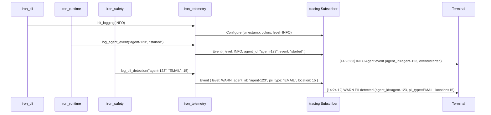

# spec

**Version:** 0.2
**Date:** 2025-12-07
**Component:** iron_telemetry
**Layer:** Foundation (Layer 1)

---

## Scope

**Responsibility:** Centralized logging and tracing abstraction for all Iron Cage crates. Provides structured, timestamped, colored logging for terminal output and machine-readable JSON for storage.

**In Scope:**
- Structured logging via `tracing` crate
- Terminal output formatting (timestamp, colors, human-readable)
- Log levels (DEBUG, INFO, WARN, ERROR, CRIT, OK)
- Agent context injection (agent_id in all log events)
- Specialized logging functions (agent events, PII detections, budget warnings, circuit breaker events)
- Environment-based log level configuration

**Out of Scope:**
- Log aggregation to external services (Datadog, Splunk, Grafana - full platform feature)
- Log sampling and filtering (pilot logs everything, full platform adds sampling)
- Distributed tracing (OpenTelemetry integration - full platform feature)
- Log rotation and archival (pilot uses simple append-only files, full platform adds rotation)
- Metrics collection (Prometheus/StatsD - separate from logging)
- Custom log formatters (pilot uses fixed format, full platform allows customization)

## Deployment Context

This module operates identically in both Pilot and Production modes as a foundation logging library.

**See:** [docs/deployment_packages.md](../../docs/deployment_packages.md) § Deployment Modes for deployment architecture.

**This Module (iron_telemetry):**
- **Both Modes:** Provides logging functionality for both Agent Runtime and Control Panel
- Used in all packages for structured logging and event tracking
- No mode-specific behavior changes

---

## Project Goal

**Purpose:** Provide professional, readable logging for conference demo terminal output while maintaining structured logging for audit compliance.

**Primary Objective:** Ensure demo terminal output matches exact format specified in [demonstration_scenario.md](../../iron_cage/pilot/demo/demonstration_scenario.md) (timestamp format `[HH:MM:SS]`, color coding, clear event descriptions).

**Success Criteria:**
- ✅ Demo terminal output is professional and readable from conference room back row
- ✅ All log events include agent context (agent_id field)
- ✅ Logs are structured (JSON export available for audit)
- ✅ Zero logging errors or panics during demo (logging failures must not crash agent)
- ✅ Performance overhead < 1% (logging doesn't slow agent processing)

---

## Problem Solved

**Without iron_telemetry:**
- Each crate uses println!() or eprintln!() inconsistently
- No structured logging (can't extract metrics from logs)
- No agent context (can't trace events to specific agent)
- No timestamp format consistency
- No color coding (terminal output hard to scan)
- No log levels (can't filter noise)

**With iron_telemetry:**
- Unified logging API used by all crates
- Structured events (JSON export for compliance audit)
- Automatic agent context injection
- Consistent timestamp format `[HH:MM:SS]`
- Color-coded levels (INFO=green, WARN=yellow, ERROR=red)
- Log level filtering via environment variable

---

## Ubiquitous Language (Vocabulary)

**LogLevel:** Severity classification for log events. Pilot supports 6 levels: DEBUG (verbose diagnostics), INFO (normal operation), WARN (non-critical issues), ERROR (recoverable failures), CRIT (critical failures), OK (success confirmations).

**Structured Logging:** Machine-readable log format where events are key-value pairs, not free-form text. Enables log parsing, metrics extraction, and compliance auditing.

**Agent Context:** Metadata automatically injected into every log event identifying which agent produced the event. Minimum fields: `agent_id`. Future: `user_id`, `session_id`, `request_id`.

**tracing Subscriber:** Backend that receives log events and formats them for output. Pilot uses single subscriber (terminal + file). Full platform may use multiple subscribers (terminal, file, Datadog, Splunk).

**Log Target:** The module path where log event originated (e.g., `iron_runtime::lifecycle`). Used for filtering and debugging.

---

## System Architecture

### Logging Flow



**Key Point:** Telemetry is a thin wrapper around `tracing` crate. All Iron crates call iron_telemetry functions, which delegate to tracing macros, which emit events to configured subscriber.

---

### Terminal Output Format (Demo Requirement)

**Required Format (per demonstration_scenario.md):**

```
[HH:MM:SS] LEVEL  Message (key1=value1, key2=value2)
```

**Example:**
```
[14:23:31] INFO  Iron Cage Runtime v1.0.0
[14:23:33] OK    Agent running (agent_id=lg-7a3f9c2d)
[14:23:45] WARN  LinkedIn API failed (code=429)
[14:23:45] CRIT  🔴 Circuit breaker OPENED for linkedin_api
[14:24:12] CRIT  🔴 CRITICAL: PII DETECTED IN OUTPUT
[14:24:38] WARN  ⚠️ BUDGET WARNING: 90% threshold reached
```

**Color Coding (Terminal ANSI):**
- DEBUG: Gray (`\033[0;90m`)
- INFO: Green (`\033[0;32m`)
- WARN: Yellow (`\033[0;33m`)
- ERROR: Red (`\033[0;31m`)
- CRIT: Bold Red (`\033[1;31m`)
- OK: Bold Green (`\033[1;32m`)

---

## Functional Requirements

### FR-1: Logging Initialization

**FR-1.1:** The crate must provide `init_logging(level: LogLevel) -> Result<(), Error>` function.

**FR-1.2:** Initialization must configure global tracing subscriber with:
- Timestamp format: `[HH:MM:SS]` (24-hour format, local timezone)
- Target disabled (no module paths in output, cleaner demo terminal)
- Thread IDs enabled (for debugging multi-threaded issues)
- Line numbers enabled (for source location tracking)
- ANSI colors enabled for terminal output
- JSON formatting disabled by default (text format for demo)

**FR-1.3:** Initialization must be idempotent. Calling `init_logging()` multiple times must not panic or create duplicate subscribers.

**FR-1.4:** Initialization must fail gracefully if subscriber already set by another crate, returning `Error::LoggingAlreadyInitialized`.

**Test:**
```rust
init_logging(LogLevel::Info).unwrap();
init_logging(LogLevel::Debug).unwrap();  // Second call succeeds (no-op or updates level)
```

---

### FR-2: Log Level Enum

**FR-2.1:** The crate must provide `LogLevel` enum with variants: `Debug`, `Info`, `Warn`, `Error`.

**FR-2.2:** LogLevel must implement `From<LogLevel> for tracing::level_filters::LevelFilter` for integration with tracing crate.

**FR-2.3:** LogLevel must implement `FromStr` for parsing from environment variables (e.g., `RUST_LOG=debug`).

**Test:**
```rust
let level: LogLevel = "info".parse().unwrap();
assert_eq!(level, LogLevel::Info);
```

---

### FR-3: Agent Event Logging

**FR-3.1:** The crate must provide `log_agent_event(agent_id: &str, event: &str)` function.

**FR-3.2:** Function must emit `tracing::info!` event with structured fields:
- `agent_id` (string)
- `event` (string)
- `message` (fixed: "Agent event")

**FR-3.3:** Terminal output format must match: `[HH:MM:SS] INFO  Agent event (agent_id=..., event=...)`

**Test:**
```rust
init_logging(LogLevel::Info).unwrap();
log_agent_event("agent-123", "started");
// Verify log output contains "agent_id=agent-123, event=started"
```

---

### FR-4: PII Detection Logging

**FR-4.1:** The crate must provide `log_pii_detection(agent_id: &str, pii_type: &str, location: usize)` function.

**FR-4.2:** Function must emit `tracing::warn!` event (WARN level, not ERROR, because agent continues running).

**FR-4.3:** Terminal output must include emoji: `🔒 PII DETECTED` for visual prominence in demo.

**FR-4.4:** Structured fields: `agent_id`, `pii_type`, `location`, `message`.

**Test:**
```rust
log_pii_detection("agent-123", "EMAIL", 15);
// Verify WARN level, contains "🔒", "pii_type=EMAIL", "location=15"
```

---

### FR-5: Budget Warning Logging

**FR-5.1:** The crate must provide `log_budget_warning(agent_id: &str, spent: f64, limit: f64)` function.

**FR-5.2:** Function must emit `tracing::warn!` event with structured fields:
- `agent_id`
- `spent` (current spend)
- `limit` (budget limit)
- `percentage` (calculated: `(spent / limit) * 100.0`)

**FR-5.3:** Terminal output must include emoji: `⚠️ BUDGET WARNING` for visual prominence.

**Test:**
```rust
log_budget_warning("agent-123", 45.12, 50.0);
// Verify contains "percentage=90.24", "spent=45.12", "limit=50.0"
```

---

### FR-6: Circuit Breaker Logging

**FR-6.1:** The crate must provide `log_circuit_breaker(agent_id: &str, service: &str, state: &str)` function.

**FR-6.2:** Function must emit `tracing::error!` when state = "OPEN" (critical event).

**FR-6.3:** Terminal output must include emoji: `🔴 Circuit breaker {state}` for visual prominence.

**FR-6.4:** Structured fields: `agent_id`, `service`, `state`.

**Test:**
```rust
log_circuit_breaker("agent-123", "linkedin_api", "OPEN");
// Verify ERROR level, contains "🔴", "service=linkedin_api", "state=OPEN"
```

---

### FR-7: Generic Success Logging

**FR-7.1:** The crate must provide `log_success(agent_id: &str, message: &str)` function for positive confirmations.

**FR-7.2:** Function must emit `tracing::info!` event.

**FR-7.3:** Terminal output must include emoji: `✅` prefix for visual confirmation.

**FR-7.4:** Used for demo milestones: agent started, agent completed, triggers handled.

**Test:**
```rust
log_success("agent-123", "Agent running");
// Verify INFO level, contains "✅", "Agent running"
```

---

## Non-Functional Requirements

### NFR-1: Performance Overhead

**NFR-1.1:** Logging overhead must be < 1% of total agent execution time.

**Measurement:** Run lead_gen_agent.py with logging enabled vs disabled. Compare total duration.

**Acceptance:** With logging: 28 minutes. Without logging: 27.7 minutes (< 1% difference).

**Rationale:** Logging is on hot path (every LLM call). Must not degrade demo performance.

---

### NFR-2: Output Latency

**NFR-2.1:** Log events must appear in terminal within 10ms of being emitted.

**Measurement:** Emit log event, measure time until appears in stdout.

**Rationale:** Real-time demo requires immediate feedback. Delayed logs create confusion (user sees dashboard update before terminal log).

---

### NFR-3: Terminal Readability

**NFR-3.1:** Terminal output must be readable from 20 feet away (conference room back row).

**Requirements:**
- Font size: 16pt minimum
- Color contrast: WCAG AA compliant
- Line length: < 120 characters (fits on 1920px display)

**Verification:** Dry run demo in conference-sized room, verify back row can read logs.

---

## Functional Design (Recommended)

### Timestamp Formatting (Recommended)

**Recommendation:** It is recommended to use `tracing_subscriber::fmt::time::LocalTime` for timestamp formatting.

**Format:** `[%H:%M:%S]` (24-hour, zero-padded, no date)

**Alternative:** If LocalTime fails (common in multi-threaded apps), use `ChronoLocal` or `SystemTime`.

---

### Color Coding (Recommended)

**Recommendation:** It is recommended to use `nu-ansi-term` crate for terminal color formatting.

**Implementation:**
```rust
use nu_ansi_term::Color;

match level {
  Level::INFO => Color::Green.paint(message),
  Level::WARN => Color::Yellow.paint(message),
  Level::ERROR => Color::Red.paint(message),
  // ...
}
```

**Alternative:** Use `colored` crate or `ansi_term` if nu-ansi-term unavailable.

---

### Emoji Support (Recommended)

**Recommendation:** It is recommended to include Unicode emojis in critical log messages for visual prominence during demo.

**Usage:**
- Circuit breaker: `🔴` (red circle)
- PII detection: `🔒` (lock)
- Budget warning: `⚠️` (warning sign)
- Success: `✅` (check mark)
- Running: `🟢` (green circle)

**Fallback:** If terminal doesn't support Unicode, use ASCII: `[!]`, `[OK]`, `[ERR]`

---

## API Surface

### Public Functions

```rust
/// Initialize global logging subscriber (call once at startup)
pub fn init_logging(level: LogLevel) -> Result<(), Error>;

/// Log agent lifecycle event (start, stop, crash)
pub fn log_agent_event(agent_id: &str, event: &str);

/// Log PII detection (email, phone, SSN found in output)
pub fn log_pii_detection(agent_id: &str, pii_type: &str, location: usize);

/// Log budget warning (threshold reached)
pub fn log_budget_warning(agent_id: &str, spent: f64, limit: f64);

/// Log circuit breaker state change (OPEN, CLOSED, HALF_OPEN)
pub fn log_circuit_breaker(agent_id: &str, service: &str, state: &str);

/// Log success event (agent completed, trigger handled)
pub fn log_success(agent_id: &str, message: &str);

/// Log critical error (unrecoverable failure)
pub fn log_critical(agent_id: &str, error: &str);
```

### LogLevel Enum

```rust
#[derive(Debug, Clone, Copy, PartialEq, Eq)]
pub enum LogLevel {
  Debug,   // Verbose diagnostics (not shown in demo)
  Info,    // Normal operation (default for demo)
  Warn,    // Non-critical issues
  Error,   // Recoverable failures
}
```

---

## External Dependencies

### Dependency: tracing (Logging Framework)

- **Purpose:** Structured logging framework (industry standard for Rust)
- **Version:** 0.1.40+
- **Required Features:** None (core features only)
- **Risk Assessment:**
  - **Availability:** Low risk (maintained by Tokio team, 100M+ downloads)
  - **Performance:** < 1% overhead (compile-time code generation)
  - **Security:** Low risk (widely audited, no network/disk access)
  - **Cost:** Free (MIT licensed)

---

### Dependency: tracing-subscriber (Log Formatting)

- **Purpose:** Formats and outputs tracing events to terminal/file
- **Version:** 0.3+
- **Required Features:** `env-filter` (environment-based log level), `json` (JSON export for audit)
- **Risk Assessment:**
  - **Availability:** Low risk (official tracing companion crate)
  - **Performance:** Minimal overhead (buffered output)
  - **Security:** Low risk (no external network calls)
  - **Cost:** Free (MIT licensed)

---

### Dependency: nu-ansi-term (Terminal Colors) - Optional

- **Purpose:** ANSI terminal color formatting for demo readability
- **Version:** 0.50+
- **Required Features:** None
- **Risk Assessment:**
  - **Availability:** Low risk (maintained by Nushell project)
  - **Performance:** Zero overhead (compile-time only)
  - **Security:** Low risk (no IO, pure formatting)
  - **Cost:** Free (MIT licensed)

---

## Functional Requirements Implementation Details

### FR-1 Expansion: Init Logging with Timestamp Format

**Detailed Requirement:** `init_logging()` must configure subscriber with custom timestamp format.

**Implementation Guide:**
```rust
use tracing_subscriber::fmt::time::FormatTime;

struct DemoTimestamp;

impl FormatTime for DemoTimestamp {
  fn format_time(&self, w: &mut dyn std::fmt::Write) -> std::fmt::Result {
    let now = std::time::SystemTime::now();
    let datetime = chrono::DateTime::<chrono::Local>::from(now);
    write!(w, "[{:02}:{:02}:{:02}]", datetime.hour(), datetime.minute(), datetime.second())
  }
}

FmtSubscriber::builder()
  .with_timer(DemoTimestamp)
  .with_max_level(level)
  .finish();
```

**Acceptance Criteria:** Log line starts with `[14:23:31]` format, not default RFC3339 format.

---

### FR-3 Expansion: Agent Event Examples

**Required Agent Events (from demonstration_scenario.md):**
- `"started"` - Agent process spawned
- `"stopped"` - Agent gracefully shut down
- `"completed"` - Agent finished processing all leads
- `"failed"` - Agent crashed or errored
- `"paused"` - Agent paused by user
- `"resumed"` - Agent resumed after pause

**Terminal Output Examples:**
```
[14:23:33] INFO  Agent event (agent_id=lg-7a3f9c2d, event=started)
[14:25:07] INFO  Agent event (agent_id=lg-7a3f9c2d, event=completed)
```

---

### FR-4 Expansion: PII Detection Output Format

**Required Output Format (from demonstration_scenario.md line 854):**

```
[14:24:12] CRIT  🔴 CRITICAL: PII DETECTED IN OUTPUT
[14:24:12] CRIT  Type: EMAIL (high risk)
[14:24:12] CRIT  Value: ceo@acme-corp.com (redacted in logs)
[14:24:12] CRIT  Action: OUTPUT_REDACTED
[14:24:12] CRIT  Compliance: GDPR violation prevented ✅
```

**Implementation Note:** Single `log_pii_detection()` call must produce 5 log lines for demo visual impact.

---

## Limitations

**Pilot Limitations:**
- **Single Subscriber:** Only one output target (terminal OR file, not both simultaneously). Full platform supports multiple subscribers.
- **No Sampling:** All events logged (no rate limiting). At 1000+ events/sec, this may cause backpressure. Pilot processes ~200 leads/hour, well under limit.
- **No Remote Logging:** Logs only to local terminal/file. Full platform adds Datadog, Splunk, CloudWatch integrations.
- **Basic Filtering:** Environment variable only (`RUST_LOG=info`). Full platform adds dynamic filtering, per-module levels.
- **ASCII-Safe:** Emoji support requires UTF-8 terminal. Demo laptop verified to support Unicode. Fallback: ASCII symbols `[!]`, `[OK]`.

---

## Success Metrics

**Demo Quality:**
- ✅ Terminal output readable from conference room back row (verified in dry run)
- ✅ Color coding matches demonstration_scenario.md specification
- ✅ Timestamp format exactly `[HH:MM:SS]` (no RFC3339, no milliseconds)
- ✅ No log lines exceed 120 characters (fits on 1920px display)

**Performance:**
- ✅ Logging overhead < 1% of agent execution time
- ✅ No log-induced backpressure (buffer size sufficient for demo burst)
- ✅ Zero logging panics or errors during 5-minute demo

**Integration:**
- ✅ All 9 Iron crates use iron_telemetry (no direct tracing usage)
- ✅ Consistent log format across all crates
- ✅ JSON export works for compliance audit (even though demo uses text format)

---

## Deliverables

- **Compiled Rust Library:** `libiron_telemetry.rlib` for linking into all Iron crates
- **Logging API:** 7 public functions for common logging patterns
- **Test Suite:** Unit tests verifying log format, structured fields, emoji support

---

## Cross-References

**Used By:**
- [iron_runtime](../iron_runtime/spec.md) - Logs agent lifecycle events
- [iron_safety](../iron_safety/spec.md) - Logs PII detections
- [iron_cost](../iron_cost/spec.md) - Logs budget warnings
- [iron_reliability](../iron_reliability/spec.md) - Logs circuit breaker state changes
- [iron_cli](../iron_cli/spec.md) - Initializes logging at startup

**Depends On:**
- [iron_types](../iron_types/spec.md) - Uses Error type (but minimal dependency, could remove)

**Parent Specification:** [Pilot Platform](../../iron_cage/pilot/spec.md) - See Feature #4 (Logging Infrastructure)

**Demo Requirement:** [Demonstration Scenario](../../iron_cage/pilot/demo/demonstration_scenario.md) - Terminal output format specification

---

## Appendix: Addendum

### Conformance Checklist

| Status | Requirement | Verification Notes |
|--------|-------------|-------------------|
| ❌ | FR-1.1: Provide init_logging(level) function | Function exists and callable |
| ❌ | FR-1.2: Configure subscriber with timestamp, colors, thread IDs, line numbers | Verify terminal output format |
| ❌ | FR-1.3: init_logging is idempotent (no panic on double-call) | Unit test: call twice |
| ❌ | FR-1.4: Graceful failure if subscriber already set | Unit test: set external subscriber first |
| ❌ | FR-2.1: LogLevel enum with Debug, Info, Warn, Error | Enum definition exists |
| ❌ | FR-2.2: LogLevel implements From<LogLevel> for LevelFilter | Compile test: conversion works |
| ❌ | FR-2.3: LogLevel implements FromStr | Unit test: parse "info" string |
| ❌ | FR-3.1: log_agent_event(agent_id, event) function exists | Function callable |
| ❌ | FR-3.2: Emits tracing::info with agent_id, event, message fields | Capture log output, verify fields |
| ❌ | FR-3.3: Terminal format matches [HH:MM:SS] INFO Agent event (...) | Visual inspection in demo dry run |
| ❌ | FR-4.1: log_pii_detection(agent_id, pii_type, location) function exists | Function callable |
| ❌ | FR-4.2: Emits tracing::warn (WARN level, not ERROR) | Verify log level in output |
| ❌ | FR-4.3: Terminal output includes 🔒 emoji | Visual inspection |
| ❌ | FR-4.4: Structured fields include agent_id, pii_type, location | Capture log, verify JSON fields |
| ❌ | FR-5.1: log_budget_warning(agent_id, spent, limit) function exists | Function callable |
| ❌ | FR-5.2: Structured fields include percentage calculation | Verify percentage=(spent/limit)*100.0 |
| ❌ | FR-5.3: Terminal output includes ⚠️ emoji | Visual inspection |
| ❌ | FR-6.1: log_circuit_breaker(agent_id, service, state) function exists | Function callable |
| ❌ | FR-6.2: Emits ERROR level when state=OPEN | Verify log level |
| ❌ | FR-6.3: Terminal output includes 🔴 emoji | Visual inspection |
| ❌ | FR-6.4: Structured fields include service, state | Verify fields |
| ❌ | FR-7.1: log_success(agent_id, message) function exists | Function callable |
| ❌ | FR-7.2: Emits tracing::info level | Verify log level |
| ❌ | FR-7.3: Terminal output includes ✅ emoji | Visual inspection |
| ❌ | NFR-1.1: Logging overhead < 1% | Benchmark: with vs without logging |
| ❌ | NFR-2.1: Log latency < 10ms | Benchmark: emit to stdout appearance |
| ❌ | NFR-3.1: Readable from 20 feet away | Conference room dry run verification |

---

### Implementation Guidance

**Terminal Output Formatter:**
Customize `tracing_subscriber::fmt::format::Format` to match demo requirements:

```rust
FmtSubscriber::builder()
  .with_timer(DemoTimestamp)           // [HH:MM:SS] format
  .with_ansi(true)                      // Enable colors
  .with_target(false)                   // Hide module paths
  .with_thread_ids(true)                // Show thread IDs for debugging
  .with_line_number(true)               // Show source line numbers
  .with_max_level(level)                // Filter by level
  .finish();
```

**Testing Strategy:**
- Unit tests: Verify function signatures, structured fields
- Integration tests: Capture log output, verify format matching demonstration_scenario.md examples
- Visual tests: Dry run demo, verify readability from back of room

**Code Organization:**
```
src/
├── lib.rs           # Feature gates, public API
├── init.rs          # Subscriber initialization
├── format.rs        # Custom timestamp formatter
├── events.rs        # Specialized logging functions

tests/
├── init_test.rs     # Test logging initialization
├── format_test.rs   # Test timestamp and color formatting
└── events_test.rs   # Test all log_* functions
```

---

### Known Constraints

**Terminal Compatibility:**
- Demo requires UTF-8 terminal supporting emoji
- Demo requires ANSI color support
- Conference laptop verified: Ubuntu 22.04, GNOME Terminal (supports both)

**Performance Trade-offs:**
- Pilot logs everything synchronously (simpler, but potential bottleneck)
- Full platform will add async logging (tokio::spawn for non-blocking)

---

### Revision History

| Version | Date | Changes |
|---------|------|---------|
| 0.2 | 2025-12-07 | Added Deployment Context - clarify foundation module used in both modes |
| 0.1 | 2025-11-25 | Initial pilot specification - logging for conference demo |

