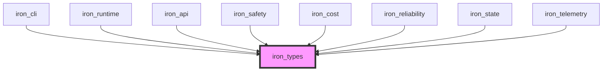
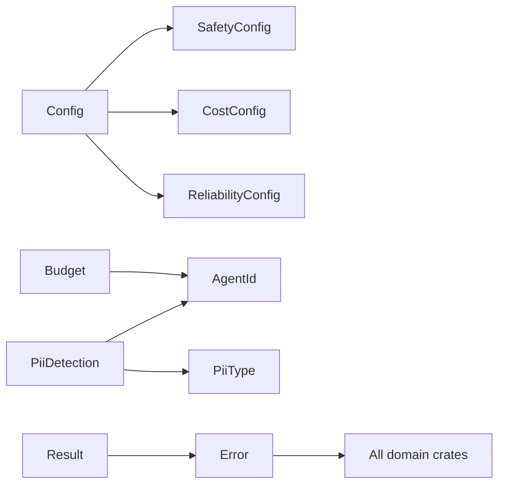

# spec

**Version:** 0.2
**Date:** 2025-12-07
**Component:** iron_types
**Layer:** Foundation (Layer 1)

---

## Scope

**Responsibility:** Shared types, traits, and error definitions for all Iron Cage pilot platform crates.

**In Scope:**
- Core domain types (AgentId, Budget, PiiDetection, CircuitBreakerState)
- Configuration structures for all 3 safety domains (Safety, Cost, Reliability)
- Unified error type with variants for all failure modes
- Result type alias for ergonomic error handling
- Serialization support (serde) for all types
- Type safety guarantees (newtype wrappers for primitive strings/numbers)

**Out of Scope:**
- Business logic implementation (belongs in domain crates: iron_safety, iron_cost, iron_reliability)
- Database schema definitions (belongs in iron_state)
- API contracts (belongs in iron_api)
- Advanced validation rules (pilot uses basic validation only, full platform will add comprehensive validation)
- Custom derive macros (pilot uses manual implementations, full platform may add proc macros)
- Zero-copy serialization optimizations (pilot prioritizes simplicity over performance)

## Deployment Context

This module operates identically in both Pilot and Production modes as a foundation type library.

**See:** [docs/deployment_packages.md](../../docs/deployment_packages.md) § Deployment Modes for deployment architecture.

**This Module (iron_types):**
- **Both Modes:** Shared type definitions used across all packages
- Used by both Agent Runtime and Control Panel
- No mode-specific behavior changes

---

## Project Goal

**Purpose:** Provide foundation types that prevent type confusion, enable compile-time safety, and establish ubiquitous language across all Iron Cage crates for the pilot platform (conference demo + $10-25K pilot customers).

**Primary Objective:** Eliminate primitive obsession and enable the Rust type system to catch bugs at compile time rather than runtime.

**Success Criteria:**
- ✅ All Iron Cage crates compile with no type conflicts
- ✅ AgentId cannot be confused with arbitrary strings (newtype wrapper)
- ✅ Budget math is type-safe (cannot add dollars to percentages)
- ✅ Error handling is consistent across all crates (single Error enum)
- ✅ Serialization works for all types (JSON for API, logs, storage)

---

## Problem Solved

**Without iron_types:**
- Primitive obsession: agent IDs are `String`, budgets are `f64`, leading to type confusion
- Error inconsistency: each crate defines own error types, no unified error handling
- Duplication: same types defined multiple times across crates (Budget in iron_cost AND iron_cli)
- Type safety gaps: can pass wrong string to function expecting AgentId, compiles but wrong

**With iron_types:**
- Newtype wrappers: `AgentId(String)` prevents passing arbitrary strings
- Unified errors: single `Error` enum with variants for all failure modes
- Zero duplication: Budget defined once, imported by iron_cost, iron_cli, iron_runtime
- Compile-time safety: type mismatch caught by compiler, not discovered in production

---

## Ubiquitous Language (Vocabulary)

**AgentId:** Unique identifier for a running agent instance. Format: `agent-{uuid}` (e.g., `agent-7a3f9c2d`). Newtype wrapper around String to prevent type confusion.

**Budget:** Financial constraint applied to agent execution. Contains three components: limit (maximum allowed spend), spent (cumulative cost so far), remaining (limit - spent). Always in USD.

**PiiType:** Classification of personally identifiable information. Pilot supports three types: Email, Phone, SSN. Full platform will add CreditCard, Passport, License, Custom.

**PiiDetection:** Evidence that PII was found in agent output. Contains: pii_type (what kind), location (character offset), value_hash (SHA256 of redacted value for audit). Does NOT contain actual PII value (security requirement).

**CircuitBreakerState:** State machine for circuit breaker pattern. Three states: Closed (normal operation), Open (failures detected, requests blocked), HalfOpen (testing if service recovered). Prevents cascade failures.

**SafetyConfig:** Configuration for PII detection and redaction. Controls whether detection is enabled and where audit logs are written.

**CostConfig:** Configuration for budget tracking and enforcement. Specifies hard limit (budget_usd) and warning threshold (alert_threshold as percentage, e.g., 0.90 for 90%).

**ReliabilityConfig:** Configuration for circuit breaker and fallback chains. Controls whether circuit breakers are enabled and failure threshold (number of consecutive failures before opening).

---

## System Architecture

### Component Role



**Role:** Foundation crate providing shared types to all other Iron Cage crates. Zero business logic—pure type definitions, trait declarations, and error handling.

**Design Principle:** Newtype pattern for domain primitives. Every domain concept (AgentId, Budget, etc.) gets a dedicated type, even if it's just wrapping String or f64. Compiler enforces domain boundaries.

---

### Type Dependency Graph



**Dependency Rules:**
- Types MUST NOT depend on external Iron crates (would create circular dependency)
- Types MUST only depend on other types within iron_types
- External crates import iron_types, never the reverse

---

## Functional Requirements

### FR-1: AgentId Type

**FR-1.1:** The crate must provide an `AgentId` newtype wrapper around `String`.

**FR-1.2:** AgentId must implement:
- `Debug`, `Clone`, `PartialEq`, `Eq`, `Hash` (for use in collections)
- `Display` (for logging)
- `Serialize`, `Deserialize` (for JSON API)

**FR-1.3:** AgentId must provide a constructor that validates format: `agent-{uuid}` where uuid is 8+ hex characters.

**FR-1.4:** Invalid AgentId construction must return `Result<AgentId, Error>` with descriptive error message.

**Test:**
```rust
let id = AgentId::new("agent-7a3f9c2d").unwrap();
assert_eq!(id.to_string(), "agent-7a3f9c2d");

let invalid = AgentId::new("invalid");
assert!(invalid.is_err());
```

---

### FR-2: Budget Type

**FR-2.1:** The crate must provide a `Budget` struct with fields: `limit: f64`, `spent: f64`.

**FR-2.2:** Budget must provide methods:
- `remaining(&self) -> f64` - Returns `limit - spent`
- `percentage_used(&self) -> f64` - Returns `(spent / limit) * 100.0`
- `add_cost(&mut self, amount: f64) -> Result<(), Error>` - Adds to spent, returns error if exceeds limit
- `would_exceed(&self, amount: f64) -> bool` - Checks if adding amount would exceed limit

**FR-2.3:** Budget must enforce invariant: `spent <= limit` at all times. Adding cost that would exceed limit must fail with `Error::BudgetExceeded`.

**FR-2.4:** Budget must implement `Serialize`, `Deserialize` for API transport.

**Test:**
```rust
let mut budget = Budget { limit: 50.0, spent: 0.0 };
assert_eq!(budget.remaining(), 50.0);

budget.add_cost(25.0).unwrap();
assert_eq!(budget.percentage_used(), 50.0);

assert!(budget.add_cost(30.0).is_err());  // Would exceed limit
```

---

### FR-3: PII Types

**FR-3.1:** The crate must provide `PiiType` enum with variants: `Email`, `Phone`, `Ssn`.

**FR-3.2:** The crate must provide `PiiDetection` struct with fields:
- `pii_type: PiiType` - Type of PII detected
- `location: usize` - Character offset in output where PII was found
- `value_hash: String` - SHA256 hash of original value (for audit, NOT the actual PII)
- `timestamp: i64` - Unix timestamp of detection

**FR-3.3:** PiiDetection must implement `Serialize`, `Deserialize` for audit logging.

**FR-3.4:** PiiDetection must implement `Display` for human-readable logging format:
`"PII detected: {pii_type} at position {location} (hash: {value_hash})"`

**Test:**
```rust
use std::collections::hash_map::DefaultHasher;
use std::hash::{Hash, Hasher};

let detection = PiiDetection {
  pii_type: PiiType::Email,
  location: 15,
  value_hash: "abc123...".to_string(),
  timestamp: 1700000000,
};

assert_eq!(format!("{}", detection), "PII detected: Email at position 15 (hash: abc123...)");
```

---

### FR-4: Circuit Breaker State

**FR-4.1:** The crate must provide `CircuitBreakerState` enum with variants:
- `Closed` - Normal operation, requests pass through
- `Open { opened_at: i64, cooldown_seconds: u64 }` - Failures detected, requests blocked
- `HalfOpen { test_request_count: usize }` - Testing if service recovered

**FR-4.2:** CircuitBreakerState must implement state transition validation:
- `Closed` can transition to `Open` only
- `Open` can transition to `HalfOpen` only (after cooldown expires)
- `HalfOpen` can transition to `Closed` (on success) or `Open` (on failure)

**FR-4.3:** CircuitBreakerState must provide method: `can_allow_request(&self) -> bool`
- `Closed`: returns `true`
- `Open`: returns `false` (unless cooldown expired, then transitions to HalfOpen)
- `HalfOpen`: returns `true` (but limits request count)

**Test:**
```rust
let mut state = CircuitBreakerState::Closed;
assert!(state.can_allow_request());

state = CircuitBreakerState::Open {
  opened_at: 1700000000,
  cooldown_seconds: 60,
};
assert!(!state.can_allow_request());
```

---

### FR-5: Configuration Types

**FR-5.1:** The crate must provide `Config` struct containing: `safety: SafetyConfig`, `cost: CostConfig`, `reliability: ReliabilityConfig`.

**FR-5.2:** Config must implement `Default` with sensible pilot defaults:
- `safety.pii_detection_enabled = true`
- `safety.audit_log_path = Some("./iron_cage_audit.log")`
- `cost.budget_usd = 50.0`
- `cost.alert_threshold = 0.90` (90%)
- `reliability.circuit_breaker_enabled = true`
- `reliability.failure_threshold = 5`

**FR-5.3:** Config must support deserialization from YAML and TOML formats (via serde).

**FR-5.4:** Config validation must reject:
- Negative budgets
- Alert thresholds outside 0.0-1.0 range
- Failure thresholds < 1

**Test:**
```rust
let config = Config::default();
assert_eq!(config.cost.budget_usd, 50.0);
assert_eq!(config.cost.alert_threshold, 0.90);

let yaml = "cost:\n  budget_usd: -10.0";
let invalid: Result<Config> = serde_yaml::from_str(yaml);
assert!(invalid.is_err());  // Negative budget rejected
```

---

### FR-6: Error Enum

**FR-6.1:** The crate must provide `Error` enum with variants covering all Iron Cage failure modes:
- `Safety(String)` - PII detection, policy violations
- `BudgetExceeded(String)` - Cost limit reached
- `CircuitBreakerOpen(String)` - Service unavailable
- `Config(String)` - Invalid configuration
- `Agent(String)` - Agent startup/runtime failures
- `Io(std::io::Error)` - File/network I/O errors

**FR-6.2:** Error must implement `std::error::Error` trait via thiserror derive.

**FR-6.3:** Error must implement `Display` with human-readable messages suitable for logging.

**FR-6.4:** Error must implement `From<std::io::Error>` for ergonomic `?` operator usage.

**Test:**
```rust
fn read_config() -> Result<Config> {
  let file = std::fs::read_to_string("config.yaml")?;  // io::Error auto-converts
  Ok(serde_yaml::from_str(&file)?)
}
```

---

### FR-7: Result Type Alias

**FR-7.1:** The crate must provide type alias: `pub type Result<T> = std::result::Result<T, Error>`.

**FR-7.2:** All public APIs in iron_types that can fail must return `Result<T>`.

**Rationale:** Reduces boilerplate and ensures consistent error handling across entire Iron Cage codebase.

---

## Non-Functional Requirements

### NFR-1: Compilation Performance

**NFR-1.1:** The crate must compile in under 5 seconds on a modern development machine (2020+ laptop, 4+ cores).

**Measurement:** `time cargo build -p iron_types --release`

**Rationale:** Foundation crate is compiled frequently. Fast compilation improves developer productivity.

---

### NFR-2: Zero Runtime Overhead

**NFR-2.1:** All newtype wrappers (AgentId, etc.) must be `#[repr(transparent)]` to guarantee zero runtime overhead.

**Verification:** Check generated assembly contains no wrapper allocation/deallocation.

**Rationale:** Types are used in hot paths (every LLM call). Zero overhead ensures type safety doesn't degrade performance.

---

### NFR-3: Serialization Efficiency

**NFR-3.1:** Serialized JSON representation must be compact (no nested wrappers for newtypes).

**Example:** `AgentId("agent-123")` must serialize to `"agent-123"`, NOT `{"value": "agent-123"}`.

**Implementation:** Use serde's `#[serde(transparent)]` attribute.

**Rationale:** API payloads and logs must be minimal. Nested wrappers inflate payload size and reduce readability.

---

## Functional Design (Recommended)

### Newtype Pattern (Recommended)

**Recommendation:** It is recommended to use the newtype pattern for all domain primitives.

**Structure:**
```rust
#[repr(transparent)]
#[derive(Debug, Clone, PartialEq, Eq, Hash, Serialize, Deserialize)]
#[serde(transparent)]
pub struct AgentId(String);
```

**Benefits:**
- Type safety (cannot pass wrong string)
- Self-documenting (function signature shows `AgentId`, not `String`)
- Validation encapsulation (constructor validates format)

---

### Configuration Validation (Recommended)

**Recommendation:** It is recommended to implement a `Config::validate() -> Result<()>` method that checks all configuration invariants.

**Validation Rules:**
- Budget >= 0.0
- Alert threshold in range 0.0..=1.0
- Failure threshold >= 1
- Paths exist and are writable (if specified)

**Usage:**
```rust
let config: Config = serde_yaml::from_str(yaml)?;
config.validate()?;  // Fails fast on invalid config
```

---

## API Surface

### Public Exports

```rust
// Core domain types
pub struct AgentId(String);
pub struct Budget { pub limit: f64, pub spent: f64 }
pub enum PiiType { Email, Phone, Ssn }
pub struct PiiDetection { pub pii_type: PiiType, pub location: usize, pub value_hash: String, pub timestamp: i64 }
pub enum CircuitBreakerState { Closed, Open { opened_at: i64, cooldown_seconds: u64 }, HalfOpen { test_request_count: usize } }

// Configuration
pub struct Config { pub safety: SafetyConfig, pub cost: CostConfig, pub reliability: ReliabilityConfig }
pub struct SafetyConfig { pub pii_detection_enabled: bool, pub audit_log_path: Option<String> }
pub struct CostConfig { pub budget_usd: f64, pub alert_threshold: f64 }
pub struct ReliabilityConfig { pub circuit_breaker_enabled: bool, pub failure_threshold: u32 }

// Error handling
pub enum Error { Safety(String), BudgetExceeded(String), CircuitBreakerOpen(String), Config(String), Agent(String), Io(std::io::Error) }
pub type Result<T> = std::result::Result<T, Error>;
```

---

## External Dependencies

### Dependency: serde (Serialization)

- **Purpose:** JSON serialization for API transport, configuration loading, audit logging
- **Version:** 1.0+
- **Required Features:** `derive` (for automatic Serialize/Deserialize implementations)
- **Risk Assessment:**
  - **Availability:** Low risk (core Rust ecosystem crate, stable)
  - **Performance:** Negligible impact (compile-time code generation)
  - **Security:** Low risk (widely audited, no known vulnerabilities)
  - **Cost:** Free (MIT/Apache licensed)

---

### Dependency: thiserror (Error Derivation)

- **Purpose:** Ergonomic Error enum derivation (implements std::error::Error + Display)
- **Version:** 1.0+
- **Required Features:** None
- **Risk Assessment:**
  - **Availability:** Low risk (maintained by dtolnay, Rust core contributor)
  - **Performance:** Zero runtime overhead (compile-time code generation)
  - **Security:** Low risk (minimal code, no network/IO)
  - **Cost:** Free (MIT/Apache licensed)

---

## Limitations

**Pilot Scope Limitations:**
- **PII Types:** Only 3 types supported (Email, Phone, SSN). Full platform will add CreditCard, Passport, License, Custom patterns.
- **Validation Complexity:** Basic validation only (format checks, range checks). Full platform will add cross-field validation, business rule validation.
- **Internationalization:** US-only formats for Phone and SSN. Full platform will support international formats.
- **Performance:** Not optimized for high-throughput scenarios (>10,000 agents/sec). Pilot supports single-agent demo only.

---

## Success Metrics

**Code Quality:**
- ✅ 100% test coverage for all public APIs
- ✅ Zero clippy warnings
- ✅ All types implement expected traits (Debug, Clone, Serialize, etc.)

**Integration:**
- ✅ All 9 Iron crates import iron_types successfully
- ✅ No type conflicts across crate boundaries
- ✅ Single unified Error type used everywhere

**Performance:**
- ✅ Compilation time < 5 seconds
- ✅ Newtype wrappers have zero runtime overhead (verified via assembly inspection)
- ✅ Serialization round-trip succeeds for all types

---

## Deliverables

- **Compiled Rust Library:** `libiron_types.rlib` for linking into all Iron crates
- **Public API Documentation:** `cargo doc` generated documentation for all public types
- **Test Suite:** Comprehensive unit tests covering all Functional Requirements

---

## Cross-References

**Implemented By:** All Iron Cage crates depend on this foundation

**Primary Consumers:**
- [iron_safety](../iron_safety/spec.md) - Uses PiiType, PiiDetection, Error::Safety
- [iron_cost](../iron_cost/spec.md) - Uses Budget, Error::BudgetExceeded
- [iron_reliability](../iron_reliability/spec.md) - Uses CircuitBreakerState, Error::CircuitBreakerOpen
- [iron_runtime](../iron_runtime/spec.md) - Uses AgentId, Config, Error, Result
- [iron_cli](../iron_cli/spec.md) - Uses Config for argument parsing

**Parent Specification:** [Pilot Platform](../../iron_cage/pilot/spec.md) - See lines 646-678 for iron_types architecture role

---

## Appendix: Addendum

### Conformance Checklist

| Status | Requirement | Verification Notes |
|--------|-------------|-------------------|
| ❌ | FR-1.1: Provide AgentId newtype wrapper | Unit test: AgentId construction |
| ❌ | FR-1.2: AgentId implements Debug, Clone, PartialEq, Eq, Hash, Display, Serialize, Deserialize | Compile test: use AgentId in HashMap |
| ❌ | FR-1.3: AgentId validates format `agent-{uuid}` | Unit test: invalid format rejected |
| ❌ | FR-1.4: Invalid AgentId returns Result with error | Unit test: error message verified |
| ❌ | FR-2.1: Budget struct with limit and spent fields | Struct definition exists |
| ❌ | FR-2.2: Budget provides remaining(), percentage_used(), add_cost(), would_exceed() | Unit tests for all methods |
| ❌ | FR-2.3: Budget enforces spent <= limit invariant | Unit test: add_cost rejects overflow |
| ❌ | FR-2.4: Budget implements Serialize, Deserialize | Integration test: JSON round-trip |
| ❌ | FR-3.1: PiiType enum with Email, Phone, Ssn | Enum definition exists |
| ❌ | FR-3.2: PiiDetection struct with pii_type, location, value_hash, timestamp | Struct definition exists |
| ❌ | FR-3.3: PiiDetection implements Serialize, Deserialize | Unit test: JSON serialization |
| ❌ | FR-3.4: PiiDetection implements Display with specified format | Unit test: format string match |
| ❌ | FR-4.1: CircuitBreakerState enum with Closed, Open, HalfOpen | Enum definition exists |
| ❌ | FR-4.2: State transition validation (Closed→Open, Open→HalfOpen, HalfOpen→Closed/Open) | Unit test: invalid transitions rejected |
| ❌ | FR-4.3: can_allow_request() returns correct bool for each state | Unit test: all states verified |
| ❌ | FR-5.1: Config struct contains safety, cost, reliability sub-configs | Struct definition exists |
| ❌ | FR-5.2: Config::default() returns sensible pilot defaults | Unit test: default values verified |
| ❌ | FR-5.3: Config supports YAML and TOML deserialization | Integration test: parse both formats |
| ❌ | FR-5.4: Config validation rejects invalid values (negative budget, etc.) | Unit test: validate() method |
| ❌ | FR-6.1: Error enum with Safety, BudgetExceeded, CircuitBreakerOpen, Config, Agent, Io | Enum definition exists |
| ❌ | FR-6.2: Error implements std::error::Error via thiserror | Compile test: use in Box<dyn Error> |
| ❌ | FR-6.3: Error implements Display with human-readable messages | Unit test: error message quality |
| ❌ | FR-6.4: Error implements From<io::Error> | Unit test: io::Error auto-converts via ? |
| ❌ | FR-7.1: Result<T> type alias defined | Type alias exists |
| ❌ | FR-7.2: All fallible APIs return Result<T> | API audit: no unwrap() in public APIs |
| ❌ | NFR-1.1: Compiles in < 5 seconds | Benchmark: `time cargo build -p iron_types --release` |
| ❌ | NFR-2.1: Newtypes are repr(transparent) for zero overhead | Assembly inspection or size_of checks |
| ❌ | NFR-3.1: AgentId serializes to string, not nested object | Unit test: JSON output format |

---

### Implementation Guidance

**Design Patterns:**
- **Newtype Pattern:** All domain primitives wrapped in dedicated types
- **Type State Pattern:** Circuit breaker states enforce valid transitions at compile time
- **Result-based Errors:** No panics in public APIs, always return Result<T>

**Testing Strategy:**
- Unit test every public method
- Property-based testing for Budget arithmetic (remaining always non-negative)
- Integration tests for serde round-trips (JSON, YAML, TOML)

**Code Organization:**
```
src/
├── lib.rs           # Feature gates and re-exports
├── agent.rs         # AgentId type
├── budget.rs        # Budget type and methods
├── pii.rs           # PiiType and PiiDetection
├── circuit.rs       # CircuitBreakerState
├── config.rs        # Config and sub-configs
└── error.rs         # Error enum and Result alias

tests/
├── agent_test.rs
├── budget_test.rs
├── pii_test.rs
├── circuit_test.rs
├── config_test.rs
└── error_test.rs
```

---

### Known Constraints

**Pilot Constraints:**
- **Single-Agent Focus:** Types optimized for single-agent demo, not multi-agent orchestration
- **US-Only Formats:** Phone/SSN validation assumes US formats
- **Basic Validation:** No complex business rules (e.g., "budget must be divisible by 10")

**Future Extensions (Post-Pilot):**
- Add CreditCard, Passport PII types
- Add international phone/SSN formats
- Add AgentGroup type for multi-agent orchestration
- Add BudgetPool type for team-level budgets

---

### Revision History

| Version | Date | Changes |
|---------|------|---------|
| 0.2 | 2025-12-07 | Added Deployment Context - clarify foundation module used in both modes |
| 0.1 | 2025-11-25 | Initial pilot specification - foundation types for conference demo |

