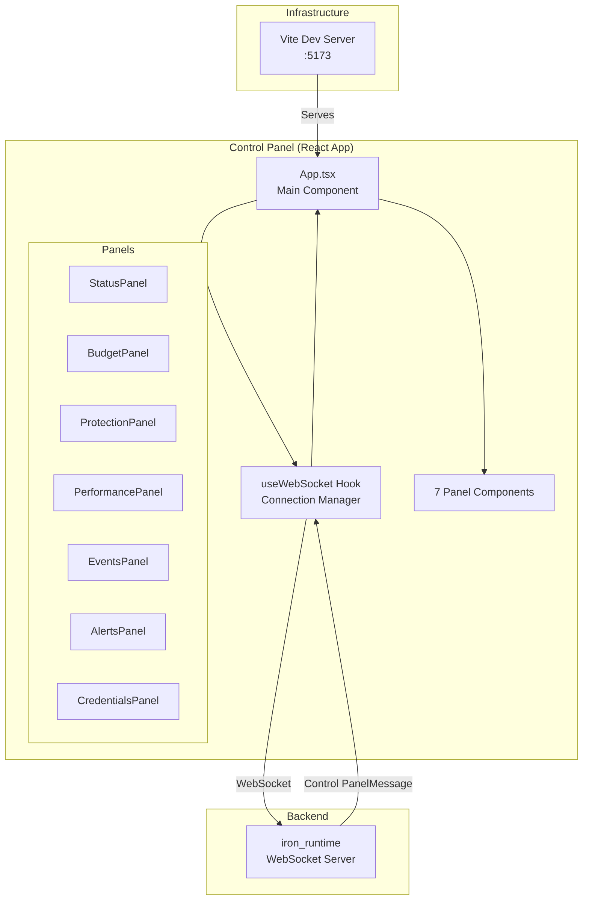
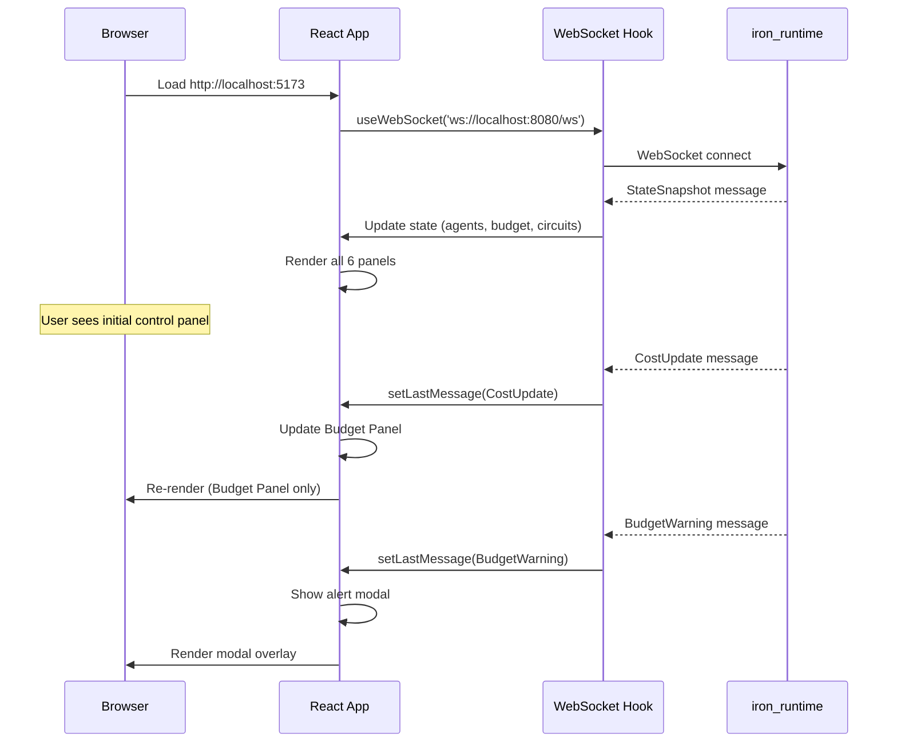

# spec

**Version:** 0.1
**Date:** 2025-11-25
**Component:** iron_control (React Control Panel)
**Layer:** Application (Layer 4)
**Status:** Specification Complete, Implementation Not Started
**Priority:** OPTIONAL for Pilot (Slides-Only Recommended)

---

## 1. Overview

### 1.1 Purpose

**iron_control** is a **React-based web control panel** that visualizes real-time metrics from Iron Cage runtime during AI agent execution. It provides a professional visual interface for conference demos, showing live updates of cost, safety events, and performance metrics as agents process tasks.

**Primary Responsibilities:**
- Real-time metrics visualization (7 panels: status, cost, safety, performance, events, alerts, secrets)
- WebSocket client for runtime connection
- Alert modals for demo triggers (circuit breaker, PII, budget, secret rotation)
- Responsive layout for presentation screens
- Chart rendering (cost trends, success rates)

**Pilot Scope:** Basic 7-panel control panel with WebSocket streaming for 5-minute conference demo (includes secrets management).

**Full Platform (Out of Scope):** Historical data analysis, multi-agent comparison, custom control panels, mobile app, authentication.

**CRITICAL NOTE:**
Per `/pilot/execution/quick_start.md` and `/pilot/demo/readme.md`, control panel implementation is **OPTIONAL for pilot**. Slides-only approach recommended for 22-day deadline. This specification is provided for completeness but can be deferred to post-conference.

### 1.2 Design Principles

1. **Real-Time First** - All metrics update via WebSocket, no polling
2. **Visual Impact** - Large fonts, bold colors for conference projection
3. **Distraction-Free** - Clean layout, no unnecessary chrome
4. **Demo-Driven** - Optimized for 3 trigger moments (circuit, PII, budget)
5. **Presentation-Ready** - Readable from 20 feet away (1920×1080 projection)

---

## 2. Scope

### 2.1 In Scope (Pilot)

**For Pilot Project (Conference Demo - IF IMPLEMENTED):**
- 7-panel layout (Status, Cost, Safety, Performance, Events, Alerts, Secrets)
- WebSocket client connecting to ws://localhost:8080/ws
- Real-time metric updates (<100ms latency)
- Alert modals for 4 demo triggers (circuit breaker, PII, budget, secret rotation)
- Cost trend chart (line chart, last 100 updates)
- Success rate gauge (circular progress)
- Secrets management panel with Add/Edit/Delete forms
- Responsive layout (1920×1080 presentation mode)
- TypeScript + React 18 + Vite

**Rationale:** Control Panel provides visual impact for conference demo. 7 panels show comprehensive runtime monitoring including secrets management.

**ALTERNATIVE (RECOMMENDED):**
Skip control panel implementation, use slides with terminal screenshots. Saves 900 LOC (~4-5 developer-days) with no demo value loss.

### 2.2 Out of Scope (Full Platform)

**Deferred to Post-Pilot:**
- Historical data analysis (time-series DB) → Pilot shows real-time only
- Multi-agent comparison control panel → Pilot has 1 agent
- Custom control panel builder (drag-and-drop) → Pilot has fixed layout
- Mobile app (React Native) → Pilot is desktop only
- User authentication (login/logout) → Pilot is localhost-only
- Control Panel theming (dark/light mode) → Pilot has single theme
- Export reports (PDF, CSV) → Pilot is view-only
- Alert configuration (thresholds) → Pilot uses hardcoded values

**Reasoning:** Conference demo is 5 minutes with single agent. Advanced analytics and customization add development time without presentation value.

---

## 3. Functional Requirements

### FR-1: Seven-Panel Layout

**Requirement:**
Display 7 distinct panels in grid layout, each showing specific aspect of runtime state.

**Layout (1920×1080):**
```
┌──────────────────────────────────────────────────────────────────┐
│  Header: Iron Cage Control Panel                      [Connected]   │
├──────────────┬──────────────┬──────────────┬────────────────────┤
│  Status      │  Cost        │  Safety      │  Secrets           │
│  Panel       │  Panel       │  Panel       │  Panel             │
│              │              │              │                    │
├──────────────┼──────────────┼──────────────┴────────────────────┤
│  Performance │  Events      │  Alerts                           │
│  Panel       │  Panel       │  Panel                            │
│              │              │                                   │
└──────────────┴──────────────┴───────────────────────────────────┘
```

**Panel Specifications:**

**1. Status Panel (Top-Left):**
- Agent ID
- Status badge (RUNNING=green, COMPLETED=blue, FAILED=red)
- Leads processed: "45 / 100"
- Duration: "1m 23s"
- Start time: "14:23:32"

**2. Budget Panel (Top-Center):**
- Circular progress gauge (percentage used)
- Total spent: "$23.14"
- Budget limit: "$50.00"
- Remaining: "$26.86"
- Last cost: "$0.45"
- Trend chart (line chart, last 50 costs)

**3. Protection Panel (Top-Right):**
- privacy protections count: "1"
- Last detection: "Email at 14:24:12"
- Auto-redact status: "ENABLED" (green badge)
- Event log (last 10 PII events)

**4. Performance Panel (Bottom-Left):**
- Success rate: "98%" (gauge)
- safety cutoffs:
  - linkedin_api: OPEN (red)
  - openai_api: CLOSED (green)
- Avg response time: "1.2s"

**5. Activity Panel (Bottom-Center):**
- Scrolling event log (last 50 events)
- Format: `[14:23:45] CRIT safety cutoff OPENED`
- Auto-scroll to bottom
- Color-coded by level

**6. Notifications Panel (Bottom-Right):**
- Active alerts count: "2"
- Alert list:
  - "Budget Warning (90%)" - yellow
  - "Circuit Open (linkedin_api)" - red
- Dismiss button per alert

**7. Credentials Panel (Top-Right):**
- Secret count: "3 secrets"
- Secret list with masked values:
  - Name: OPENAI_API_KEY
  - Environment: Production
  - Value: `sk-proj-abc...xyz` (masked)
  - Actions: [✏️ Edit] [🗑️ Delete]
- [+ Add Secret] button
- Last rotation timestamp
- Status badge: "ENCRYPTED" (green)

---

### FR-2: WebSocket Client

**Requirement:**
Connect to Iron Cage runtime via WebSocket, receive real-time updates, handle reconnection.

**Implementation (TypeScript):**
```typescript
// src/hooks/useWebSocket.ts
import { useEffect, useState } from 'react';

interface WebSocketHook {
  connected: boolean;
  lastMessage: Control PanelMessage | null;
  error: Error | null;
}

export function useWebSocket(url: string): WebSocketHook {
  const [connected, setConnected] = useState(false);
  const [lastMessage, setLastMessage] = useState<Control PanelMessage | null>(null);
  const [error, setError] = useState<Error | null>(null);

  useEffect(() => {
    const ws = new WebSocket(url);

    ws.onopen = () => {
      console.log('WebSocket connected');
      setConnected(true);
      setError(null);
    };

    ws.onmessage = (event) => {
      const message: Control PanelMessage = JSON.parse(event.data);
      setLastMessage(message);
    };

    ws.onerror = (event) => {
      console.error('WebSocket error:', event);
      setError(new Error('WebSocket connection failed'));
    };

    ws.onclose = () => {
      console.log('WebSocket closed, reconnecting in 2s...');
      setConnected(false);

      // Auto-reconnect
      setTimeout(() => {
        // useEffect will re-run and create new connection
      }, 2000);
    };

    return () => ws.close();
  }, [url]);

  return { connected, lastMessage, error };
}
```

**Message Handling:**
```typescript
// src/App.tsx
function App() {
  const { connected, lastMessage } = useWebSocket('ws://localhost:8080/ws');

  useEffect(() => {
    if (!lastMessage) return;

    switch (lastMessage.type) {
      case 'StateSnapshot':
        // Initial render: set all panel data
        setAgents(lastMessage.agents);
        setBudget(lastMessage.budget);
        setCircuits(lastMessage.circuits);
        break;

      case 'CostUpdate':
        // Update Budget Panel
        updateCostMetrics(lastMessage.metrics);
        break;

      case 'BudgetWarning':
        // Show alert modal (Demo Trigger #3)
        showNotification({
          title: 'Budget Warning',
          message: `${lastMessage.warning.percentage_used * 100}% of budget used`,
          severity: 'warning',
        });
        break;

      case 'PiiAlert':
        // Show alert modal (Demo Trigger #2)
        showNotification({
          title: 'PII Leak Prevented',
          message: `${lastMessage.pii_type} detected and redacted`,
          severity: 'critical',
        });
        break;

      case 'CircuitOpened':
        // Update Performance Panel (Demo Trigger #1)
        updateCircuitStatus(lastMessage.service, 'OPEN');
        showNotification({
          title: 'Safety Cutoff Opened',
          message: `${lastMessage.service} circuit opened (${lastMessage.failure_count} failures)`,
          severity: 'critical',
        });
        break;

      case 'SecretRotated':
        // Update Credentials Panel (Demo Trigger #4)
        showToast({
          message: `Secret updated: ${lastMessage.secret_name}`,
          severity: 'success',
        });
        // Refresh secrets list
        refreshSecrets();
        break;

      default:
        console.warn('Unknown message type:', lastMessage.type);
    }
  }, [lastMessage]);

  return (
    <Control PanelLayout>
      <Header connected={connected} />
      <Grid>
        <StatusPanel />
        <BudgetPanel />
        <ProtectionPanel />
        <CredentialsPanel />
        <PerformancePanel />
        <EventsPanel />
        <AlertsPanel />
      </Grid>
    </Control PanelLayout>
  );
}
```

---

### FR-3: Notifications for Demo Triggers

**Requirement:**
Display modal overlays when demo triggers fire (circuit breaker, PII, budget, secret rotation).

**Modal Types:**

**1. Safety Cutoff Opened (Trigger #1, Lead #34):**
```
┌────────────────────────────────────────┐
│  🔴 Safety Cutoff Opened             │
├────────────────────────────────────────┤
│                                        │
│  Service: linkedin_api                 │
│  Failures: 3                           │
│  Status: OPEN                          │
│                                        │
│  Iron Cage automatically switched to   │
│  cached data to prevent cascading      │
│  failures.                             │
│                                        │
│           [Dismiss]                    │
└────────────────────────────────────────┘
```

**2. PII Detected (Trigger #2, Lead #67):**
```
┌────────────────────────────────────────┐
│  🔒 PII Leak Prevented                 │
├────────────────────────────────────────┤
│                                        │
│  Type: Email                           │
│  Location: LLM Output                  │
│  Action: Redacted                      │
│                                        │
│  Iron Cage detected sensitive data     │
│  and automatically redacted it to      │
│  prevent GDPR violations.              │
│                                        │
│  Estimated fine avoided: $2.9M         │
│                                        │
│           [Dismiss]                    │
└────────────────────────────────────────┘
```

**3. Budget Warning (Trigger #3, Lead #85):**
```
┌────────────────────────────────────────┐
│  ⚠️  Budget Warning                     │
├────────────────────────────────────────┤
│                                        │
│  Threshold: 90%                        │
│  Spent: $45.12                         │
│  Budget: $50.00                        │
│  Remaining: $4.88                      │
│                                        │
│  You are approaching your budget       │
│  limit. Agent will stop at 100%.       │
│                                        │
│           [Dismiss]                    │
└────────────────────────────────────────┘
```

**4. Secret Rotated (Trigger #4, Lead #50):**
```
┌────────────────────────────────────────┐
│  🔄 Secret Rotated                     │
├────────────────────────────────────────┤
│                                        │
│  Secret: OPENAI_API_KEY                │
│  Environment: Production               │
│  Status: Updated                       │
│                                        │
│  Secret reloaded successfully.         │
│  Agent continues with zero downtime.   │
│                                        │
│  SIGUSR1 signal sent to agent PID      │
│  42891.                                │
│                                        │
│           [Dismiss]                    │
└────────────────────────────────────────┘
```

**Implementation:**
```typescript
// src/components/Notification.tsx
interface NotificationProps {
  title: string;
  message: string;
  severity: 'info' | 'warning' | 'critical';
  onDismiss: () => void;
}

export function Notification({ title, message, severity, onDismiss }: NotificationProps) {
  const emoji = {
    info: 'ℹ️',
    warning: '⚠️',
    critical: '🔴',
  }[severity];

  const bgColor = {
    info: 'bg-blue-500',
    warning: 'bg-yellow-500',
    critical: 'bg-red-500',
  }[severity];

  return (
    <div className="modal-overlay">
      <div className="modal-content">
        <div className={`modal-header ${bgColor}`}>
          <span className="text-2xl">{emoji}</span>
          <h2 className="text-xl font-bold">{title}</h2>
        </div>
        <div className="modal-body">
          {message}
        </div>
        <div className="modal-footer">
          <button onClick={onDismiss}>Dismiss</button>
        </div>
      </div>
    </div>
  );
}
```

---

### FR-4: Cost Trend Chart

**Requirement:**
Display line chart showing cost accumulation over time (last 100 data points).

**Chart Specification:**
- X-axis: Lead number (1-100)
- Y-axis: Cumulative cost ($0-$50)
- Line color: Blue
- Budget limit: Red horizontal line at $50
- Warning threshold: Yellow horizontal line at $45 (90%)

**Implementation:**
```typescript
// src/components/BudgetPanel.tsx
import { LineChart, Line, XAxis, YAxis, CartesianGrid, ReferenceLine } from 'recharts';

interface CostDataPoint {
  lead: number;
  cost: number;
}

export function BudgetPanel({ metrics }: { metrics: CostMetrics }) {
  const [costHistory, setCostHistory] = useState<CostDataPoint[]>([]);

  useEffect(() => {
    // Append new data point
    setCostHistory(prev => {
      const updated = [...prev, { lead: metrics.leads_processed, cost: metrics.total_spent }];
      return updated.slice(-100);  // Keep last 100 points
    });
  }, [metrics]);

  return (
    <div className="panel cost-panel">
      <h3>Cost Tracking</h3>

      {/* Circular gauge */}
      <CircularProgress
        value={metrics.percentage_used}
        max={1.0}
        color={metrics.percentage_used > 0.9 ? 'red' : 'green'}
        label={`${(metrics.percentage_used * 100).toFixed(1)}%`}
      />

      <div className="metrics">
        <MetricRow label="Spent" value={`$${metrics.total_spent.toFixed(2)}`} />
        <MetricRow label="Budget" value={`$${metrics.budget_limit.toFixed(2)}`} />
        <MetricRow label="Remaining" value={`$${metrics.remaining.toFixed(2)}`} />
      </div>

      {/* Trend chart */}
      <LineChart width={400} height={200} data={costHistory}>
        <CartesianGrid strokeDasharray="3 3" />
        <XAxis dataKey="lead" label="Lead #" />
        <YAxis label="Cost (USD)" />
        <Line type="monotone" dataKey="cost" stroke="#3b82f6" strokeWidth={2} />
        <ReferenceLine y={50} stroke="red" strokeDasharray="3 3" label="Budget" />
        <ReferenceLine y={45} stroke="orange" strokeDasharray="3 3" label="90%" />
      </LineChart>
    </div>
  );
}
```

**Demo Impact:**
- Visual line climbing toward red budget line
- Spike visible when warning threshold crossed (lead #85)
- Audience sees real-time cost accumulation

---

### FR-5: Performance Panel with Circuit Status

**Requirement:**
Display circuit breaker states with color-coded indicators.

**Panel Content:**
- Success rate: 98% (circular gauge)
- safety cutoffs:
  - 🟢 openai_api: CLOSED
  - 🔴 linkedin_api: OPEN
- Avg response time: 1.2s
- Leads/sec throughput: 0.6

**Implementation:**
```typescript
// src/components/PerformancePanel.tsx
export function PerformancePanel({ metrics }: { metrics: PerformanceMetrics }) {
  return (
    <div className="panel performance-panel">
      <h3>Performance</h3>

      {/* Success rate gauge */}
      <CircularGauge
        value={metrics.success_rate}
        label="Success Rate"
        color={metrics.success_rate > 0.95 ? 'green' : 'yellow'}
      />

      {/* safety cutoffs */}
      <div className="circuits">
        <h4>Safety Cutoffs</h4>
        {metrics.circuits.map(circuit => (
          <CircuitIndicator
            key={circuit.service}
            service={circuit.service}
            state={circuit.state}
            failureCount={circuit.failure_count}
          />
        ))}
      </div>

      {/* Metrics */}
      <MetricRow label="Avg Response" value={`${metrics.avg_response_ms}ms`} />
      <MetricRow label="Throughput" value={`${metrics.leads_per_sec.toFixed(1)}/s`} />
    </div>
  );
}

function CircuitIndicator({ service, state, failureCount }: CircuitBreakerMetrics) {
  const emoji = state === 'OPEN' ? '🔴' : state === 'HALF_OPEN' ? '🟡' : '🟢';
  const color = state === 'OPEN' ? 'text-red-500' : state === 'HALF_OPEN' ? 'text-yellow-500' : 'text-green-500';

  return (
    <div className={`circuit-indicator ${color}`}>
      <span className="text-2xl">{emoji}</span>
      <span className="font-mono">{service}</span>
      <span className="text-sm">({state})</span>
      {failureCount > 0 && <span className="text-xs">Failures: {failureCount}</span>}
    </div>
  );
}
```

**Demo Trigger #1 Visual:**
- Before lead #34: linkedin_api shows 🟢 CLOSED
- After lead #34: linkedin_api turns 🔴 OPEN
- Failure count increments: 1 → 2 → 3
- Modal pops up with alert message

---

### FR-6: Activity Panel with Auto-Scroll

**Requirement:**
Display scrolling event log with last 50 events, color-coded by severity.

**Event Display:**
```
[14:23:32] INFO  Agent started (agent-001)
[14:23:32] INFO  Processing lead 1/100: Acme Corp
[14:23:33] INFO  Cost: $0.42 | Total: $0.42
...
[14:23:45] CRIT  🔴 safety cutoff OPENED for linkedin_api
[14:23:46] INFO  Using cached LinkedIn URL
...
[14:24:12] CRIT  🔒 PII DETECTED IN OUTPUT
...
[14:24:58] WARN  ⚠️  BUDGET WARNING: 90% reached
```

**Implementation:**
```typescript
// src/components/EventsPanel.tsx
interface Event {
  timestamp: string;  // "14:23:45"
  level: 'INFO' | 'WARN' | 'ERROR' | 'CRIT';
  message: string;
}

export function EventsPanel() {
  const [events, setEvents] = useState<Event[]>([]);
  const eventsEndRef = useRef<HTMLDivElement>(null);

  const { lastMessage } = useWebSocket('ws://localhost:8080/ws');

  useEffect(() => {
    if (!lastMessage) return;

    // Convert Control PanelMessage to Event
    const event = convertToEvent(lastMessage);
    if (event) {
      setEvents(prev => {
        const updated = [...prev, event];
        return updated.slice(-50);  // Keep last 50
      });
    }
  }, [lastMessage]);

  // Auto-scroll to bottom
  useEffect(() => {
    eventsEndRef.current?.scrollIntoView({ behavior: 'smooth' });
  }, [events]);

  const levelColors = {
    INFO: 'text-green-400',
    WARN: 'text-yellow-400',
    ERROR: 'text-red-400',
    CRIT: 'text-red-600 font-bold',
  };

  return (
    <div className="panel events-panel">
      <h3>Event Log</h3>
      <div className="events-scroll overflow-y-auto h-64 font-mono text-sm">
        {events.map((event, idx) => (
          <div key={idx} className={`event-line ${levelColors[event.level]}`}>
            <span className="timestamp">[{event.timestamp}]</span>
            <span className="level">{event.level}</span>
            <span className="message">{event.message}</span>
          </div>
        ))}
        <div ref={eventsEndRef} />
      </div>
    </div>
  );
}
```

---

### FR-7: Secrets Management Panel

**Requirement:**
Display secrets management interface with Add/Edit/Delete forms, masked secret values, and real-time rotation updates.

**Panel Content:**
```
┌────────────────────────────────────────────────────┐
│ Secrets Management                       [+ Add]   │
├────────────────────────────────────────────────────┤
│ Name                Environment    Value          │
│ OPENAI_API_KEY      Production     sk-proj-ab...z │ [✏️] [🗑️]
│ LINKEDIN_API_KEY    Production     li-abc...xyz   │ [✏️] [🗑️]
│ POSTGRES_PASSWORD   Development    pg-dev...123   │ [✏️] [🗑️]
├────────────────────────────────────────────────────┤
│ 🔒 All secrets encrypted (AES-256-GCM)            │
│ Last rotation: 2 minutes ago                       │
└────────────────────────────────────────────────────┘
```

**Add Secret Modal:**
```
┌────────────────────────────────────────┐
│  ➕ Add Secret                          │
├────────────────────────────────────────┤
│                                        │
│  Name: [__________________________]   │
│  Environment: [Production ▼]          │
│  Value: [__________________________]  │
│         [Show] (toggle visibility)     │
│                                        │
│  ⚠️  Secret will be encrypted at rest  │
│                                        │
│           [Cancel]  [Add Secret]       │
└────────────────────────────────────────┘
```

**Edit Secret Modal:**
```
┌────────────────────────────────────────┐
│  ✏️  Edit Secret: OPENAI_API_KEY        │
├────────────────────────────────────────┤
│                                        │
│  Name: OPENAI_API_KEY (read-only)     │
│  Environment: [Production ▼]          │
│  New Value: [__________________________] │
│             [Show] (toggle)            │
│                                        │
│  ⚠️  Agents will reload this secret    │
│      via SIGUSR1 signal               │
│                                        │
│           [Cancel]  [Update Secret]    │
└────────────────────────────────────────┘
```

**Implementation:**
```typescript
// src/components/CredentialsPanel.tsx
interface Secret {
  name: string;
  environment: 'Development' | 'Staging' | 'Production';
  value_masked: string;  // "sk-proj-abc...xyz"
  created_at: number;
  updated_at: number;
}

export function CredentialsPanel({ secrets }: { secrets: Secret[] }) {
  const [showAddModal, setShowAddModal] = useState(false);
  const [editingSecret, setEditingSecret] = useState<string | null>(null);

  return (
    <div className="panel secrets-panel">
      <div className="panel-header flex justify-between">
        <h3>Secrets Management</h3>
        <button
          onClick={() => setShowAddModal(true)}
          className="btn-add"
        >
          + Add
        </button>
      </div>

      {/* Secret list */}
      <div className="secrets-list">
        <table className="w-full">
          <thead>
            <tr>
              <th>Name</th>
              <th>Environment</th>
              <th>Value</th>
              <th>Actions</th>
            </tr>
          </thead>
          <tbody>
            {secrets.map(secret => (
              <tr key={secret.name}>
                <td className="font-mono">{secret.name}</td>
                <td>
                  <EnvironmentBadge env={secret.environment} />
                </td>
                <td className="font-mono text-sm text-gray-400">
                  {secret.value_masked}
                </td>
                <td>
                  <button onClick={() => setEditingSecret(secret.name)}>
                    ✏️
                  </button>
                  <button onClick={() => handleDelete(secret.name)}>
                    🗑️
                  </button>
                </td>
              </tr>
            ))}
          </tbody>
        </table>
      </div>

      {/* Status footer */}
      <div className="panel-footer">
        <StatusBadge label="ENCRYPTED" color="green" />
        <span className="text-xs text-gray-400">
          Last rotation: {formatRelativeTime(lastRotation)}
        </span>
      </div>

      {/* Modals */}
      {showAddModal && <AddSecretModal onClose={() => setShowAddModal(false)} />}
      {editingSecret && (
        <EditSecretModal
          secretName={editingSecret}
          onClose={() => setEditingSecret(null)}
        />
      )}
    </div>
  );
}

function AddSecretModal({ onClose }: { onClose: () => void }) {
  const [name, setName] = useState('');
  const [environment, setEnvironment] = useState<'Development' | 'Staging' | 'Production'>('Production');
  const [value, setValue] = useState('');
  const [showValue, setShowValue] = useState(false);

  const handleSubmit = async () => {
    // POST /secrets with { name, environment, value }
    await fetch('/api/secrets', {
      method: 'POST',
      headers: { 'Content-Type': 'application/json' },
      body: JSON.stringify({ name, environment, value }),
    });
    onClose();
  };

  return (
    <Modal title="➕ Add Secret" onClose={onClose}>
      <FormField label="Name">
        <input
          type="text"
          value={name}
          onChange={(e) => setName(e.target.value)}
          placeholder="OPENAI_API_KEY"
        />
      </FormField>

      <FormField label="Environment">
        <select value={environment} onChange={(e) => setEnvironment(e.target.value as any)}>
          <option value="Development">Development</option>
          <option value="Staging">Staging</option>
          <option value="Production">Production</option>
        </select>
      </FormField>

      <FormField label="Value">
        <input
          type={showValue ? 'text' : 'password'}
          value={value}
          onChange={(e) => setValue(e.target.value)}
          placeholder="sk-proj-..."
        />
        <button onClick={() => setShowValue(!showValue)}>
          {showValue ? 'Hide' : 'Show'}
        </button>
      </FormField>

      <Alert severity="warning">
        Secret will be encrypted at rest with AES-256-GCM
      </Alert>

      <ModalActions>
        <button onClick={onClose}>Cancel</button>
        <button onClick={handleSubmit} disabled={!name || !value}>
          Add Secret
        </button>
      </ModalActions>
    </Modal>
  );
}

function EditSecretModal({ secretName, onClose }: { secretName: string, onClose: () => void }) {
  const [environment, setEnvironment] = useState<'Development' | 'Staging' | 'Production'>('Production');
  const [newValue, setNewValue] = useState('');
  const [showValue, setShowValue] = useState(false);

  const handleSubmit = async () => {
    // PUT /secrets/:name with { environment, value }
    await fetch(`/api/secrets/${secretName}`, {
      method: 'PUT',
      headers: { 'Content-Type': 'application/json' },
      body: JSON.stringify({ environment, value: newValue }),
    });
    onClose();
  };

  return (
    <Modal title={`✏️ Edit Secret: ${secretName}`} onClose={onClose}>
      <FormField label="Name">
        <input type="text" value={secretName} disabled />
      </FormField>

      <FormField label="Environment">
        <select value={environment} onChange={(e) => setEnvironment(e.target.value as any)}>
          <option value="Development">Development</option>
          <option value="Staging">Staging</option>
          <option value="Production">Production</option>
        </select>
      </FormField>

      <FormField label="New Value">
        <input
          type={showValue ? 'text' : 'password'}
          value={newValue}
          onChange={(e) => setNewValue(e.target.value)}
          placeholder="Enter new value"
        />
        <button onClick={() => setShowValue(!showValue)}>
          {showValue ? 'Hide' : 'Show'}
        </button>
      </FormField>

      <Alert severity="warning">
        Agents will reload this secret via SIGUSR1 signal (zero downtime)
      </Alert>

      <ModalActions>
        <button onClick={onClose}>Cancel</button>
        <button onClick={handleSubmit} disabled={!newValue}>
          Update Secret
        </button>
      </ModalActions>
    </Modal>
  );
}
```

**Demo Trigger #4 Visual:**
- Before lead #50: Secrets panel shows OPENAI_API_KEY with old value
- User clicks [✏️ Edit] button
- Edit modal opens, user enters new API key
- User clicks [Update Secret]
- Toast notification: "Secret updated successfully"
- Agent receives SIGUSR1 signal
- Events panel shows: `[14:23:59] INFO 🔄 Secret reloaded: OPENAI_API_KEY`
- Lead #51 continues processing with new key (zero downtime)

---

## 4. Non-Functional Requirements

### NFR-1: Update Latency

**Requirement:** Control Panel panels must update within 200ms of WebSocket message receipt (P99).

**Rationale:** Demo shows "real-time" updates. Laggy UI undermines this claim.

**Measurement:** Timestamp WebSocket message arrival, measure React re-render completion.

**Acceptance:**
- P50: <50ms
- P99: <200ms

**Implementation:**
- Use React state updates (automatic batching in React 18)
- Avoid expensive computations in render (use useMemo)
- Limit chart data points (100 max)

---

### NFR-2: Presentation Readability

**Requirement:** All text must be readable from 20 feet away on 1920×1080 projection.

**Font Sizes:**
- Panel titles: 24px (1.5rem)
- Metric values: 32px (2rem)
- Metric labels: 18px (1.125rem)
- Event log: 16px (1rem monospace)

**Colors:**
- High contrast (dark background, light text)
- Color-blind safe (use icons + color)

**Testing:**
- Project on 1920×1080 screen
- Stand 20 feet away
- Verify all panels readable

---

### NFR-3: Rendering Performance

**Requirement:** Control Panel must render at 60 FPS during updates (no lag or jank).

**Rationale:** Smooth animations and transitions look professional. Stuttering degrades demo quality.

**Measurement:** Chrome DevTools Performance profiler during demo.

**Acceptance:**
- Frame rate: >55 FPS (P5)
- Layout shifts: 0 (no CLS)
- Time to Interactive: <2s on load

**Optimization:**
- Use React.memo() for panels (prevent unnecessary re-renders)
- Debounce rapid updates (batch within 16ms frame)
- Virtualize event log (render visible rows only)

---

### NFR-4: Bundle Size

**Requirement:** Production build must be <500KB gzipped.

**Rationale:** Control Panel loads quickly for demo rehearsals. Large bundles slow development iteration.

**Measurement:** `npm run build` output, check dist/*.js.gz size.

**Acceptance:**
- Total gzipped: <500KB
- Largest chunk: <200KB
- Initial load: <1s on localhost

**Implementation:**
- Code splitting (lazy load panels)
- Tree-shaking (Vite automatic)
- Minimal dependencies (avoid heavy chart libraries)

---

## 5. Ubiquitous Language

| Term | Definition | Example |
|------|------------|---------|
| **Panel** | Control Panel section showing specific metrics | Budget Panel, Protection Panel |
| **Gauge** | Circular progress indicator | Success rate: 98% |
| **Chart** | Time-series line chart | Cost trend over leads |
| **Modal** | Overlay alert dialog | Budget Warning modal |
| **Badge** | Status indicator (colored label) | RUNNING (green), OPEN (red) |
| **WebSocket** | Real-time bidirectional connection | ws://localhost:8080/ws |
| **Message** | JSON payload from runtime | Control PanelMessage::CostUpdate |
| **Snapshot** | Complete state on initial connection | All agents + budget + circuits |
| **Event** | Single log line in Activity Panel | [14:23:45] CRIT Circuit opened |

---

## 6. System Architecture

### 6.1 Component Diagram



### 6.2 Data Flow



---

## 7. Detailed Functional Requirements

### FR-1: Status Panel

**Data Source:** StateSnapshot.agents[0] (single agent for pilot)

**Display Elements:**
```typescript
interface StatusPanelProps {
  agent: AgentState;
}

export function StatusPanel({ agent }: StatusPanelProps) {
  return (
    <div className="panel status-panel">
      <h3>Agent Status</h3>

      <StatusBadge status={agent.status} />

      <div className="metrics-grid">
        <MetricRow label="Agent ID" value={agent.agent_id} />
        <MetricRow label="Status" value={agent.status} />
        <MetricRow label="Leads" value={`${agent.leads_processed} / 100`} />
        <MetricRow label="Duration" value={formatDuration(agent.duration_secs)} />
        <MetricRow label="Started" value={formatTimestamp(agent.start_time)} />
      </div>
    </div>
  );
}

function StatusBadge({ status }: { status: string }) {
  const config = {
    RUNNING: { color: 'bg-green-500', icon: '▶️' },
    COMPLETED: { color: 'bg-blue-500', icon: '✅' },
    FAILED: { color: 'bg-red-500', icon: '❌' },
    STOPPED: { color: 'bg-gray-500', icon: '⏹️' },
  }[status] || { color: 'bg-gray-300', icon: '❓' };

  return (
    <div className={`badge ${config.color} text-white px-4 py-2 rounded`}>
      <span className="text-2xl mr-2">{config.icon}</span>
      <span className="text-xl font-bold">{status}</span>
    </div>
  );
}
```

---

### FR-2: Budget Panel (Full Implementation)

**Data Source:** Control PanelMessage::CostUpdate

**Components:**
1. **Circular Gauge** (percentage used)
2. **Metric Rows** (spent, budget, remaining)
3. **Trend Chart** (cost over time)

**Full Implementation:**
```typescript
// src/components/BudgetPanel.tsx
import { useState, useEffect } from 'react';
import { CircularProgressbar, buildStyles } from 'react-circular-progressbar';
import { LineChart, Line, XAxis, YAxis, Tooltip, ReferenceLine } from 'recharts';

interface BudgetPanelProps {
  metrics: CostMetrics;
}

export function BudgetPanel({ metrics }: BudgetPanelProps) {
  const [history, setHistory] = useState<Array<{ lead: number, cost: number }>>([]);

  useEffect(() => {
    setHistory(prev => [...prev, {
      lead: metrics.leads_processed,
      cost: metrics.total_spent
    }].slice(-100));
  }, [metrics]);

  const percentageColor = metrics.percentage_used > 0.9 ? '#ef4444' : '#10b981';

  return (
    <div className="panel cost-panel bg-gray-800 p-6 rounded-lg">
      <h3 className="text-2xl font-bold mb-4">Cost Tracking</h3>

      {/* Circular gauge */}
      <div className="w-32 h-32 mx-auto mb-4">
        <CircularProgressbar
          value={metrics.percentage_used * 100}
          text={`${(metrics.percentage_used * 100).toFixed(1)}%`}
          styles={buildStyles({
            textSize: '24px',
            pathColor: percentageColor,
            textColor: '#ffffff',
          })}
        />
      </div>

      {/* Metrics grid */}
      <div className="grid grid-cols-2 gap-4 mb-4">
        <Metric label="Spent" value={`$${metrics.total_spent.toFixed(2)}`} />
        <Metric label="Budget" value={`$${metrics.budget_limit.toFixed(2)}`} />
        <Metric label="Remaining" value={`$${(metrics.budget_limit - metrics.total_spent).toFixed(2)}`} />
        <Metric label="Last Cost" value={`$${metrics.last_cost.toFixed(4)}`} />
      </div>

      {/* Trend chart */}
      <LineChart width={350} height={150} data={history}>
        <XAxis dataKey="lead" stroke="#6b7280" />
        <YAxis stroke="#6b7280" />
        <Tooltip
          contentStyle={{ backgroundColor: '#1f2937', border: 'none' }}
          labelStyle={{ color: '#ffffff' }}
        />
        <Line type="monotone" dataKey="cost" stroke="#3b82f6" strokeWidth={2} dot={false} />
        <ReferenceLine y={metrics.budget_limit} stroke="#ef4444" strokeDasharray="3 3" />
        <ReferenceLine y={metrics.budget_limit * 0.9} stroke="#f59e0b" strokeDasharray="3 3" />
      </LineChart>
    </div>
  );
}

function Metric({ label, value }: { label: string, value: string }) {
  return (
    <div>
      <div className="text-sm text-gray-400">{label}</div>
      <div className="text-xl font-bold text-white">{value}</div>
    </div>
  );
}
```

---

### FR-3: Protection Panel

**Data Source:** Control PanelMessage::SafetyEvent, Control PanelMessage::PiiAlert

**Display:**
```typescript
export function ProtectionPanel({ metrics }: { metrics: SafetyMetrics }) {
  return (
    <div className="panel safety-panel">
      <h3>Safety Monitoring</h3>

      {/* privacy protection status */}
      <div className="status-indicator">
        <StatusBadge
          label="Privacy Protection"
          status="ENABLED"
          color="green"
        />
      </div>

      {/* Detection count */}
      <div className="metric-large">
        <span className="text-4xl font-bold">{metrics.pii_count}</span>
        <span className="text-lg ml-2">Privacy Protections</span>
      </div>

      {/* Last detection */}
      {metrics.last_detection && (
        <div className="last-detection bg-red-900 p-3 rounded">
          <div className="text-sm text-gray-300">Last Detection</div>
          <div className="font-mono">{metrics.last_detection.pii_type}</div>
          <div className="text-xs text-gray-400">
            {formatTimestamp(metrics.last_detection.timestamp)}
          </div>
        </div>
      )}

      {/* Recent events */}
      <div className="recent-events">
        <h4 className="text-sm text-gray-400 mb-2">Recent Events</h4>
        {metrics.recent_events.map((event, idx) => (
          <div key={idx} className="text-xs font-mono mb-1">
            [{event.timestamp}] {event.pii_type} redacted
          </div>
        ))}
      </div>
    </div>
  );
}
```

**Demo Trigger #2 Visual:**
- PII count increments: 0 → 1
- Last detection shows: "Email at 14:24:12"
- Modal pops up: "PII Leak Prevented"
- Red flash animation on panel border

---

## 8. API Surface (Public Contract)

### 8.1 TypeScript Types

```typescript
// src/types/index.ts

// Agent state
export interface AgentState {
  agent_id: string;
  status: 'RUNNING' | 'COMPLETED' | 'FAILED' | 'STOPPED';
  leads_processed: number;
  start_time: number;  // Unix timestamp
  end_time?: number;
  duration_secs: number;
}

// Cost metrics
export interface CostMetrics {
  agent_id: string;
  total_spent: number;
  budget_limit: number;
  percentage_used: number;
  last_cost: number;
  timestamp: number;
}

// Safety metrics
export interface SafetyMetrics {
  agent_id: string;
  pii_count: number;
  last_detection?: {
    pii_type: string;
    location: string;
    timestamp: number;
  };
  recent_events: Array<{
    pii_type: string;
    timestamp: string;
  }>;
}

// Performance metrics
export interface PerformanceMetrics {
  agent_id: string;
  success_rate: number;
  avg_response_ms: number;
  leads_per_sec: number;
  circuits: CircuitBreakerMetrics[];
}

export interface CircuitBreakerMetrics {
  service: string;
  state: 'CLOSED' | 'OPEN' | 'HALF_OPEN';
  failure_count: number;
  opened_at?: number;
}

// Secrets management
export interface Secret {
  name: string;
  environment: 'Development' | 'Staging' | 'Production';
  value_masked: string;  // "sk-proj-abc...xyz"
  created_at: number;
  updated_at: number;
}

// WebSocket messages
export type Control PanelMessage =
  | { type: 'StateSnapshot', agents: AgentState[], budget: BudgetSnapshot, circuits: CircuitBreakerMetrics[], secrets: Secret[] }
  | { type: 'CostUpdate', agent_id: string, metrics: CostMetrics }
  | { type: 'SafetyEvent', agent_id: string, event: SafetyMetrics }
  | { type: 'BudgetWarning', agent_id: string, warning: BudgetWarning }
  | { type: 'PiiAlert', agent_id: string, pii_type: string, location: string }
  | { type: 'CircuitOpened', service: string, failure_count: number }
  | { type: 'SecretRotated', secret_name: string, environment: string, timestamp: number };
```

### 8.2 React Component API

```typescript
// Panel components
export function StatusPanel(props: { agent: AgentState }): JSX.Element;
export function BudgetPanel(props: { metrics: CostMetrics }): JSX.Element;
export function ProtectionPanel(props: { metrics: SafetyMetrics }): JSX.Element;
export function PerformancePanel(props: { metrics: PerformanceMetrics }): JSX.Element;
export function EventsPanel(props: { events: Event[] }): JSX.Element;
export function AlertsPanel(props: { alerts: Alert[] }): JSX.Element;
export function CredentialsPanel(props: { secrets: Secret[] }): JSX.Element;

// Hooks
export function useWebSocket(url: string): {
  connected: boolean;
  lastMessage: Control PanelMessage | null;
  error: Error | null;
};

export function useControl PanelState(): {
  agent: AgentState | null;
  cost: CostMetrics | null;
  safety: SafetyMetrics | null;
  performance: PerformanceMetrics | null;
  events: Event[];
  alerts: Alert[];
  secrets: Secret[];
};

// Utilities
export function formatTimestamp(unix: number): string;
export function formatDuration(secs: number): string;
export function formatCurrency(usd: number): string;
```

---

## 9. External Dependencies

### 9.1 npm Packages

| Package | Version | Purpose | Risk | Mitigation |
|---------|---------|---------|------|------------|
| **react** | 18.2 | UI framework | Low (standard) | Pin version |
| **react-dom** | 18.2 | DOM rendering | Low (standard) | Pin version |
| **typescript** | 5.0 | Type safety | Low (standard) | Pin version |
| **vite** | 5.0 | Build tool | Low (mature) | Pin version |
| **recharts** | 2.10 | Chart library | Medium (complex) | Pin version, minimal usage |
| **react-circular-progressbar** | 2.1 | Gauge component | Low (simple) | Pin version |
| **tailwindcss** | 3.4 | CSS framework | Low (standard) | Pin version |

**package.json:**
```json
{
  "name": "iron-control panel",
  "version": "1.0.0",
  "type": "module",
  "scripts": {
    "dev": "vite",
    "build": "tsc && vite build",
    "preview": "vite preview",
    "test": "vitest"
  },
  "dependencies": {
    "react": "^18.2.0",
    "react-dom": "^18.2.0",
    "recharts": "^2.10.0",
    "react-circular-progressbar": "^2.1.0"
  },
  "devDependencies": {
    "@types/react": "^18.2.0",
    "@types/react-dom": "^18.2.0",
    "@vitejs/plugin-react": "^4.2.0",
    "typescript": "^5.0.0",
    "vite": "^5.0.0",
    "tailwindcss": "^3.4.0",
    "autoprefixer": "^10.4.0",
    "postcss": "^8.4.0",
    "vitest": "^1.0.0"
  }
}
```

---

## 10. Data Model

### 10.1 Control Panel State

**Global State (Context API):**
```typescript
// src/context/Control PanelContext.tsx
interface Control PanelState {
  // Current agent
  agent: AgentState | null;

  // Metrics (latest)
  cost: CostMetrics | null;
  safety: SafetyMetrics | null;
  performance: PerformanceMetrics | null;

  // Historical
  events: Event[];  // Last 50
  alerts: Alert[];  // Active alerts only

  // Secrets management
  secrets: Secret[];  // All secrets (masked)

  // Connection
  connected: boolean;
}

const Control PanelContext = createContext<Control PanelState | null>(null);

export function Control PanelProvider({ children }: { children: ReactNode }) {
  const [state, setState] = useState<Control PanelState>({
    agent: null,
    cost: null,
    safety: null,
    performance: null,
    events: [],
    alerts: [],
    secrets: [],
    connected: false,
  });

  const { connected, lastMessage } = useWebSocket('ws://localhost:8080/ws');

  useEffect(() => {
    setState(prev => ({ ...prev, connected }));
  }, [connected]);

  useEffect(() => {
    if (!lastMessage) return;

    // Update state based on message type
    switch (lastMessage.type) {
      case 'StateSnapshot':
        setState(prev => ({
          ...prev,
          agent: lastMessage.agents[0],
          // ... initialize all fields
        }));
        break;

      case 'CostUpdate':
        setState(prev => ({ ...prev, cost: lastMessage.metrics }));
        break;

      // ... other message types
    }
  }, [lastMessage]);

  return (
    <Control PanelContext.Provider value={state}>
      {children}
    </Control PanelContext.Provider>
  );
}
```

---

## 11. Error Handling

### 11.1 Connection Errors

**Scenario 1: WebSocket Connection Failed**
```typescript
const { connected, error } = useWebSocket('ws://localhost:8080/ws');

if (error) {
  return (
    <div className="error-screen">
      <h2>Connection Failed</h2>
      <p>Could not connect to Iron Cage runtime.</p>
      <p className="text-sm">Ensure runtime is running:</p>
      <code>iron_cage start agent.py</code>
      <button onClick={() => window.location.reload()}>Retry</button>
    </div>
  );
}
```

**Scenario 2: WebSocket Disconnected During Demo**
- Show reconnecting banner at top of control panel
- Keep last known state visible (dont clear panels)
- Auto-reconnect every 2s
- Success: Resume real-time updates from new StateSnapshot

**Scenario 3: Invalid Message Format**
```typescript
ws.onmessage = (event) => {
  try {
    const message: Control PanelMessage = JSON.parse(event.data);
    setLastMessage(message);
  } catch (err) {
    console.error('Invalid WebSocket message:', err);
    // Ignore malformed messages, dont crash control panel
  }
};
```

---

## 12. Integration Points

### 12.1 With iron_runtime WebSocket Server

**Connection:**
- URL: ws://localhost:8080/ws
- Protocol: JSON text messages
- Reconnection: Automatic with exponential backoff (2s, 4s, 8s, max 30s)

**Message Flow:**
1. Control Panel connects → Runtime sends StateSnapshot
2. Runtime publishes update → StateManager broadcasts
3. WebSocket handler receives → Converts to Control PanelMessage
4. Control Panel receives → Updates React state
5. React re-renders → User sees update

### 12.2 With Vite Dev Server

**Development:**
```bash
npm run dev
# Vite server: http://localhost:5173
# WebSocket proxy: ws://localhost:8080/ws
```

**Production Build:**
```bash
npm run build
# Output: dist/ directory with static files
# Serve with: python -m http.server 5173 --directory dist
```

### 12.3 With Conference Presentation

**Display Setup:**
- Resolution: 1920×1080 (Full HD)
- Browser: Chrome fullscreen (F11)
- Zoom: 100% (no browser zoom)
- Position: Right half of screen (terminal on left)

**Presenter Actions:**
- Open control panel before demo starts
- Verify WebSocket connected (green indicator)
- No interaction during demo (view-only)
- Audience watches metrics update automatically

---

## 13. Demo Integration

### 13.1 Demo Execution (If Control Panel Implemented)

**Setup (Before Demo):**
```bash
# Terminal 1: Build control panel
cd /path/to/iron_control
npm install
npm run build

# Terminal 2: Serve control panel
python -m http.server 5173 --directory dist

# Terminal 3: Start runtime + agent (this opens WebSocket server)
iron_cage start lead_gen_agent.py --budget 50

# Browser: Open control panel
open http://localhost:5173
```

**During Demo:**
- Control Panel auto-connects to ws://localhost:8080/ws
- StateSnapshot received, all panels initialize
- Real-time updates stream during 100-lead processing
- 3 modals appear at trigger moments (leads 34, 67, 85)
- Final state shows completion summary

### 13.2 Visual Timeline

**From demonstration_scenario.md:**

| Time | Lead # | Control Panel Visual | Modal |
|------|--------|------------------|-------|
| 14:23:31 | - | All panels show initial state (0 leads, $0.00) | - |
| 14:23:32 | 1 | Status Panel: "1 / 100", Budget Panel: $0.42 | - |
| 14:23:45 | 34 | Performance Panel: linkedin_api turns 🔴 | "Safety Cutoff Opened" |
| 14:23:59 | 50 | Credentials Panel: OPENAI_API_KEY value updated, toast notification | "Secret Rotated" |
| 14:24:12 | 67 | Protection Panel: PII count 0 → 1 | "PII Leak Prevented" |
| 14:24:58 | 85 | Budget Panel: gauge turns red (90%+) | "Budget Warning" |
| 14:25:45 | 100 | Status Panel: ✅ COMPLETED, final metrics | - |

---

## 14. Testing Strategy

### 14.1 Component Tests

**Test File:** `src/components/BudgetPanel.test.tsx`
```typescript
import { render, screen } from '@testing-library/react';
import { BudgetPanel } from './BudgetPanel';

test('renders cost metrics correctly', () => {
  const metrics: CostMetrics = {
    agent_id: 'test-001',
    total_spent: 23.14,
    budget_limit: 50.0,
    percentage_used: 0.4628,
    last_cost: 0.42,
    timestamp: Date.now(),
  };

  render(<BudgetPanel metrics={metrics} />);

  expect(screen.getByText('$23.14')).toBeInTheDocument();
  expect(screen.getByText('$50.00')).toBeInTheDocument();
  expect(screen.getByText('46.3%')).toBeInTheDocument();
});

test('gauge turns red when budget >90%', () => {
  const metrics: CostMetrics = {
    total_spent: 45.12,
    budget_limit: 50.0,
    percentage_used: 0.9024,
    // ...
  };

  const { container } = render(<BudgetPanel metrics={metrics} />);

  // Check gauge color
  const gauge = container.querySelector('.CircularProgressbar-path');
  expect(gauge).toHaveStyle({ stroke: '#ef4444' });  // red
});
```

### 14.2 Integration Tests

**Test File:** `src/App.test.tsx`
```typescript
import { render, screen, waitFor } from '@testing-library/react';
import { App } from './App';

// Mock WebSocket
global.WebSocket = jest.fn().mockImplementation(() => ({
  onopen: null,
  onmessage: null,
  send: jest.fn(),
  close: jest.fn(),
}));

test('connects to WebSocket on mount', async () => {
  render(<App />);

  await waitFor(() => {
    expect(global.WebSocket).toHaveBeenCalledWith('ws://localhost:8080/ws');
  });
});

test('renders all 6 panels', () => {
  render(<App />);

  expect(screen.getByText(/Status/i)).toBeInTheDocument();
  expect(screen.getByText(/Cost/i)).toBeInTheDocument();
  expect(screen.getByText(/Safety/i)).toBeInTheDocument();
  expect(screen.getByText(/Performance/i)).toBeInTheDocument();
  expect(screen.getByText(/Events/i)).toBeInTheDocument();
  expect(screen.getByText(/Alerts/i)).toBeInTheDocument();
});
```

### 14.3 End-to-End Tests (Manual)

**Test Procedure:**
1. Start iron_cage runtime: `iron_cage start agent.py --budget 50`
2. Start control panel dev server: `npm run dev`
3. Open browser: http://localhost:5173
4. Verify:
   - ✅ Control Panel loads without errors
   - ✅ "Connected" indicator shows green
   - ✅ All 7 panels render (Status, Cost, Safety, Secrets, Performance, Events, Alerts)
   - ✅ Status Panel shows agent-001 RUNNING
   - ✅ Budget Panel shows $0.00 initially
   - ✅ Credentials Panel shows encrypted secrets list
5. Wait for demo triggers:
   - ✅ Lead #34: Circuit modal appears, Performance Panel updates
   - ✅ Lead #50: Edit secret in Credentials Panel, verify toast notification and agent reload
   - ✅ Lead #67: PII modal appears, Protection Panel increments
   - ✅ Lead #85: Budget modal appears, Cost gauge turns red
6. Verify final state:
   - ✅ Status Panel shows COMPLETED
   - ✅ Budget Panel shows ~$49.88 / $50.00
   - ✅ Activity Panel has ~100 entries

---

## 15. Success Metrics

### 15.1 Pilot Success Criteria (If Implemented)

**Functional:**
- ✅ Control Panel connects to runtime WebSocket successfully
- ✅ All 7 panels render without errors (including Credentials Panel)
- ✅ Real-time updates visible during demo
- ✅ 4 alert modals appear at correct trigger moments (circuit, secret rotation, PII, budget)
- ✅ Credentials Panel displays masked values and supports Add/Edit/Delete operations
- ✅ Secret rotation works with zero downtime (SIGUSR1 signal)
- ✅ Final state shows completion metrics

**Performance (NFRs):**
- ✅ Update latency: <200ms P99 (NFR-1)
- ✅ Text readable from 20 feet (NFR-2)
- ✅ Rendering: 60 FPS (NFR-3)
- ✅ Bundle size: <500KB gzipped (NFR-4)

**Demo Execution:**
- ✅ Presenter opens control panel before demo starts
- ✅ Control Panel visible on projector (right half of screen)
- ✅ Audience sees real-time metrics during demo
- ✅ Visual triggers enhance presentation narrative

### 15.2 Code Quality

- Target LOC: 900 TypeScript/TSX (current: 0, gap: +900)
- Test coverage: >60% component coverage
- Zero TypeScript errors (`npm run build` succeeds)
- Zero linter warnings (`npm run lint` clean)
- Accessibility: WCAG 2.1 AA (keyboard navigation, ARIA labels)
- Security: Secrets never logged in plaintext, always masked in UI

---

## 16. Implementation Phases

### Phase 1: Project Setup
**Estimated LOC:** +50 (config files)
**Dependencies:** Vite, React, TypeScript
**Deliverable:** package.json, tsconfig.json, vite.config.ts, tailwind.config.js
**Validation:** `npm run dev` starts dev server

### Phase 2: WebSocket Hook (FR-2)
**Estimated LOC:** +80
**Dependencies:** Native WebSocket API
**Deliverable:** useWebSocket() hook with reconnection
**Validation:** Unit tests with mock WebSocket

### Phase 3: Type Definitions (FR-1)
**Estimated LOC:** +100
**Dependencies:** None
**Deliverable:** types/index.ts with all interfaces
**Validation:** TypeScript compilation succeeds

### Phase 4: Seven Panels (FR-1, FR-7)
**Estimated LOC:** +400
**Dependencies:** Phase 2, Phase 3
**Deliverable:** All 7 panel components (including CredentialsPanel with Add/Edit/Delete modals)
**Validation:** Component tests for each panel

### Phase 5: Notifications (FR-3)
**Estimated LOC:** +100
**Dependencies:** Phase 3
**Deliverable:** Notification component with 4 trigger variants (circuit, secret rotation, PII, budget)
**Validation:** Modal appears on message receipt

### Phase 6: Charts (FR-4)
**Estimated LOC:** +120
**Dependencies:** recharts library
**Deliverable:** Cost trend chart, success rate gauge
**Validation:** Visual test with mock data

### Phase 7: Integration
**Estimated LOC:** +50
**Dependencies:** All phases
**Deliverable:** App.tsx with context provider, routing
**Validation:** End-to-end manual test with real runtime

**Total Estimated:** 900 LOC (includes secrets management)
**Total Effort:** 4-5 developer-days (if implemented)

---

## 17. Limitations and Assumptions

### 17.1 Pilot Limitations

**Simplified for Conference Demo:**

1. **Single Agent Only:** No multi-agent control panel
   - **Why:** Demo has 1 agent (lead_gen_agent.py)
   - **Impact:** Full platform needs agent selector, comparison view

2. **No Historical Data:** Shows real-time only (no time travel)
   - **Why:** Demo is single execution, no persistence
   - **Impact:** Full platform stores metrics in time-series DB

3. **Fixed Layout:** 6 panels, not customizable
   - **Why:** Demo script assumes specific layout
   - **Impact:** Full platform allows drag-and-drop panel arrangement

4. **No Authentication:** Control Panel open to anyone on localhost
   - **Why:** Demo runs on presenter's laptop (trusted)
   - **Impact:** Full platform needs login, role-based access

5. **Desktop Only:** Responsive down to 1280×720, not mobile
   - **Why:** Conference projection is desktop resolution
   - **Impact:** Full platform needs mobile-first responsive design

6. **Hardcoded WebSocket URL:** ws://localhost:8080/ws
   - **Why:** Demo environment is predictable
   - **Impact:** Full platform needs configurable backend URL

### 17.2 Known Issues

**None (not implemented yet).**

**Potential Issues:**
1. **Chart Performance:** Recharts can lag with >1000 data points
   - **Mitigation:** Limit history to 100 points (slice(-100))

2. **WebSocket Reconnect Loop:** Aggressive reconnection can spam logs
   - **Mitigation:** Exponential backoff (2s, 4s, 8s, max 30s)

---

## 18. Cross-References

### 18.1 Parent Specifications

- **Pilot Spec:** `/home/user1/pro/lib/willbe/module/iron_cage/pilot/spec.md`
  - Section 5.3: Feature #19-24 (Control Panel UI)
  - Lines 350-432: Control Panel requirements

- **Demo Scenario:** `/home/user1/pro/lib/willbe/module/iron_cage/pilot/demo/demonstration_scenario.md`
  - Control Panel panel specifications
  - Alert modal content
  - Visual timeline

- **Execution Plan:** `/home/user1/pro/lib/willbe/module/iron_cage/pilot/execution/quick_start.md`
  - **RECOMMENDATION:** Slides-only approach (skip control panel)
  - Control Panel marked as LOW PRIORITY
  - 23-day timeline constraint

### 18.2 Related Specifications

- **iron_runtime:** WebSocket server at :8080/ws (message source)
- **iron_control_api:** Alternative WebSocket endpoint (optional)
- **iron_runtime_state:** StateManager data structure (matches TypeScript types)

---

## 19. Conformance Checklist

**Specification Completeness:**
- ✅ Version and date specified
- ✅ Component and layer identified
- ✅ Purpose and scope defined (In/Out of scope)
- ✅ Functional requirements (FR-1 through FR-6)
- ✅ Non-functional requirements (NFR-1 through NFR-4)
- ✅ Ubiquitous language vocabulary
- ✅ System architecture (Mermaid diagrams)
- ✅ API surface documented (TypeScript types, React components)
- ✅ Error handling specified
- ✅ Integration points defined
- ✅ Demo integration detailed
- ✅ Testing strategy provided
- ✅ Success metrics measurable
- ✅ Limitations documented
- ✅ Cross-references complete

**Implementation Readiness (Mark ❌ if implemented):**
- ❌ FR-1: 7 panel components implemented
- ❌ FR-2: useWebSocket hook implemented
- ❌ FR-3: Alert modals implemented (4 variants)
- ❌ FR-4: Cost trend chart implemented
- ❌ FR-5: Performance panel with circuit status implemented
- ❌ FR-6: Events panel with auto-scroll implemented
- ❌ FR-7: Secrets panel with Add/Edit/Delete modals implemented
- ❌ NFR-1: Update latency <200ms verified
- ❌ NFR-2: Readability from 20ft verified (presentation test)
- ❌ NFR-3: 60 FPS rendering verified
- ❌ NFR-4: Bundle size <500KB verified
- ❌ Component tests pass (>60% coverage)
- ❌ Integration test with real runtime passes
- ❌ TypeScript compilation clean
- ❌ Linter clean (npm run lint)
- ❌ Secrets masking verified (no plaintext exposure)

---

## 20. Open Questions and Decisions

### 20.1 Resolved

**Q1:** Should control panel be implemented for pilot?
**A1:** OPTIONAL. Execution plan recommends slides-only approach for 22-day deadline. Specification provided for completeness but implementation can be deferred.

**Q2:** React or Vue?
**A2:** React 18 (matches modern ecosystem, TypeScript support excellent).

**Q3:** State management: Redux or Context?
**A3:** Context API (simpler, sufficient for single-agent control panel).

**Q4:** Chart library: Recharts, Chart.js, or D3?
**A4:** Recharts (React-native, declarative, sufficient for pilot).

### 20.2 Pending (If Implementing)

**Q1:** Dark mode only or support light mode toggle?
**Decision:** Dark mode only for pilot (better for projection). Light mode is full platform feature.

**Q2:** Should control panel auto-start when runtime starts?
**Decision:** No for pilot (separate processes). Full platform can bundle with Tauri/Electron.

**Q3:** Error boundary strategy?
**Decision:** Wrap each panel in error boundary (1 panel crash doesnt break others).

---

## 21. Implementation Priority

### 21.1 Pilot Recommendation: DEFER

**From `/pilot/execution/quick_start.md`:**
> "Slides-only approach recommended for 23-day timeline."

**From `/pilot/demo/readme.md` (lines 44-48):**
> "❌ Python agent: Not implemented (spec exists)
> ❌ React control panel: Not implemented (spec exists)
> **Priority:** Low (slides-only approach recommended)"

**Rationale:**
- **Timeline:** 22 days remaining until conference
- **Effort:** Control Panel = 900 LOC + 4-5 developer-days (including secrets management)
- **Value:** Terminal output provides same information
- **Risk:** UI bugs visible to entire audience (terminal more reliable)

**Alternative (Recommended):**
- Create slides with screenshots of control panel mockups
- Show terminal-only during live demo
- Implement control panel post-conference if interest high

### 21.2 If Implementing (Against Recommendation)

**Estimated Effort:** 4-5 developer-days (900 LOC + tests, including secrets management)

**Dependencies:**
- iron_runtime WebSocket server must be implemented first
- iron_runtime_state must expose all required metrics
- iron_secrets must provide /secrets REST API endpoints
- Test data (100 leads) must be ready

**Risk Assessment:**
- **High:** UI bugs during live demo (React errors, WebSocket disconnect)
- **Medium:** Development time exceeds estimate (chart issues, layout bugs)
- **Low:** Bundle size too large (can optimize)

**Mitigation:**
- Extensive rehearsals (5+ full demo runs)
- Fallback plan: Hide control panel, show terminal only
- Pre-recorded video backup

---

## 22. Migration Notes

### 22.1 From Current State

**Existing Code:** 0 LOC (not implemented)

**Required Implementation (If Building):**
1. Initialize Vite + React + TypeScript project
2. Configure Tailwind CSS
3. Install dependencies (recharts, react-circular-progressbar)
4. Create type definitions (src/types/) - include Secret interface
5. Implement useWebSocket hook
6. Implement 7 panel components (including CredentialsPanel with Add/Edit/Delete modals)
7. Implement alert modal component (4 variants)
8. Implement App.tsx with context provider
9. Create index.html, main.tsx entry point
10. Configure vite.config.ts, tsconfig.json

**Estimated Effort:** 4-5 developer-days
**Priority:** LOW (defer to post-pilot)

### 22.2 No Breaking Changes

N/A (greenfield implementation)

---

## 23. Future Extensions (Post-Pilot)

### 23.1 Historical Data Analysis

**Requirement:** Time-series view of past agent executions.

**Features:**
- Date range picker (last 7 days, 30 days)
- Aggregate metrics (avg cost, total privacy protections)
- Trend analysis (cost increasing over time?)

**Effort:** 3 developer-days (time-series DB, chart enhancements)

### 23.2 Multi-Agent Comparison

**Requirement:** Side-by-side comparison of multiple agents.

**Features:**
- Agent selector dropdown
- Split-screen layout (2-4 agents)
- Comparative charts (agent A vs agent B cost)

**Effort:** 2 developer-days (layout changes, data aggregation)

### 23.3 Custom Control Panels

**Requirement:** User-configurable panel layout.

**Features:**
- Drag-and-drop panel arrangement
- Panel library (add/remove panels)
- Save layout preferences (localStorage)

**Effort:** 5 developer-days (react-grid-layout integration)

---

**End of Specification**

**CRITICAL RECOMMENDATION:**
**DO NOT IMPLEMENT** control panel for pilot. Use slides-only approach per execution plan. Control Panel adds 900 LOC (4-5 developer-days) without demo value increase. Terminal output is sufficient and more reliable.

**If User Insists on Control Panel:**
1. Review this specification
2. Confirm 4-5 developer-days available in timeline
3. Implement Phases 1-7 in order (including Credentials Panel with Add/Edit/Delete modals)
4. Conduct 5+ full rehearsals to catch UI bugs
5. Prepare contingency (hide control panel if bugs occur)

**Slides-Only Alternative:**
- Create Figma mockups of 7 panels (including Credentials Panel)
- Screenshot mockups for slides
- Show terminal during live demo (reliable, professional)
- Post-conference: Implement control panel if feedback positive

---

**Last Updated:** 2025-11-25
**Next Review:** After pilot scope finalized (decision on control panel inclusion)
