# Task 029: FreeForm onboarding — zero to full account in under 60 seconds

## The request

**Under 60 seconds, from zero to a full Iron Cage account — no forms filled.**

Paste anything (a sentence, a list of emails, a block of API keys, a one-line policy); the platform infers the fields, shows them under **"AI inferred — review and confirm,"** and applies on Confirm. Every classic form has a FreeForm twin behind a toggle. The 20 slides below are the spec — match the implementation to each slide.

## What should work

A new admin can paste free-text content into the Iron Cage Control Panel and reach a fully governed 10-person team in under 60 seconds, without filling a single classic form. A member receiving the invite link can register and get a governed gateway token in under 30 seconds the same way.

---

## Admin path

### Slide 1 — Login (t = 0:00)

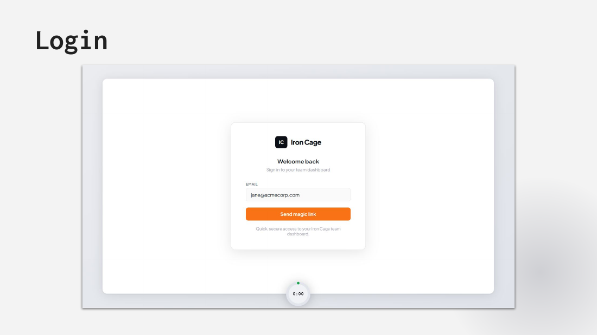

The admin enters their email and receives a magic-link sign-in. No password. The "Send magic link" button kicks off a one-time login email; clicking the link returns the admin authenticated to the Control Panel. This is the only authentication surface — there is no separate sign-up.

### Slide 2 — Registration · Classic Form (t = 0:06)

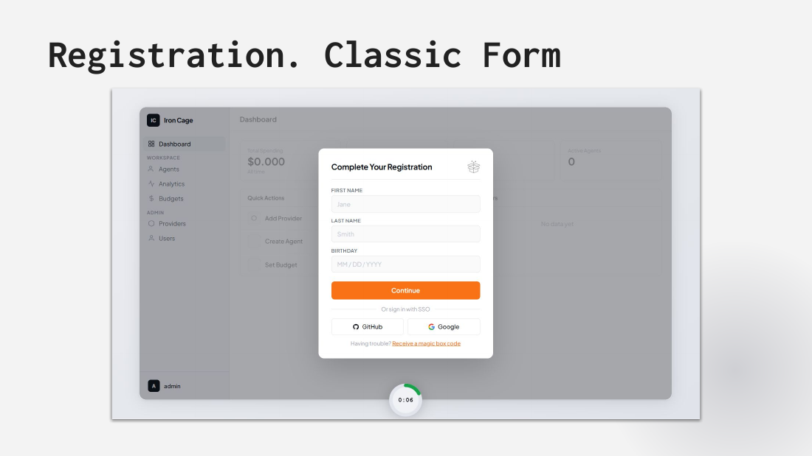

After clicking the magic link, the admin lands on **Complete Your Registration**. The classic form asks for First Name, Last Name, Birthday. SSO sign-in via GitHub or Google is offered as an alternative. This is the baseline that exists for users who prefer to type each field.

### Slide 3 — Registration · FreeForm Mode (t = 0:07)

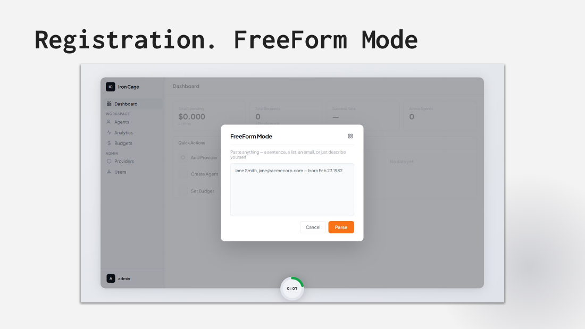

The toggle icon in the top-right of the classic form opens **FreeForm Mode**. The admin pastes a single sentence — the placeholder copy reads *"Paste anything — a sentence, a list, an email, or just describe yourself."* The deck example: `Jane Smith, jane@acmecorp.com — born Feb 23 1982`. Cancel returns to the classic form; Parse sends the text to the backend for inference.

### Slide 4 — Registration · Confirmed (t = 0:08)

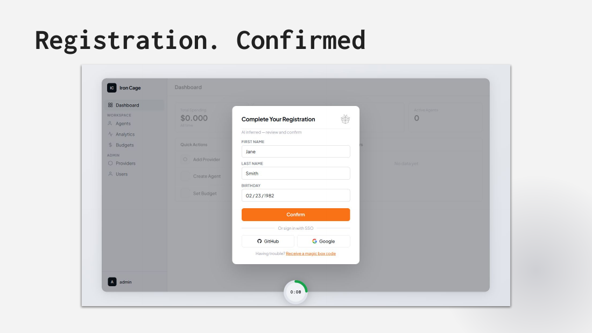

The same classic form reopens with all three fields prefilled (`Jane` / `Smith` / `02/23/1982`) and the subtitle **"AI inferred — review and confirm"** above the fields. The button is now **Confirm**, not Continue. The admin can edit any field before confirming. This pattern — paste → AI inference → review on the classic form → confirm — repeats across every FreeForm surface.

### Slide 5 — Team Setup · Classic Form (t = 0:11)

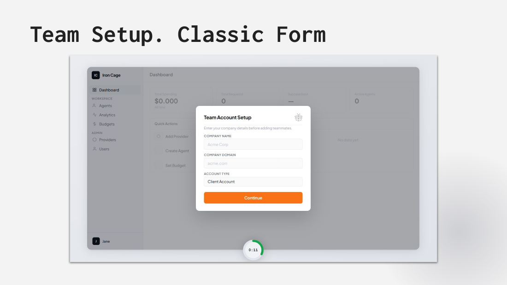

After registration, the next dialog is **Team Account Setup**: Company Name, Company Domain, Account Type. The admin can type each field in directly.

### Slide 6 — Team Setup · FreeForm Mode (t = 0:12)

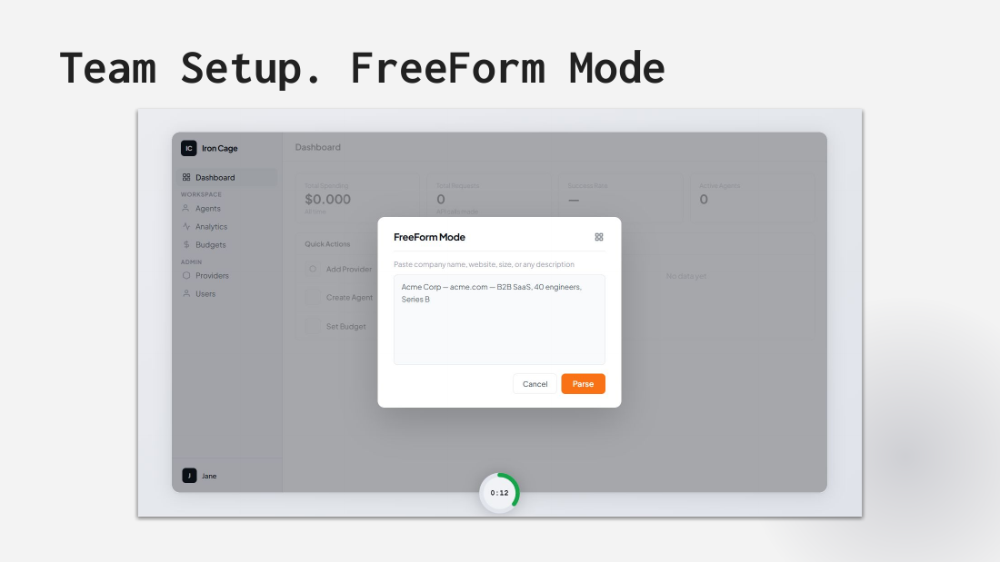

The same FreeForm toggle opens a paste dialog with placeholder *"Paste company name, website, size, or any description."* Deck example: `Acme Corp — acme.com — B2B SaaS, 40 engineers, Series B`. The free-text description is mapped onto the structured enum fields by the inference layer.

### Slide 7 — Team Setup · Confirmed (t = 0:13)

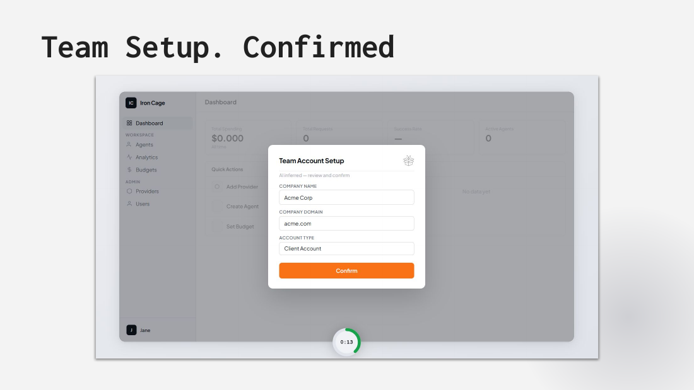

The classic Team Account Setup form reappears with `Acme Corp` / `acme.com` / `Client Account` prefilled and the **"AI inferred — review and confirm"** subtitle. The Company Domain is validated (RFC-1035 hostname shape); Account Type is constrained to the existing enum. The admin reviews and clicks Confirm.

### Slide 8 — Dashboard · Add Provider spotlight (t = 0:16)

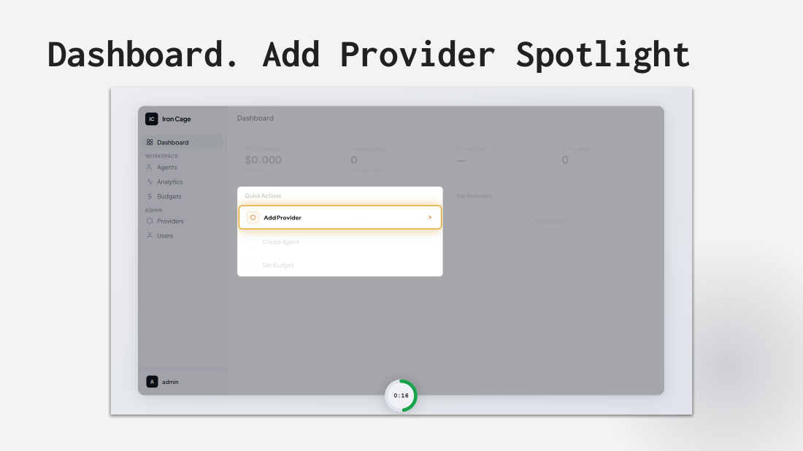

The freshly-registered admin lands on a dashboard with everything dimmed except the **Quick Actions** card, which highlights **Add Provider**. This is the guided next step — without provider keys configured, the workspace can't yet route inference traffic. The other quick actions (Create Agent, Set Budget) are visible but de-emphasized.

### Slide 9 — Providers · Classic View (t = 0:18)

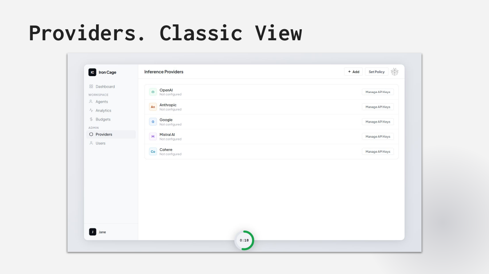

The Inference Providers screen lists each supported provider (OpenAI, Anthropic, Google, Mistral AI, Cohere) with "Not configured" labels and a **Manage API Keys** button per row. Top-right has `+ Add` and `Set Policy` actions. The classic flow is "click each provider in turn, register a key, repeat for invitees."

### Slide 10 — Providers · FreeForm Mode (t = 0:19)

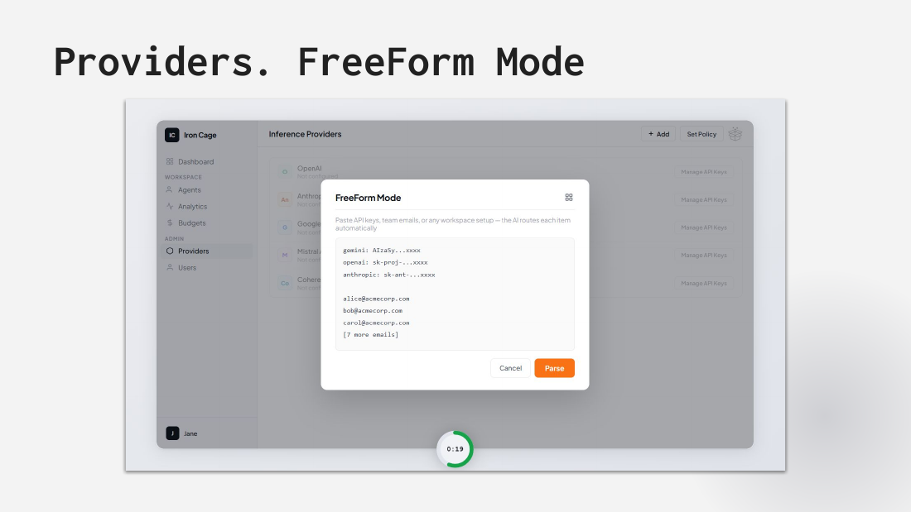

The headline FreeForm surface. The toggle opens a paste dialog with the copy *"Paste API keys, team emails, or any workspace setup — the AI routes each item automatically."* Deck example mixes provider keys and team emails in a single block:

```
gemini:    AIzaSy...xxxx
openai:    sk-proj-...xxxx
anthropic: sk-ant-...xxxx

alice@acmecorp.com
bob@acmecorp.com
carol@acmecorp.com
[7 more emails]
```

One paste covers both provider registration and invite queueing. The grammar is structured (`provider: key` lines, bare emails as invites) — not LLM-inferred — so behavior is deterministic and idempotent.

### Slide 11 — Parse Confirmation (t = 0:21)

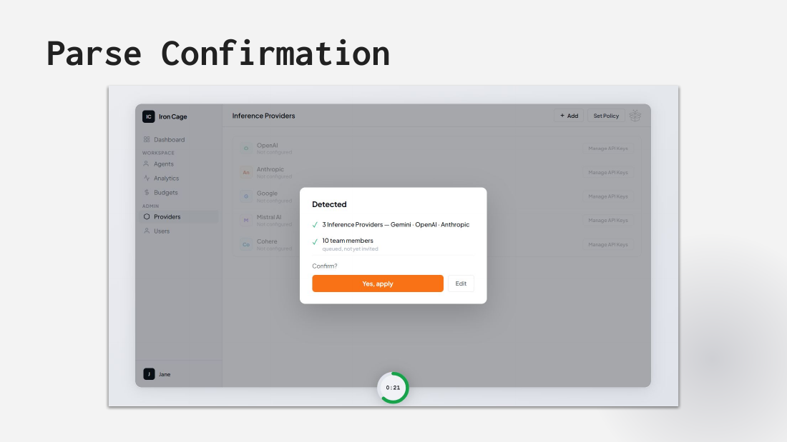

Instead of a classic-form prefill (since there's no equivalent classic form for a bulk paste), the structured paste produces a **Detected** card with green checkmarks:

- ✓ 3 Inference Providers — Gemini · OpenAI · Anthropic
- ✓ 10 team members *(queued, not yet invited)*

The admin clicks **Yes, apply** to commit; **Edit** returns to the paste dialog with the original text preserved. Apply runs the whole block in one transaction — either everything persists, or nothing does.

### Slide 12 — Usage Policy · FreeForm Mode (t = 0:24)

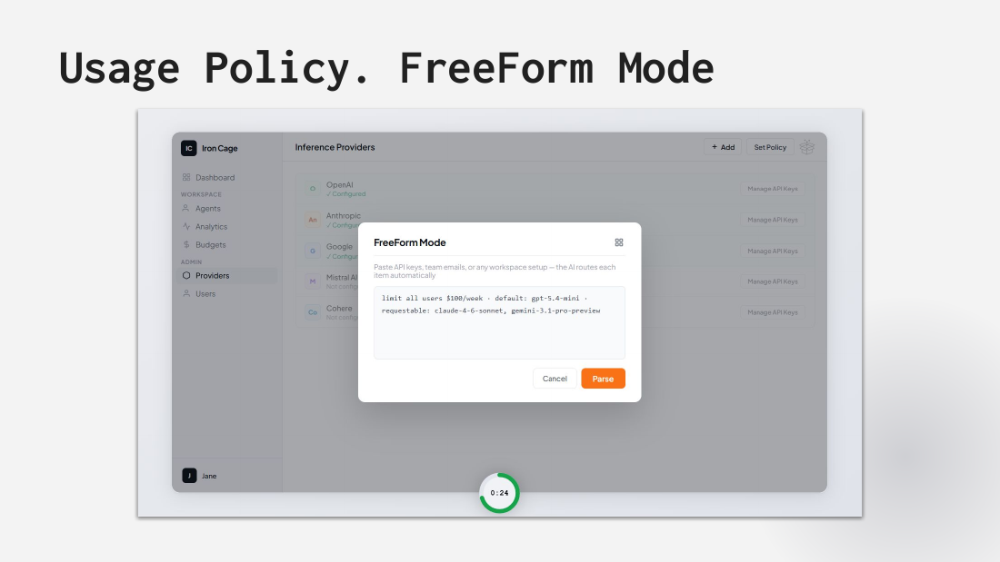

The **Set Policy** button (top-right of Providers) opens its own FreeForm dialog. Deck example:

```
limit all users $100/week - default: gpt-5.4-mini -
requestable: claude-4-6-sonnet, gemini-3.1-pro-preview
```

One line sets the workspace-wide spending cap, the default model every member gets out-of-the-box, and the list of models gated behind an admin-approval request.

### Slide 13 — Usage Policy · Detected (t = 0:26)

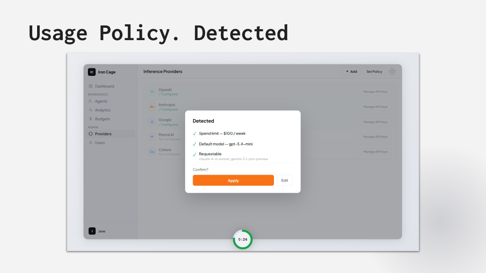

A Detected card lists the three policy items with green checkmarks:

- ✓ Spend limit — $100 / week
- ✓ Default model — gpt-5.4-mini
- ✓ Requestable — claude-4-6-sonnet, gemini-3.1-pro-preview

Apply persists the policy snapshot to the workspace. From this moment on, every invited member inherits exactly these settings until an admin changes them.

### Slide 14 — Invite Link Generated (t = 0:34)

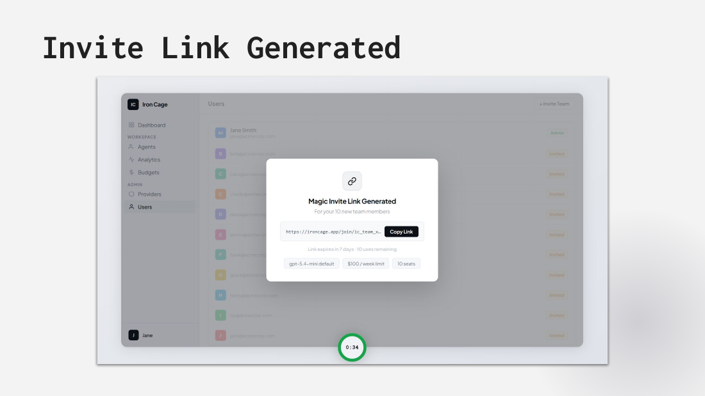

From the Users screen, the admin generates a **Magic Invite Link**. The dialog shows:

- The URL: `https://ironcage.app/join/ic_team_x_…`
- Copy Link button
- "Link expires in 7 days · 10 uses remaining"
- Policy chips at the bottom: `gpt-5.4-mini default` · `$100/week limit` · `10 seats`

The link is bound to a **policy snapshot** taken at generation time — later workspace-policy changes do not affect joiners who clicked an earlier link. Seat decrement on each consumption is atomic.

---

## Member path

### Slide 15 — Member Registration · Classic Form (member t = 0:00)

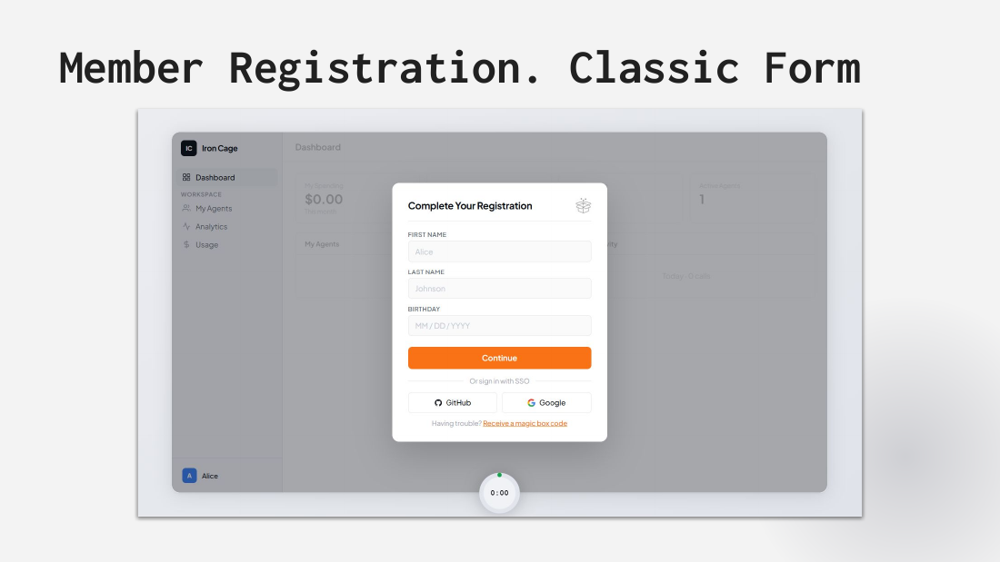

A member clicks the magic invite link and lands on the same Complete Your Registration screen the admin saw, but pre-scoped to the inviting workspace's policy snapshot. The classic form asks for First Name, Last Name, Birthday — identical layout to the admin Registration screen.

### Slide 16 — Member Registration · FreeForm Mode (t = 0:01)

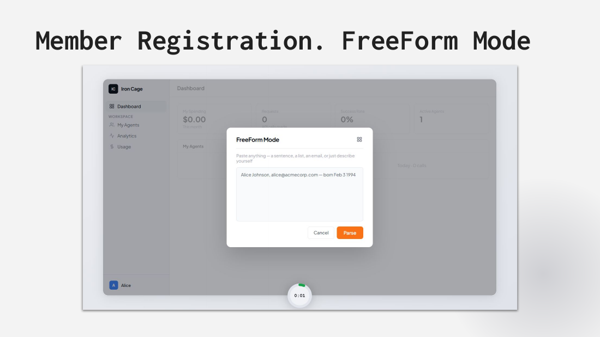

The same FreeForm toggle opens the same paste dialog. Deck example: `Alice Johnson, alice@acmecorp.com — born Feb 3 1994`. Identical UX to the admin Registration FreeForm — one component, two host pages.

### Slide 17 — Member Registration · Confirmed (t = 0:02)

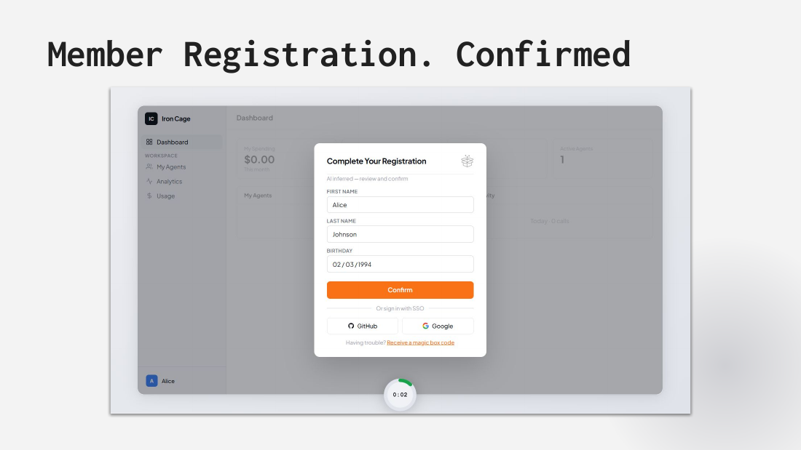

`Alice` / `Johnson` / `02/03/1994` prefilled with the **"AI inferred — review and confirm"** subtitle. Confirm consumes one invite seat (atomically), issues an IC token, and enrolls Alice into the workspace with the snapshot policy.

### Slide 18 — Model Access · Requested (member t = 0:13)

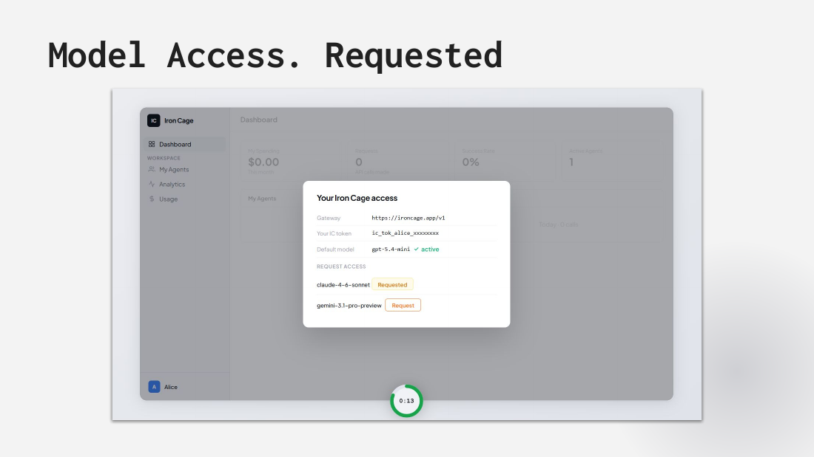

Alice lands on her dashboard. The **Your Iron Cage access** panel shows what she needs to use the gateway:

- Gateway URL: `https://ironcage.app/v1`
- Your IC token: `ic_tok_alice_xxxxxxxx` (with copy-to-clipboard; stored hash-only on server)
- Default model: `gpt-5.4-mini` ✓ active
- **REQUEST ACCESS** section listing gated models from `requestable:`:
  - `claude-4-6-sonnet` — already **Requested** (badge)
  - `gemini-3.1-pro-preview` — **Request** (button)

Clicking Request creates a pending row visible to admins; the button flips to a Requested badge. An admin approves or denies; on approval the model becomes usable through the same IC token.

---

## Section title and closing summary

### Slide 19 — From zero to protected (section title)

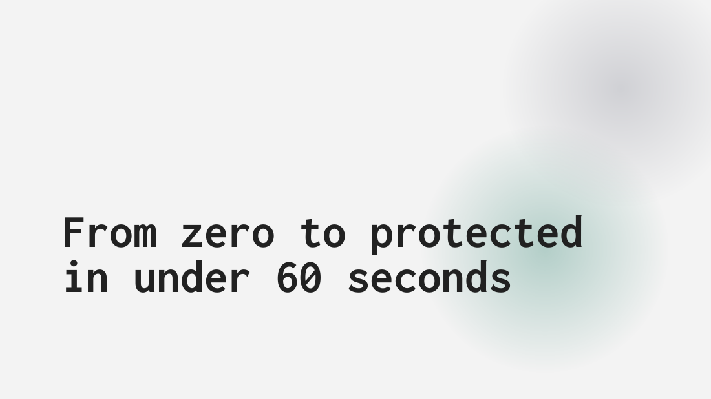

The section title slide that introduces the flow in the deck: *"From zero to protected in under 60 seconds."*

### Slide 20 — Iron Cage Control Panel (closing summary)

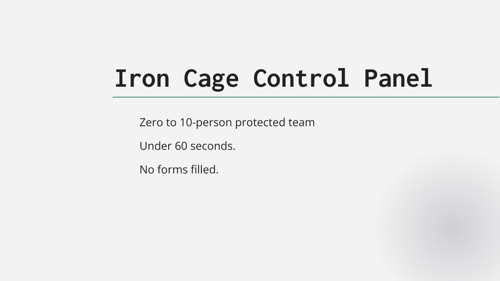

The closing summary: **Zero to 10-person protected team. Under 60 seconds. No forms filled.**

---

## Universal behavior

- Every classic form has a FreeForm toggle (icon top-right). One component, many hosts.
- Re-applying any paste is a clean no-op (idempotent). Invalid input rejects the whole block with per-line errors; nothing partial is persisted.
- "AI inferred — review and confirm" is shown on every confirmation surface that came from an AI-inferred paste — explicit disclosure pattern.
- Admin path completes in under 60 seconds. Member path completes in under 30 seconds.

## Out of scope

- Email delivery of invite links (copy-link only).
- Multi-workspace / multi-tenant setup in a single paste.
- Edit or delete operations through paste (apply is additive and reconciling, never destructive).
- Bulk admin approval for access requests (single-row approval is sufficient).

## Acceptance

The admin path and member path above complete end-to-end in a real browser against the deployed control API, with the deck's 60-second promise holding on a recorded run. All 20 slides embedded above are committed under `task/029_assets/` so the PR carries them inline.
